子项目说明
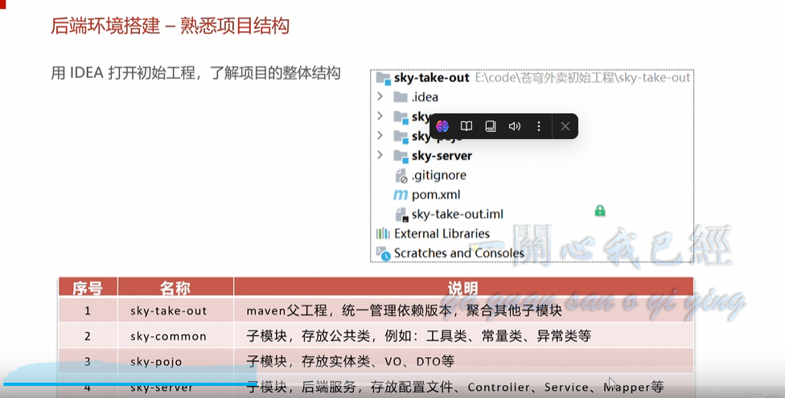
后端
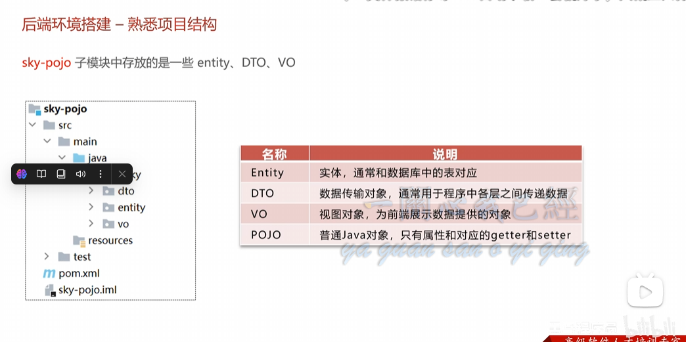
数据库
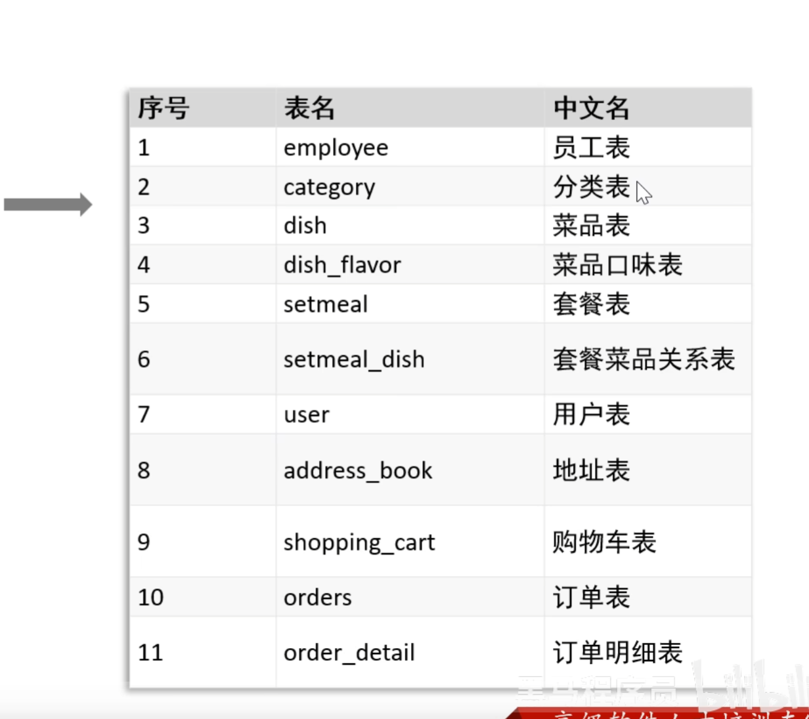
反向代理
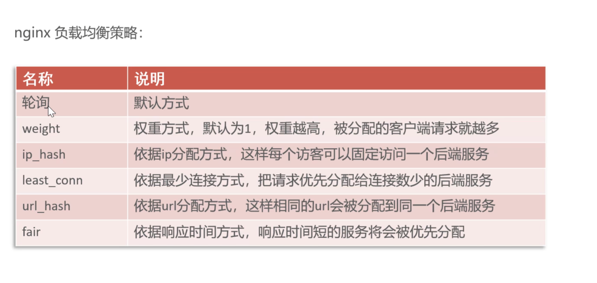
### 接口设计
#### 导入接口文档
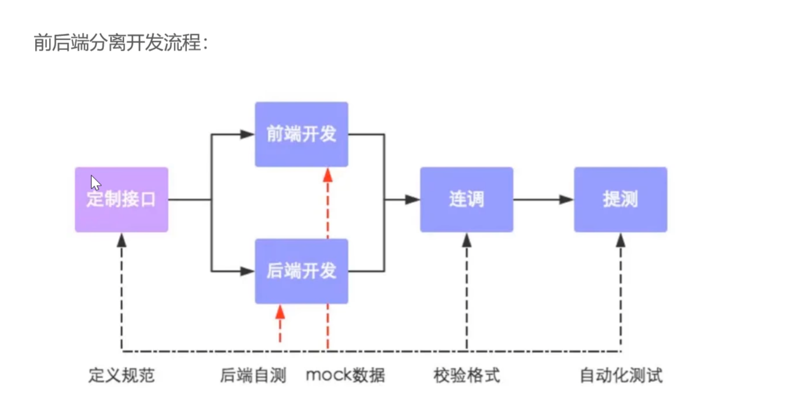
SWAGGER
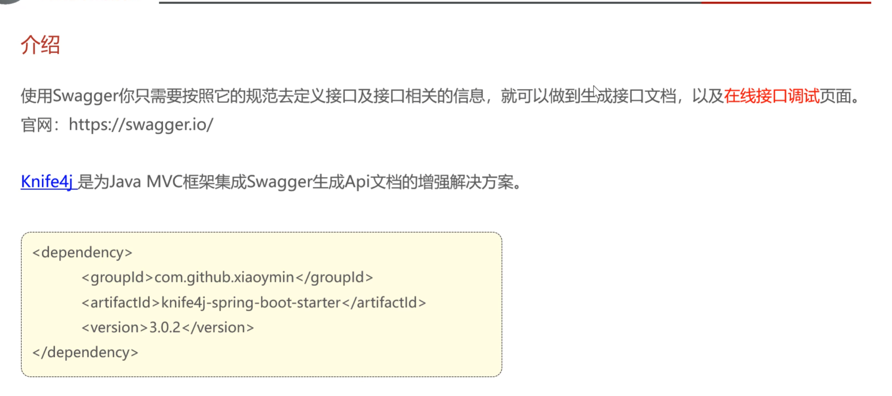
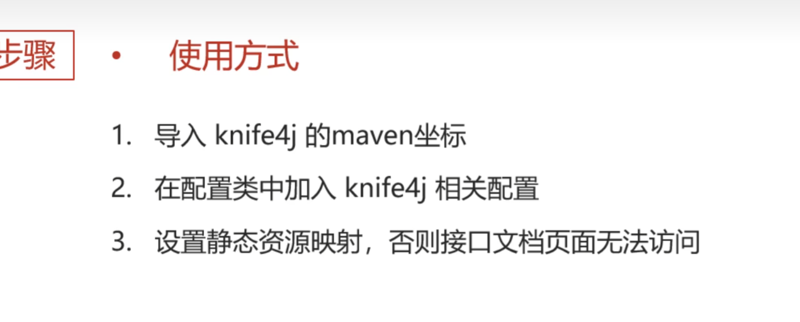
```
/**
     * 通过knife4j生成接口文档
     * @return
*/
@Bean
public Docket docket() {
ApiInfo apiInfo = new ApiInfoBuilder()
.title("苍穹外卖项目接口文档")
.version("2.0")
.description("苍穹外卖项目接口文档")
.build();
Docket docket = new Docket(DocumentationType.SWAGGER_2)
.apiInfo(apiInfo)
.select()
.apis(RequestHandlerSelectors.basePackage("com.sky.controller"))
.paths(PathSelectors.any())
.build();
return docket;
}
```
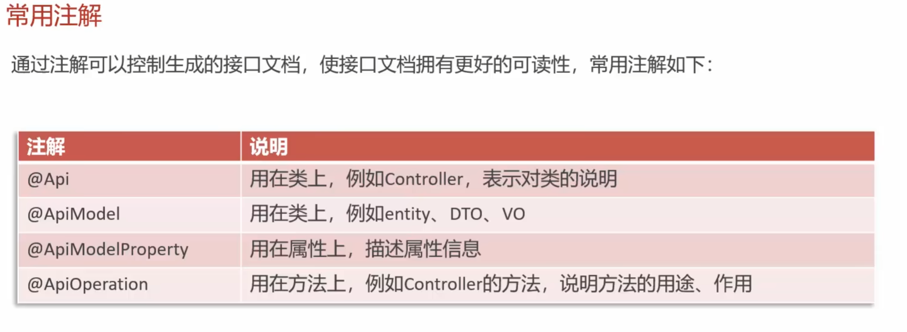
对象属性拷贝
属性名一致
```
// 对象属性拷贝
BeanUtils.copyProperties(employeeDTO, employee);
```

日期格式化
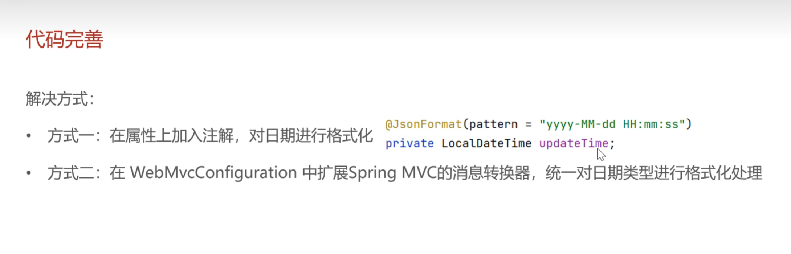
```
@JsonFormat(pattern = "yyyy-MM-dd HH:mm:ss")
    private LocalDateTime updateTime;
    
    
   /**
 * 对象映射器:基于jackson将Java对象转为json，或者将json转为Java对象
 * 将JSON解析为Java对象的过程称为 [从JSON反序列化Java对象]
 * 从Java对象生成JSON的过程称为 [序列化Java对象到JSON]
 */
 
 @Override
    protected void extendMessageConverters(List<HttpMessageConverter<?>> converters) {
        // 创建一个消息转换器对象
//        super.extendMessageConverters(converters);
        MappingJackson2HttpMessageConverter converter = new MappingJackson2HttpMessageConverter();
        converter.setObjectMapper(new JacksonObjectMapper());

    }
```

```
路径参数 @PathVariable
public Result statusEmployee(@PathVariable Integer status, Long id){
```

### 公共字段处理
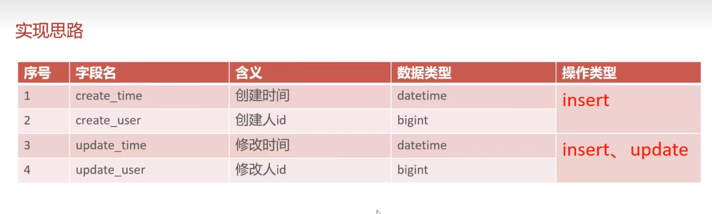

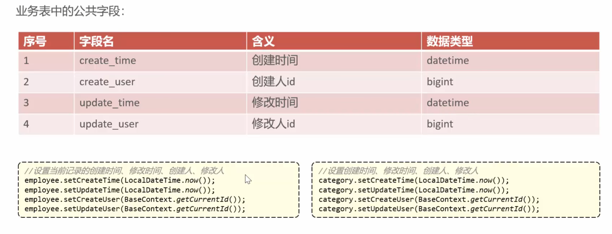

为Mapper方法加入注解
AOP

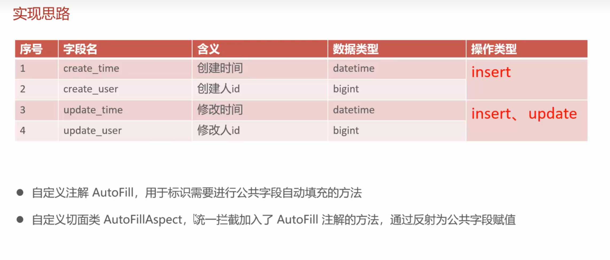


### AOP：

切点+通知
**切点**：  @Pointcut定义一个切入点， 方法上面加注解
```
"execution(* com.sky.mapper.*.*(..)) && @annotation(com.sky.annotation.AutoFill)"代表切入点的位置
@Pointcut("execution(* com.sky.mapper.*.*(..)) && @annotation(com.sky.annotation.AutoFill)")
autoFillPointCut 代表切入点名字


  @Pointcut("execution(* com.sky.mapper.*.*(..)) && @annotation(com.sky.annotation.AutoFill)")
    public void autoFillPointCut(){
    }
```
**通知**

前置通知，后置
@Before("autoFillPointCut()") 在这个切入点进行前置

```
@Before("autoFillPointCut()")
    public void autoFill(JoinPoint joinPoint){
        log.info("开始公共字段的填充");


        


    }
```
在使用Spring AOP做切面时，对方法增强处理，经常需要获取方法参数。需要使用JoinPoint作为第一个参数，因为当该代理方法执行时，JoinPoint代表了织入增强处理的连接点。
JoinPoint通常使用的有四个方法
Object[] getArgs：获取目标方法的参数数组

Signature getSignature：获取目标方法的签名

Object getTarget：获取被织入增强处理的目标对象

Object getThis：获取AOP框架为目标对象生成的代理对象

```python
package com.sky.aspect;

import com.sky.annotation.AutoFill;
import com.sky.constant.AutoFillConstant;
import com.sky.context.BaseContext;
import com.sky.enumeration.OperationType;
import lombok.extern.slf4j.Slf4j;
import org.aspectj.lang.JoinPoint;
import org.aspectj.lang.Signature;
import org.aspectj.lang.annotation.Aspect;
import org.aspectj.lang.annotation.Before;
import org.aspectj.lang.annotation.Pointcut;
import org.aspectj.lang.reflect.MethodSignature;
import org.aspectj.util.GenericSignature;
import org.springframework.stereotype.Component;

import java.lang.reflect.Method;
import java.time.LocalDateTime;

/**
 * 自定义切面类
 * **/

@Aspect
@Component
@Slf4j
public class AutoFillAspect {

    //通知+切入点
    /*
    * 切入点
    * * com.sky.mapper.*.*(..) mapper里面的所有方法
    *                           加了注解的
    *
    * */
    @Pointcut("execution(* com.sky.mapper.*.*(..)) && @annotation(com.sky.annotation.AutoFill)")
    public void autoFillPointCut(){
    }

    /*
    * 前置通知， 在通知中进行公共字段的填充
    * JoinPoint 连接点的所有信息
    * @Before("autoFillPointCut()") 是在那个契入点
    * */
    @Before("autoFillPointCut()")
    public void autoFill(JoinPoint joinPoint) throws Exception {
        log.info("开始公共字段的填充");
        // 获取当前拦截的注解数据库操作类型
        MethodSignature signature = (MethodSignature) joinPoint.getSignature();// 拦截的是一个方法 ClassSignature
        AutoFill annotation = signature.getMethod().getAnnotation(AutoFill.class);// 获得方法上的注解对象
        OperationType operationType = annotation.value();//获得数据库操作类型

        // 获取当前被拦截方法的参数
        Object[] args = joinPoint.getArgs();
        if(args == null || args.length == 0){
            return;
        }
        Object entity = args[0];

        LocalDateTime now = LocalDateTime.now();
        Long currentid = BaseContext.getCurrentId();


        //赋值
        if(operationType == OperationType.INSERT){
            Method setCreateTime = entity.getClass().getDeclaredMethod(AutoFillConstant.SET_CREATE_TIME, LocalDateTime.class);
            Method setUpdateTime = entity.getClass().getDeclaredMethod(AutoFillConstant.SET_UPDATE_TIME, LocalDateTime.class);
            Method setCreateUser = entity.getClass().getDeclaredMethod(AutoFillConstant.SET_CREATE_USER, Long.class);
            Method setUpdateUser = entity.getClass().getDeclaredMethod(AutoFillConstant.SET_UPDATE_USER, Long.class);
            setCreateTime.invoke(entity, now);
            setUpdateTime.invoke(entity, now);
            setCreateUser.invoke(entity, currentid);
            setUpdateUser.invoke(entity, currentid);

        } else if (operationType == OperationType.UPDATE) {
            Method setUpdateTime = entity.getClass().getDeclaredMethod("setUpdateTime", LocalDateTime.class);
            Method setUpdateUser = entity.getClass().getDeclaredMethod("setUpdateUser", Long.class);
            setUpdateTime.invoke(entity, now);
            setUpdateUser.invoke(entity, currentid);
        }


        log.info("开始公共字段的填充完毕， 数据库操作类型{}", operationType);


    }
}

```


插入的主键值赋值给对象
```java
<insert id="insert" useGeneratedKeys="true">
        insert into dish (name, category_id, price, image, description, create_time, update_time, create_user, update_user)
        values
            (#{name}, #{categoryId}, #{price}, #{image}, #{description}, #{createTime}, #{updateTime}, #{createUser}, #{updateUser})
    </insert>
```

前端传的ids 1，2，3用逗号分割，后端接受的时候不用string，，springmvc帮忙处理转换为List
添加注解@RequestParam List<Long> ids
```java
@DeleteMapping
    @ApiOperation("删除菜品")
    public Result delete(@RequestParam List<Long> ids){

    }
```

当遇见插入，附带其他表的插入，开启事务注解
```java
@Transactional
    public void saveWithFlavor(DishDTO dishDTO) {
        // 菜品表插入

        Dish dish = new Dish();
        BeanUtils.copyProperties(dishDTO, dish);
        dishMapper.insert(dish);

        Long dishId = dish.getId();
        // 口味表插入数据
        List<DishFlavor> flavors = dishDTO.getFlavors();
        if(flavors != null && !flavors.isEmpty()){
            flavors.forEach(dishFlavor -> {
                dishFlavor.setDishId(dishId);
            });
            // 批量插入
            dishFlavorMapper.insertList(flavors);
        }

    }
```
``` sql
在 MySQL 数据库中，
DELETE FROM dish_flavor WHERE dish_id = 3 
语句会删除所有满足 dish_id = 3 的记录。

```

Redis, 编写配置类
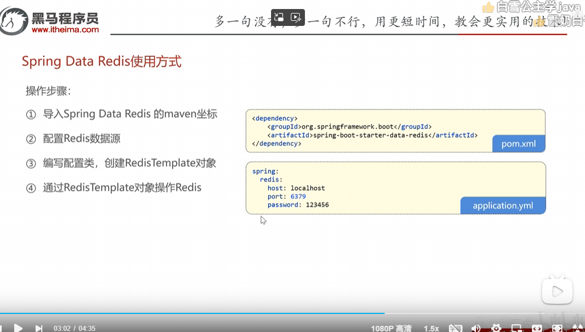
```java

package com.sky.config;

import lombok.extern.slf4j.Slf4j;
import org.springframework.context.annotation.Bean;
import org.springframework.context.annotation.Configuration;
import org.springframework.data.redis.connection.RedisConnectionFactory;
import org.springframework.data.redis.core.RedisTemplate;
import org.springframework.data.redis.serializer.StringRedisSerializer;

@Configuration
@Slf4j
public class RedisConfiguration {
    @Bean
    public RedisTemplate redisTemplate(RedisConnectionFactory redisConnectionFactory){
        log.info("创建redis连接：{}", redisConnectionFactory);
        RedisTemplate redisTemplate = new RedisTemplate();
        //设置redis的连接工厂对象
        redisTemplate.setConnectionFactory(redisConnectionFactory);
        //设置redi key序列化器
        redisTemplate.setKeySerializer(new StringRedisSerializer());
        return redisTemplate;
    }
}

```
不同包下的Controller冲突
```java
@RestController("userShopController")
@RestController("adminShopController")
```

swagger的设置docket
分组
```java
 @Bean
    public Docket docket1() {
        log.info("准备生成接口文档........");
        ApiInfo apiInfo = new ApiInfoBuilder()
                .title("苍穹外卖项目接口文档")
                .version("2.0")
                .description("苍穹外卖项目接口文档")
                .build();
        Docket docket = new Docket(DocumentationType.SWAGGER_2)
                .groupName("用户端")
                .apiInfo(apiInfo)
                .select()
                .apis(RequestHandlerSelectors.basePackage("com.sky.controller.user"))
                .paths(PathSelectors.any())
                .build();
        return docket;
    }

    @Bean
    public Docket docket2() {
        log.info("准备生成接口文档........");
        ApiInfo apiInfo = new ApiInfoBuilder()
                .title("苍穹外卖项目接口文档")
                .version("2.0")
                .description("苍穹外卖项目接口文档")
                .build();
        Docket docket = new Docket(DocumentationType.SWAGGER_2)
                .groupName("管理端")
                .apiInfo(apiInfo)
                .select()
                .apis(RequestHandlerSelectors.basePackage("com.sky.controller.admin"))
                .paths(PathSelectors.any())
                .build();
        return docket;
    }
```
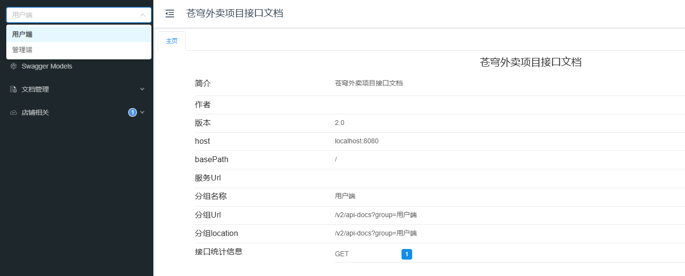
### 文件上传设计逻辑
如果用OSS，OSS的注入属性
如果上传本地, 同样有根路径
```java
/*
 创建一个属性类, 文件上传位置注入，由配置文件，存放文件上传相关信息
 * **/
package com.sky.properties;

import lombok.Data;
import org.springframework.boot.context.properties.ConfigurationProperties;
import org.springframework.stereotype.Component;

@Component
@Data
@ConfigurationProperties(value = "sky.localfile")
public class LocalFileProperties {
    private String localFileRootDir;
}

```
文件上传工具类
文件上传工具需要用到OSS配置相关信息，
相关信息的设置由属性注入到
```java
package com.sky.utils;

import lombok.AllArgsConstructor;
import lombok.Data;
import lombok.extern.slf4j.Slf4j;
import org.springframework.web.multipart.MultipartFile;

import java.io.File;
import java.io.IOException;

@Data
@AllArgsConstructor
@Slf4j
public class LocalFileUtil {
    private String localFileRootDir;
    /**
     * 文件上传
     *
     * @param MultipartFile
     * @param objectName
     * @return
     */
    public String upload(MultipartFile file, String objectName) {
        File directory = new File(localFileRootDir);
        if (!directory.exists()) {
            directory.mkdir();
        }

        // 保存文件到本地
        String filePath = localFileRootDir + objectName;
        try {
            file.transferTo(new File(filePath));
            return filePath;
        } catch (IOException e) {
            throw new RuntimeException(e);
        }
    }
}


```

上传文件配置并注入到容器,返回的实际是一个工具类，工具类的属性实际由配置处属性注入进去
后面直接使用这个类即可
```java

package com.sky.config;

import com.sky.properties.LocalFileProperties;
import com.sky.utils.LocalFileUtil;
import lombok.extern.slf4j.Slf4j;
import org.springframework.boot.autoconfigure.condition.ConditionalOnMissingBean;
import org.springframework.context.annotation.Bean;
import org.springframework.context.annotation.Configuration;

@Configuration
@Slf4j
public class LocalFileConfiguration {

    @Bean
    @ConditionalOnMissingBean
    public LocalFileUtil localFileUtil(LocalFileProperties localFileProperties){
        log.info("创建本地上传文件工具对象：{}", localFileProperties);
        return new LocalFileUtil(localFileProperties.getLocalFileRootDir());
    }
}

```
### HTTPCLIENT及其封装的工具类
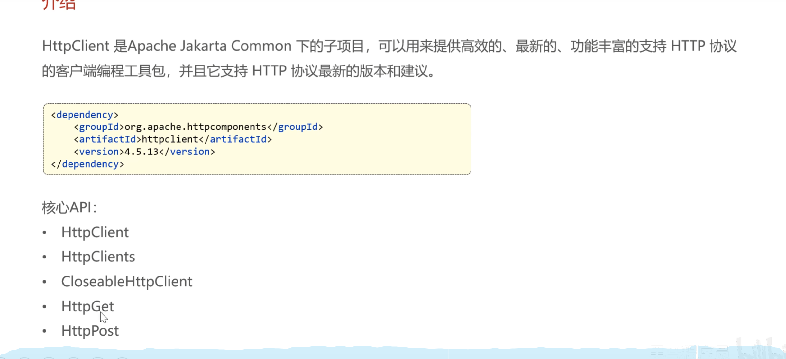
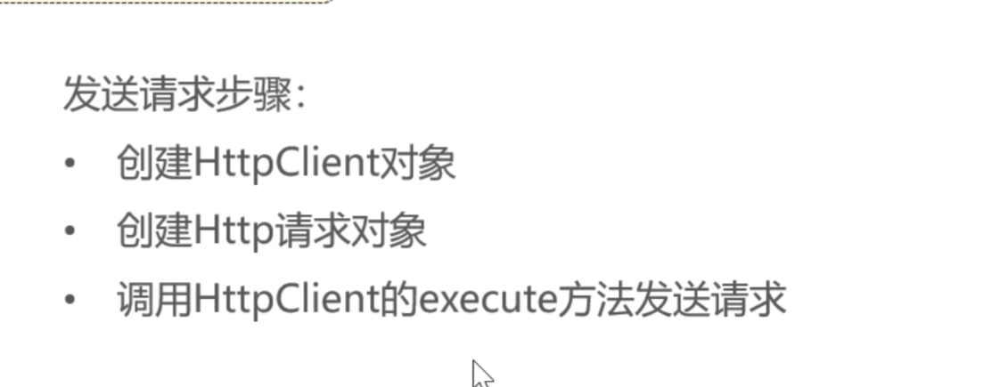

```java
package com.sky.utils;

import com.alibaba.fastjson.JSONObject;
import org.apache.http.NameValuePair;
import org.apache.http.client.config.RequestConfig;
import org.apache.http.client.entity.UrlEncodedFormEntity;
import org.apache.http.client.methods.CloseableHttpResponse;
import org.apache.http.client.methods.HttpGet;
import org.apache.http.client.methods.HttpPost;
import org.apache.http.client.utils.URIBuilder;
import org.apache.http.entity.StringEntity;
import org.apache.http.impl.client.CloseableHttpClient;
import org.apache.http.impl.client.HttpClients;
import org.apache.http.message.BasicNameValuePair;
import org.apache.http.util.EntityUtils;

import java.io.IOException;
import java.net.URI;
import java.util.ArrayList;
import java.util.List;
import java.util.Map;

/**
 * Http工具类
 */
public class HttpClientUtil {

    static final  int TIMEOUT_MSEC = 5 * 1000;

    /**
     * 发送GET方式请求
     * @param url
     * @param paramMap
     * @return
     */
    public static String doGet(String url,Map<String,String> paramMap){
        // 创建Httpclient对象
        CloseableHttpClient httpClient = HttpClients.createDefault();

        String result = "";
        CloseableHttpResponse response = null;

        try{
            URIBuilder builder = new URIBuilder(url);
            if(paramMap != null){
                for (String key : paramMap.keySet()) {
                    builder.addParameter(key,paramMap.get(key));
                }
            }
            URI uri = builder.build();

            //创建GET请求
            HttpGet httpGet = new HttpGet(uri);

            //发送请求
            response = httpClient.execute(httpGet);

            //判断响应状态
            if(response.getStatusLine().getStatusCode() == 200){
                result = EntityUtils.toString(response.getEntity(),"UTF-8");
            }
        }catch (Exception e){
            e.printStackTrace();
        }finally {
            try {
                response.close();
                httpClient.close();
            } catch (IOException e) {
                e.printStackTrace();
            }
        }

        return result;
    }

    /**
     * 发送POST方式请求
     * @param url
     * @param paramMap
     * @return
     * @throws IOException
     */
    public static String doPost(String url, Map<String, String> paramMap) throws IOException {
        // 创建Httpclient对象
        CloseableHttpClient httpClient = HttpClients.createDefault();
        CloseableHttpResponse response = null;
        String resultString = "";

        try {
            // 创建Http Post请求
            HttpPost httpPost = new HttpPost(url);

            // 创建参数列表
            if (paramMap != null) {
                List<NameValuePair> paramList = new ArrayList();
                for (Map.Entry<String, String> param : paramMap.entrySet()) {
                    paramList.add(new BasicNameValuePair(param.getKey(), param.getValue()));
                }
                // 模拟表单
                UrlEncodedFormEntity entity = new UrlEncodedFormEntity(paramList);
                httpPost.setEntity(entity);
            }

            httpPost.setConfig(builderRequestConfig());

            // 执行http请求
            response = httpClient.execute(httpPost);

            resultString = EntityUtils.toString(response.getEntity(), "UTF-8");
        } catch (Exception e) {
            throw e;
        } finally {
            try {
                response.close();
            } catch (IOException e) {
                e.printStackTrace();
            }
        }

        return resultString;
    }

    /**
     * 发送POST方式请求
     * @param url
     * @param paramMap
     * @return
     * @throws IOException
     */
    public static String doPost4Json(String url, Map<String, String> paramMap) throws IOException {
        // 创建Httpclient对象
        CloseableHttpClient httpClient = HttpClients.createDefault();
        CloseableHttpResponse response = null;
        String resultString = "";

        try {
            // 创建Http Post请求
            HttpPost httpPost = new HttpPost(url);

            if (paramMap != null) {
                //构造json格式数据
                JSONObject jsonObject = new JSONObject();
                for (Map.Entry<String, String> param : paramMap.entrySet()) {
                    jsonObject.put(param.getKey(),param.getValue());
                }
                StringEntity entity = new StringEntity(jsonObject.toString(),"utf-8");
                //设置请求编码
                entity.setContentEncoding("utf-8");
                //设置数据类型
                entity.setContentType("application/json");
                httpPost.setEntity(entity);
            }

            httpPost.setConfig(builderRequestConfig());

            // 执行http请求
            response = httpClient.execute(httpPost);

            resultString = EntityUtils.toString(response.getEntity(), "UTF-8");
        } catch (Exception e) {
            throw e;
        } finally {
            try {
                response.close();
            } catch (IOException e) {
                e.printStackTrace();
            }
        }

        return resultString;
    }
    private static RequestConfig builderRequestConfig() {
        return RequestConfig.custom()
                .setConnectTimeout(TIMEOUT_MSEC)
                .setConnectionRequestTimeout(TIMEOUT_MSEC)
                .setSocketTimeout(TIMEOUT_MSEC).build();
    }

}


```

### 微信小程序登录
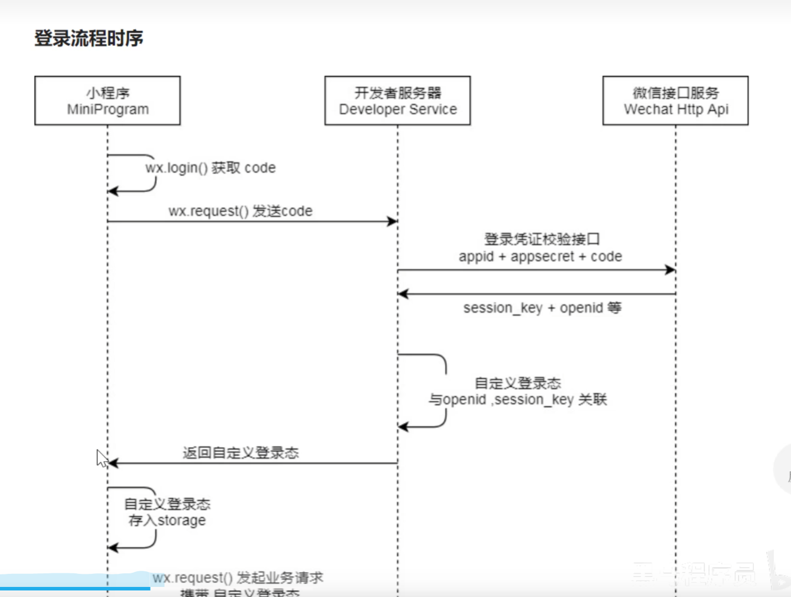

### springboot实现拦截器和过滤器
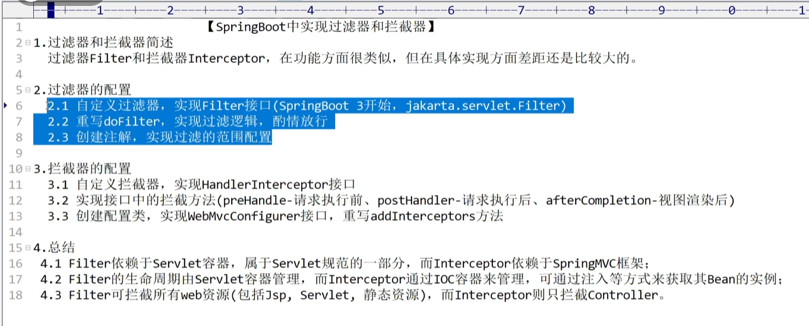
```java
// 自定义拦截器
// 实现HandlerInterceptor接口
@Component
@Slf4j
// 实现重写方法
public class JwtTokenUserInterceptor implements HandlerInterceptor {

    @Autowired
    private JwtProperties jwtProperties;

    /**
     * 校验jwt
     *
     * @param request
     * @param response
     * @param handler
     * @return
     * @throws Exception
     */
    public boolean preHandle(HttpServletRequest request, HttpServletResponse response, Object handler) throws Exception {
        //判断当前拦截到的是Controller的方法还是其他资源
        if (!(handler instanceof HandlerMethod)) {
            //当前拦截到的不是动态方法，直接放行
            return true;
        }

        //1、从请求头中获取令牌
        String token = request.getHeader(jwtProperties.getUserTokenName());

        //2、校验令牌
        try {
            log.info("jwt校验:{}", token);
            Claims claims = JwtUtil.parseJWT(jwtProperties.getUserSecretKey(), token);
            Long userId = Long.valueOf(claims.get(JwtClaimsConstant.USER_ID).toString());
            log.info("当前用户id：", userId);
            BaseContext.setCurrentId(userId);

            //3、通过，放行
            return true;
        } catch (Exception ex) {
            //4、不通过，响应401状态码
            response.setStatus(401);
            return false;
        }
    }
}
// 创建配置类
@Configuration
@Slf4j
public class WebMvcConfiguration extends WebMvcConfigurationSupport {

    @Autowired
    private JwtTokenAdminInterceptor jwtTokenAdminInterceptor;

    @Autowired
    private JwtTokenUserInterceptor jwtTokenUserInterceptor;

    /**
     * 注册自定义拦截器
     *
     * @param registry
     */
    protected void addInterceptors(InterceptorRegistry registry) {
        log.info("开始注册自定义拦截器...");
        registry.addInterceptor(jwtTokenAdminInterceptor)
                .addPathPatterns("/admin/**")
                .excludePathPatterns("/admin/employee/login");

        registry.addInterceptor(jwtTokenUserInterceptor)
                .addPathPatterns("/user/**")
                .excludePathPatterns("/user/user/login")
                .excludePathPatterns("user/user/shop");
    }
}
```

### Spring Cache  缓存

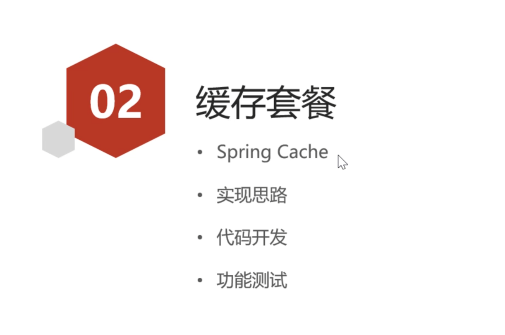
基于注解的缓存功能

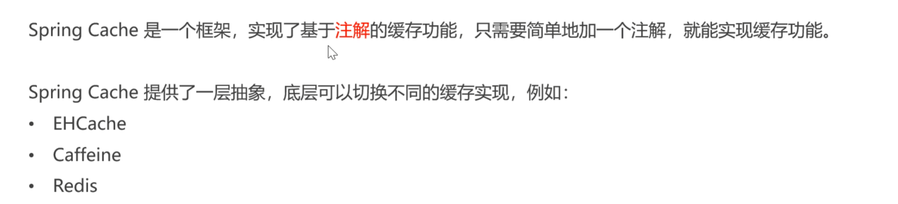
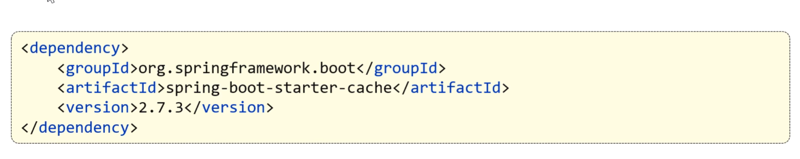
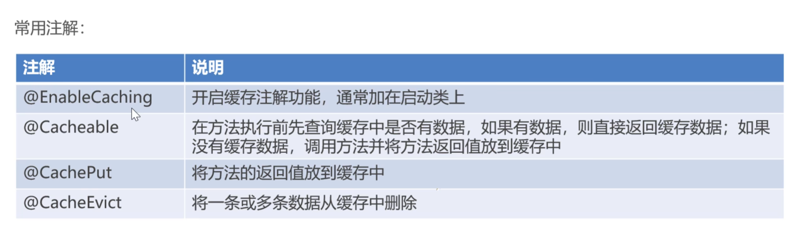

```java

@SpringBootApplication
@EnableTransactionManagement //开启注解方式的事务管理
@Slf4j
@EnableCaching // 开启缓存注解
public class SkyApplication {
    public static void main(String[] args) {
        SpringApplication.run(SkyApplication.class, args);
        log.info("server started");
    }
}
```

```java
@CachePut(cachNames = "userCache", key = "#user.id") // key的生成userCache::#{key}
@CachePut(cachNames = "userCache", key = "#result.id") // key的生成userCache::#{key} result是固定的 对象导航
@CachePut(cachNames = "userCache", key = "#p0.id") // key的生成userCache::#{key} p0 第一个参数
public  User save(User user){
    pass
}


// 先查redis，没有就加入
@Cacheable(cachNames = "userCache", key = "#id") // key的生成userCache::#{key}
//@Cacheable(cachNames = "userCache", key = "#result.id") // key的生成userCache::#{key} result是固定的 对象导航 不可以使用result
//@Cacheable(cachNames = "userCache", key = "#p0.id") // key的生成userCache::#{key} p0 第一个参数
public  User getById(Long id){
    pass
}


//删除一条
@CacheEvict(cachNames = "userCache", key = "#id") // key的生成userCache::#{key}
//@Cacheable(cachNames = "userCache", key = "#result.id") // key的生成userCache::#{key} result是固定的 对象导航 不可以使用result
//@Cacheable(cachNames = "userCache", key = "#p0.id") // key的生成userCache::#{key} p0 第一个参数
public  User deleteById(Long id){
    pass
}

// 删除多条
@CacheEvict(cachNames = "userCache", allEntries = true) // key的生成userCache::#{key}
// 删除所有的userCache
public  User deleteALL(Long id){
    pass
}


```

### 微信支付
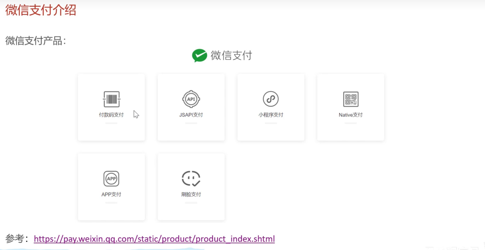
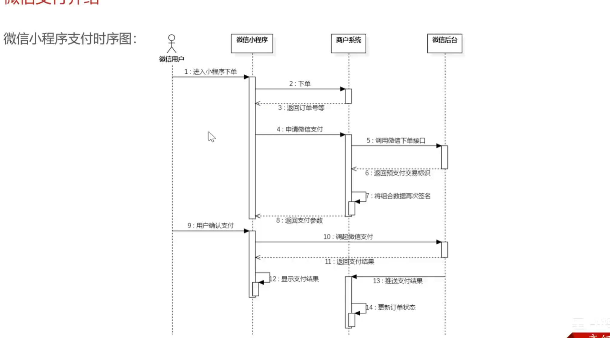
#### 微信后台怎么调用商户系统？
商户系统Ip局域网地址， 内网穿透
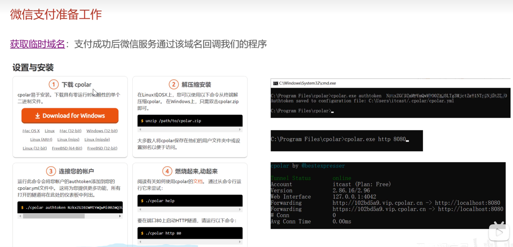


#### 怎么保证安全
1、商户系统需要向微信支付申请证书，证书是商户系统向微信支付申请到的，用于加密解密微信支付返回的数据，保证数据的安全。
2、商户系统需要向微信支付申请商户号，商户号是微信支付为商户系统分配的，用于标识商户系统，保证数据的唯一性。
3、商户系统需要向微信支付申请商户密钥，商户密钥是微信支付为商户系统分配的，用于加密解密微信支付返回的数据，保证数据的安全。
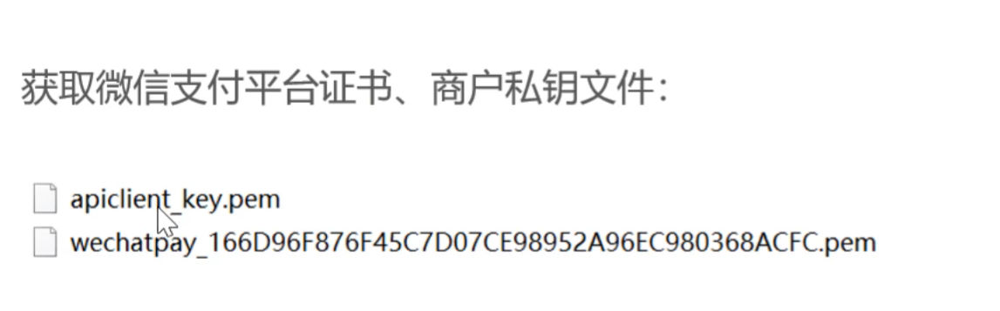

#### 配置
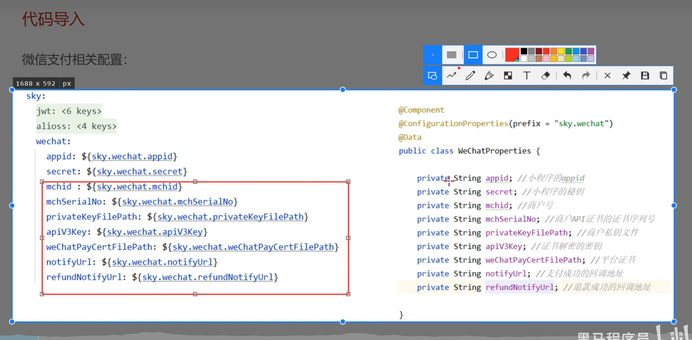

```yaml
sky:
  wechat:
    appid: wxe69bbf0f48da2320
    secret: 3e36274ac60292187d43f700baaef62c
    mchid: 1600000001
    mchSeriaNo: 1600000001
    privateKeyFilePath: classpath:apiclient_key.pem
    apiV3Key: 7e9a6e9a6e9a6e9a6e9a6e9a6e9a6e9a
    weChatPayCertFilePath: classpath:apiclient_cert.pem
    notifyUrl: http://goongwangip/pay/wxpay_notify
    refundNotifyUrl: http://goongwangip/pay/wxpay_refund_notify
```
refundNotifyUrl: http://goongwangip/pay/wxpay_refund_notify 回调地址


#### PayNotifController
```java

package com.sky.controller.user;

import com.alibaba.druid.support.json.JSONUtils;
import com.alibaba.fastjson.JSON;
import com.alibaba.fastjson.JSONObject;
import com.sky.properties.WeChatProperties;
import com.sky.service.OrderService;
import com.wechat.pay.contrib.apache.httpclient.util.AesUtil;
import lombok.extern.slf4j.Slf4j;
import org.apache.http.entity.ContentType;
import org.springframework.beans.factory.annotation.Autowired;
import org.springframework.web.bind.annotation.RequestMapping;
import org.springframework.web.bind.annotation.RestController;
import javax.servlet.http.HttpServletRequest;
import javax.servlet.http.HttpServletResponse;
import java.io.BufferedReader;
import java.nio.charset.StandardCharsets;
import java.util.HashMap;

/**
 * 支付回调相关接口
 */
@RestController
@RequestMapping("/notify")
@Slf4j
public class PayNotifyController {
    @Autowired
    private OrderService orderService;
    @Autowired
    private WeChatProperties weChatProperties;

    /**
     * 支付成功回调
     *
     * @param request
     */
    @RequestMapping("/paySuccess")
    public void paySuccessNotify(HttpServletRequest request, HttpServletResponse response) throws Exception {
        //读取数据
        String body = readData(request);
        log.info("支付成功回调：{}", body);

        //数据解密
        String plainText = decryptData(body);
        log.info("解密后的文本：{}", plainText);

        JSONObject jsonObject = JSON.parseObject(plainText);
        String outTradeNo = jsonObject.getString("out_trade_no");//商户平台订单号
        String transactionId = jsonObject.getString("transaction_id");//微信支付交易号

        log.info("商户平台订单号：{}", outTradeNo);
        log.info("微信支付交易号：{}", transactionId);

        //业务处理，修改订单状态、来单提醒
        orderService.paySuccess(outTradeNo);

        //给微信响应
        responseToWeixin(response);
    }

    /**
     * 读取数据
     *
     * @param request
     * @return
     * @throws Exception
     */
    private String readData(HttpServletRequest request) throws Exception {
        BufferedReader reader = request.getReader();
        StringBuilder result = new StringBuilder();
        String line = null;
        while ((line = reader.readLine()) != null) {
            if (result.length() > 0) {
                result.append("\n");
            }
            result.append(line);
        }
        return result.toString();
    }

    /**
     * 数据解密
     *
     * @param body
     * @return
     * @throws Exception
     */
    private String decryptData(String body) throws Exception {
        JSONObject resultObject = JSON.parseObject(body);
        JSONObject resource = resultObject.getJSONObject("resource");
        String ciphertext = resource.getString("ciphertext");
        String nonce = resource.getString("nonce");
        String associatedData = resource.getString("associated_data");

        AesUtil aesUtil = new AesUtil(weChatProperties.getApiV3Key().getBytes(StandardCharsets.UTF_8));
        //密文解密
        String plainText = aesUtil.decryptToString(associatedData.getBytes(StandardCharsets.UTF_8),
                nonce.getBytes(StandardCharsets.UTF_8),
                ciphertext);

        return plainText;
    }

    /**
     * 给微信响应
     * @param response
     */
    private void responseToWeixin(HttpServletResponse response) throws Exception{
        response.setStatus(200);
        HashMap<Object, Object> map = new HashMap<>();
        map.put("code", "SUCCESS");
        map.put("message", "SUCCESS");
        response.setHeader("Content-type", ContentType.APPLICATION_JSON.toString());
        response.getOutputStream().write(JSONUtils.toJSONString(map).getBytes(StandardCharsets.UTF_8));
        response.flushBuffer();
    }
}

```

#### WeChatPayUtils
```java

package com.sky.utils;

import com.alibaba.fastjson.JSON;
import com.alibaba.fastjson.JSONObject;
import com.sky.properties.WeChatProperties;
import com.wechat.pay.contrib.apache.httpclient.WechatPayHttpClientBuilder;
import com.wechat.pay.contrib.apache.httpclient.util.PemUtil;
import org.apache.commons.lang.RandomStringUtils;
import org.apache.http.HttpHeaders;
import org.apache.http.client.methods.CloseableHttpResponse;
import org.apache.http.client.methods.HttpGet;
import org.apache.http.client.methods.HttpPost;
import org.apache.http.entity.ContentType;
import org.apache.http.entity.StringEntity;
import org.apache.http.impl.client.CloseableHttpClient;
import org.apache.http.util.EntityUtils;
import org.springframework.beans.factory.annotation.Autowired;
import org.springframework.stereotype.Component;

import java.io.File;
import java.io.FileInputStream;
import java.io.FileNotFoundException;
import java.math.BigDecimal;
import java.security.PrivateKey;
import java.security.Signature;
import java.security.cert.X509Certificate;
import java.util.ArrayList;
import java.util.Arrays;
import java.util.Base64;
import java.util.List;

/**
 * 微信支付工具类
 */
@Component
public class WeChatPayUtil {

    //微信支付下单接口地址
    public static final String JSAPI = "https://api.mch.weixin.qq.com/v3/pay/transactions/jsapi";

    //申请退款接口地址
    public static final String REFUNDS = "https://api.mch.weixin.qq.com/v3/refund/domestic/refunds";

    @Autowired
    private WeChatProperties weChatProperties;

    /**
     * 获取调用微信接口的客户端工具对象
     *
     * @return
     */
    private CloseableHttpClient getClient() {
        PrivateKey merchantPrivateKey = null;
        try {
            //merchantPrivateKey商户API私钥，如何加载商户API私钥请看常见问题
            merchantPrivateKey = PemUtil.loadPrivateKey(new FileInputStream(new File(weChatProperties.getPrivateKeyFilePath())));
            //加载平台证书文件
            X509Certificate x509Certificate = PemUtil.loadCertificate(new FileInputStream(new File(weChatProperties.getWeChatPayCertFilePath())));
            //wechatPayCertificates微信支付平台证书列表。你也可以使用后面章节提到的“定时更新平台证书功能”，而不需要关心平台证书的来龙去脉
            List<X509Certificate> wechatPayCertificates = Arrays.asList(x509Certificate);

            WechatPayHttpClientBuilder builder = WechatPayHttpClientBuilder.create()
                    .withMerchant(weChatProperties.getMchid(), weChatProperties.getMchSerialNo(), merchantPrivateKey)
                    .withWechatPay(wechatPayCertificates);

            // 通过WechatPayHttpClientBuilder构造的HttpClient，会自动的处理签名和验签
            CloseableHttpClient httpClient = builder.build();
            return httpClient;
        } catch (FileNotFoundException e) {
            e.printStackTrace();
            return null;
        }
    }

    /**
     * 发送post方式请求
     *
     * @param url
     * @param body
     * @return
     */
    private String post(String url, String body) throws Exception {
        CloseableHttpClient httpClient = getClient();

        HttpPost httpPost = new HttpPost(url);
        httpPost.addHeader(HttpHeaders.ACCEPT, ContentType.APPLICATION_JSON.toString());
        httpPost.addHeader(HttpHeaders.CONTENT_TYPE, ContentType.APPLICATION_JSON.toString());
        httpPost.addHeader("Wechatpay-Serial", weChatProperties.getMchSerialNo());
        httpPost.setEntity(new StringEntity(body, "UTF-8"));

        CloseableHttpResponse response = httpClient.execute(httpPost);
        try {
            String bodyAsString = EntityUtils.toString(response.getEntity());
            return bodyAsString;
        } finally {
            httpClient.close();
            response.close();
        }
    }

    /**
     * 发送get方式请求
     *
     * @param url
     * @return
     */
    private String get(String url) throws Exception {
        CloseableHttpClient httpClient = getClient();

        HttpGet httpGet = new HttpGet(url);
        httpGet.addHeader(HttpHeaders.ACCEPT, ContentType.APPLICATION_JSON.toString());
        httpGet.addHeader(HttpHeaders.CONTENT_TYPE, ContentType.APPLICATION_JSON.toString());
        httpGet.addHeader("Wechatpay-Serial", weChatProperties.getMchSerialNo());

        CloseableHttpResponse response = httpClient.execute(httpGet);
        try {
            String bodyAsString = EntityUtils.toString(response.getEntity());
            return bodyAsString;
        } finally {
            httpClient.close();
            response.close();
        }
    }

    /**
     * jsapi下单
     *
     * @param orderNum    商户订单号
     * @param total       总金额
     * @param description 商品描述
     * @param openid      微信用户的openid
     * @return
     */
    private String jsapi(String orderNum, BigDecimal total, String description, String openid) throws Exception {
        JSONObject jsonObject = new JSONObject();
        jsonObject.put("appid", weChatProperties.getAppid());
        jsonObject.put("mchid", weChatProperties.getMchid());
        jsonObject.put("description", description);
        jsonObject.put("out_trade_no", orderNum);
        jsonObject.put("notify_url", weChatProperties.getNotifyUrl());

        JSONObject amount = new JSONObject();
        amount.put("total", total.multiply(new BigDecimal(100)).setScale(2, BigDecimal.ROUND_HALF_UP).intValue());
        amount.put("currency", "CNY");

        jsonObject.put("amount", amount);

        JSONObject payer = new JSONObject();
        payer.put("openid", openid);

        jsonObject.put("payer", payer);

        String body = jsonObject.toJSONString();
        return post(JSAPI, body);
    }

    /**
     * 小程序支付
     *
     * @param orderNum    商户订单号
     * @param total       金额，单位 元
     * @param description 商品描述
     * @param openid      微信用户的openid
     * @return
     */
    public JSONObject pay(String orderNum, BigDecimal total, String description, String openid) throws Exception {
        //统一下单，生成预支付交易单
        String bodyAsString = jsapi(orderNum, total, description, openid);
        //解析返回结果
        JSONObject jsonObject = JSON.parseObject(bodyAsString);
        System.out.println(jsonObject);

        String prepayId = jsonObject.getString("prepay_id");
        if (prepayId != null) {
            String timeStamp = String.valueOf(System.currentTimeMillis() / 1000);
            String nonceStr = RandomStringUtils.randomNumeric(32);
            ArrayList<Object> list = new ArrayList<>();
            list.add(weChatProperties.getAppid());
            list.add(timeStamp);
            list.add(nonceStr);
            list.add("prepay_id=" + prepayId);
            //二次签名，调起支付需要重新签名
            StringBuilder stringBuilder = new StringBuilder();
            for (Object o : list) {
                stringBuilder.append(o).append("\n");
            }
            String signMessage = stringBuilder.toString();
            byte[] message = signMessage.getBytes();

            Signature signature = Signature.getInstance("SHA256withRSA");
            signature.initSign(PemUtil.loadPrivateKey(new FileInputStream(new File(weChatProperties.getPrivateKeyFilePath()))));
            signature.update(message);
            String packageSign = Base64.getEncoder().encodeToString(signature.sign());

            //构造数据给微信小程序，用于调起微信支付
            JSONObject jo = new JSONObject();
            jo.put("timeStamp", timeStamp);
            jo.put("nonceStr", nonceStr);
            jo.put("package", "prepay_id=" + prepayId);
            jo.put("signType", "RSA");
            jo.put("paySign", packageSign);

            return jo;
        }
        return jsonObject;
    }

    /**
     * 申请退款
     *
     * @param outTradeNo    商户订单号
     * @param outRefundNo   商户退款单号
     * @param refund        退款金额
     * @param total         原订单金额
     * @return
     */
    public String refund(String outTradeNo, String outRefundNo, BigDecimal refund, BigDecimal total) throws Exception {
        JSONObject jsonObject = new JSONObject();
        jsonObject.put("out_trade_no", outTradeNo);
        jsonObject.put("out_refund_no", outRefundNo);

        JSONObject amount = new JSONObject();
        amount.put("refund", refund.multiply(new BigDecimal(100)).setScale(2, BigDecimal.ROUND_HALF_UP).intValue());
        amount.put("total", total.multiply(new BigDecimal(100)).setScale(2, BigDecimal.ROUND_HALF_UP).intValue());
        amount.put("currency", "CNY");

        jsonObject.put("amount", amount);
        jsonObject.put("notify_url", weChatProperties.getRefundNotifyUrl());

        String body = jsonObject.toJSONString();

        //调用申请退款接口
        return post(REFUNDS, body);
    }
}

```

### 定时任务 Task
cron表达式：0 0 0 * * ?
cron.qqe2.com 自定义网站
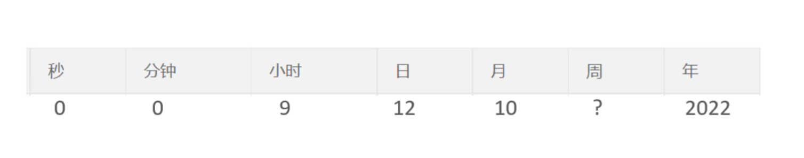
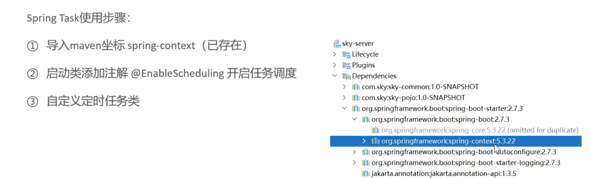
```java

@SpringBootApplication
@EnableTransactionManagement //开启注解方式的事务管理
@Slf4j
@EnableCaching // 开启缓存注解
@EnableScheduling //开启任务调度
public class SkyApplication {
    public static void main(String[] args) {
        SpringApplication.run(SkyApplication.class, args);
        log.info("server started");
    }
}
```
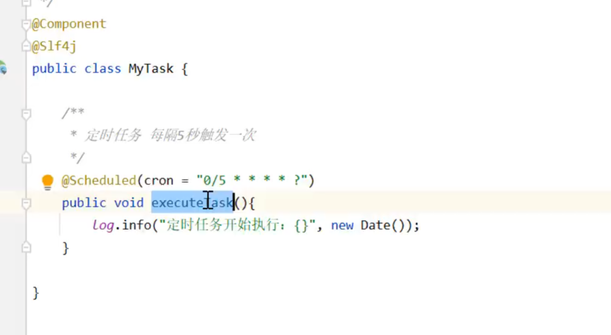
 使用步骤：
1. 在Spring Boot项目中，创建一个定时任务类，实现`@Scheduled`注解，指定cron表达式。

```java
package com.sky.task;

import com.sky.entity.Orders;
import com.sky.mapper.OrderMapper;
import lombok.extern.slf4j.Slf4j;
import org.springframework.beans.factory.annotation.Autowired;
import org.springframework.scheduling.annotation.Scheduled;
import org.springframework.stereotype.Component;

import java.time.LocalDateTime;
import java.util.List;

@Slf4j
@Component

public class OrderTask {
    @Autowired
    private OrderMapper orderMapper;
    //处理超时订单
    @Scheduled(cron = "0 * * * * ?") //每分钟触发一次
    public void processTimeoutOrder(){
        log.info("处理超时订单", LocalDateTime.now());

        LocalDateTime time = LocalDateTime.now().plusMinutes(-15);
        List<Orders> ordersList = orderMapper.getByStatusAndOrderTimeLT(Orders.PENDING_PAYMENT, time);
        if (ordersList != null && ordersList.size() > 0) {
            for (Orders orders : ordersList) {
                orders.setStatus(Orders.CANCELLED);
                orders.setCancelReason("订单超时，自动取消");
                orders.setCancelTime(LocalDateTime.now());
                orderMapper.update(orders);
            }
        }
    }


    // 处理一直处于派送中的订单
    @Scheduled(cron = "0 0 1 * * ?") //每天凌晨一点触发一次
    // 每5s触发一次，做测试
//    @Scheduled(cron = "0/5 * * * * ?")
    public void processDeliveryOrder(){
        log.info("处理一直处于派送中的订单", LocalDateTime.now());

        LocalDateTime time = LocalDateTime.now().plusMinutes(-60);
        List<Orders> ordersList = orderMapper.getByStatusAndOrderTimeLT(Orders.DELIVERY_IN_PROGRESS, time);
        if (ordersList != null && ordersList.size() > 0){
            for (Orders orders : ordersList) {
                orders.setStatus(Orders.COMPLETED);
                orderMapper.update(orders);
            }
        }
    }
}

```
### Webscoket
WebSocket是一种用于创建全双工通信的协议，允许客户端和服务器之间的通信，而不需要浏览器刷新页面。
#### 实现步骤
1. 在前端页面中，使用WebSocket对象与服务器建立连接。    
2. 在后端服务器中，监听WebSocket连接，并接收客户端发送的消息。
3. 导入Maven依赖：
```xml
<dependency>
	<groupId>org.springframework.boot</groupId>
	<artifactId>spring-boot-starter-websocket</artifactId>
</dependency>
```
4. 导入服务端组件websoceketServer,和客户端通信
```java
package com.sky.websocket;

import org.springframework.stereotype.Component;
import javax.websocket.OnClose;
import javax.websocket.OnMessage;
import javax.websocket.OnOpen;
import javax.websocket.Session;
import javax.websocket.server.PathParam;
import javax.websocket.server.ServerEndpoint;
import java.util.Collection;
import java.util.HashMap;
import java.util.Map;

/**
 * WebSocket服务
 */
@Component
@ServerEndpoint("/ws/{sid}")
public class WebSocketServer {

    //存放会话对象
    private static Map<String, Session> sessionMap = new HashMap();

    /**
     * 连接建立成功调用的方法
     */
    @OnOpen
    public void onOpen(Session session, @PathParam("sid") String sid) {
        System.out.println("客户端：" + sid + "建立连接");
        sessionMap.put(sid, session);
    }

    /**
     * 收到客户端消息后调用的方法
     *
     * @param message 客户端发送过来的消息
     */
    @OnMessage
    public void onMessage(String message, @PathParam("sid") String sid) {
        System.out.println("收到来自客户端：" + sid + "的信息:" + message);
    }

    /**
     * 连接关闭调用的方法
     *
     * @param sid
     */
    @OnClose
    public void onClose(@PathParam("sid") String sid) {
        System.out.println("连接断开:" + sid);
        sessionMap.remove(sid);
    }

    /**
     * 群发
     *
     * @param message
     */
    public void sendToAllClient(String message) {
        Collection<Session> sessions = sessionMap.values();
        for (Session session : sessions) {
            try {
                //服务器向客户端发送消息
                session.getBasicRemote().sendText(message);
            } catch (Exception e) {
                e.printStackTrace();
            }
        }
    }

}


```
5. 导入配置类WebSocketConfiguration， 注册WebSocket服务组件
```java
package com.sky.config;

import org.springframework.context.annotation.Bean;
import org.springframework.context.annotation.Configuration;
import org.springframework.web.socket.server.standard.ServerEndpointExporter;

/**
 * WebSocket配置类，用于注册WebSocket的Bean
 */
@Configuration
public class WebSocketConfiguration {

    @Bean
    public ServerEndpointExporter serverEndpointExporter() {
        return new ServerEndpointExporter();
    }

}

```
6. 导入定时任务类，定时发送消息给客户端
```java

// service中的时机
// 通过websocket向客户端推送消息
        Map map = new HashMap<>();
        map.put("type", 1);
        map.put("orderId", ordersDB.getId());
        map.put("content", "订单号:" + outTradeNo);
        String jsonString = JSON.toJSONString(map);
        webSocketServer.sendToAllClient(jsonString);
```
### String， 流处理
```java
@Override
    public SalesTop10ReportVO top10(LocalDate begin, LocalDate end) {
        LocalDateTime beginTime = LocalDateTime.of(begin, LocalTime.MIN);
        LocalDateTime endTime = LocalDateTime.of(end, LocalTime.MAX);
        Map map = new HashMap();
        map.put("beginTime", beginTime);
        map.put("endTime", endTime);
        map.put("status", Orders.COMPLETED);

        List<GoodsSalesDTO> goodsSalesDTOList = orderMapper.getSalesTop10(map);
        List<String> namemList = goodsSalesDTOList.stream().map(GoodsSalesDTO::getName).collect(Collectors.toList());
        List<Integer> numberList = goodsSalesDTOList.stream().map(GoodsSalesDTO::getNumber).collect(Collectors.toList());
        return SalesTop10ReportVO.builder()
                .nameList(StringUtils.join(namemList, ","))
                .numberList(StringUtils.join(numberList, ","))
                .build();
    }
```

### Apache POI
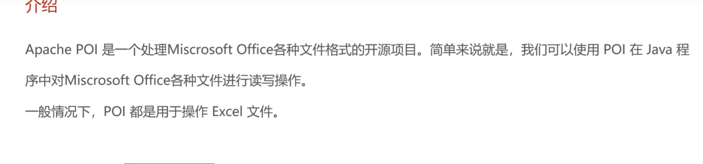
Apache POI 是一个 Java API，用于在 Java 程序中创建和操作 Microsoft Office 文件。它提供了一组类和接口，用于读取和写入各种 Office 文件格式，如 Excel、Word、PowerPoint 等。
#### 应用场景
1. 银行账单导出
2. 业务系统导出报表
3. 批量导入业务数据
4. ......

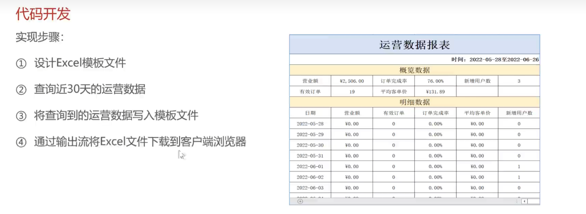

