### 拦截器
1. 拦截所有请求和部分请求：添加多个拦截器，并设置拦截器的order,表明拦截器执行顺序。
2. 拦截器需要注册到WebMvcConfigurer中,且拦截器中需要的bean 需要提前注入。
```java
public class RefreshTokenInterceptor implements HandlerInterceptor {
    private StringRedisTemplate stringRedisTemplate;
    public RefreshTokenInterceptor(StringRedisTemplate stringRedisTemplate) {
        this.stringRedisTemplate = stringRedisTemplate;
    }
    public boolean preHandle(HttpServletRequest request, HttpServletResponse response, Object handler) throws Exception {
        // 1.获取请求头中的token
        String token = request.getHeader("authorization");
        if (StrUtil.isBlank(token)) {
            return true;
        }
        // 2.基于token获取redis中的用户
        String key = RedisConstants.LOGIN_USER_KEY + token;
        Map<Object, Object> userMap = stringRedisTemplate.opsForHash().entries(key);
        // 3.判断用户是否存在
        if (userMap.isEmpty()) {
            // 4.不存在，拦截，返回401
            return true;
        }
        // 5.存在，保存用户信息到 ThreadLocal
        UserDTO userDTO = BeanUtil.fillBeanWithMap(userMap, new UserDTO(), false);
        UserHolder.saveUser(userDTO);
        // 6.刷新token有效期
        stringRedisTemplate.expire(key, RedisConstants.LOGIN_USER_TTL, TimeUnit.MINUTES);
        // 7.放行
        return true;
    }
    public void afterCompletion(HttpServletRequest request, HttpServletResponse response, Object handler, Exception ex) throws Exception {
        // 移除用户
        UserHolder.removeUser();
    }
}
```
```java

@Configuration
public class WebMvcConfig implements WebMvcConfigurer {
    @Resource
    private StringRedisTemplate stringRedisTemplate;
    @Override
    public void addInterceptors(InterceptorRegistry registry) {
        registry.addInterceptor(new LoginInterceptor())
                .addPathPatterns("/**")
                .excludePathPatterns("/user/code","/user/login","/blog/hot","/shop/**","/shop-type/**","/upload/**","/voucher/**")
                .order(1);
        registry.addInterceptor(new RefreshTokenInterceptor(stringRedisTemplate))
                .addPathPatterns("/**")
                .order(0);
    }


}
```

## 缓存相关
### 缓存穿透
查询一个不存在的数据，缓存和数据库都不命中，而大量请求这种查询的请求导致数据库压力增大
**原因：** 
- 业务代码问题，set和get的key不一致。
- 恶意攻击，爬虫造成大量的空命中。
1. 缓存空值：缓存空值，避免缓存穿透。
**存在的问题：**
- value为null不占用存储空间，但是缓存为空值，需要一定的内存空间，**设置一个较短的过期时间，让其自动剔除**
- 缓存层和存储层有一段时间的窗口不一致，过期时间设置为5分钟，如果此时存储层添加了这个数据，缓存层和存储层会出现数据不一致性。**存储时清楚缓存层的空值**

```java

public <R, ID> R getWithPassThrough(String keyPrefix, ID id, Class<R> type, Function<ID, R> dbFallback, Long time, TimeUnit unit){
        String key = keyPrefix + id;
        String json = stringRedisTemplate.opsForValue().get(key);
        if (StrUtil.isNotBlank(json)) {
            return JSONUtil.toBean(json, type);
        }
        if (json != null) {
            return null;
        }
        R r = dbFallback.apply(id);
        if (r == null) {
            stringRedisTemplate.opsForValue().set(key, "", time, unit);
            return null;
        }
        this.set(key, r, time, unit);
        return r;
    }
```
2. 布隆过滤器
- 在访问缓存层和存储层之前，将存在的key用布隆过滤器提前保存，对需要请求的key用布隆过滤器验证是否存在，存在时在进入缓存层，存储层。
- 用bitmap做布隆过滤器，使用hash函数，将key映射到bitmap的索引位置，如果索引位置为1，则表示存在，否则不存在。
- 布隆过滤器可以减少缓存穿透，由于哈希函数的碰撞，导致误判。但是误判率不能太高，否则会降低效率。

### 缓存击穿
缓存击穿：当前的key是一个热点key,并发量非常大，而对该key的缓存重建不能在短时间完成，比如key失效了，有大量的线程重建缓存，增加后端的负载。
1. 互斥锁
只允许一个线程进行重建，其他线程等待重建缓存的线程执行完成，重新从缓存获取数据即可。
- 缓存重建非常耗时时，吞吐量降低。如果缓存依赖其他缓存可能存在死锁。一致性可得到保证
2. 永不过期
设置一个逻辑过期的时间，当发现超过逻辑过期时间后，用单独的线程取更新缓存。而其他的返回之前的旧数据
- 存在数据不一致情况。
```java
public <R, ID> R getWithLogicalExpire(String keyPrefix, String lockKeyPrefix,ID id, Class<R> type, Function<ID, R> dbFallback, Long time, TimeUnit unit){
        String key = keyPrefix + id;
        String json = stringRedisTemplate.opsForValue().get(key);
        if (StrUtil.isBlank(json)) {
            return null;
        }
        RedisData redisData = JSONUtil.toBean(json, RedisData.class);
        R r = JSONUtil.toBean((JSONObject) redisData.getData(), type);
        LocalDateTime expireTime = redisData.getExpireTime();
        // 判断是否过期
        if (expireTime.isAfter(LocalDateTime.now())) {
            // 没有过期，直接返回数据
            return r;
        }
        // 开启一个线程，刷新缓存
        String lockKey = lockKeyPrefix + id;
        boolean isLock = tryLock(lockKey);
        if(isLock){
            CACHE_REBUILD_EXECUTOR.submit(() -> {
                try {
                    // 重建缓存
                    R r1 = dbFallback.apply(id);
                    this.setWithLogicalExpire(key, r1, time, unit);
                } catch (Exception e) {
                    throw new RedisCacheException("缓存重建异常");
                } finally {
                    // 释放锁
                    unLock(lockKey);
                }
            });
        }
        return r;
    }
```
### 缓存雪崩
大量缓存在同一时间段内失效，发生大量的缓存穿透，所有的查询落到数据库上
- 尽量让失效时间点均衡
### 简单工具封装
```java

package com.hmdp.utils;

import cn.hutool.core.util.BooleanUtil;
import cn.hutool.core.util.StrUtil;
import cn.hutool.json.JSONObject;
import cn.hutool.json.JSONUtil;
import com.hmdp.exception.RedisCacheException;
import org.springframework.data.redis.core.StringRedisTemplate;
import org.springframework.stereotype.Component;

import javax.annotation.Resource;
import java.time.LocalDateTime;
import java.util.concurrent.ExecutorService;
import java.util.concurrent.Executors;
import java.util.concurrent.TimeUnit;
import java.util.function.Function;

@Component
public class RedisCache {

    private final StringRedisTemplate stringRedisTemplate;

    public RedisCache(StringRedisTemplate stringRedisTemplate) {
        this.stringRedisTemplate = stringRedisTemplate;
    }

    public void set(String key, Object value, Long timeout, TimeUnit timeUnit){
        stringRedisTemplate.opsForValue().set(key, JSONUtil.toJsonStr(value), timeout, timeUnit);
    }
    // 逻辑过期
    public void setWithLogicalExpire(String key, Object value, Long timeout, TimeUnit timeUnit){
        RedisData redisData = new RedisData();
        redisData.setData(value);
        redisData.setExpireTime(LocalDateTime.now().plusSeconds(timeUnit.toSeconds(timeout)));
        stringRedisTemplate.opsForValue().set(key, JSONUtil.toJsonStr(redisData));
    }

    /**
     * 缓存穿透是指在缓存中查询一个不存在的数据，导致数据库查询，然后返回一个null值，导致客户端无法使用，称为缓存穿透。
     * 粗暴用控制缓存击，直接返回空
     * **/
    public <R, ID> R getWithPassThrough(String keyPrefix, ID id, Class<R> type, Function<ID, R> dbFallback, Long time, TimeUnit unit){
        String key = keyPrefix + id;
        String json = stringRedisTemplate.opsForValue().get(key);
        if (StrUtil.isNotBlank(json)) {
            return JSONUtil.toBean(json, type);
        }
        if (json != null) {
            return null;
        }
        R r = dbFallback.apply(id);
        if (r == null) {
            stringRedisTemplate.opsForValue().set(key, "", time, unit);
            return null;
        }
        this.set(key, r, time, unit);
        return r;
    }

    /**
     * 缓存击穿
     * */
    // 线程池、
    private static final ExecutorService CACHE_REBUILD_EXECUTOR = Executors.newFixedThreadPool(10);
    public <R, ID> R getWithLogicalExpire(String keyPrefix, String lockKeyPrefix,ID id, Class<R> type, Function<ID, R> dbFallback, Long time, TimeUnit unit){
        String key = keyPrefix + id;
        String json = stringRedisTemplate.opsForValue().get(key);
        if (StrUtil.isBlank(json)) {
            return null;
        }
        RedisData redisData = JSONUtil.toBean(json, RedisData.class);
        R r = JSONUtil.toBean((JSONObject) redisData.getData(), type);
        LocalDateTime expireTime = redisData.getExpireTime();
        // 判断是否过期
        if (expireTime.isAfter(LocalDateTime.now())) {
            // 没有过期，直接返回数据
            return r;
        }
        // 开启一个线程，刷新缓存
        String lockKey = lockKeyPrefix + id;
        boolean isLock = tryLock(lockKey);
        if(isLock){
            CACHE_REBUILD_EXECUTOR.submit(() -> {
                try {
                    // 重建缓存
                    R r1 = dbFallback.apply(id);
                    this.setWithLogicalExpire(key, r1, time, unit);
                } catch (Exception e) {
                    throw new RedisCacheException("缓存重建异常");
                } finally {
                    // 释放锁
                    unLock(lockKey);
                }
            });
        }
        return r;
    }
    private boolean tryLock(String key){
        Boolean flag = stringRedisTemplate.opsForValue().setIfAbsent(key, "1", 10, TimeUnit.SECONDS);
        return BooleanUtil.isTrue(flag);
    }
    private void unLock(String key){
        stringRedisTemplate.delete(key);
    }
}
```
## 锁 
- 乐观锁：假设每次并不一定会发生冲突，不会立即锁定资源。通过版本号法，或者时间戳，版本号法是一种灵活的思想
每次更新之前检查数据的版本号是否一致，只有版本号一致时才回更新。**适合读多写少场景**，例如库存查询。
- 悲观锁：假设每次都会发生冲突，再操作之前会立即锁定资源。有效防止并发冲突，锁定时间较长的情况下会影响系统。
### 乐观锁解决超卖
```java
 @Transactional
    public Long seckillVoucherByLeGuan(Long voucherId) {
        /**
         * 乐观锁：
         * 版本号法，更新时判断之前的版本号是否正确，不正确则返回错误，正确则更新库存，并返回更新后的版本号
         * 根据实际情况选择版本号字段，比如stock就可以作为一种版本
         * 解决超卖，.gt("stock",0)即可
         *
         * */
        SeckillVoucher voucher = seckillVoucherService.getById(voucherId);
        if(voucher.getBeginTime().isAfter(LocalDateTime.now())){
            throw new VoucherException("秒杀尚未开始");
        }
        if(voucher.getEndTime().isBefore(LocalDateTime.now())){
            throw new VoucherException("秒杀已经结束");
        }
        if(voucher.getStock()<=0){
            throw new VoucherException("库存不足");
        }
        // 扣减库存
        boolean success = seckillVoucherService.update()
                .setSql("stock=stock-1")
                .eq("voucher_id", voucherId).gt("stock",0) // 乐观锁，解决超卖
                .update();
        if(!success){
            throw new VoucherException("库存不足");
        }
        // 创建订单
        VoucherOrder order = new VoucherOrder();
        // 全局唯一ID
        long orderId = redisIdWorker.nextId("order");
        order.setId(orderId);
        order.setUserId(UserHolder.getUser().getId());
        order.setVoucherId(voucherId);
        save(order);
        return orderId;
    }

```

### 一人一单
- 对USERID进行锁，防止一个用户多次下单，同一个JVM中，不同线程带过来的USERID获取相同的USERID常量池，userId.toString().intern()，内存地址相同
- 使用synchronized对USERID加锁，然后执行业务
- 加锁时机，由于业务是有事务的，需要对整个业务加锁，确保事务提交后，才释放锁
- 事务要生效是对当前的类做了动态代理，拿到代理对象，通过代理对象this.createVoucherOrder(voucherId); this是非代理对象，没有事务功能
1. 依赖
```xml
  <dependency>
    <groupId>org.aspectj</groupId>
    <artifactId>aspectjweaver</artifactId>
</dependency>
```
2. 启动类暴露代理
```java 
@EnableAspectJAutoProxy(exposeProxy = true)
```
3. 通过代理对象执行业务代码
```java
IVoucherOrderService proxy = (IVoucherOrderService) AopContext.currentProxy();
            Long orderId = proxy.createVoucherOrder(voucherId);
            return orderId;
```
- 具体代码
```java
 @Transactional
public Long createVoucherOrder(Long voucherId) {
    // 一人一单
    Long userId = UserHolder.getUser().getId();
    if(query().eq("user_id",userId).eq("voucher_id",voucherId).count()>0){
        throw new VoucherException("您已经购买过该优惠券");
    }
    // 扣减库存
    boolean success = seckillVoucherService.update()
            .setSql("stock=stock-1")
            .eq("voucher_id", voucherId).gt("stock",0) // 乐观锁，解决超卖
            .update();
    if(!success){
        throw new VoucherException("库存不足");
    }
    // 创建订单
    VoucherOrder order = new VoucherOrder();
    // 全局唯一ID
    long orderId = redisIdWorker.nextId("order");
    order.setId(orderId);
    order.setUserId(UserHolder.getUser().getId());
    order.setVoucherId(voucherId);
    save(order);
    return orderId;
}

public Long seckillVoucherByYiRenYiDan(Long voucherId) {
        /**
         *
         * 乐观锁：
         * 版本号法，更新时判断之前的版本号是否正确，不正确则返回错误，正确则更新库存，并返回更新后的版本号
         * 根据实际情况选择版本号字段，比如stock就可以作为一种版本
         * 解决超卖，.gt("stock",0)即可
         *
         * */
        SeckillVoucher voucher = seckillVoucherService.getById(voucherId);
        if(voucher.getBeginTime().isAfter(LocalDateTime.now())){
            throw new VoucherException("秒杀尚未开始");
        }
        if(voucher.getEndTime().isBefore(LocalDateTime.now())){
            throw new VoucherException("秒杀已经结束");
        }
        if(voucher.getStock()<=0){
            throw new VoucherException("库存不足");
        }

        Long userId = UserHolder.getUser().getId();
        /**
         * 加锁时机：
         * 1. 通过userID进行加锁，但userId.toString,每次都创建新一个对象，导致锁不住，用intern()解决，intern返回规范表示，从常量池查找对应的地址
         * 2.事务提交后再释放锁
         * 如果在createVoucherOrder里面加锁，函数结束后，锁释放，但是事务还没有提交，存在并发安全问题。
         * 所以必须在事务提交后释放锁， 锁整个函数
         * 3.事务要生效是对当前的类做了动态代理，拿到代理对象，通过代理对象this.createVoucherOrder(voucherId);
         * this是非代理对象，没有事务功能
         * 添加注解
         * <dependency>
         *  <groupId>org.aspectj</groupId>
         *  <artifactId>aspectjweaver</artifactId>
         * </dependency>
         * 启动类暴露代理
         * @EnableAspectJAutoProxy(exposeProxy = true)
         * */
//        synchronized (
//                userId.toString().intern()
//        ){
//            Long orderId = this.createVoucherOrder(voucherId);
//            return orderId;
//        }
        synchronized (
                userId.toString().intern()
        ){
            IVoucherOrderService proxy = (IVoucherOrderService) AopContext.currentProxy();
            Long orderId = proxy.createVoucherOrder(voucherId);
            return orderId;
        }

    }

```

### 使用redis互斥锁分布式锁
多个集群的时候前面的锁就不适用了
基于redis实现分布式锁的思路：
- 利用set nx ex获取锁，设置保存时间，保存线程标识，防止超时释放带来的误删锁
- 释放锁，判断锁标识是否是自己的，是就删除，不是就返回
- 利用LUA脚本让判断锁标识一致的操作和删除锁的操作原子化，保证原子性
- 定义一个锁对象
```java 
 public interface ILock {
    /**
     * 尝试获取锁
     * @return true代表获取锁成功，false代表获取锁失败
     * @param timeoutSec 锁持有的过期时间，单位秒
     */
    boolean tryLock(long timeoutSec);

    void unlock();
}
```
存在的情况:
1. 锁误删除，删除的不是自己的锁，存入的线程提示
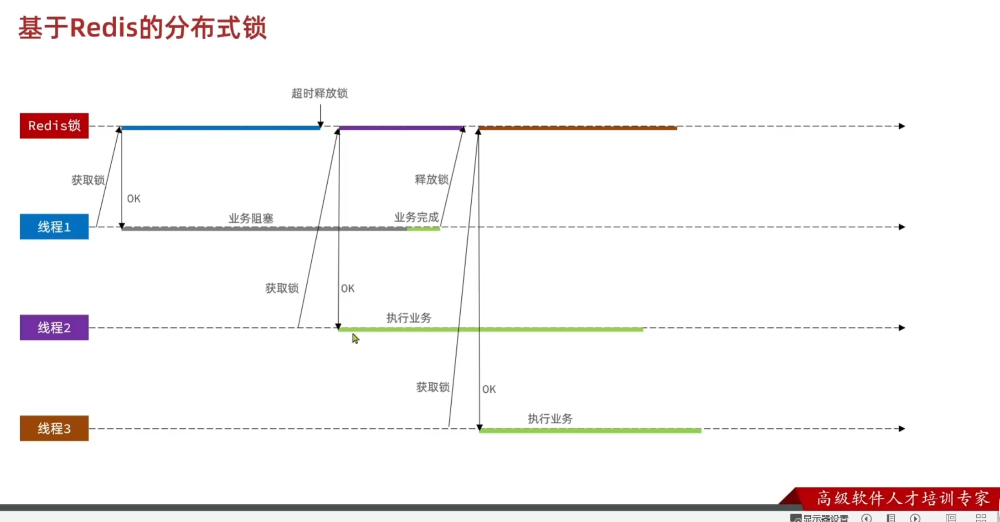
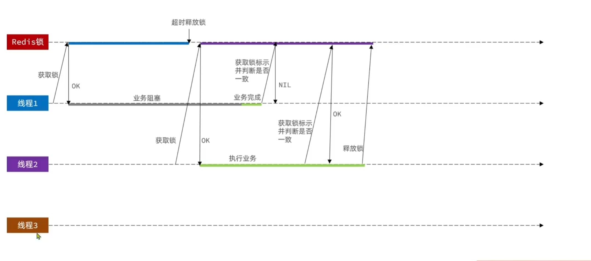
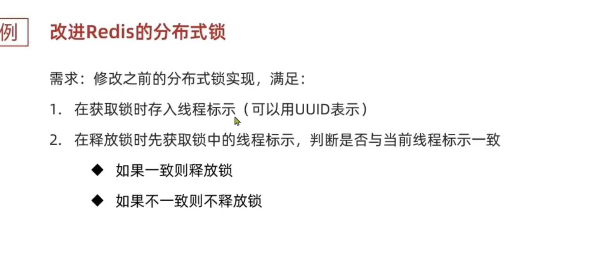
```java
public class GaiJinRedisLock implements ILock{
    private StringRedisTemplate stringRedisTemplate;
    private String name;
    private final static String KEY_PREFIX = "lock:";
    private final static String ID_PREFIX = UUID.randomUUID().toString(true) + "-";
    public GaiJinRedisLock(String name, StringRedisTemplate stringRedisTemplate) {
        this.name = name;
        this.stringRedisTemplate = stringRedisTemplate;
    }
    @Override
    public boolean tryLock(long timeoutSec) {
        String threadId = ID_PREFIX + Thread.currentThread().getId();
        Boolean isLock = stringRedisTemplate.opsForValue().setIfAbsent(KEY_PREFIX + name, threadId, timeoutSec, TimeUnit.SECONDS);
        // 防止自动拆箱的空指针
        return Boolean.TRUE.equals(isLock);
    }

    @Override
    public void unlock() {
        // 判断标识是否一致
        String threadId = ID_PREFIX + Thread.currentThread().getId();
        String id = stringRedisTemplate.opsForValue().get(KEY_PREFIX + name);
        if (threadId.equals(id)) {
            stringRedisTemplate.delete(KEY_PREFIX + name);
        }
    }
}
```
```java
public Long seckillVoucherJiQun2(Long voucherId) {
        SeckillVoucher voucher = seckillVoucherService.getById(voucherId);
        if (voucher.getBeginTime().isAfter(LocalDateTime.now())) {
            throw new VoucherException("秒杀尚未开始");
        }
        if (voucher.getEndTime().isBefore(LocalDateTime.now())) {
            throw new VoucherException("秒杀已经结束");
        }
        if (voucher.getStock() <= 0) {
            throw new VoucherException("库存不足");
        }

        Long userId = UserHolder.getUser().getId();

        String lockKey = "order:" + userId;
        GaiJinRedisLock lock = new GaiJinRedisLock(lockKey, stringRedisTemplate);
        boolean isLock = lock.tryLock(1200);
        if (!isLock) {
            throw new VoucherException("不允许重复下单");
        }
        try {
            IVoucherOrderService proxy  = (IVoucherOrderService) AopContext.currentProxy();
            return proxy.createVoucherOrder(voucherId);
        } finally {
            // 释放锁
            lock.unlock();
        }
    }

```

2. 判断锁是否过期，和释放锁之间的误差 
判断锁标识和释放锁两个动作，之间发生阻塞就GG，保证这个操作的原子性
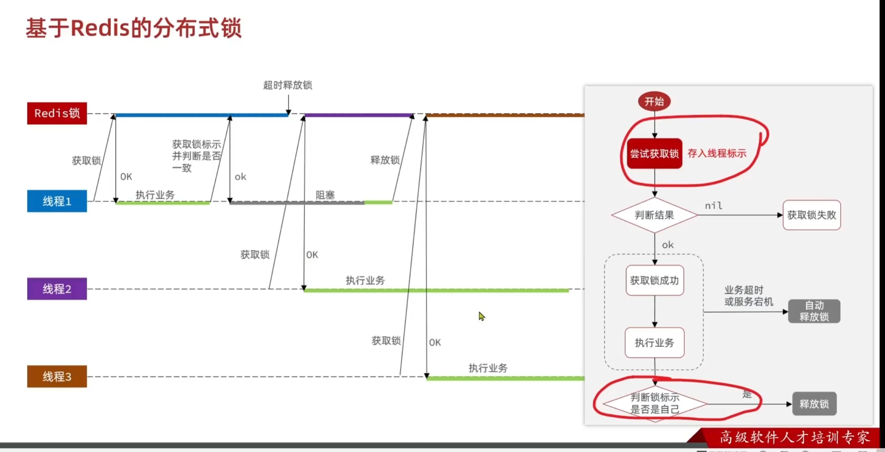

Redis事务？？？？？    XXXX
**LUA脚本**
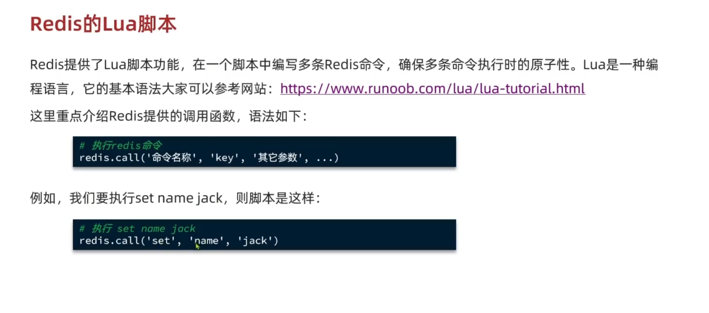
```lua
if (redis.call('get', KEYS[1]) == ARGV[1]) then
	-- 释放锁
	return redis.call('del', KEYS[1])
end
return 0
```
```java
public class LuaRedisLock implements ILock{
    private StringRedisTemplate stringRedisTemplate;
    private String name;
    private final static String KEY_PREFIX = "lock:";
    private final static String ID_PREFIX = UUID.randomUUID().toString(true) + "-";
    // 释放锁的脚本,通过文件加载
    private static final DefaultRedisScript<Long> SECUNLOCK_SCRIPT;
    static {
        SECUNLOCK_SCRIPT = new DefaultRedisScript<>();
        SECUNLOCK_SCRIPT.setLocation(new ClassPathResource("secUnlock.lua"));
        SECUNLOCK_SCRIPT.setResultType(Long.class);
    }


    public LuaRedisLock(String name, StringRedisTemplate stringRedisTemplate) {
        this.name = name;
        this.stringRedisTemplate = stringRedisTemplate;
    }
    @Override
    public boolean tryLock(long timeoutSec) {
        String threadId = ID_PREFIX + Thread.currentThread().getId();
        Boolean isLock = stringRedisTemplate.opsForValue().setIfAbsent(KEY_PREFIX + name, threadId, timeoutSec, TimeUnit.SECONDS);
        // 防止自动拆箱的空指针
        return Boolean.TRUE.equals(isLock);
    }

    @Override
    public void unlock() {
        // 判断标识是否一致
        String threadId = ID_PREFIX + Thread.currentThread().getId();
        // 调用lua脚本, 满足了原子性
        stringRedisTemplate.execute(
                SECUNLOCK_SCRIPT,
                Collections.singletonList(KEY_PREFIX + name),
                threadId);
    }
}


```


### 上述存在的问题
下述问题发生概率极低
- 不可重入：同一线程不能多次获取同一把锁：比如方法A调用方法B,A中需要获取锁，而B中也需要获取锁，B此时是获取不到锁的，因为A已经获取了锁，此时B就无法获取锁了，造成死锁。
- 不可重试：锁获取失败，返回false, 无法重试，需要用户自己重试
- 超时释放：业务执行时间过长，导致锁无法释放，存在安全隐患 
- 主从一致性： 如果Redis提供了主从集群，主从同步存在延迟。线程从主节点获得锁，还未来得及同步给从节点，此时主节点宕机，从从节点新选一个节点作为主节点，而此时新选的主节点没有被之前宕机的主节点同步，导致其他线程也能获取锁，从而造成安全隐患问题
**解决**
#### Redisson框架
- 可重入：利用hsah结构记录线程ID和重入次数
- 可重试：利用信号量和PubSub功能实现等待唤醒，获取锁失败的重试机制、
- 超时续约：利用watchDog,每隔一段时间(releaseTime/3)，重置超时时间。
- 主从一致性：
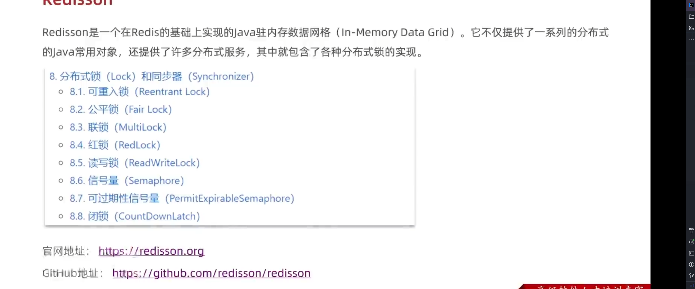

#### 使用redisson分布式锁
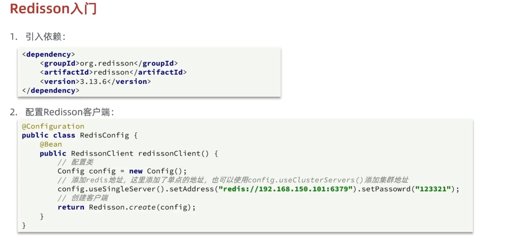

可重入性
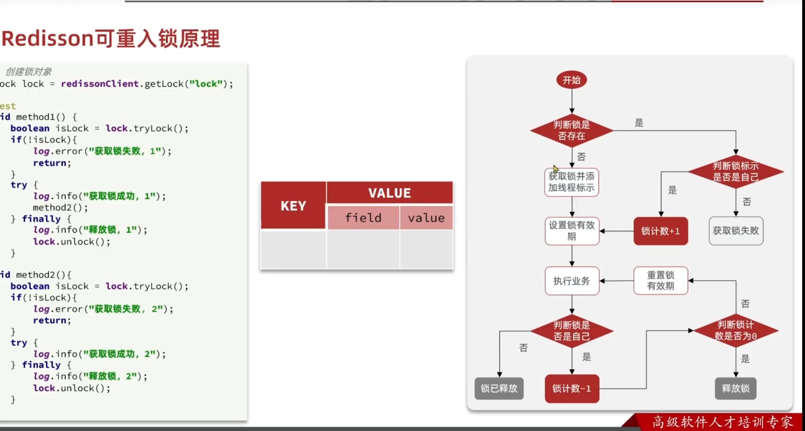， 用LUA脚本实现
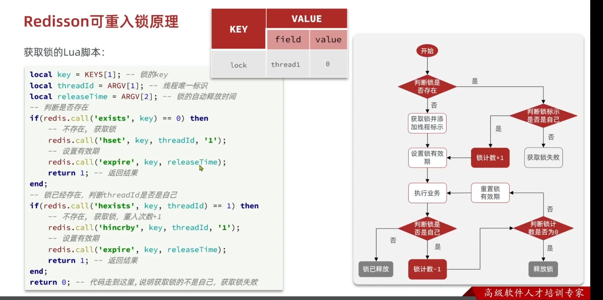 
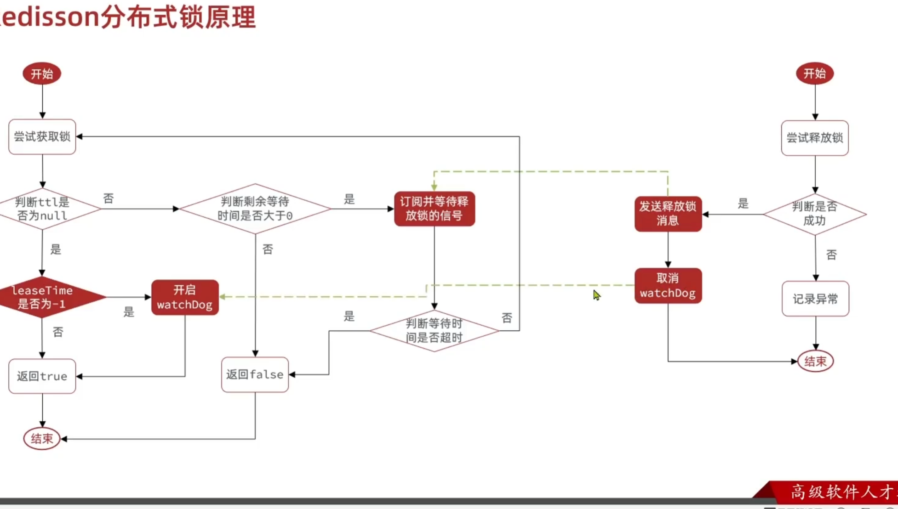

### redis优化
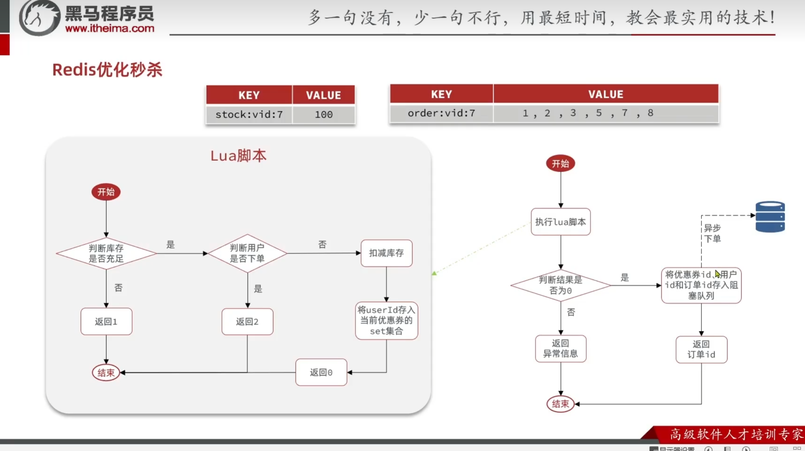
- 将优惠券时间，库存等数据存储在redis中，避免每次都去数据库查询，从而提高效率。
- 将对应优惠券的购买的用户集合存储在redis中，避免每次都去数据库查询，从而提高效率。
- 将订单创建，库存扣减放入消息队列，避免高并发下，数据库压力过大。
- - Lua脚本
```Lua
local voucherId = ARGV[1]
local userId = ARGV[2]
local currentTime = tonumber(ARGV[3])

local stockKey = 'seckill:stock:' .. voucherId
local orderKey = 'seckill:order:' .. voucherId

-- 获取活动信息
local stock = tonumber(redis.call('hget', stockKey, 'stock'))
local startTime = tonumber(redis.call('hget', stockKey, 'start_time'))
local endTime = tonumber(redis.call('hget', stockKey, 'end_time'))

-- 判断活动是否未开始
if currentTime < startTime then
    return 3
end

-- 判断活动是否已结束
if currentTime > endTime then
    return 4
end

-- 判断库存是否充足
if stock <= 0 then
    return 1
end

-- 判断用户是否已经下单
if redis.call('sismember', orderKey, userId) == 1 then
    return 2
end

-- 扣减库存并记录用户
redis.call('hincrby', stockKey, 'stock', -1)
redis.call('sadd', orderKey, userId)

return 0
 
```
- - service
```java
private static final String LUA_SCRIPT_NAME = "/lua/secKill2.lua";
private static final DefaultRedisScript<Long> SECKILL_SCRIPT;
static {
    SECKILL_SCRIPT = new DefaultRedisScript<>();
    SECKILL_SCRIPT.setLocation(new ClassPathResource(LUA_SCRIPT_NAME));
    SECKILL_SCRIPT.setResultType(Long.class);
}
public Long seckillVoucherYiBU(Long voucherId){
        // 执行LUA脚本
        Long userId = UserHolder.getUser().getId();
        // 当前时间的时间戳
        Long now = LocalDateTime.now().toEpochSecond(ZoneOffset.UTC);
        Long result = stringRedisTemplate.execute(
                SECKILL_SCRIPT,
                Collections.emptyList(),
                voucherId.toString(),
                userId.toString(),
                now.toString()
        );
        int r = result.intValue();
        if(r == 1){
            throw new VoucherException("库存不足");
        } else if(r == 2){
            throw new VoucherException("不能重复下单");
        } else if(r == 3){
            throw new VoucherException("活动未开始");
        } else if(r == 4){
            throw new VoucherException("活动已结束");
        }
        // 有购买资格，保存到阻塞队列
        long orderId = redisIdWorker.nextId("seckill:orderID");

        // 加入异步MQ队列,实现订单创建
        VoucherOrder order = new VoucherOrder();
        order.setId(orderId);
        order.setUserId(UserHolder.getUser().getId());
        order.setVoucherId(voucherId);
//        rabbitTemplate.convertAndSend("order.direct", "order.routing.key", order);
        rabbitTemplate.convertAndSend("order.exchange", "order.seckill.routing.key", order);
        return orderId;

    }
```
- - 消费者
```java
@Component
@Slf4j
public class OrderSecMq {
    @Resource
    private VoucherOrderServiceImpl voucherOrderService;
    @Resource
    private ISeckillVoucherService seckillVoucherService;
    // 绑定交换机、队列、路由键
    @RabbitListener( bindings = @QueueBinding(
            value = @Queue(value = "order.seckill.queue", durable = "true"),
            exchange = @Exchange(value = "order.exchange", type = "direct", durable = "true"),
            key = "order.seckill.routing.key"
    ))
    @Transactional
    public void createOrder(VoucherOrder voucherOrder){
        // 幂等判断
        VoucherOrder voucherOrder1 = voucherOrderService.getById(voucherOrder.getId());
        if (voucherOrder1 != null){
            log.info("mq, 订单已存在");
            return;
        }
        try{

            // 库存见一
            // 扣减库存
            boolean success = seckillVoucherService.update()
                    .setSql("stock=stock-1")
                    .eq("voucher_id", voucherOrder.getVoucherId()).gt("stock",0) // 乐观锁，解决超卖
                    .update();
            if(!success){
                log.error("mq, 库存不足");
            }
            voucherOrderService.save(voucherOrder);
            log.info("mq, 扣减库存成功");

        }catch (Exception e){
            log.error("mq, 下单失败, 订单详情：", voucherOrder);
        }

    }
}
```
- - rabbitmq配置
```yaml
spring:
  application:
    name: hmdp
  rabbitmq:
    host: localhost
    port: 5672
    username: sats
    password: 123456
    virtual-host: /dp
#    生产者重试机制
    connection-timeout: 1s
    template:
      retry:
        enabled: true
        multiplier: 1
        max-attempts: 3
        initial-interval: 1000ms
    listener:
      simple:
        acknowledge-mode: auto

```
- - 批量登录的token生成
- - 优惠券预热，提前打入redis
- 压测
库存100， 150个用户，每个用20次请求，总计3000次请求 相比于不用redis性能提升了一倍左右


## 关注推送
### Feed流
- 拉模式（读扩散）：只有用户主动去拉取，没有实时性，读取速度慢，
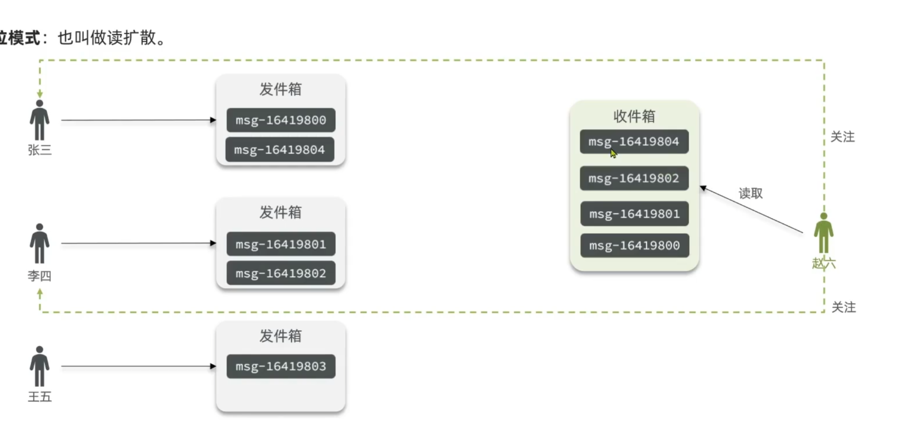
- 推模式（写扩散）：内存占用高
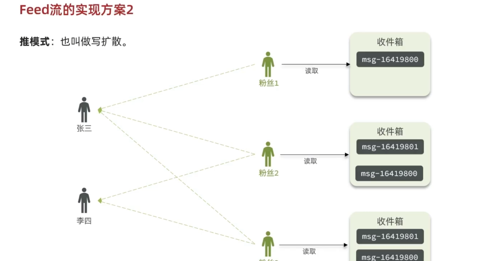


# 包装为xx项目

## 问题

Q:一人多单问题？针对**Lua脚本+RabbitMQ**优化藏品抢购的订单处理流程

使用hash存储，key为藏品ID,hashkey为用户ID,value为已经购买数量，脚本传递购买资格数量

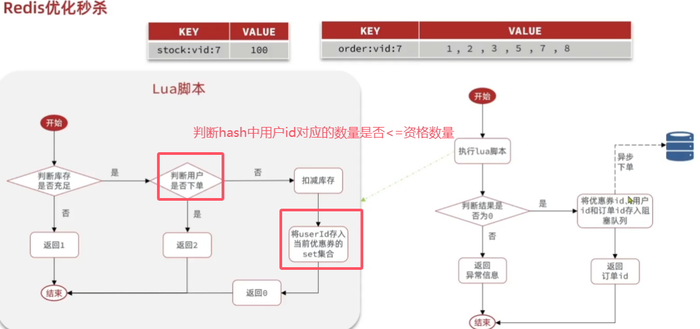

Q:实现**MetaObjectHandler**接口，重写insertFill，updateFill方法实现公共字段的自动填充

1.在实体类上添加注解@TableField，指定自动填充的策略

2.创建一个类，实现MetaObjectHandler接口，并重写相应的方法

```java


 
/**
 * 员工实体
 */
@Data
public class Employee implements Serializable {
    private static final long serialVersionUID = 1L;
    private Long id;
    private String username;
    private String name;
    private String password;
    private String phone;
    private String sex;
    private String idNumber;
    private Integer status;
 
    //插入时候填充
    @TableField(fill = FieldFill.INSERT)
    private LocalDateTime createTime;
    //插入和更新时填充
    @TableField(fill = FieldFill.INSERT_UPDATE)
    private LocalDateTime updateTime;
 
    //插入时填充
    @TableField(fill = FieldFill.INSERT)
    private Long createUser;
 
    //插入更新时填充
    @TableField(fill = FieldFill.INSERT_UPDATE)
    private Long updateUser;
 
```

```java
package com.hmdp.config;/**
 * @Description: TODO
 * @Author: sats@jz
 * @Date: 2024/11/5 19:20
 **/

import com.baomidou.mybatisplus.core.handlers.MetaObjectHandler;
import org.apache.ibatis.reflection.MetaObject;

import java.time.LocalDateTime;

/**
 * @description TODO
 * @author sats@jz
 * @date 2024年11月05日 19:20
 */
@configuration
public class MyMetaObjectHandler implements MetaObjectHandler {
    @Override
    public void insertFill(MetaObject metaObject) {
        if (metaObject.hasSetter("createTime")) {
            metaObject.setValue("createTime", LocalDateTime.now()); // 创建时间
        }
        if (metaObject.hasSetter("updateTime")) {
            metaObject.setValue("updateTime", LocalDateTime.now()); // 修改时间
        }
        if (metaObject.hasSetter("createUser")) {
            metaObject.setValue("createUser", 1); // 创建人ID
        }
        if (metaObject.hasSetter("updateUser")) {
            metaObject.setValue("updateUser", 1); // 修改人ID
        }
    }

    @Override
    public void updateFill(MetaObject metaObject) {
        if (metaObject.hasSetter("updateTime")) {
            metaObject.setValue("updateTime", LocalDateTime.now()); // 修改时间
        }
        if (metaObject.hasSetter("updateUser")) {
            metaObject.setValue("updateUser", 1); // 修改人ID
        }
    }
}

```

### 抽奖

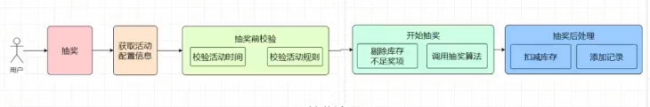

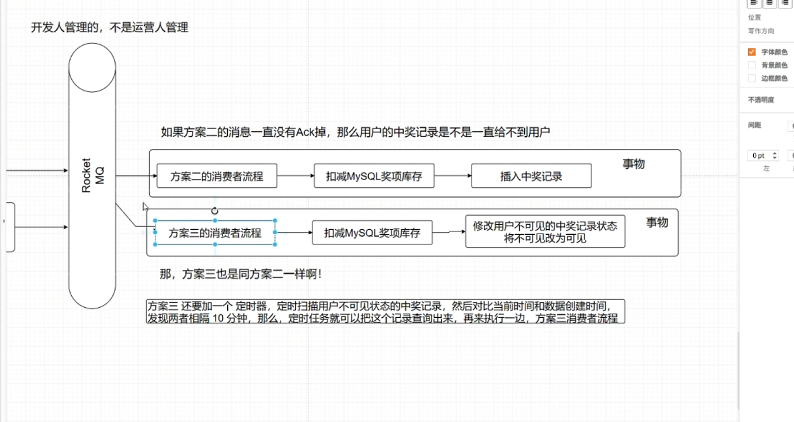

抽奖算法设计，变量，1.用户创建时间到抽奖时间之差的时间戳t 2.用户历史期间已经中奖品次数m 3.用户最近一个月消费总数与总消费数比值r  4.随机扰动因子，增加一点随机性   输出一个概率p， 根据概率p得到中将奖品的优劣。其中3的优先级大于2大于1大于4

**t**: 用户创建时间到抽奖时间的差值（时间戳）。

- 归一化处理：可以将时间差转换为权重范围，越新的用户赋予较低权重，越老的用户权重较高。

**mmm**: 用户历史期间已中奖品次数。

- 如果用户中奖次数多，可能相对权重较低（避免重复中奖），通过一定比例计算出归一化值。

**rrr**: 用户最近一个月消费总数与总消费数的比值。

- 权重设定为 rrr 的直接比值，消费比例越高的用户权重越高，优先考虑。

**随机扰动因子**：用于增加随机性，使得权重相近的用户也有一定概率获得奖品。

- 可以设置为一个0到1之间的随机数，每次抽奖重新生成。

#### 2. 权重设定和概率计算

根据优先级分配每个变量的权重，例如：

- rrr 的权重最大，设为 0.5
- mmm 的权重其次，设为 0.3
- ttt 的权重较低，设为 0.15
- 随机扰动因子权重最低，设为 0.05

#### 1. 变量定义和预处理

我们先对各变量做归一化处理，以确保它们在相同范围（例如0到1之间），方便权重计算。

- **ttt**: 用户创建时间到抽奖时间的差值（时间戳）。
  - 归一化处理：可以将时间差转换为权重范围，越新的用户赋予较低权重，越老的用户权重较高。
- **mmm**: 用户历史期间已中奖品次数。
  - 如果用户中奖次数多，可能相对权重较低（避免重复中奖），通过一定比例计算出归一化值。
- **rrr**: 用户最近一个月消费总数与总消费数的比值。
  - 权重设定为 rrr 的直接比值，消费比例越高的用户权重越高，优先考虑。
- **随机扰动因子**：用于增加随机性，使得权重相近的用户也有一定概率获得奖品。
  - 可以设置为一个0到1之间的随机数，每次抽奖重新生成

#### 2. 权重设定和概率计算

根据优先级分配每个变量的权重，例如：

- rrr 的权重最大，设为 0.5
- mmm 的权重其次，设为 0.3
- ttt 的权重较低，设为 0.15
- 随机扰动因子权重最低，设为 0.05

然后，我们使用加权求和的方式计算一个最终的概率 ppp 来决定中奖的概率：


其中，wrw_rwr、wmw_mwm、wtw_twt、wrandw_{\text{rand}}wrand 分别为各个变量的权重。

- **rrr**: 消费比例，直接取值。
- **mmm**: 历史中奖次数，我们取 1−m1 - m1−m 来降低中奖次数高的用户的权重。
- **ttt**: 使用 1log⁡(t+1)\frac{1}{\log(t + 1)}log(t+1)1 来表示时间戳的加权，时间越长，权重越低。
- **随机扰动因子**: 使用一个随机数在0到1之间，增加一定的随机性。

#### 3. 中奖概率 ppp 的解释

计算出 ppp 后，可以将其用于奖品分配，按照ppp 的值将用户分入不同的奖品级别。例如：

- p>0.8p > 0.8p>0.8: 用户有机会获得高等级奖品
- 0.5<p≤0.80.5 < p \leq 0.80.5<p≤0.8: 用户有机会获得中等级奖品
- p≤0.5p \leq 0.5p≤0.5: 用户有机会获得低等级奖品

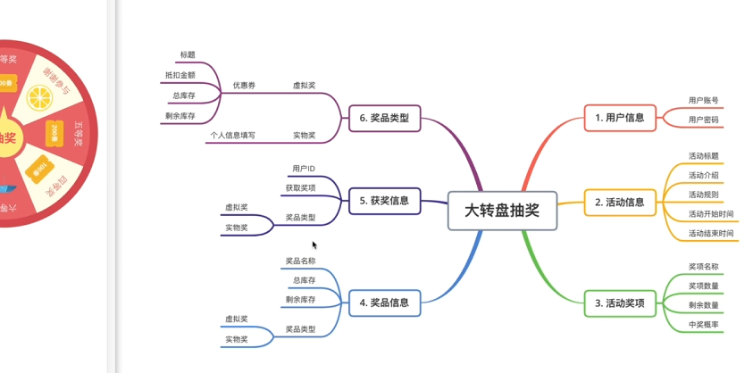

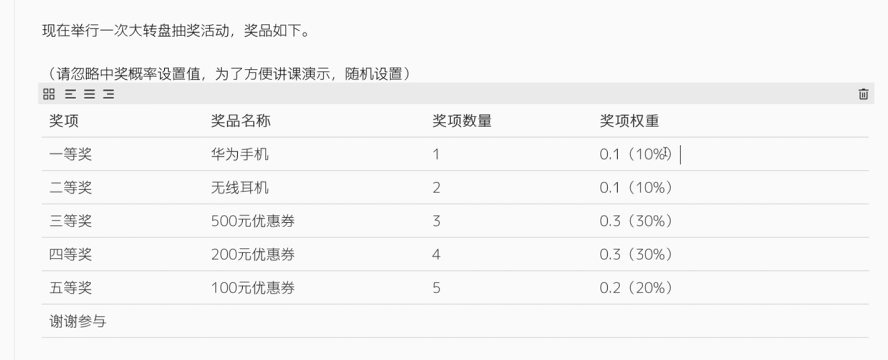

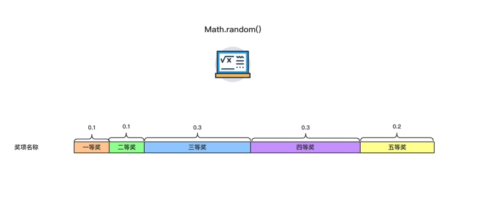

### 限流

执行LUA脚本

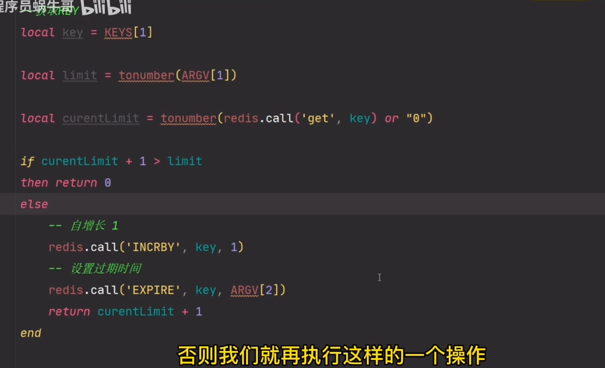

1. 基于Redis Incrby自增长， 传参过期时间，IP地址， 限制次数，

   

   **LUA脚本**

   数据结构 hash 

   接口key:

   ​      IP: Incrby < 限制次数

基于注解和redis实现接口IP限流， 比如1S内请求30次，则封禁IP30分钟。

1. 实现步骤

   1. **定义限流注解**：创建一个注解用于配置限流参数，包括时间窗口、最大请求次数和封禁时间。
   2. **编写 Lua 脚本**：Lua 脚本负责计数和封禁逻辑，确保每次请求操作都在 Redis 中原子执行。
   3. **使用 AOP 拦截**：在控制器方法调用前拦截请求，根据注解参数调用 Lua 脚本实现限流。
   4. **异常处理**：封禁时返回友好的错误消息。

   #### 详细代码实现

   #### 1.  定义限流注解

   创建一个注解 `IpRateLimit`，用于指定请求次数、时间窗口和封禁时间。

```java

import org.springframework.beans.factory.annotation.Autowired;
import org.springframework.data.redis.core.RedisTemplate;
import org.springframework.stereotype.Component;

import java.util.concurrent.TimeUnit;

@Component
public class RedisRateLimiter {
    @Autowired
    private RedisTemplate<String, Integer> redisTemplate;

    public boolean isAllowed(String ip, int maxRequests, int timeWindow, int banTime) {
        String countKey = "rate_limit:count:" + ip; // IP请求次数的键
        String banKey = "rate_limit:ban:" + ip;     // 封禁标记的键

        // 检查 IP 是否已被封禁
        if (redisTemplate.hasKey(banKey)) {
            return false; // 如果存在封禁标记，则直接返回不允许请求
        }

        // 记录请求次数
        Integer count = redisTemplate.opsForValue().get(countKey);
        if (count == null) {
            // 第一次请求，设置计数器并设定时间窗口
            redisTemplate.opsForValue().set(countKey, 1, timeWindow, TimeUnit.SECONDS);
            return true;
        } else if (count < maxRequests) {
            // 在时间窗口内，计数未超过限制，增加计数
            redisTemplate.opsForValue().increment(countKey);
            return true;
        } else {
            // 超过限流，设置封禁标记
            redisTemplate.opsForValue().set(banKey, 1, banTime, TimeUnit.MINUTES);
            redisTemplate.delete(countKey); // 删除计数器
            return false;
        }
    }
}

```

#### 2. 编写 Lua 脚本

Lua 脚本会执行以下逻辑：

- 判断 IP 是否已被封禁。
- 如果没有被封禁，则递增计数器。
- 如果请求次数超过限制，设置封禁键，并删除计数键。

```java

-- Redis Lua 脚本
local countKey = KEYS[1]
local banKey = KEYS[2]
local maxRequests = tonumber(ARGV[1])
local timeWindow = tonumber(ARGV[2])
local banTime = tonumber(ARGV[3])

-- 检查是否已被封禁
if redis.call("EXISTS", banKey) == 1 then
    return 0 -- 已封禁，拒绝请求
end

-- 获取当前请求次数
local currentRequests = tonumber(redis.call("GET", countKey) or "0")

if currentRequests >= maxRequests then
    -- 超过最大请求次数，设置封禁键和封禁时间
    redis.call("SET", banKey, 1, "EX", banTime * 60)
    redis.call("DEL", countKey) -- 清除计数器
    return 0 -- 超过限流，返回封禁结果
else
    -- 未超出限流，增加请求计数
    redis.call("INCR", countKey)
    redis.call("EXPIRE", countKey, timeWindow)
    return 1 -- 请求允许
end

```

#### 3. 编写 RedisRateLimiter 类

创建一个 `RedisRateLimiter` 类，通过 `RedisTemplate` 调用 Lua 脚本。这个类的 `isAllowed` 方法会根据 IP 和限流参数进行限流判断。

```java

import org.springframework.beans.factory.annotation.Autowired;
import org.springframework.core.io.ClassPathResource;
import org.springframework.data.redis.core.RedisTemplate;
import org.springframework.data.redis.core.script.DefaultRedisScript;
import org.springframework.stereotype.Component;

import java.util.Arrays;

@Component
public class RedisRateLimiter {

    @Autowired
    private RedisTemplate<String, Integer> redisTemplate;

    // Lua脚本
    private final DefaultRedisScript<Long> rateLimitScript;

    public RedisRateLimiter() {
        // 加载 Lua 脚本
        rateLimitScript = new DefaultRedisScript<>();
        rateLimitScript.setLocation(new ClassPathResource("rate_limit.lua")); // Lua 脚本路径
        rateLimitScript.setResultType(Long.class);
    }

    public boolean isAllowed(String ip, int maxRequests, int timeWindow, int banTime) {
        String countKey = "rate_limit:count:" + ip;
        String banKey = "rate_limit:ban:" + ip;

        Long result = redisTemplate.execute(rateLimitScript,
                Arrays.asList(countKey, banKey),
                maxRequests, timeWindow, banTime);

        return result != null && result == 1;
    }
}

```

#### 4. 编写 AOP 切面逻辑

创建切面类，拦截带有 `@IpRateLimit` 注解的方法，根据注解参数调用 `RedisRateLimiter` 实现限流。

```java

import org.aspectj.lang.ProceedingJoinPoint;
import org.aspectj.lang.annotation.Around;
import org.aspectj.lang.annotation.Aspect;
import org.springframework.beans.factory.annotation.Autowired;
import org.springframework.stereotype.Component;

import javax.servlet.http.HttpServletRequest;

@Aspect
@Component
public class RateLimitAspect {

    @Autowired
    private RedisRateLimiter redisRateLimiter;

    @Autowired
    private HttpServletRequest request;

    @Around("@annotation(ipRateLimit)")
    public Object around(ProceedingJoinPoint joinPoint, IpRateLimit ipRateLimit) throws Throwable {
        String clientIp = request.getRemoteAddr(); // 获取客户端 IP 地址
        int maxRequests = ipRateLimit.maxRequests();
        int timeWindow = ipRateLimit.timeWindow();
        int banTime = ipRateLimit.banTime();

        // 检查请求是否超过限流
        if (!redisRateLimiter.isAllowed(clientIp, maxRequests, timeWindow, banTime)) {
            throw new RuntimeException("IP banned due to too many requests - please try again later.");
        }

        // 限流检查通过，执行方法
        return joinPoint.proceed();
    }
}

```

#### 5. 在 Controller 中使用注解

在需要限流的接口方法上添加 `@IpRateLimit` 注解，指定限流配置。

```java

import org.springframework.web.bind.annotation.GetMapping;
import org.springframework.web.bind.annotation.RequestMapping;
import org.springframework.web.bind.annotation.RestController;

@RestController
@RequestMapping("/api")
public class ApiController {

    @IpRateLimit(maxRequests = 30, timeWindow = 1, banTime = 30) // 1秒内超过30次请求封禁30分钟
    @GetMapping("/limited-endpoint")
    public String limitedEndpoint() {
        return "Request successful";
    }
}

```

