## 分布式Redis
**单点Redis的问题**
- 数据丢失问题：Redis持久化
- 并发能力问题：主从集群，读写分离
- 存储能力问题：分片集群，插槽机制，动态扩容
- 故障恢复问题：Redis哨兵，，实现健康检测和自动恢复
  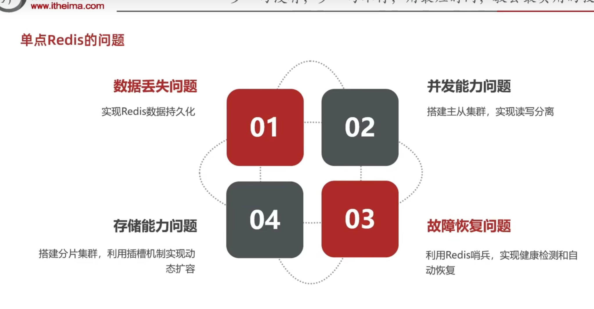

### Redis持久化
- RDB：快照，把内存的数据记录到磁盘中
- AOF：日志，默认关闭，开启后，每次写操作都会记录到日志中，然后异步刷盘，默认是同步刷盘，可以设置异步刷盘，异步刷盘会丢失数据，但是可以提高性能，异步刷盘会丢失数据，但是可以提高性能

#### RDB
默认是服务停止
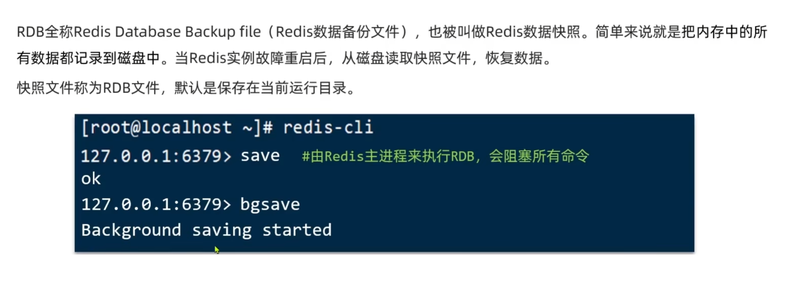
**save**和**bgsave**的区别：
- save：由redis的主进程执行RDB,会阻塞所有的命令
- bgsave：子进程执行RDB，避免主进程收到影响
redis-cli连接redis，执行命令命令后，会在运行目录中生成一个rdb文件
##### 我们每隔一段时间，redis会自动执行一次RDB
```congfig
redis.conf配置文件进行配置
save t n: t秒内，如果至少有一个key被修改，执行bgsave，如果是save "", 禁用RDB
rdbcompress yes 压缩，磁盘占用小，但是速度慢
dbfilename dump.rdb RDB文件名
dir ./ 文件保存路径
```
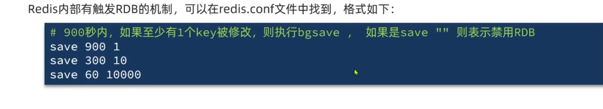


bgsave开始的时候会**fork主进程（阻塞主进程）**得到一个子进程，子进程共享主进程的内存数据。**完成fork后读取内存数据写入RDB文件（异步）**
需要加快fork的速度：直接拷贝主进程数据对应的页表，而不是从内存中拷贝数据
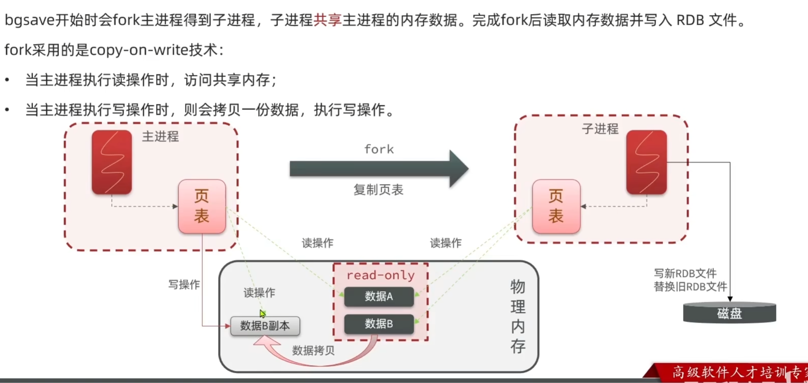
**存在的问题**
子进程在拷贝数据时，主进程可能被修改，导致数据不一致，fork采用copy-on-write机制，解决这个问题
- 主进程执行读操作的时候，访问共享的内存‘
- 主进程执行写操作的时候，会拷贝一对应要写入的数据，执行写操作
- 缺点：
- - 持久化间隔时间长
- - 极端情况，子进程写入磁盘很慢，在这个过程中，主进程不断的有写数据，每次都要拷贝，内存占用极端情况翻倍   
- - save 60 1000, 每隔60s执行一次，但是60S内发生宕机呢？会有丢失消息的风险， 缩短保存周期？fork子进程，压缩，写出RBD文件比较耗时


**思考**
- 使用bgsave时，如果不断有数据写入redis,
- 如果写入RDB的时间比间隔执行的时间久会发生生么情况呢？比如我写RDB是10s, save周期是5s,忙不过来

#### AOF
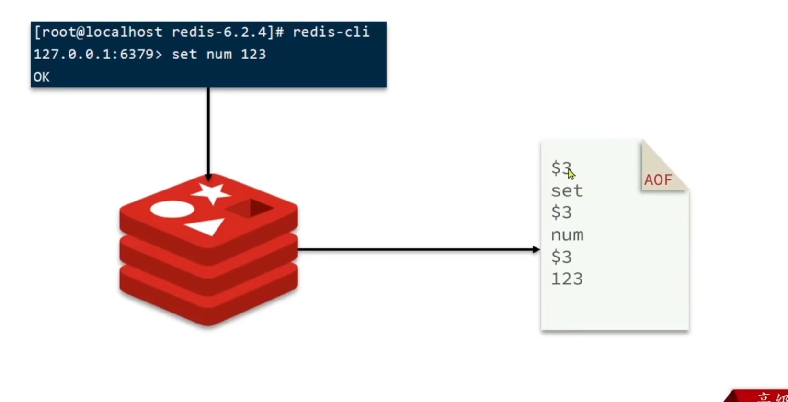
全称：append only file，只记录写操作，不记录读操作，默认关闭，开启后，每次写操作都会记录到日志中
恢复数据：读取日志，执行日志的操作

```config
appendonly yes # 是否开启AOF,默认关闭
appendfilename "appendonly.aof" # AOF文件名
### 记录的频率 3中刷盘策略 
appendfsync always # 每次写完就记录到AOF文件， 性能差
appendfsync everysec # 写命令执行完先放入AOF缓冲区，每隔1s将缓冲区数据写到AOF文件，是默认方案， 最多丢失
appendfsync no # 写命令执行完先放入AOF缓冲区， 由操作系统决定什么时候将缓冲区内容写到磁盘
```
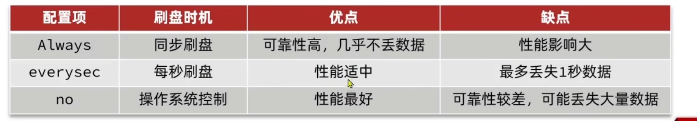

存在的问题：
比如第一次set num 123, 第二次set num 456.实际上set num 456就可以了，所以aof比rdb大很多
解决办法：执行**bgrewriteaof命令**，让redis执行重写功能，用最少的次数写入aof文件，达到相同的效果
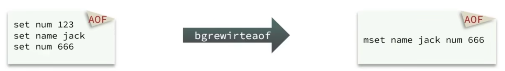
Redis会触发阈值时自动去重写AOF文件，阈值可以被配置
```config
# AOF文件相比上次增长多少百分比会触发bgrewriteaof命令
auto-aof-rewrite-percentage 100
# AOF文件体积最小多大以上才会触发bgrewriteaof命令
auto-aof-rewrite-min-size 64mb
```
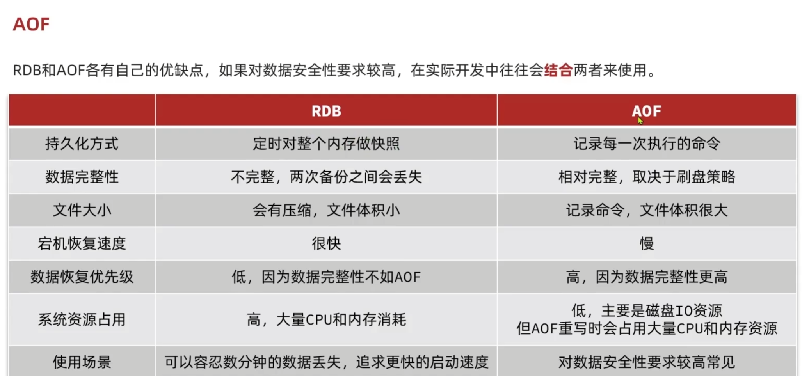

### Redis主从
搭建主从集群：
多读写少
1个主节点，多个从节点，主节点写数据，从节点同步数据，主节点挂了，从节点自动切换为主节点，主从之间数据一致，主从之间数据一致
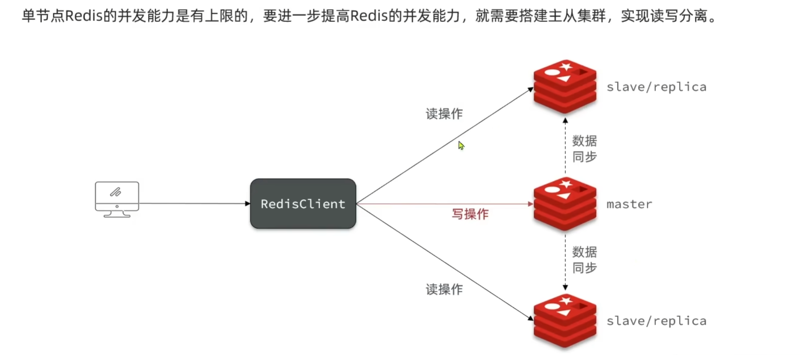
#### 搭建主从，单机docker
1. 创建网络
```bash
docker network create redis-cluster 
```
2. 启动主节点
```bash
docker run -d --name redis-master --net redis-cluster -p 6379:6379 redis:latest 
```
3. 启动从节点
```bash
docker run -d --name redis-replica1 --net redis-cluster -p 6380:6379 redis:latest  --replicaof redis-master 6379
docker run -d --name redis-replica2 --net redis-cluster -p 6381:6379 redis:latest  --replicaof redis-master 6379
```
4. 查看主从节点信息
```bash
docker exec -it redis-master redis-cli -h redis-master -p 6379 info replication 
```
#### 搭建主从，单机docker,基于redis配置文件

```config
# 主节点
appendonly no
# replicaof redis-master 6379
port 6379
bind 0.0.0.0
```
```config
# 从节点
appendonly no
replicaof redis-master 6379
port 6379
bind 0.0.0.0
```
和上面差不多
创建网络，doocker run *******,
docker 命令：
- 我自己新建了master,slave1,slave2文件夹，用于挂载目录卷
- 配置文件的port是6379，就是-p 6379:6379，右侧端口号，左侧端口号是对外界提供的
- replicaof 容器名6379
```dockerfile
# 主节点
docker run \
-d --name redis-master \
-p 6379:6379 \
-v /home/sats/redis_zc/master/redis_slave.conf:/etc/redis/redis.conf \
-v /home/sats/redis_zc/master/data:/data \
redis redis-server /etc/redis/redis.conf
```

```dockerfile
# 从节点
docker run \
-d --name redis-slave1 --network redis_zc \
-p 6380:6379 \
-v /home/sats/redis_zc/slave1/redis_slave.conf:/etc/redis/redis.conf \
-v /home/sats/redis_zc/slave1/data:/data \
redis redis-server /etc/redis/redis.conf
```

#### compose-yml 搭建


#### 数据同步原理
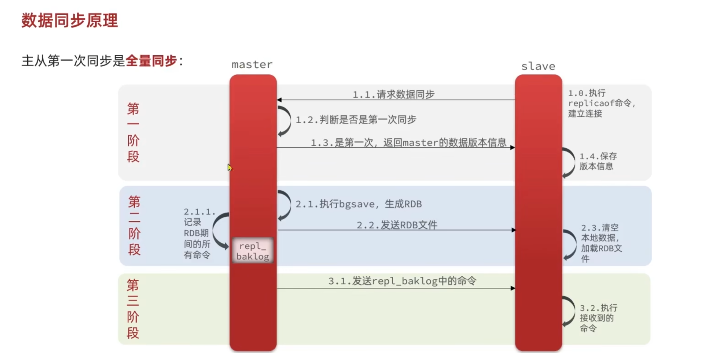
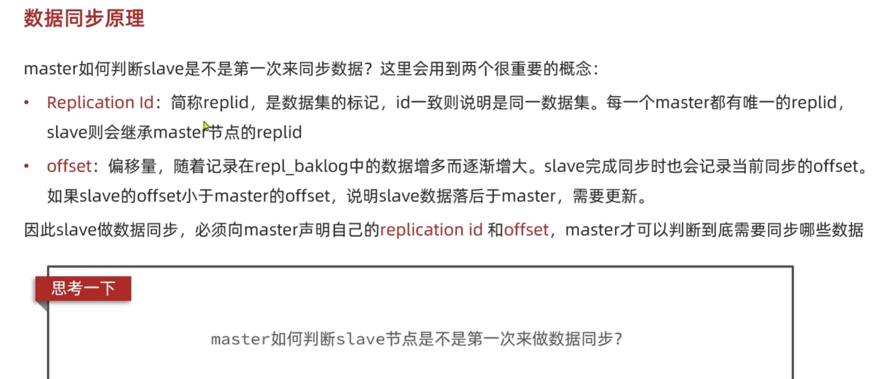
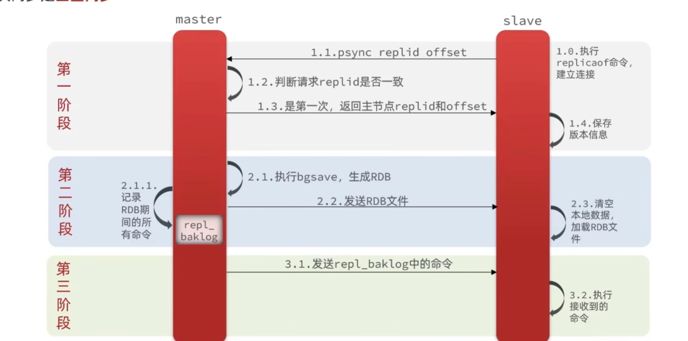
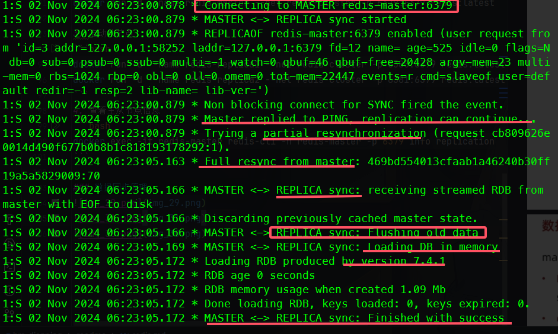

##### 全量同步
salve节点携带replid请求增量同步，主节点判断replid是否一致，不一致说明第一次同步，拒绝增量同步，随后master将哇整的内存数据生成RDB发送到从节点清空本地数据，加载主节点的RDB，主节点将RDB期间的命令记录在repl_baklog中，并持续将log中的命令发送到从节点，从节点将命令执行完，并记录到AOF日志，最后将AOF日志发送到主节点，主节点将AOF日志写入RDB，并继续将log中命令发送到从节点，，从节点执行接受到的命令，保持于master之间的同步。
**思考**
1. 发送repl_baklog期间，如果由新数据写入主节点呢？岂不是套娃了？
  offset偏移
2. RDB是整个数据库，还是某一个数据库的？

#### 增量同步
主从第一次同步是全量同步，如果slave重启后同步，则执行增量同步
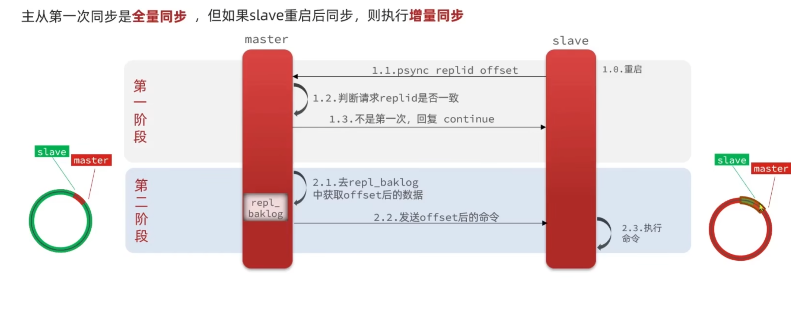

这个循环数组存储了同步信息的数据，通过偏移offset来记录从节点读取到主节点数据中的什么位置，但如果比如从节点宕机了主节点的循环数组内容一致增加，而从节点还没有同步，offset没有变化，或者同步速度跟不上主节点写入速度，循环数组内容满了，就会覆盖还没有同步的数据，导致数据丢失去
此时只有进行全量同步

**如何避免？？**
#### 尽量减少全量同步

- 在master中配置repl-diskless-sync yes,启用无磁盘复制，避免全量同步时的磁盘IO,也就是不向磁盘写，直接写道网络的IO流，减少了一次磁盘的操作
- Reids单节点的内存占用不要太大， 减少RDB导致的多过磁盘IO
- 适当提高repl_baklog的大小，发现slave宕机时尽快恢复，避免全量同步
- 限制一个master上的slave节点数量，实在太多slave,采用主从从链式结构
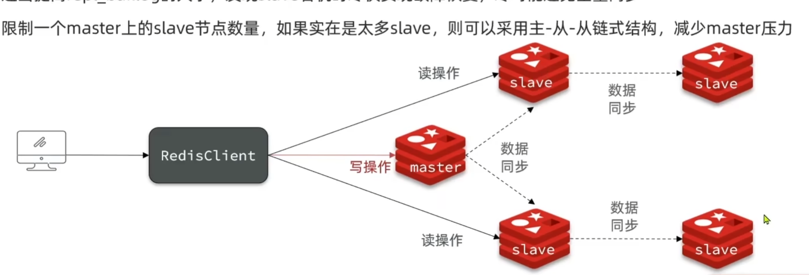


#### master宕机？？
监控集群状态，一旦master宕机，slave自动切换为主节点，主节点挂了，从节点自动切换为主节点，主从之间数据一致，主从之间数据一致
#### redis哨兵
客户端访问的主从节点流程：
由redisClient->redis集群 变为
由redisClient->哨兵集群->redis集群 
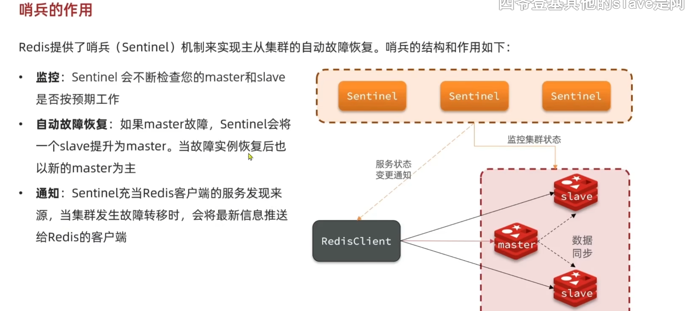

#### 服务监控
基于心跳检测，每隔1S向集群发送ping命令
- 主观下线：如果某个sentinel节点发现某个实例未在规定时间响应，认为实例主观下线,不一定真的下线了
- 客观下线：超过指定数量（quorum）的sentinel都认为该实例客观下线。quorum 最好超过哨兵实例一半
#### 主从切换策略
考虑数据尽可能同步的更多
- 判断slave和master断开时间长短，超过指定值，排除该slave节点，越高说明从节点丢失数据越多
- 判断slave节点slave-priority，越小，优先级越高，越有可能被选中， 为0 的slave不参与选
- slave-priority一样，offset越大，优先级越高，说明数据越新
- offset一样，随便挑选一个判断slave节点的运行id运行大小，越小，优先级越高
#### 故障转移
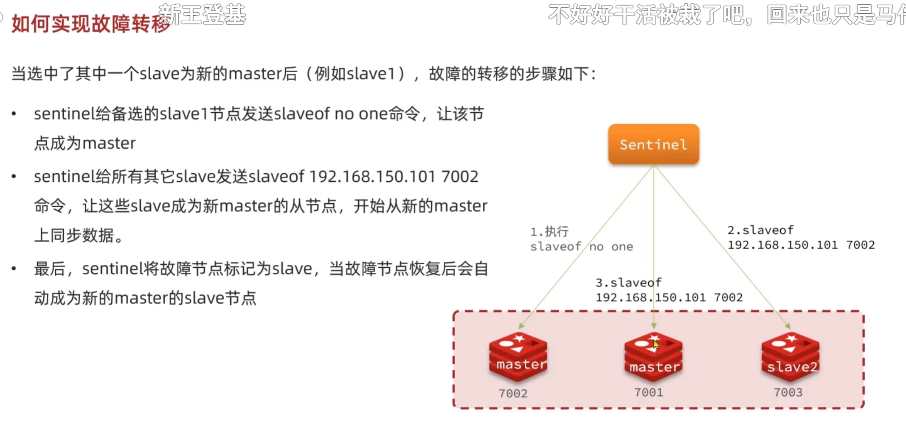

#### 哨兵集群搭建
docker run -p 27003:27001 --name redis-sentinel3 \ -v /home/sats/redis_zc/sentinel3/sentinel.conf:/etc/redis/sentinel.conf --network redis_zc \
-d redis redis-sentinel /etc/redis/sentinel.conf
90d4caa7118ecfcc95397a9f273a16201cef134ac36fbc5d937270569857c8de
1. 编写配置文件
```config 
port 27001
sentinel monitor mymaster 172.18.0.7 7001 2
sentinel down-after-milliseconds mymaster 5000
sentinel failover-timeout mymaster 60000
dir "/tmp/s1"
```
2. 同样的新建了三个文件夹
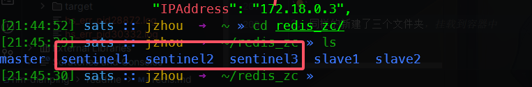

3. 执行命令

```config 
docker run -p 27003:27001 --name redis-sentinel3 --network redis_zc \
-v /home/sats/redis_zc/sentinel3/sentinel.conf:/etc/redis/sentinel.conf \
-d redis redis-sentinel /etc/redis/sentinel.conf
```
**注意：**
- 配置文件中的mymaster 是集群的name，现场取的， 和前面的无关， 172.18.0.7不能用镜像名字代替，也不能用127.0.0.1代替
- 就是mater 主节点的ip地址 用docker的时候用这个命令查看：
```java
docker inspect redis-master | grep IPAddress
```
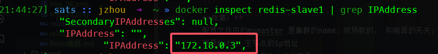
- 配置文件的端口不用变

4. 停掉mater主节点后
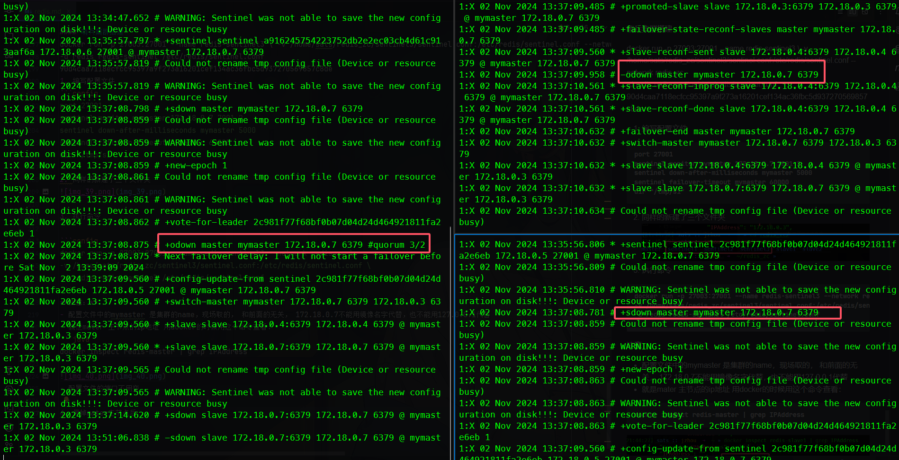

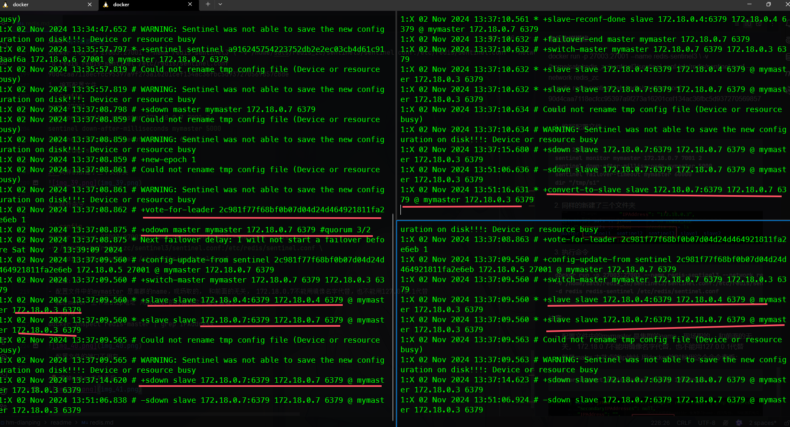

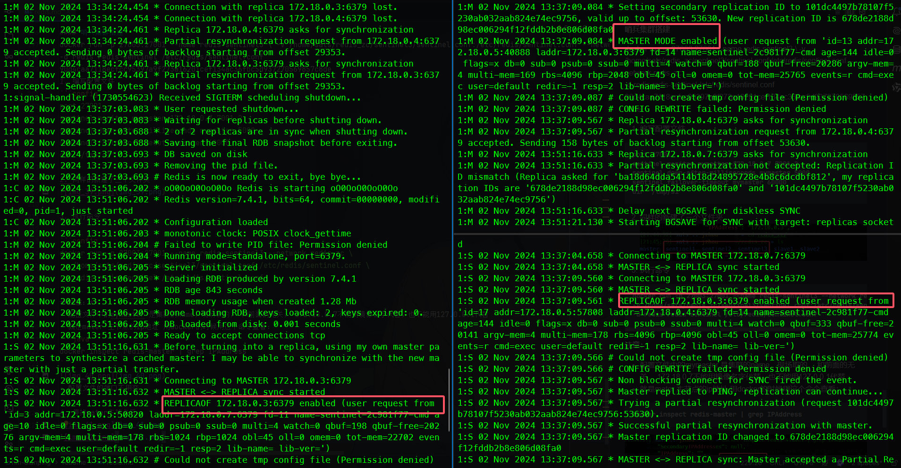


### RedisTemplate哨兵

待续

#### 分片集群
key与插槽绑定，根据key有效部分计算插槽值：两种情况？计算方式？
如何判断某个key在那个实例？
同一类型的数据如何存放到统一实例？

#### 集群伸缩
添加或者移除节点
