## 微服务
### 如何实现项目拆分？
高内聚，低耦合
比如下单时需要查询商品数据。这个时候我们不能在订单服务直接查询商品数据库，否则就导致了数据耦合。
而应该由商品服务对应暴露接口，并且一定要保证微服务对外接口的稳定性（即：尽量保证接口外观不变）。
虽然出现了服务间调用，但此时无论你如何在商品服务做内部修改，都不会影响到订单微服务，服务间的耦合度就降低了。

**纵向拆分**，就是按照项目的功能模块来拆分
**横向拆分**，是看各个功能模块之间有没有公共的业务部分，如果有将其抽取出来作为通用服务。例如用户登录是需要发送消息通知，记录风控数据，下单时也要发送短信，记录风控数据。
因此消息发送、风控数据记录就是通用的业务功能，因此可以将他们分别抽取为公共服务：消息中心服务、风控管理服务。

### 服务之间如何调用
Spring提供了RestTemplate的API实现Http请求发送
1.将RestTemplate注册为一个Bean
```java
@Configuration
public class RemoteCallConfig {

    @Bean
    public RestTemplate restTemplate() {
        return new RestTemplate();
    }
}
```
2.远程调用
利用RestTemplate发送http请求与前端ajax发送请求非常相似，都包含四部分信息：
- ① 请求方式
- ② 请求路径
- ③ 请求参数
- ④  返回值类型


### 注册中心
微服务中远程调用包括服务提供者和服务消费者，服务提供者需要暴露服务，服务消费者需要调用服务。
在大型微服务项目中，服务提供者的数量会非常多，为了管理这些服务就引入了注册中心的概念。
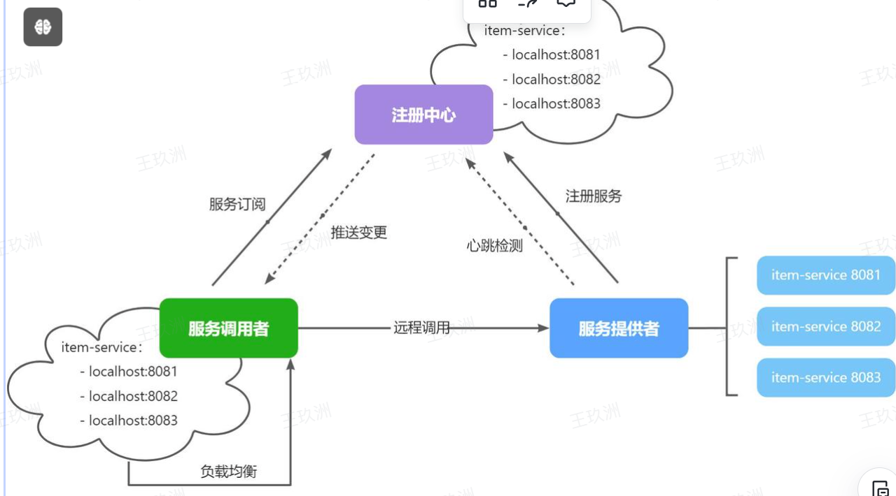
#### 流程
1. 服务启动想注册中心注册自己的服务信息，（服务名，Ip，端口）
2. 调用者从注册中心订阅服务，获取实例列表
3. 调用者自己实现负载均衡，挑选实例
4. 调配这向实例发起远程调用

#### 当服务提供者的实例宕机或者启动新实例时，调用者如何得知呢？
- 服务提供者会定期向注册中心发送请求，报告自己的健康状态（心跳请求）
- 当注册中心长时间收不到提供者的心跳时，会认为该实例宕机，将其从服务的实例列表中剔除
- 当服务有新实例启动时，会发送注册服务请求，其信息会被记录在注册中心的服务实例列表
- 当注册中心服务列表变更时，会主动通知微服务，更新本地服务列表

#### 框架（Nacos）

1. 添加依赖
```xml

<!--nacos 服务注册发现-->
<dependency>
    <groupId>com.alibaba.cloud</groupId>
    <artifactId>spring-cloud-starter-alibaba-nacos-discovery</artifactId>
</dependency>
```

2. service配置nacos
```xml
spring:
  application:
    name: item-service # 服务名称
  cloud:
    nacos:
      server-addr: 192.168.150.101:8848 # nacos地址
```

3. 启动服务实例，向nacos服务注册自己
4. 服务发现,
```xml
<!--nacos 服务注册发现-->
<dependency>
    <groupId>com.alibaba.cloud</groupId>
    <artifactId>spring-cloud-starter-alibaba-nacos-discovery</artifactId>
</dependency>
```
5. 发现并调用服务
   服务调用者必须利用负载均衡的算法，从多个实例中挑选一个去访问。常见的负载均衡算法有：
- 随机
- 轮询
- IP的hash
- 最近最少访问
- ...

**服务发现需要工具**DiscoverClient, 直接注入使用
```java
List<ServiceInstance> instanceList = discoveryClient.getInstances("item-service");
ServiceInstance instance = instance.get(RandomUtil.randomInt(instanceList.size()));

instance.getUri();
```

#### OpenFeign
Feign是Spring Cloud官方提供的一个声明式REST客户端，它允许你以声明的方式调用REST服务，简化了REST调用的代码编写。
```java
List<ServiceInstance> instanceList = discoveryClient.getInstances("item-service");
ServiceInstance instance = instance.get(RandomUtil.randomInt(instanceList.size()));

instance.getUri();
```

这段代码包括下面的调用，抽取出来， OpenFeign可以做到，让**远程调用像本地方法**调用一样简单。
其实远程调用的关键点就在于四个：
- 请求方式
- 请求路径
- 请求参数
- 返回值类型
1. 依赖
```xml 
  <!--openFeign-->
<dependency>
    <groupId>org.springframework.cloud</groupId>
    <artifactId>spring-cloud-starter-openfeign</artifactId>
</dependency>
        <!--负载均衡器-->
<dependency>
<groupId>org.springframework.cloud</groupId>
<artifactId>spring-cloud-starter-loadbalancer</artifactId>
</dependency>
```

2. 启动类上面加入注解@EnableFeignClients
3. 定义接口暴露自己，编写Feign客户端
```java
@FeignClient("item-service")
public interface ItemClient {

    @GetMapping("/items")
    List<ItemDTO> queryItemByIds(@RequestParam("ids") Collection<Long> ids);
}
```
- @FeignClient("item-service") ：声明服务名称
- @GetMapping ：声明请求方式
- @GetMapping("/items") ：声明请求路径
- @RequestParam("ids") Collection<Long> ids ：声明请求参数
- List<ItemDTO> ：返回值类型

4. 使用， 直接像注入Servcie 一样注入Client
#### 连接池
Feign低层发起的Http请求，但性能不行
其底层支持的http客户端实现包括：
- HttpURLConnection：默认实现，不支持连接池
- Apache HttpClient ：支持连接池
- OKHttp：支持连接池
比如使用Http链接池
- 依赖
- 开启配置
```yml
feign:
  okhttp:
    enabled: true # 开启OKHttp功能 
```

**日志级别定义**

### 网关路由

由于不同的微服务对应不同的端口IP，前端无法直接访问，因此需要网关做转发，
前端的请求发送到网关，网管可以做身份鉴权，然后转发给微服务组件

有了网关，前端只需要访问网关，网关做转发，开发体验还是和以前一样
#### 如何实现网关

1. 新建网关项目添加依赖
```xml
<dependency>
            <groupId>org.springframework.cloud</groupId>
            <artifactId>spring-cloud-starter-gateway</artifactId>
        </dependency>
```

2. 配置网关路由
端口对前端来说固定了
application.yaml
```yml
server:
  port: 8080
spring:
  application:
    name: gateway
  cloud:
    nacos:
      server-addr: localhost
    gateway:
      routes:
        - id: item # 路由规则id，自定义，唯一
          uri: lb://item-service # 路由的目标服务，lb代表负载均衡，会从注册中心拉取服务列表
          predicates: # 路由断言，判断当前请求是否符合当前规则，符合则路由到目标服务
            - Path=/items/**,/search/** # 这里是以请求路径作为判断规则
        - id: cart
          uri: lb://cart-service
          predicates:
            - Path=/carts/**
        - id: user
          uri: lb://user-service
          predicates:
            - Path=/users/**,/addresses/**
        - id: trade
          uri: lb://trade-service
          predicates:
            - Path=/orders/**
        - id: pay
          uri: lb://pay-service
          predicates:
            - Path=/pay-orders/**

```
#### 如何实现网关的登录校验
整体流程
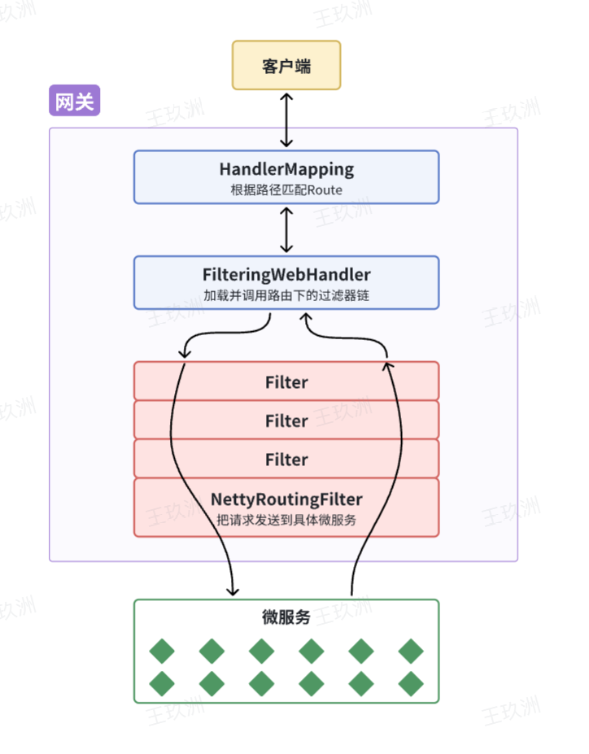
- 客户端发送的请求，到网关，先通过
- HandlerMapping,根据路径匹配Route
- 加载并调用路由下的过滤器链：FilterWebHandler
- 通过一系列Filter，最下面的时NettyRouterFiler(pre),然后转发给微服务，
微服务实现完成后在从NettyRoutingFilter层层往上（post）


**时机**：如果我们能够定义一个过滤器，在其中实现登录校验逻辑，
并且将过滤器执行顺序定义到NettyRoutingFilter之前，这就符合我们的需求了

**实现网管过滤器**
- GlobalFilter
- GatewayFilter
配置文件方式
```yml
spring:
  cloud:
    gateway:
      routes:
        - id: test_route
          uri: lb://test-service
          predicates:
            -Path=/test/**
          filters:
            - AddRequestHeader=key, value # 逗号之前是请求头的key，逗号之后是value 
```
##### 自定义GlobalFilter方式
实现GlobalFilter,Ordered接口
public Mono<Void> filter(ServerWebExchange exchange, GatewayFilterChain chain) {
1. 定义过滤器
```java
package com.hmall.gateway.filter;

import com.hmall.common.exception.UnauthorizedException;
import com.hmall.common.utils.CollUtils;
import com.hmall.gateway.config.AuthProperties;
import com.hmall.gateway.util.JwtTool;
import lombok.RequiredArgsConstructor;
import org.springframework.boot.context.properties.EnableConfigurationProperties;
import org.springframework.cloud.gateway.filter.GatewayFilterChain;
import org.springframework.cloud.gateway.filter.GlobalFilter;
import org.springframework.core.Ordered;
import org.springframework.http.server.reactive.ServerHttpRequest;
import org.springframework.http.server.reactive.ServerHttpResponse;
import org.springframework.stereotype.Component;
import org.springframework.util.AntPathMatcher;
import org.springframework.web.server.ServerWebExchange;
import reactor.core.publisher.Mono;

import java.util.List;

@Component
@RequiredArgsConstructor
@EnableConfigurationProperties(AuthProperties.class)
public class AuthGlobalFilter implements GlobalFilter, Ordered {

    private final JwtTool jwtTool;

    private final AuthProperties authProperties;

    private final AntPathMatcher antPathMatcher = new AntPathMatcher();

    @Override
    public Mono<Void> filter(ServerWebExchange exchange, GatewayFilterChain chain) {
        // 1.获取Request
        ServerHttpRequest request = exchange.getRequest();
        // 2.判断是否不需要拦截
        if(isExclude(request.getPath().toString())){
            // 无需拦截，直接放行
            return chain.filter(exchange);
        }
        // 3.获取请求头中的token
        String token = null;
        List<String> headers = request.getHeaders().get("authorization");
        if (!CollUtils.isEmpty(headers)) {
            token = headers.get(0);
        }
        // 4.校验并解析token
        Long userId = null;
        try {
            userId = jwtTool.parseToken(token);
        } catch (UnauthorizedException e) {
            // 如果无效，拦截
            ServerHttpResponse response = exchange.getResponse();
            response.setRawStatusCode(401);
            return response.setComplete();
        }

        // TODO 5.如果有效，传递用户信息
        System.out.println("userId = " + userId);
        // 6.放行
        return chain.filter(exchange);
    }

    private boolean isExclude(String antPath) {
        for (String pathPattern : authProperties.getExcludePaths()) {
            if(antPathMatcher.match(pathPattern, antPath)){
                return true;
            }
        }
        return false;
    }

    @Override
    public int getOrder() {
        return 0;
    }
}
```

#### 如何实现网关到服务的用户信息传递
网关到微服务的请求时http，可以考虑使用http头传递，例如：
微服务收取到网关信息如何获取用户信息呢
1. 改造网关过滤器，获取用户信息保存到请求头，转发到下游服务（如上）
2. 编写微服务拦截器，从请求头中获取用户信息
**修改登良校验的拦截器处理逻辑**
- 拦截器实现GlobalFilter,Ordered接口;
- GlobalFilter实现 ```public Mono<Void> filter(ServerWebExchange exchange, GatewayFilterChain chain)```
接口
- Ordered实现 ```public int getOrder()```接口
- filter中根据 excahnge获取Request，并获得请求头，判断是否包含token，如果包含，
则解析token，获取用户信息，并设置到请求头中，是否合法，最后放行
- 返回一个新的exahnge，将请求头设置进去
```java
String userInfo = userId.toString();
        //  传递用户信息
        ServerWebExchange build = exchange.mutate()
                .request(builder -> builder.header("user-info", userInfo))
                .build();
        return chain.filter(build);
```

3. 拦截器获取用户
- 编写拦截器获取用户信息到UserContext, UserInfoInterceptor
- 拦截器实现HandlerInterceptor接口, 重写preHandle方法和afterCompletion方法
- preHandle方法中，从请求头中获取用户信息，并设置到UserContext中
- afterCompletion方法中，清除UserContext中的用户信息
4. 编写SpringMVC的配置类， 配置登录拦截器
```java

@Configuration
@ConditionalOnClass(DispatcherServlet.class)
public class MvcConfig implements WebMvcConfigurer {
    @Override
    public void addInterceptors(InterceptorRegistry registry) {
        registry.addInterceptor(new UserInfoInterceptor());
    }
}
```
5. 由于这个配置类时定义在公共包下，和微服务组件不在统一层级
基于SpringBoot的自动装配原理， 将塔添加到resources下的META-INF/spring.factories中
```xml
org.springframework.boot.autoconfigure.EnableAutoConfiguration=\
  com.hmall.common.config.MyBatisConfig,\
  com.hmall.common.config.JsonConfig,\
  com.hmall.common.config.MvcConfig
```
#### 微服务之间的信息传递如何实现
OpenFeign传递用户之间的信息
借助Feign提供的一个拦截器接口，FeignClientInterceptor
```java

public interface RequestInterceptor {

  /**
   * Called for every request. 
   * Add data using methods on the supplied {@link RequestTemplate}.
   */
  void apply(RequestTemplate template);
}
```
实现这个接口，并实现apply接口，利用RequestTemplate添加请求头
```java

@Bean
    public RequestInterceptor userInfoRequestInterceptor() {
        return new RequestInterceptor() {
            @Override
            public void apply(RequestTemplate requestTemplate) {
                Long userId = UserContext.getUser();
                if(userId != null) {
                    requestTemplate.header("user-info", userId.toString());
                }
            }
        };
    }
```
最后将这个配置类注入到注解中@EnableFeignClients(defaultConfiguration = DefaultFeignConfig.class)

### nacos配置中心
#### 共享配置
1. 抽取公共配置，到nacos中心
2. 拉取配置，到微服务中
- 将拉取的和本地的配置合并，完成项目上下文初始化
- 读取Nacos配置是SpringCloud上下文（ApplicationContext）初始化时处理的，发生在项目的引导阶段。然后才会初始化SpringBoot上下文，去读取application.yaml。
- SpringCloud在初始化上下文的时候会先读取一个名为bootstrap.yaml(或者bootstrap.properties)的文件，如果我们将nacos地址配置到bootstrap.yaml中，那么在项目引导阶段就可以读取nacos中的配置了。
- 引入依赖
```xml
<!--nacos配置管理-->
<dependency>
   <groupId>com.alibaba.cloud</groupId>
   <artifactId>spring-cloud-starter-alibaba-nacos-config</artifactId>
</dependency>
        <!--读取bootstrap文件-->
<dependency>
<groupId>org.springframework.cloud</groupId>
<artifactId>spring-cloud-starter-bootstrap</artifactId>
</dependency>
```
- 新建bootstrap.yaml文件，配置nacos地址，配置文件名，配置文件类型
- 修改application配置,删除bootstrap中重复配置， 添加nacos注册中心变量的配置
#### 配置热更新
例如购物车业务，购物车数量有一个上限，默认是10，想要动态更改这个值，不用重启微服务
1. nacos新建配置文件， 将购物车数量添加到配置中心，并指定配置文件类型为properties
```yaml
hm:
  cart:
    maxAcount: 1
```
2. dataId格式
```[服务名]-[spring.active.profile].[后缀名]```
3. 配置热更新
- 在微服务中新建一个类读取属性
```java
@Data
@Component
@ConfigurationProperties(prefix = "hm.cart")
public class CartProperties {
    private Integer maxAmount;
}
```
- 业务中使用
自定注入

### 动态路由 
路由写死了怎么半， 更改就要重启网关
1. 动态路由，将路由规则保存到nacos配置中心，让网关动态读取，实现动态路由
2. 在网关服务中监听Nacos配置变更
3. 配置变更时动态更新路由规则

- 依赖
```xml
 <!--nacos配置管理-->
<dependency>
   <groupId>com.alibaba.cloud</groupId>
   <artifactId>spring-cloud-starter-alibaba-nacos-config</artifactId>
</dependency>
        <!--读取bootstrap文件-->
<dependency>
<groupId>org.springframework.cloud</groupId>
<artifactId>spring-cloud-starter-bootstrap</artifactId>
</dependency> 
```

## 服务保护
### 解决雪崩方案
#### 请求限流
大量请求过来，但放行的请求恒定
#### 线程隔离
限定每个业务所能使用得到线程数量，线程池
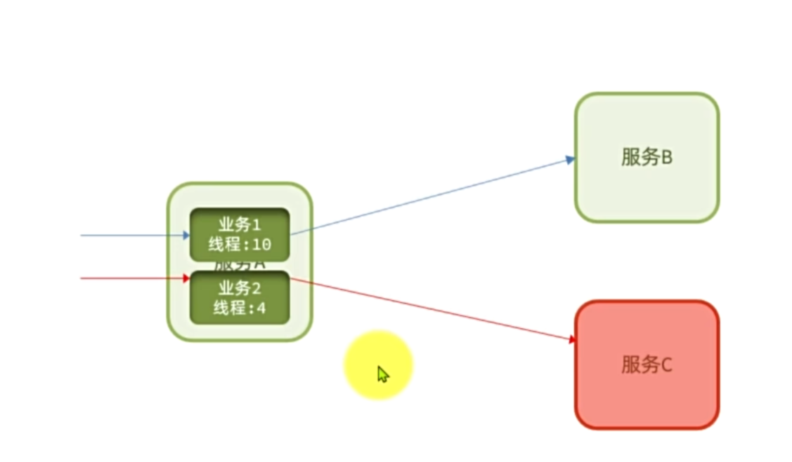
#### 服务熔断
由熔断器统计异常请求或者满调用的比例，超出阈值会熔断业务，拦截该接口请求，走一个fallback逻辑
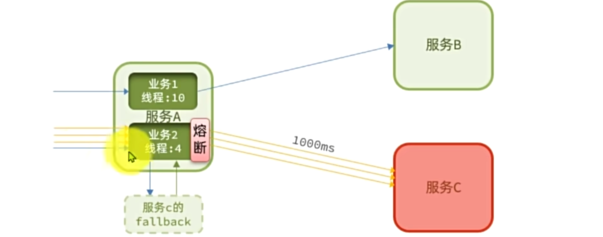

```============================================```
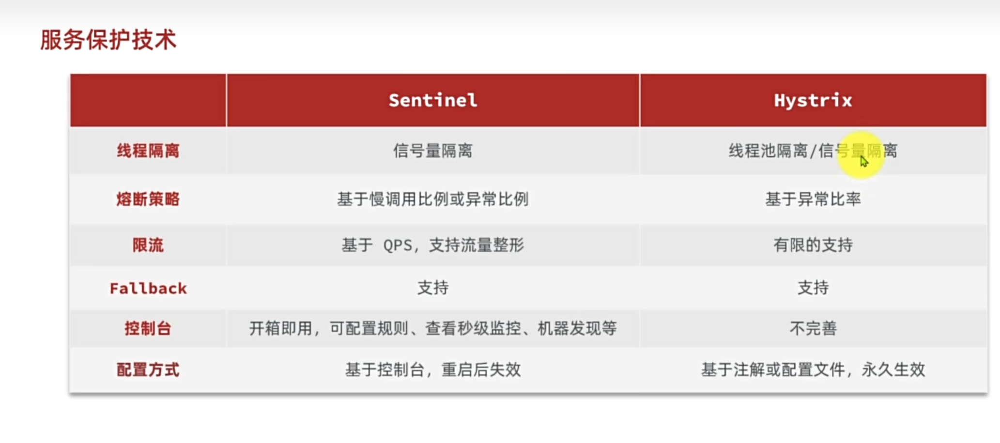

### Sentinel
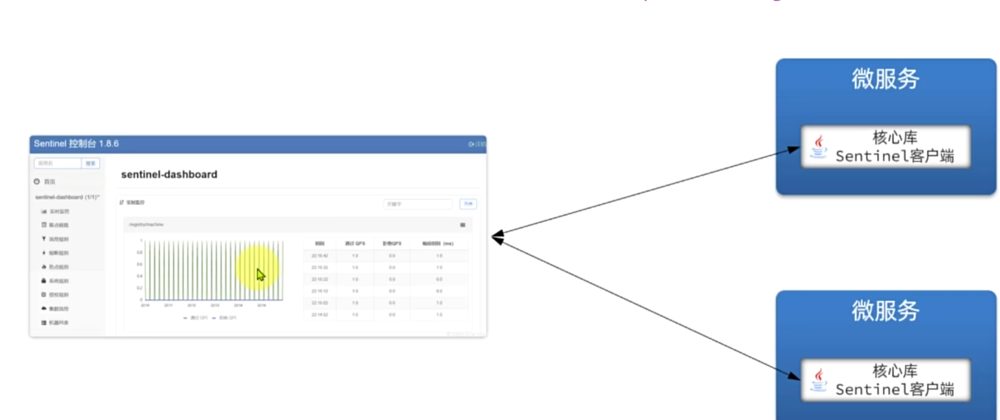

- 运行sentinel控制台，默认端口8080,一个jar包
- 微服务中引入依赖，并配置sentinel
- 控制台配置规则 

注意点：
- restful风格很多的api可能一样，配置http请求方式（application.yaml）
#### FallBack实现基于OpenFeign
针对远程调用进行隔离
- Feign开启服务Client调用的簇点, 微服务组件中开启Feign的sentinel功能：
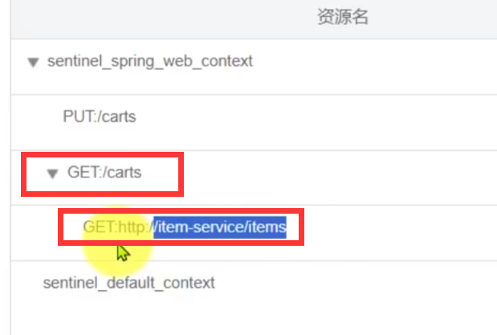
```yaml
feign:
  sentinel:
    enable: true
```
- 一般选择FallbackFactory实现FallBack, 也可以用FallbackClass用的少
- 在client组件中实现FallBack处理，实现FallbackFactory
- - 定义一个XXXClientFallBack，实现FallbackFactory接口,泛型就是对应的XXXClient，重写create方法，返回一个XXXClientFallBack,
```java
@Slf4j
public class ItemClientFallback implements FallbackFactory<ItemClient> {
    @Override
    public ItemClient create(Throwable cause) {
        return new ItemClient() {
            @Override
            public List<ItemDTO> queryItemByIds(Collection<Long> ids) {
                log.error("远程调用ItemClient#queryItemByIds方法出现异常，参数：{}", ids, cause);
                // 查询购物车允许失败，查询失败，返回空集合
                return CollUtils.emptyList();
            }

            @Override
            public void deductStock(List<OrderDetailDTO> items) {
                // 库存扣减业务需要触发事务回滚，查询失败，抛出异常
                throw new BizIllegalException(cause);
            }
        };
    }
}
```
- 将XXXClientFallBack注册到Spring容器中, DefaultFeignConfig.java中注入 里面还包括日志级别
- 在XXXClient接口中使用这个FallBack
```java
@FeignClient(value = "item-service",
            configuration = .class,
            fallbackFactory = ItemClientFallback.class
)
public interface ItemClient {
    @GetMapping("/items")
    List<ItemDTO> queryItemByIds(@RequestParam("ids") Collection<Long> ids);

    // 扣减库存
    @PutMapping("/items/stock/deduct")
    void deductStock(@RequestBody List<OrderDetailDTO> items);
}
```
#### 熔断
- 什么时候断开，什么时候恢复？
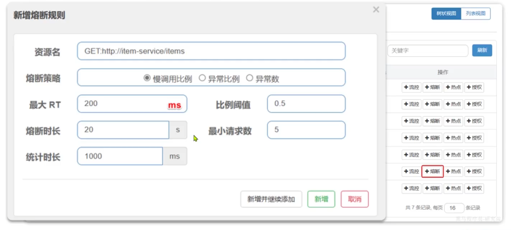
断路器： 统计比例，超出阈值熔断， 服务恢复放行
- - 有三个状态机：OPEN，HALF-OPEN，CLOSE
- - 处于CLOSE状态，请求正常，放行，并监控请求的异常情况，异常比例超过阈值，断路器状态机转OPEN
- - 处于OPEN状态会请求快速的失败，OPEN状态是一个临时状态，有参数可以设置这个状态持续多久
- - 到了参数的持续时间，进入HALF-OPEN状态，尝试请求一次，成功，状态机转CLOSE，关闭断路器。失败，状态机转OPEN,打开断路器
- - 熔断策略： 慢调用比例（最大RT 请求》RT算作慢）， 异常比例， 异常数； 比例阈值控制
- - 熔断时长： Open状态的持续时间
- - 最小统计时长： 要发送多少次请求才统计
- - 统计时长：多久范围内的

## 微服务分布式事务
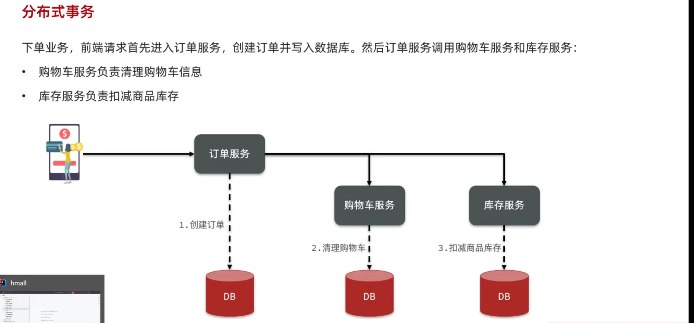

ACID 事务在不同的库中

### Seata 
- Seata 是一个分布式事务解决方案，致力于在微服务架构下提供高性能和简单易用的分布式事务服务。

- **分布式事务：** 在分布式事务中，如果一个业务需要多个服务完成， 而每个服务都有事务，但索格事务必须同时成功或者失败
**解决思路：** 让各个子事务之间必须能感知到彼此的事务状态，才可以保证一致性
事务通过一个事务协调者感知到各个事务的状态，并协调各个事务，保证事务一致性。
#### Seata事务的角色
1. TC（Transaction Coordinator）事务协调者，维护全局事务和分支事务的状态，协调全局事务的提交、回滚等；
2. TM（Transaction Manager）事务管里器，定义全局事务的范围，开始全局事务，提交或者回滚全局事务；
3. RM（Resource Manager）资源管理器，管理分支事务，与TC交谈以注册分支事务和报告分支事务的状态；
4. 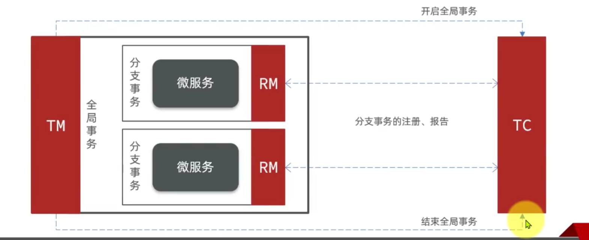

TM找到全局事务的开始和结束处，TC就能感知到全局事务的开始和结束，
RM向TC注册分支事务，TC就可以感知分支事务的状态
TM结束后，TC在看待所有分支事务的状态，如果全部成功，TC就提交全局事务，如果失败，TC就回滚全局事务

#### Seata也是一个独立的服务了

XA模式：

## rabbitmq
### 高级
#### 消息可靠性
消息丢失情况：
- 服务向消息代理发送消息，但消息代理没有收到消息，导致消息丢失。如网络故障
- 消息代理收到了消息，消息队列准备发送消息到服务时，消息队列挂了，丢失消息
- 服务收到消息后，处理消息时，服务挂了，丢失消息

**发送的可靠性：**
- 发送者重连：
```yaml
spring:
   rabbitmq:
      connection-timeout: 1s # 设置MQ的连接超时时间
      template:
         retry:
            enabled: true # 开启超时重试机制
            initial-interval: 1000ms # 失败后的初始等待时间
            multiplier: 1 # 失败后下次的等待时长倍数，下次等待时长 = initial-interval * multiplier
            max-attempts: 3 # 最大重试次数 
```
重试机制是阻塞式，等待时线程会被阻塞，影响性能。使用和合理的connection-timeout，multiplier
- 发送者确认机制：
MQ收到信息保存在内存导致两个问题
- MQ宕机，消息丢失
- 内存空间有限，消费者处理太慢，消息积压，导致OOM， MQ阻塞

1. 数据持久化：
- 交换机持久化
- 队列持久化
- 消息持久化
2. Lazy Queue:
- 接受到消息后直接存入磁盘，不再存入内存
- 消费者要消费是才会从磁盘加载到内存（可以提前缓存部分消息到内存，最多2048条）
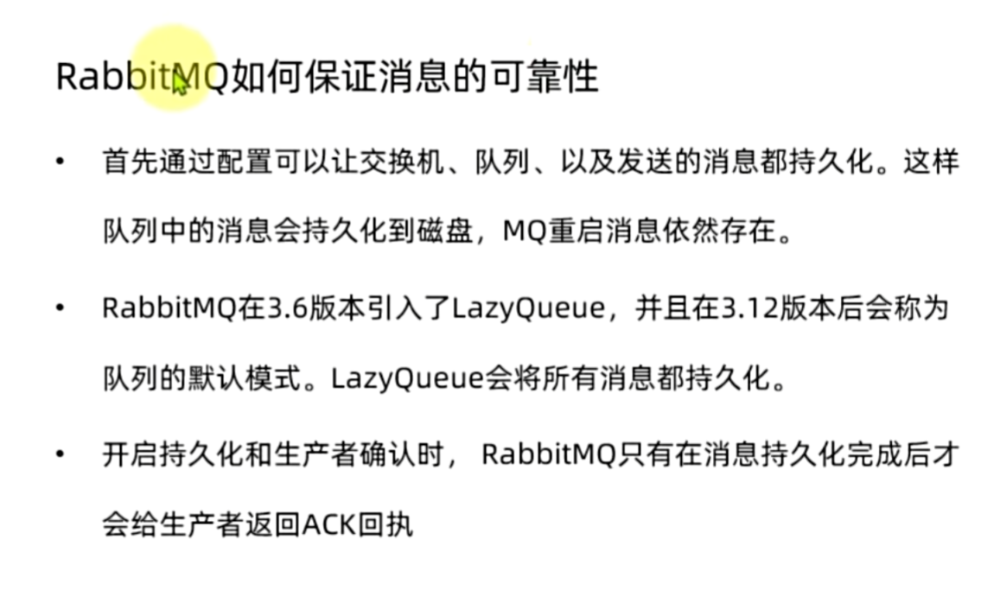

**消费者确认机制**
 