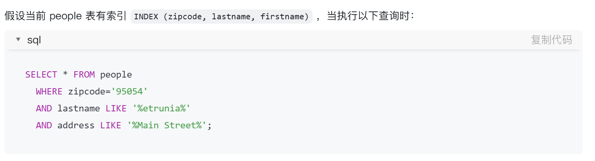
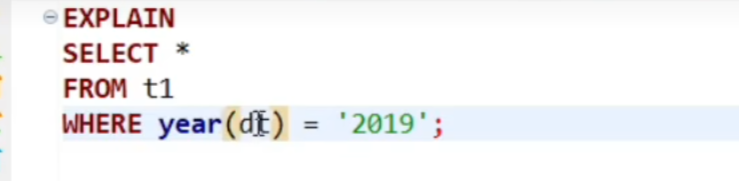
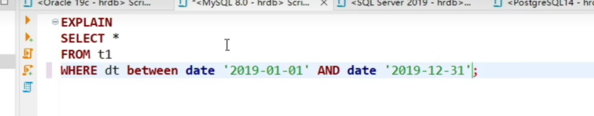
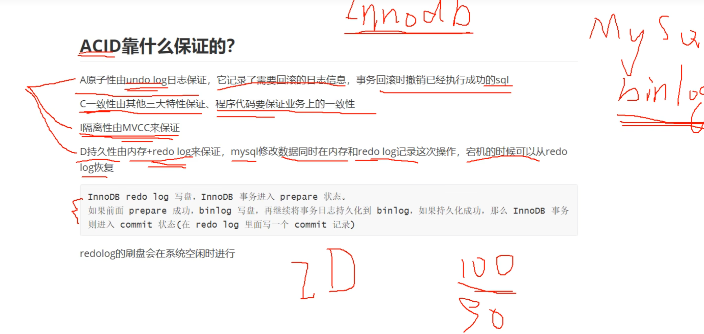
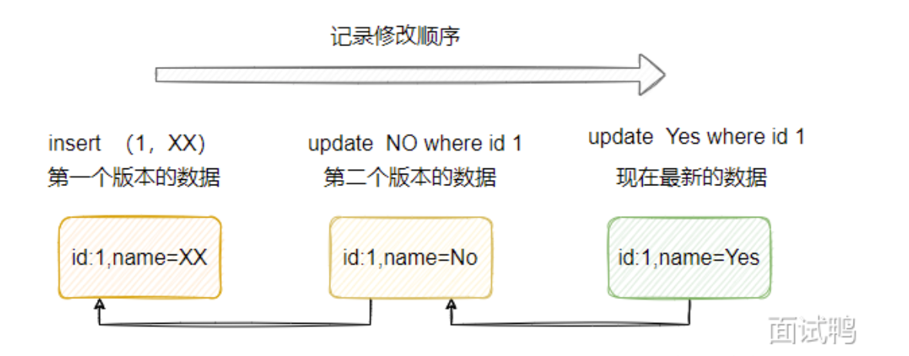

#### 索引类型

- B+书角度:聚簇和非
- 数据结构：B+,哈希，倒排，R-树
- 索引性质：唯一索引、主键、联合、普通（辅助、二级索引）、全文索引

#### 数据排序实现

- 命中索引，**索引排序**

- 未命中，文件排序，数据很少，内存中，多，外部排序，归并

  双路排序，内存id+需要排序字段，内存可以更过数据->回表

  单路排序  所有字段

  磁盘文件排序，针对文件排序，合并为有序的大文件

#### SQL执行过程

- 连接器校验权限
- 分析器SQL的词法语法分析，**构建解析树**， 语句什么类型携带什么参数，语法错苏
- 优化器选择合适索引和表连接顺序，选择最佳方案
- 执行器，调用引擎查询返回

#### B+/B区别

#### B+树怎么产生


#### 叶子节点存储的什么数据？

一页16KB, 存储的一条数据大小+索引


#### 聚簇和非聚簇

- 索引使用B+树数据结构
- 聚簇：将数据存储和索引放在一起，按照一定顺序，找到索引就找到数据，索引响铃，数据也是相邻

​		优势：直接获取数据（**覆盖索引才可以**），非聚簇索引需要两次查询， 适合排序、范围查询的

​		劣势: 维护索引昂贵，**插入新行，主键被更新导致分页**，导致数据移动，必须被移动的行数据造成碎片，主键ID没有徐比如UUID,导致比全表扫描更慢

- 非聚簇：数据是数据，索引是索引，叶子节点不存储数据，存储数据行地址

- InnoDB中一定有主键，主键一定是聚簇索引，不手动设置、会使用unique索引
- MyISM使用非聚簇索引

#### 范围查找怎么才能走索引

最左

单条件字段有索引

避免操作字段

控制范围查询的数据量

在联合索引中，如果第一个字段是范围查找，后续字段的索引可能失效。**范围查找后，索引不再有序，无法继续利用后续字段的索引。**尽量将范围字段放到索引的最后：

#### 联合索引，最左前缀匹配

从上至下扫描利用的时索引

从左到右是链表本省

##### 联合索引叶子节点

不完整数据，索引对应数据+主键ID

#### 回表

走io

#### 全表扫描

从叶子节点的链表扫描查找

索引存储不完整的数据，所以一个节点可以存放更多的数据

所以对应的IO会更少

#### 范围查找索引失效原理

select *

select a,b,c

abc在索引中


**范围月精确越好**

全表扫描和走索引那个快就那个

#### 覆盖索引

索引上的信息就满足查询了，不需要回表

查询的字段就在索引中，不需要**回表**

**Order By导致索引失效**

select  *****  order by a,b,c   abc是索引

1. 虽然abc索引对应链表是有序的, 查询所有数据，又需要回表， **不需要排序+需要回表**
2. 全表扫描，**需要排序（内存）+ 不用回表**

2会更快一点

#### 索引下推

减少回表查询，提高查询的手段，用索引查找数据时，将部分条件下推到存储引擎过滤，减少IO,应用在联合索引




#### 索引数量越多越好？

索引需要被修改，维护开销大

占用空间大，创建索引创建一个B+树，每页16KB

#### 对字段进行操作索引失效

a = ‘c' ---> 0 类型转换为0  a是int ,,'c'转换为0

a = ’123‘ ---->1 数字就转换为数字 123

select * from t1 where e=1  e是varchar,  首先将t1中e字段的所有内容转换为对应的数字， ‘c' ->0, '123'->123

**费时间**

即使e是索引，也不会走索引，代价很大

a+=1也是

....


- 这样一种查询

- dt是索引

-   索引失效

- 

  可以走索引

#### 事务隔离级别

- 读未提交，一个事务看到另一个事务未提交数据修改，**脏读问题**
- 读已提交，**引发不可重复读**，同一个事务，相同的查询返回不同的结果
- 可重复读，避免不可重估读问题，**引发幻读**，同一事务中，多次查询返回不同数量的行， 默认的隔离级别

​		**幻读** 是指在一个事务中，当某个查询操作多次执行时，结果集中出现了新增或删除的行，就像“幻影”一样，导致事务的多次读取结果不一致。

​     	**具体表现：**事务第一次查询后，另一事务对数据进行插入或删除，当前事务再次查询时，结果与上一次查询不一致，即“出现了幻觉般的新行”。

- 串行化，事务串行执行

#### 存储金额数据

- bigint  -> long
- decimal -> BogDecimal

#### EXISTS和IN

- exists 一旦找到就返回，子表查询结束， 1. 子查询并不实际返回结果，而是基于条件逐行检查主查询的记录是否能满足子查询。
- in 查询子表所有， 1. 子查询先执行，生成一个结果集（可以看作列表）。2. 主查询逐行检查字段值是否匹配这个结果集中的值

### Mysql锁

#### 1.锁粒度

- 行锁
- 表锁
- 间隙锁

#### 2.共享/排他

共享：读锁，其他事务可以读不可以写， forupdata不能加

排他：写锁，其他事务不能读不能写

#### 3.乐观/悲观

- 乐观： 不会正真锁，通过版本号
- 悲观：行锁，表锁都是

#### Mysql慢查询优化

- 是否走索引，没有就优化SQL走索引
- 利用的索引是否最优索引
- 查询字段是否都必须
- 数据是否太多，分库分表
- 数据库及机器性能

### 分库分表

单数据库拆分多数据库

单表数据差分多表数据

#### 水平

- 分库：库结构一样，数据不一样，没有交集。
- 分表：表结构一样，数据不一样，没有交集。分区键

#### 垂直

### ACID 如何保证



事务原子性，一致性,隔离性(MVCC,)，持久性

Innodb存储引擎

- undo log日志 记录反向执行的一个sql
- redo log日志 

数据库

- bin log

MyISM

#### MVCC

并发控制机制，允许多个事务同时读取和写入，不需要相互等待

为每隔事务创建快照，数据被修改，不会覆盖原数据，而是生成新版本的记录，每一个记录保留了对应的版本号和时间戳

多版本之间形成一条版本连



#### 索引优化

- explain工具

  explain  select * from

- explain 中的列

#### 索引失效

## **索引失效的常见原因**

### **(1) 查询条件中使用函数或表达式**

- 当查询条件对索引字段应用了函数或表达式，MySQL 无法使用索引。

**示例：**

```
sql复制代码SELECT * FROM users WHERE LEFT(name, 3) = 'Tom'; -- 索引失效
SELECT * FROM users WHERE id + 1 = 10;          -- 索引失效
```

**原因：**

- 函数和表达式改变了字段的值，索引变得不可用。

**优化方法：**

- 将函数移到查询条件右侧。

```
sql复制代码SELECT * FROM users WHERE name LIKE 'Tom%'; -- 索引有效
SELECT * FROM users WHERE id = 9;          -- 索引有效
```

------

### **(2) 使用 `OR` 条件且不是所有字段都有索引**

- 如果 `OR` 条件中的字段没有全部命中索引，MySQL 不会使用索引，而是执行全表扫描。

**示例：**

```
sql


复制代码
SELECT * FROM users WHERE id = 1 OR name = 'Tom'; -- 索引失效
```

**原因：**

- `OR` 会导致 MySQL 无法高效地使用索引，除非两个字段都有索引。

**优化方法：**

- 拆分查询，用 `UNION` 合并结果。

```
sql复制代码SELECT * FROM users WHERE id = 1
UNION
SELECT * FROM users WHERE name = 'Tom'; -- 索引有效
```

------

### **(3) 查询条件中使用隐式类型转换**

- 如果索引字段的类型与查询条件的数据类型不匹配，MySQL 可能会进行隐式类型转换，导致索引失效。

**示例：**

```
sql


复制代码
SELECT * FROM users WHERE phone_number = 1234567890; -- 假设 phone_number 是 VARCHAR 类型
```

**原因：**

- MySQL 会将 `phone_number` 转为数字进行比较，索引失效。

**优化方法：**

- 确保查询条件的类型与字段类型一致。

```
sql


复制代码
SELECT * FROM users WHERE phone_number = '1234567890'; -- 索引有效
```

------

### **(4) 模糊查询以通配符开头**

- 如果使用 `LIKE` 关键字进行模糊查询，以 `%` 开头会导致索引失效。

**示例：**

```
sql


复制代码
SELECT * FROM users WHERE name LIKE '%Tom'; -- 索引失效
```

**原因：**

- `%` 开头的模糊查询无法使用索引，需要全表扫描。

**优化方法：**

- 避免以 `%` 开头，或使用全文索引（FULLTEXT）。

```
sql


复制代码
SELECT * FROM users WHERE name LIKE 'Tom%'; -- 索引有效
```

------

### **(5) 查询条件中包含 `!=`、`<>`、`NOT IN` 或 `NOT LIKE`**

- 这些操作符会使索引无法使用。

**示例：**

```
sql复制代码SELECT * FROM users WHERE id != 10; -- 索引失效
SELECT * FROM users WHERE name NOT LIKE 'Tom%'; -- 索引失效
```

**原因：**

- MySQL 通常无法高效地利用索引来处理排除性条件。

**优化方法：**

- 优化业务逻辑，尽量避免使用这些操作符。

------

### **(6) 查询条件中使用范围查询后再有其他条件**

- 如果一个索引字段用作范围查询（如 `>`、`<`、`BETWEEN`），索引可能仅对范围条件部分有效，后续条件无法使用索引。

**示例：**

```
sql


复制代码
SELECT * FROM users WHERE age > 30 AND name = 'Tom'; -- name 索引失效
```

**原因：**

- 索引在范围条件后会失去排序规则，无法继续加速后续字段的匹配。

**优化方法：**

- 调整索引顺序或拆分查询逻辑。

------

### **(7) 索引列参与排序时的混合情况**

- 如果查询中既有排序，又有其他非索引列的操作，索引可能失效。

**示例：**

```
sql


复制代码
SELECT * FROM users WHERE age > 30 ORDER BY name; -- 索引可能失效
```

**原因：**

- MySQL 无法同时满足过滤条件和排序要求。

**优化方法：**

- 建立联合索引满足查询需求：

```
sql


复制代码
CREATE INDEX idx_age_name ON users(age, name);
```

------

### **(8) 表的统计信息不准确或查询条件匹配过多**

- 如果查询返回的结果集占比很大（如超过 30%），MySQL 可能会放弃索引，选择全表扫描。

**优化方法：**

- 定期优化表和更新统计信息：

```
sql复制代码ANALYZE TABLE users;
OPTIMIZE TABLE users;
```

------

### **(9) 覆盖索引未命中**

- 如果查询字段没有全部包含在索引中，无法触发覆盖索引。

**示例：**

```
sql


复制代码
SELECT name FROM users WHERE age = 30; -- 假设索引为 (age, id)
```

**优化方法：**

- 添加所需字段的覆盖索引：

```
sql


复制代码
CREATE INDEX idx_age_name ON users(age, name);
```

## 常见的存储引擎

#### InnoDB

- 支持事务，行级锁，外键
- 适合高并发
- 聚簇索引

#### MyISAM

- 不支持事务外键，表级锁
- 读多写少

#### MEMORY

- 存在内存中，快
- 临时数据，快速缓存

#### NDB

- 支持高可用，大规模分布式应用
- 行级锁自动分区