# 数据库设计

### 藏品相关

#### 社区表：

ID、板块名字、介绍

#### 藏品发售表：

ID、板块ID、名字、份数、售价、发售方式（0：公售， 1：优先购， 2：0+13：空投）、开始时间、结束时间、优先购开始、优先购结束时间

#### 藏品表：

ID、藏品发售表ID、藏品编号

### 用户仓库

#### 藏品持有表：

ID、UserID、藏品表ID、藏品状态（寄售？）、获得方式、获得时间、购买售价、出售价格

### 订单

#### 发售订单表：

ID,订单ID,UserID,price,时间，购买发售类型，购买数量，

#### 藏品交易订单表：

ID,订单ID,藏品表ID，UserID,被交易UserID,成交price,时间，订单状态

### 优先购

#### 优先购资格表

ID,藏品表ID,UserID,资格数

# 功能流程细节

## 藏品抢购


- 空投藏品由后台统一空投

- 优先购场景，需要先将此次藏品信息、优先购资格表放到缓存中，具体  **藏品表ID：：UserID   ---> 资格数**，**藏品表ID：：UserID   ---> 购买数**

  **藏品表ID::--->库存:XXXX**

  ​                  **---->时间:XXXX**

  **编号池：数据结构Zset**

- 也可以传递购买数量，判断下购买数量+已购买数和剩余资格数的情况

- 使用LUA脚本传参当前时间、开始结束时间、藏品表ID，UserID,脚本判断时间是否合理，不合理返回标识，

- 在判断库存情况，不足返回标识，判断资格数-购买数量是否大于0， 大于0， 分配编号（判断编号数量==库存   !=  返回标识）， 购买数记录增加，扣减库存，返回编号

- 创建订单、订单信息+**购买藏品信息**（包括编号）加入缓存

- 取消订单（修改订单状态，分配编号放入Zset进行回收、删除购买藏品缓存信息、异步将订单信息加入数据库）

- 支付成功、异步（修改订单库存（修改缓存+存入订单数据库）、扣减数据库优先购资格数、扣减数据库库存）

- 定时删除缓存


# 具体问题

## 1 缓存

### 互斥信号量：

redis的SETNX,键值不存在才能成功设置键值，已经存在返回失败，设置过期时间

### **Double Check:**

流程是：先从缓存中查询，命中缓存直接返回，没有命中，尝试获取锁，获取锁成功，会再次检查是否命中缓存，能命中直接返回，不能命中，查询数据库。

线程A、B第一次没有命中缓存，线程B完成了查询并加入了缓存，此时线程A获取锁，再次判断就可以直接得到缓存，不用查数据库了。


### 如何封装

- 定义一个类
- get函数,模板类，传递key，DataFetcher的查询函数defallback，过期时间
- 调用函数 dbfallback.fetch()

## 2 Redission

## 3 Lua 脚本+RabbitMQ


lua脚本判断缓存是否当前抢购成立，成立缓存扣减库存，并分配编号，创建订单（不加入数据库），缓存订单到redis，并异步到MQ，如果这个任务1分钟未被消费，因为支付倒计时1分钟，加入私信队列进行超时订单的处理，幂等判断，状态是否为待支付，不是就返回，是就说明真的超时了，然后更改缓存中订单的状态为超时，恢复缓存中的库存，回收编号，保存订单信息到数据库，状态是超时。取消订单时，先更改缓存订单的信息为取消，回收编号，异步到MQ主要是保存该订单信息.**支付前先检查当前订单状态、并再次判断是否超时,防止死信队列未能及时处理**，超时则修改订单状态为超时，并异步至MQ、 支付成功的时候：修改缓存中订单信息状态，并将抢购的藏品信息加入缓存中，并异步到MQ保存订单，扣减数据库库存。

一个页面重复提交，创建订单，请求多次------

支付即将超时的时候正准备支付，超时取消任务，和支付任务可能并发，给一个锁，两个任务要么超时先做，要么支付时先做。

- 空投藏品由后台统一空投

- 优先购场景，需要先将此次藏品信息、优先购资格表放到缓存中，具体  **藏品表ID：：UserID   ---> 资格数**，**藏品表ID：：UserID   ---> 购买数**

  **藏品表ID::--->库存:XXXX**

  ​                  **---->时间:XXXX**

  **编号池：数据结构Zset**

- 也可以传递购买数量，判断下购买数量+已购买数和剩余资格数的情况

- 使用LUA脚本传参当前时间、开始结束时间、藏品表ID，UserID,脚本判断时间是否合理，不合理返回标识，

- 在判断库存情况，不足返回标识，判断资格数-购买数量是否大于0， 大于0， 分配编号（判断编号数量==库存   !=  返回标识）， 购买数记录增加，扣减库存，返回编号

- 异步创建订单（设置逻辑过期的时间）、订单信息+**购买藏品信息**（包括编号）加入缓存

- 取消订单（修改订单状态，恢复缓存的库存和购买资格，分配编号放入Zset进行回收、删除购买藏品缓存信息、异步将订单信息加入数据库）

- 支付成功、异步（修改订单库存（修改缓存+存入订单数据库）、扣减数据库优先购资格数、扣减数据库库存）

- 定时删除缓存

### 编号池

共有m个藏品，存储1~m的编号，脚本判断的条件都通过时，从分配编号，

取消订单或者支付不成功或者超时的情况，一方面缓存中订单信息变更，另一个就是将该编号进行回收

## 限流

redis结构：**LIST**=====> **接口名字::IP::  time**，  IP作为成员，时间戳作为分数


在需要限流的接口上添加关于限流的注解，指定限流的配置参数包括时间窗口，最大请求次数，封禁时间。通过AOP拦截带有该注解的方法，around通知，AOP中的逻辑是：获取客户端地址和注解相关参数，判断是否已经被封禁，清理zset中过期的时间戳，（过期的时间戳：时间戳中小于当前时间戳减去时间窗口，通过**removeRangeByScore**， 然后统计清理后的长度是否大于最大请求次数，如果大于就加入封禁，过期时间设置为封禁时间，返回封禁的消息，并将信息发送给MQ异步保存，）并删除对应的zset, 没有超过，将当前的时间戳加入zset中


- 定义限流的注解，配置了限流参数，包括时间窗口，最大请求次数，封禁时间(默认值-1)，
- RemRangeByScore删除过期命令


####  新

#### 1. **定义限流注解**

Zset

首先，定义一个注解 `@RateLimit` 来为方法添加限流规则。

```
java复制代码import java.lang.annotation.*;

@Target(ElementType.METHOD)
@Retention(RetentionPolicy.RUNTIME)
public @interface RateLimit {
    int timeWindow() default 60;  // 时间窗口，单位秒，默认60秒
    int maxRequests() default 10; // 最大请求次数，默认10次
}
```

#### 2. **AOP 拦截器实现**

然后使用 AOP 拦截器来拦截带有 `@RateLimit` 注解的方法，执行限流逻辑。具体的做法是：每次请求时，将当前时间戳存入 Redis 的 `ZSet` 中，然后清理时间窗口外的过期请求，最后判断当前请求是否超过最大请求次数。

```java
import org.aspectj.lang.annotation.Aspect;
import org.aspectj.lang.annotation.Before;
import org.aspectj.lang.annotation.Around;
import org.aspectj.lang.ProceedingJoinPoint;
import org.springframework.beans.factory.annotation.Autowired;
import org.springframework.stereotype.Component;
import redis.clients.jedis.Jedis;

@Aspect
@Component
public class RateLimitAspect {

    @Autowired
    private Jedis jedis;

    @Around("@annotation(rateLimit)") // 拦截带有@RateLimit注解的方法
    public Object rateLimit(ProceedingJoinPoint joinPoint, RateLimit rateLimit) throws Throwable {
        String clientIp = getClientIp();  // 获取客户端 IP 地址
        String key = "RateLimit::" + rateLimit.timeWindow() + "::" + clientIp;

        long currentTimestamp = System.currentTimeMillis() / 1000;  // 当前时间戳，单位秒
        long windowStart = currentTimestamp - rateLimit.timeWindow();  // 计算时间窗口的开始时间

        // 删除过期的时间戳，移除掉超过时间窗口范围的请求
        jedis.zremrangeByScore(key, 0, windowStart);

        // 获取当前时间窗口内的请求次数
        long requestCount = jedis.zcard(key);

        if (requestCount >= rateLimit.maxRequests()) {
            // 超过最大请求次数，触发限流
            return "请求过于频繁，请稍后再试";  // 限流消息
        }

        // 将当前请求的时间戳加入 ZSet 中
        jedis.zadd(key, currentTimestamp, String.valueOf(currentTimestamp));

        // 执行原方法
        return joinPoint.proceed();
    }

    private String getClientIp() {
        // 获取客户端 IP 地址
        // 这里假设使用了某种方式获取 IP 地址，实际项目中通常从 HTTP 请求的 header 中获取
        return "192.168.1.100";
    }
}
```


## JWT

- 写一个工具类实现生成和解析JWT

- 创建拦截器拦截请求，请求到达之前进行用户认证

- 并将解析的用户信息存储到ThreadLocal中，以便在后续的处理过程中获取用户信息

- 注册拦截器，实现WebConfigurer接口，重写addInterceptors接口

  

#### 如果不想要所有的拦截

新增一个拦截器就可以了，添加

```
.addPathPatterns("/**")
.excludePathPatterns("/pre/**")
```

添加优先级

```
public void addInterceptors(InterceptorRegistry registry) {
    registry.addInterceptor(new LoginInterceptor())
            .addPathPatterns("/**")
            .excludePathPatterns("/user/code","/user/login","/blog/hot","/shop/**","/shop-type/**","/upload/**","/voucher/**","/pre/**")
            .order(1);
    registry.addInterceptor(new RefreshTokenInterceptor(stringRedisTemplate))
            .addPathPatterns("/**")
            .excludePathPatterns("/pre/**")
            .order(0);
}
```


## 数据脱敏+策略模式


基于正则来进行匹配

- 定义一个脱敏接口，包含一个脱敏方法，传递脱敏字符串和脱敏正则。具体的脱敏方法实现该接口，自定义的通过脱敏正则表达式实现。

- 定义一个注解包括一个脱敏策略，默认为自定义脱敏策略，还有一个正则表达式

- 自定义序列化器，结合注解和策略模式完成脱敏，继承JsonSeriable,实现seriable接口，通过seriable传递的value，获取字段，并遍历字段获取字段上面的注解是否包含该注解，包含该注解，执行脱敏，并写回到JsonGenerator 中实现替换。

- 在需要脱敏的字段上使用该注解

  ```java
  public interface DesensitizationStrategy {
      /**
       * 执行脱敏操作
       * 
       * @param value 原始字符串
       * @param regex 正则表达式
       * @return 脱敏后的字符串
       */
      String desensitize(String value, String regex);
  }
  
  ```
  
  ```java
  
  import java.util.regex.Matcher;
  import java.util.regex.Pattern;
  
  public class DefaultDesensitizationStrategy implements DesensitizationStrategy {
  
      @Override
      public String desensitize(String value, String regex) {
          if (value == null || regex == null) {
              return value;
          }
          Pattern pattern = Pattern.compile(regex);
          Matcher matcher = pattern.matcher(value);
          if (matcher.find()) {
              StringBuffer result = new StringBuffer();
              do {
                  matcher.appendReplacement(result, "****");
              } while (matcher.find());
              matcher.appendTail(result);
              return result.toString();
          }
          return value;
      }
  }
  ```
  
  
  
  ```java
  import com.fasterxml.jackson.annotation.JacksonAnnotationsInside;
  import com.fasterxml.jackson.databind.annotation.JsonSerialize;
  import java.lang.annotation.*;
  
  @Documented
  @Target(ElementType.FIELD)
  @Retention(RetentionPolicy.RUNTIME)
  @JacksonAnnotationsInside
  @JsonSerialize(using = DesensitizationSerializer.class) // 自定义序列化器
  public @interface Desensitize {
      /**
       * 脱敏策略类，默认为自定义脱敏策略
       */
      Class<? extends DesensitizationStrategy> strategy() default DefaultDesensitizationStrategy.class;
  
      /**
       * 正则表达式，用于匹配需要脱敏的内容
       */
      String regex() default "";
  }
  ```
  
  ```java
  import com.fasterxml.jackson.core.JsonGenerator;
  import com.fasterxml.jackson.databind.JsonSerializer;
  import com.fasterxml.jackson.databind.SerializerProvider;
  import java.lang.reflect.Field;
  
  public class DesensitizationSerializer extends JsonSerializer<Object> {
  
      @Override
      public void serialize(Object value, JsonGenerator gen, SerializerProvider serializers) throws IOException {
          if (value == null) {
              gen.writeNull();
              return;
          }
          Class<?> clazz = value.getClass();
          gen.writeStartObject(); // 开始序列化对象
  
          // 遍历所有字段
          for (Field field : clazz.getDeclaredFields()) {
              field.setAccessible(true);
              Object fieldValue = field.get(value);
  
              // 判断字段是否包含 @Desensitize 注解
              Desensitize annotation = field.getAnnotation(Desensitize.class);
              if (annotation != null && fieldValue instanceof String) {
                  try {
                      // 获取脱敏策略类
                      DesensitizationStrategy strategy = annotation.strategy().getDeclaredConstructor().newInstance();
                      // 执行脱敏
                      String desensitizedValue = strategy.desensitize((String) fieldValue, annotation.regex());
                      gen.writeStringField(field.getName(), desensitizedValue); // 写回脱敏后的值
                  } catch (Exception e) {
                      throw new RuntimeException("脱敏序列化失败", e);
                  }
              } else {
                  gen.writeObjectField(field.getName(), fieldValue); // 未标注字段，原样写回
              }
          }
  
          gen.writeEndObject(); // 结束序列化对象
      }
  }
  
  ```
  
  
  
  ### 不需要脱敏呢
  
  新建一个VO对象
  
  DTO：数据跨层传输
  
  
  
  


## 

# 其他的

## 全局异常

全局异常朴拙和自定义全局异常捕捉，自定义生效，添加order()

```
@RestControllerAdvice
@Order(1)
@Slf4j
public class GlobalExceptionHandler {
    @ExceptionHandler(BaseException.class)
    public Result exceptionHandler(BaseException e) {
        log.error("异常信息：{}", e.getMessage());
        return Result.fail(e.getMessage());
    }
}
```

## 集群ID唯一性设计

- Long，64为  32位为时间戳， 32位递增序列号
- 定义一个当前时间，前32位由一个时间戳构成, 当前时间相对于起始时间的秒数，然后左移32位
- 通过 Redis 的 `increment` 操作来生成一个自增序列号。这个序列号每天从 1 开始递增，并且是全局唯一的，因为它基于当前日期。
- 最后聚合```timestamp << COUNT_BITS | count;```

## Redission

### tryLock

```
public boolean tryLock(long waitTime, long leaseTime, TimeUnit unit)
```

waitTime: 重试机制等待时间

leaseTime: 默认-1， 传递的时候，默认30s

得到线程id+转换为时间毫秒

tryAcquireAsync

tyyLockInnerAsync():

```lua
-- 判断锁是否存在，不存在锁1，设置有效期，获取锁成功，nil和null差不多
if (redis.call('exists', KEYS[1]) == 0) then 
    redis.call('hincrby', KEYS[1], ARGV[2], 1); 
    redis.call('pexpire', KEYS[1], ARGV[1]); 
    return nil; 
end; 
-- 存在 判断锁的标识是不是自己，是加1，获取所成功
if (redis.call('hexists', KEYS[1], ARGV[2]) == 1) then 
    redis.call('hincrby', KEYS[1], ARGV[2], 1); 
    redis.call('pexpire', KEYS[1], ARGV[1]); 
    return nil; 
end; 
-- 获取锁失败
-- pttl返回锁剩余有效时间
return redis.call('pttl', KEYS[1]);
```

#### this.tryAcquire(waitTime, leaseTime, unit, threadId);  

返回锁获取是否成功，成功返回null,失败返回锁剩余有效时间  

waitTime: 重试机制等待时间

leaseTime: 默认-1， 传递给后续的函数，判断是不是-1，是走默认值30s.不是传递参数的值， 超时释放机制

有一个看门狗```scheduleExpirationRenewal``` 自动更新续期

static final, ConcurrentHashMap(线程安全)

```java
private static final ConcurrentMap<String, ExpirationEntry> EXPIRATION_RENEWAL_MAP = new ConcurrentHashMap();

private void scheduleExpirationRenewal(long threadId) {
    ExpirationEntry entry = new ExpirationEntry();
    ExpirationEntry oldEntry = (ExpirationEntry)EXPIRATION_RENEWAL_MAP.putIfAbsent(this.getEntryName(), entry);
    if (oldEntry != null) {
        oldEntry.addThreadId(threadId);
    } else {
        entry.addThreadId(threadId);
        this.renewExpiration();
    }

}
public static class ExpirationEntry {
        private final Map<Long, Integer> threadIds = new LinkedHashMap(); # 线程ID,重入次数
        private volatile Timeout timeout;
}
```

- 开启一个任务在leaseTime/3 后执行，执行刷新过期时间
- 递归调用，继续开启任务在leaseTime/3 后执行，执行刷新过期时间

保证以为阻塞超时，释放锁的原因。 

#### 流程

```
time -= System.currentTimeMillis() - currentTime; // 更新剩余时间 
```

**重试机制**

tryAcquire获取锁，判断是否成功，成功返回true,

失败ttl剩余有效期：

- waittime -= 上面获取锁逻辑消耗的时----》 剩余等待时间
- 剩余等待时间 <= 0,获取锁的时间将剩余等待时间耗完，返回false
- 剩余等待时间 > 0,继续尝试回去锁，并不是立即尝试，
  - 会有一个订阅，如果被锁被释放，会有一个释放信号，订阅这个信号，但并不是一直订阅，而是在剩余时间中来订阅
  - 如果剩余时间都消耗完了，还没有释放，返回false,获取锁就失败
  - 如果剩余时间没消耗完，订阅到释放信号
    - 判断剩余  waittime -= 上面订阅信逻辑消耗的时----》 剩余等待时间, 同理 剩余等待时间 > 0,尝试获取锁
    - while(true): 直到剩余时间 <=0
      - tryAcquire获取锁
      - 获取锁失败，订阅

**超时释放**

确保锁是因为业务执行完才被释放，而不是业务阻塞被释放

**锁时间续期**

看门狗， 注意只有当leasetime为-1时才会有看门狗

### unlock

**cancelExpirationRenewal**:  取消看门狗的定时任务

#### cancelExpirationRenewal

根据当前的锁的名称通过EXPIRATION_RENEWAL_MAP获取ExpirationEntry任务对象

去移除当前线程ID，如果ExpirationEntry对象没有线程了，就timeout.cancel，最后再把EXPIRATION_RENEWAL_MAP中锁的名称移除掉

redis释放：

```lua
if (redis.call('hexists', KEYS[1], ARGV[3]) == 0) then 
    return nil;
end; 
local counter = redis.call('hincrby', KEYS[1], ARGV[3], -1); 
if (counter > 0) then 
    redis.call('pexpire', KEYS[1], ARGV[2]); 
    return 0; 
else redis.call('del', KEYS[1]); 
    redis.call('publish', KEYS[2], ARGV[1]); 
    return 1; 
end; 
return nil;
```

发布订阅机制，这里的释放锁的时候会向频道KEYS[2]发布消息，值为ARGV[1]

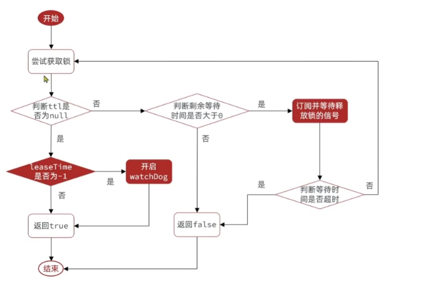


## Feed系统设计

动态发布--->DFA异步检测审核，通过-->触发推送条件

### 推送对象：

- 社区管理员发布的------->立即推送给所有的关注的活跃用户。

- 关注的对象，高活跃用户，最近5分钟又操作记录的--->立即推送
- 其他的--->写入拉取队

### 推送拉取流程

#### 在线用户检测

- 检查粉丝当前在线状态
- 过滤出在线用户列表

#### 推送执行流程

- 通过WebSocket连接推送新内容
- 使用多级缓存优化推送：
  - 内存缓存热数据
  - Redis存储近期Feed
- 批量推送优化（每100条一组）

#### 拉取执行流程

- 请求触发：刷新，携带最后可见的内容ID和时间戳
- 多级查询：Caffeine查询->Redis查询->Mysql查询
- 结果合并：时间倒序合并多级结果
- 去重
- 截取请求数量并返回

### 存储更新流程

- 写扩散，社区管理员发布的主动写入关注社区用户的Feed，更新Redis
- 读扩散，普通用户等待拉取是合并
- 定期加载活跃用户的Feed


# 微服务项目

## 注册中心，Nacos:

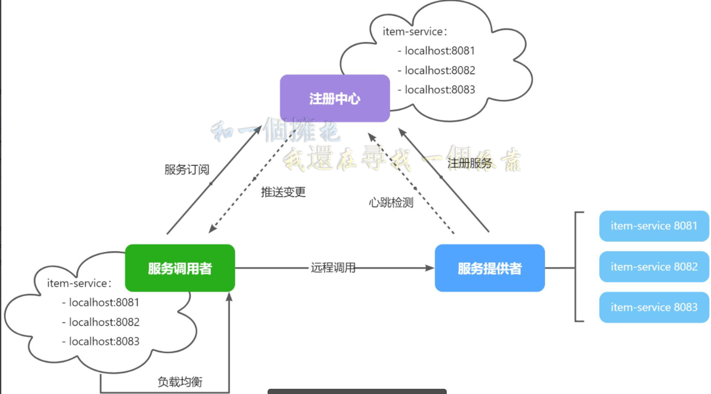


服务注册：

- 服务启动时就会注册自己的服务信息（服务名、IP、端口）到注册中心
- 调用者可以从注册中心订阅想要的服务，获取服务对应的实例列表（1个服务可能多实例部署）
- 调用者自己对实例列表负载均衡，挑选一个实例
- 调用者向该实例发起远程调用

服务发现：

- 服务提供者会定期向注册中心发送请求，报告自己的健康状态（心跳请求）
- 当注册中心长时间收不到提供者的心跳时，会认为该实例宕机，将其从服务的实例列表中剔除
- 当服务有新实例启动时，会发送注册服务请求，其信息会被记录在注册中心的服务实例列表
- 当注册中心服务列表变更时，会主动通知微服务，更新本地服务列表

服务的消费者要去nacos订阅服务，这个过程就是服务发现，步骤如下：

- 引入依赖
- 配置Nacos地址
- 发现并调用服务

## OpenFeign

#### （1）**Feign 接口**

开发者定义一个接口，使用 OpenFeign 的注解（如 `@FeignClient`, `@GetMapping`, `@RequestParam` 等）标明 HTTP 方法、路径和参数。

#### （2）**动态代理**

- OpenFeign 在应用启动时会扫描带有 `@FeignClient` 注解的接口，并为其创建动态代理。
- 调用接口方法时，实际调用的是代理对象的逻辑。
- 代理对象根据方法的注解生成 HTTP 请求信息（URL、方法类型、请求参数等）。

#### （3）**Request 模板**

- OpenFeign 会将方法的注解（如 `@RequestParam`, `@RequestHeader` 等）解析为 Request 模板。
- 模板包含 URL、路径变量、请求体、请求头等信息，作为 HTTP 请求的规范化表示。

#### （4）**HTTP 客户端**

- OpenFeign 不直接处理 HTTP 请求，而是通过可插拔的 HTTP 客户端库（如 Apache HttpClient、OkHttp 等）来执行网络请求。
- 默认情况下，OpenFeign 使用 Java 自带的 `HttpURLConnection`，但可以切换到其他更强大的 HTTP 客户端。

#### （5）**负载均衡（Ribbon 或 Spring Cloud LoadBalancer）**

- 如果配合 Spring Cloud 使用，OpenFeign 会与 Ribbon 或 Spring Cloud LoadBalancer 集成，实现服务名到具体实例地址的映射（如将 `http://service-name` 转换为 `http://192.168.1.1:8080`）。

### 工作流程：

1. **服务注册**：服务在启动时向注册中心（如 Eureka、Consul）注册自己的地址和元数据。
2. **服务发现**：OpenFeign 通过负载均衡器查询注册中心，获取目标服务的实例列表。
3. **选择实例**：负载均衡器根据策略选择一个实例，将请求路由到该地址。

#### （6）**序列化与反序列化**

- OpenFeign 使用可配置的编码器（Encoder）和解码器（Decoder）处理请求和响应数据。
- 例如，默认支持 JSON 编码/解码，可以切换到自定义的序列化库（如 Jackson、Gson）


基于Http请求， 利用动态代理实现请求

编写客户端

```java
@FeignClient("item-service")
public interface ItemClient {

    @GetMapping("/items")
    List<ItemDTO> queryItemByIds(@RequestParam("ids") Collection<Long> ids);
}
```


连接池OKHttp

开启连接池

```java
feign:
  okhttp:
    enabled: true #
```

## 网关

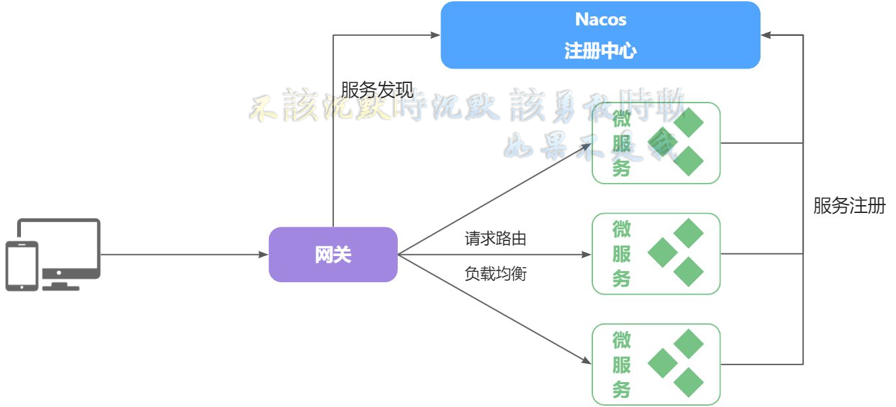

### 路由过滤

### **1. 路由 (Routing)**

#### **定义**

路由是网关的核心功能之一，负责将客户端的请求转发到对应的微服务。

#### **作用**

- 将客户端请求根据规则（如 URL 路径、请求头等）转发到对应的目标服务。
- 实现客户端与服务端的解耦，客户端无需直接知道微服务的具体地址和端口。

#### **实现方式**

- **静态路由**：在网关的配置文件中手动配置规则。
- **动态路由**：结合服务发现（如 Eureka、Nacos），通过服务名称动态选择目标服务。

### **路由规则**

路由规则通常基于以下信息：

1. **请求路径**

   （Path）：根据 URL 路径转发。

   - 示例：`/api/users/**` 转发到 `user-service`

2. **请求方法**（Method）：根据 HTTP 方法（如 GET、POST）转发。

3. **请求头**（Header）：根据请求头的内容转发。

4. **请求参数**（Query Params）：根据查询参数转发。

```java

spring:
  cloud:
    gateway:
      routes:
        - id: user-service-route
          uri: lb://user-service   # 目标服务，使用负载均衡(lb)
          predicates:
            - Path=/api/users/**   # 路径匹配规则
          filters:
            - RewritePath=/api/users/(?<segment>.*), /$\\{segment}

```

- `id`：路由的唯一标示
- `predicates`：路由断言，其实就是匹配条件
- `filters`：路由过滤条件，后面讲
- `uri`：路由目标地址，`lb://`代表负载均衡，从注册中心获取目标微服务的实例列表，并且负载均衡选择一个访问。

### 过滤

过滤是网关的扩展功能，允许在请求被转发到目标服务之前（或者响应返回给客户端之前）执行特定的逻辑

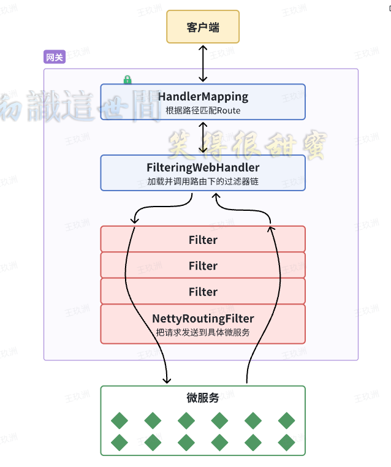

1. 客户端请求进入网关后由`HandlerMapping`对请求做判断，找到与当前请求匹配的路由规则（**`Route`**），然后将请求交给`WebHandler`去处理。
2. `WebHandler`则会加载当前路由下需要执行的过滤器链（**`Filter chain`**），然后按照顺序逐一执行过滤器（后面称为**`Filter`**）。
3. 图中`Filter`被虚线分为左右两部分，是因为`Filter`内部的逻辑分为`pre`和`post`两部分，分别会在请求路由到微服务**之前**和**之后**被执行。
4. 只有所有`Filter`的`pre`逻辑都依次顺序执行通过后，请求才会被路由到微服务。
5. 微服务返回结果后，再倒序执行`Filter`的`post`逻辑。
6. 最终把响应结果返回。

最终请求转发是有一个名为`NettyRoutingFilter`的过滤器来执行的，而且这个过滤器是整个过滤器链中顺序最靠后的一个。**如果我们能够定义一个过滤器，在其中实现登录校验逻辑，并且将过滤器执行顺序定义到****`NettyRoutingFilter`****之前**，这就符合我们的需求了

### 自定义过滤器实现登录校验

网关过滤器链中的过滤器有两种：

- **`GatewayFilter`**：路由过滤器，作用范围比较灵活，可以是任意指定的路由`Route`. 
- **`GlobalFilter`**：全局过滤器，作用范围是所有路由，不可配置。
- `FilteringWebHandler`在处理请求时，会将`GlobalFilter`装饰为`GatewayFilter`，然后放到同一个过滤器链中，排序以后依次执行。

#### 自定义GatewayFilter

```Java
@Component
public class PrintAnyGatewayFilterFactory extends AbstractGatewayFilterFactory<Object> {
    @Override
    public GatewayFilter apply(Object config) {
        return new GatewayFilter() {
            @Override
            public Mono<Void> filter(ServerWebExchange exchange, GatewayFilterChain chain) {
                // 获取请求
                ServerHttpRequest request = exchange.getRequest();
                // 编写过滤器逻辑
                System.out.println("过滤器执行了");
                // 放行
                return chain.filter(exchange);
            }
        };
    }
}
```

然后在yaml配置中这样使用：

```YAML
spring:
  cloud:
    gateway:
      default-filters:
            - PrintAny # 此处直接以自定义的GatewayFilterFactory类名称前缀类声明过滤器
```

登录鉴权

- 新建AuthGlobalFilter实现GlobalFilter接口和Order结构（保证该过滤器在NettyRouterFilter之前，越小优先级越高）

- 重写filter方法，方法有ServerWebExchange对象，可以获取请求的信息，GatewayFilterChain的信息

- 通过ServerWebExchange获取ServerHttpRequest对象获取 request.getHeaders().get("authorization");

- 判断请求路径是否被排除，有的请求不需要鉴权，排除可以通过配置文件

AuthProperties 是基于配置注册的类

```java
@Data
@ConfigurationProperties(prefix = "hm.auth")
public class AuthProperties {
    private List<String> includePaths;
    private List<String> excludePaths;
}
```


```java

if(isExclude(request.getPath().toString())){
            // 无需拦截，直接放行
            return chain.filter(exchange);
        }


private boolean isExclude(String antPath) {
        for (String pathPattern : authProperties.getExcludePaths()) {
            if(antPathMatcher.match(pathPattern, antPath)){
                return true;
            }
        }
        return false;
    }
```


```
  auth:
    excludePaths:
      - /search/**
      - /users/login
      - /items/**
      - /hi
```


- 转发请求时传递用户信息，

```
ServerWebExchange build = exchange.mutate()
        .request(builder -> builder.header("user-info", userInfo))
        .build();
```

- 转发的服务端，进行拦截器获取信息
- 重写HandlerInterceptor 
- 重写preHandle，进行保存用户信息到ThreadLocal中
- afterCompletion中移除用户信息

### 服务之间的用户信息传递

由于微服务获取用户信息是通过拦截器在请求头中读取，因此要想实现微服务之间的用户信息传递，就**必须在微服务发起调用时把用户信息存入请求头**。

基于OpenFeign借助拦截器RequestInterceptor,实现apply方法

```java
@Bean
public RequestInterceptor userInfoRequestInterceptor(){
    return new RequestInterceptor() {
        @Override
        public void apply(RequestTemplate template) {
            // 获取登录用户
            Long userId = UserContext.getUser();
            if(userId == null) {
                // 如果为空则直接跳过
                return;
            }
            // 如果不为空则放入请求头中，传递给下游微服务
            template.header("user-info", userId.toString());
        }
    };
}
```

user-info是一种全局开发约定

## 配置管理

#### 配置共享


#### 添加共享配置

比如数据库， mubatis-plus配置，日志配置，swagger,  不同的地址用在共享配置中用变量替代，然后在单独在不同的服务配置中进行配置说明

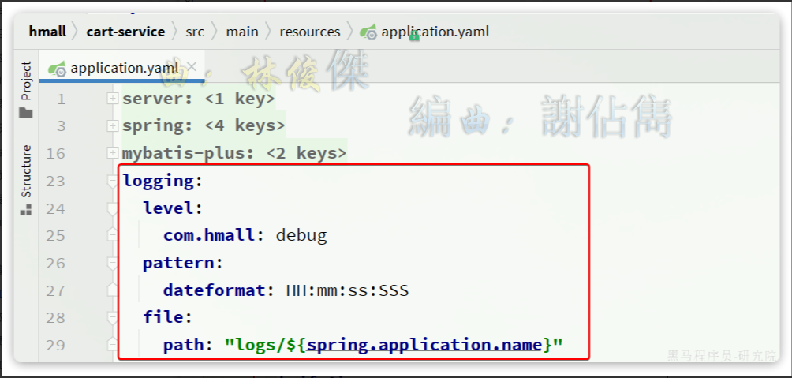

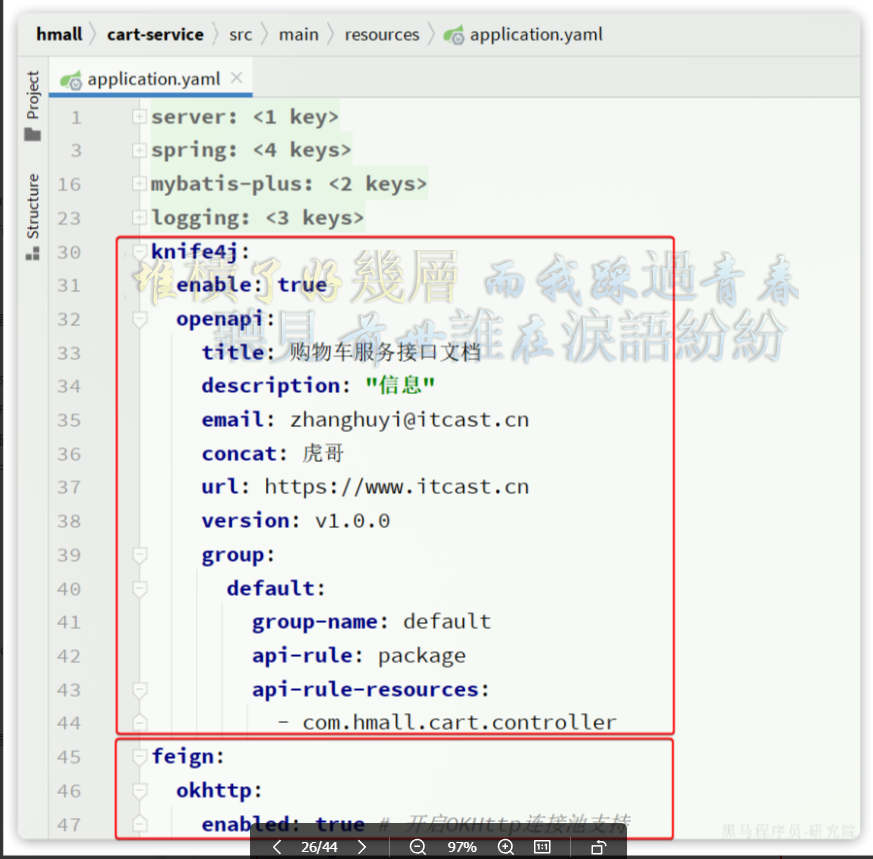

#### 拉取共享配置

将拉取到的共享配置与本地的`application.yaml`配置合并，完成项目上下文的初始化。

不过，需要注意的是，读取Nacos配置是SpringCloud上下文（`ApplicationContext`）初始化时处理的，发生在项目的引导阶段。然后才会初始化SpringBoot上下文，去读取`application.yaml`。

也就是说引导阶段，`application.yaml`文件尚未读取，根本不知道nacos 地址，该如何去加载nacos中的配置文件呢？

SpringCloud在初始化上下文的时候会先读取一个名为`bootstrap.yaml`(或者`bootstrap.properties`)的文

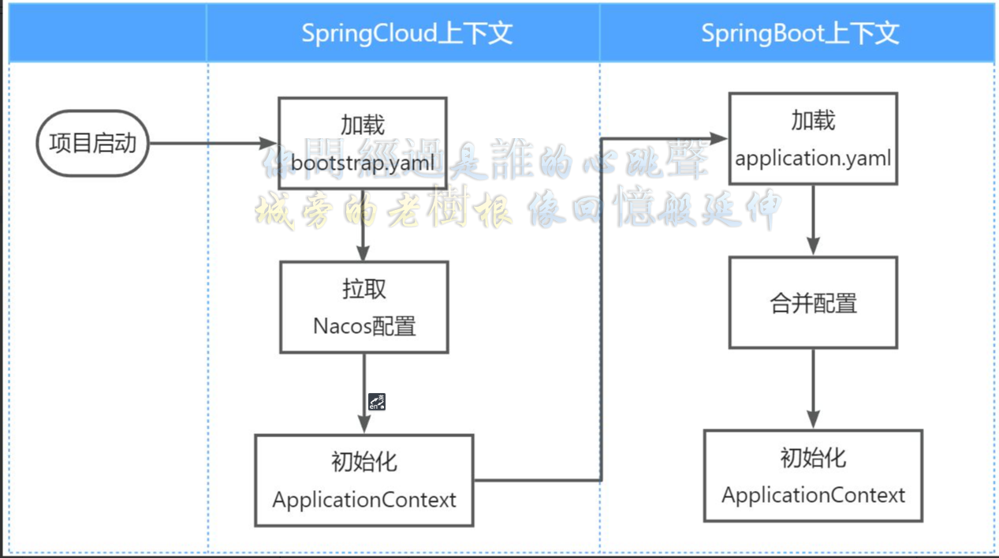

### 配置热更新

首先，我们在nacos中添加一个配置文件，将购物车的上限数量添加到配置中：

注意文件的dataId格式：[服务名]-[spring.active.profile].[后缀名]

文件名称由三部分组成：

- **`服务名`**：我们是购物车服务，所以是`cart-service`
- **`spring.active.profile`**：就是spring boot中的`spring.active.profile`，可以省略，则所有profile共享该配置
- **`后缀名`**：例如yaml

这里我们直接使用`cart-service.yaml`这个名称，则不管是dev还是local环境都可以共享该配置。

```YAML
hm:
  cart:
    maxAmount: 1 # 购物车商品数量上限
```

提交配置，在控制台能看到新添加的配置：

接着，我们在微服务中读取配置，实现配置热更新。

在`cart-service`中新建一个属性读取类：

```java
@Data
@Component
@ConfigurationProperties(prefix = "hm.cart")
public class CartProperties {
    private Integer maxAmount;
}
```


接着，在业务中使用该属性加载类：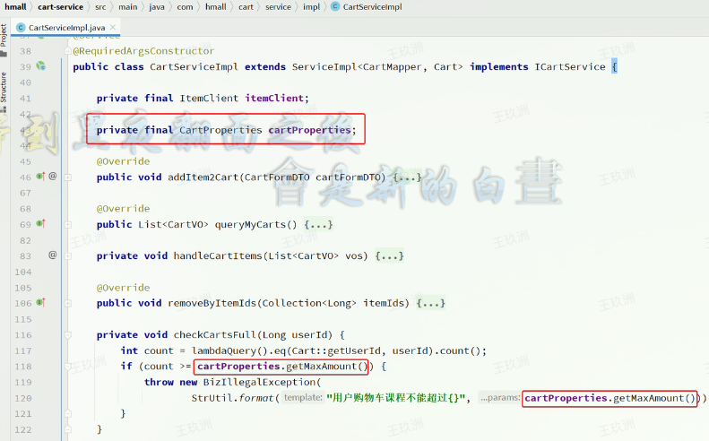

无需重启服务，配置热更新就生效了！

### 动态路由

网关的路由配置全部是在项目启动时由`org.springframework.cloud.gateway.route.CompositeRouteDefinitionLocator`在项目启动的时候加载，并且一经加载就会缓存到内存中的路由表内（一个Map），不会改变。也不会监听路由变更，所以，我们无法利用上节课学习的配置热更新来实现路由更新。

因此，我们必须监听Nacos的配置变更，然后手动把最新的路由更新到路由表中。这里有两个难点：

- 如何监听Nacos配置变更？
- 如何把路由信息更新到路由表？

#### 如何监听Nacos配置变更？

可以使用 Nacos 动态监听配置接口来实现。

```Java
public void addListener(String dataId, String group, Listener listener)
```

| **参数名** | **参数类型** | **描述**                                                     |
| :--------- | :----------- | :----------------------------------------------------------- |
| dataId     | string       | 配置 ID，保证全局唯一性，只允许英文字符和 4 种特殊字符（"."、":"、"-"、"_"）。不超过 256 字节。 |
| group      | string       | 配置分组，一般是默认的DEFAULT_GROUP。                        |
| listener   | Listener     | 监听器，配置变更进入监听器的回调函数。                       |

这里核心的步骤有2步：

- **创建ConfigService，目的是连接到Nacos**
- **添加配置监听器，编写配置变更的通知处理逻辑**

```Java
String serverAddr = "{serverAddr}";
String dataId = "{dataId}";
String group = "{group}";
// 1.创建ConfigService，连接Nacos
Properties properties = new Properties();
properties.put("serverAddr", serverAddr);
ConfigService configService = NacosFactory.createConfigService(properties);
// 2.读取配置
String content = configService.getConfig(dataId, group, 5000);
// 3.添加配置监听器
configService.addListener(dataId, group, new Listener() {
        @Override
        public void receiveConfigInfo(String configInfo) {
        // 配置变更的通知处理
                System.out.println("recieve1:" + configInfo);
        }
        @Override
        public Executor getExecutor() {
                return null;
        }
});
```

由于我们采用了`spring-cloud-starter-alibaba-nacos-config`自动装配，因此`ConfigService`已经在`com.alibaba.cloud.nacos.NacosConfigAutoConfiguration`中自动创建好了：

NacosConfigManager中是负责管理Nacos的ConfigService的，具体代码如下：

因此，只要我们拿到`NacosConfigManager`就等于拿到了`ConfigService`，第一步就实现了。

第二步，编写监听器。虽然官方提供的SDK是ConfigService中的addListener，不过项目第一次启动时不仅仅需要添加监听器，也需要读取配置，因此建议使用的API是这个：

```Java
String getConfigAndSignListener(
    String dataId, // 配置文件id
    String group, // 配置组，走默认
    long timeoutMs, // 读取配置的超时时间
    Listener listener // 监听器
) throws NacosException;
```

既可以配置监听器，并且会根据dataId和group读取配置并返回。我们就可以在项目启动时先更新一次路由，后续随着配置变更通知到监听器，完成路由更新。

#### 如何把路由信息更新到路由表？

更新路由要用到`org.springframework.cloud.gateway.route.RouteDefinitionWriter`这个接口：

```Java
package org.springframework.cloud.gateway.route;

import reactor.core.publisher.Mono;

/**
 * @author Spencer Gibb
 */
public interface RouteDefinitionWriter {
        /**
     * 更新路由到路由表，如果路由id重复，则会覆盖旧的路由
     */
        Mono<Void> save(Mono<RouteDefinition> route);
        /**
     * 根据路由id删除某个路由
     */
        Mono<Void> delete(Mono<String> routeId);

}
```

这里更新的路由，也就是RouteDefinition，之前我们见过，包含下列常见字段：

- id：路由id
- predicates：路由匹配规则
- filters：路由过滤器
- uri：路由目的地

将来我们保存到Nacos的配置也要符合这个对象结构，将来我们以JSON来保存，格式如下：

```JSON
{
  "id": "item",
  "predicates": [{
    "name": "Path",
    "args": {"_genkey_0":"/items/**", "_genkey_1":"/search/**"}
  }],
  "filters": [],
  "uri": "lb://item-service"
}
```

#### 实现动态路由

- 首先， 我们在网关gateway引入依赖
- 然后在网关`gateway`的`resources`目录创建`bootstrap.yaml`文件，内容如下：拉取共享配置

```YAML
spring:
  application:
    name: gateway
  cloud:
    nacos:
      server-addr: 192.168.150.101
      config:
        file-extension: yaml
        shared-configs:
          - dataId: shared-log.yaml # 共享日志配置
```

- 接着，修改`gateway`的`resources`目录下的`application.yml`，把之前的路由移除，最终内容如下：

```YAML
server:
  port: 8080 # 端口
hm:
  jwt:
    location: classpath:hmall.jks # 秘钥地址
    alias: hmall # 秘钥别名
    password: hmall123 # 秘钥文件密码
    tokenTTL: 30m # 登录有效期
  auth: # 自定义的过滤器前缀
    excludePaths: # 无需登录校验的路径
      - /search/**
      - /users/login
      - /items/**
```

- 然后，在`gateway`中定义配置监听器：

  ```java
  
  @Slf4j
  @Component
  @RequiredArgsConstructor
  public class DynamicRouteLoader {
  
      private final RouteDefinitionWriter writer;
      private final NacosConfigManager nacosConfigManager;
  
      // 路由配置文件的id和分组
      private final String dataId = "gateway-routes.json";// 配置成为Json方便解析
      private final String group = "DEFAULT_GROUP";
      // 保存更新过的路由id
      private final Set<String> routeIds = new HashSet<>();
  
      @PostConstruct
      public void initRouteConfigListener() throws NacosException {
          // 1.注册监听器并首次拉取配置
          String configInfo = nacosConfigManager.getConfigService()
                  .getConfigAndSignListener(dataId, group, 5000, new Listener() {
                      @Override
                      public Executor getExecutor() {
                          return null;
                      }
  
                      @Override
                      public void receiveConfigInfo(String configInfo) {
                          updateConfigInfo(configInfo);
                      }
                  });
          // 2.首次启动时，更新一次配置
          updateConfigInfo(configInfo);
      }
  
      private void updateConfigInfo(String configInfo) {
          log.debug("监听到路由配置变更，{}", configInfo);
          // 1.反序列化
          List<RouteDefinition> routeDefinitions = JSONUtil.toList(configInfo, RouteDefinition.class);
          // 2.更新前先清空旧路由
          // 2.1.清除旧路由
          for (String routeId : routeIds) {
              writer.delete(Mono.just(routeId)).subscribe();
          }
          routeIds.clear();
          // 2.2.判断是否有新的路由要更新
          if (CollUtils.isEmpty(routeDefinitions)) {
              // 无新路由配置，直接结束
              return;
          }
          // 3.更新路由
          routeDefinitions.forEach(routeDefinition -> {
              // 3.1.更新路由
              writer.save(Mono.just(routeDefinition)).subscribe();
              // 3.2.记录路由id，方便将来删除
              routeIds.add(routeDefinition.getId());
          });
      }
  }
  ```

  #### 总的来说

  1. 新建一个类并注册到容器中,当路由配置发生变化时，该方法被触发。`configInfo` 是变更后的路由配置信息。
  2. Nacos通过ConfigServer读取配置文件，对于具体的配置文件可以通过ConfigServer添加监听器addListener取监听配置文件的变化，而ConfigServer由NacosConfigManager管理
  3. 通过容器自动拿到NacosManager对象，获取ConfigServer对象，然后去添加监听器getConfigAndSignListener，去重写receiveConfigInfo方法更新配置。

  

  ```java
  @PostConstruct
      public void initRouteConfigListener() throws NacosException {
          // 1.注册监听器并首次拉取配置
          String configInfo = nacosConfigManager.getConfigService()
                  .getConfigAndSignListener(dataId, group, 5000, new Listener() {
                      @Override
                      public Executor getExecutor() {
                          return null;
                      }
  
                      @Override
                      public void receiveConfigInfo(String configInfo) {
                          updateConfigInfo(configInfo);
                      }
                  });
          // 2.首次启动时，更新一次配置
          updateConfigInfo(configInfo);
      }
  ```

  

  4. receiveConfigInfo中的逻辑

  - 由于路由变更需要我们自己手动实现，所以需要保存旧的路由，我们保存ID,存到集合

  - 反序列化configInfo为routeDefinitions， 通过RouteDefinitionWriter去实现对router的删除和保存操作
  - 具体是先清除旧的delete方法路由通过路由ID
  - 然后将变化后的路由通过save去保存， 并将新的路由ID保存到集合中，方便下次的更新。

```java
private void updateConfigInfo(String configInfo) {
        log.debug("监听到路由配置变更，{}", configInfo);
        // 1.反序列化
        List<RouteDefinition> routeDefinitions = JSONUtil.toList(configInfo, RouteDefinition.class);
        // 2.更新前先清空旧路由
        // 2.1.清除旧路由
        for (String routeId : routeIds) {
            writer.delete(Mono.just(routeId)).subscribe();
        }
        routeIds.clear();
        // 2.2.判断是否有新的路由要更新
        if (CollUtils.isEmpty(routeDefinitions)) {
            // 无新路由配置，直接结束
            return;
        }
        // 3.更新路由
        routeDefinitions.forEach(routeDefinition -> {
            // 3.1.更新路由
            writer.save(Mono.just(routeDefinition)).subscribe();
            // 3.2.记录路由id，方便将来删除
            routeIds.add(routeDefinition.getId());
        });
    }
```

## 服务保护

### 雪崩

**雪崩效应**是指一个服务的故障或过载会导致其依赖的其他服务逐渐失效，从而引发一系列连锁反应，最终可能导致整个系统崩溃的现象。

### 1.1.服务保护方案

微服务保护的方案有很多，比如：

- 请求限流，**限制或控制**接口访问的并发流量，避免服务因流量激增而出现故
- 线程隔离，限定每个接口可以使用的资源范围，也就是将其“隔离”起来。限制可用的线程资源：

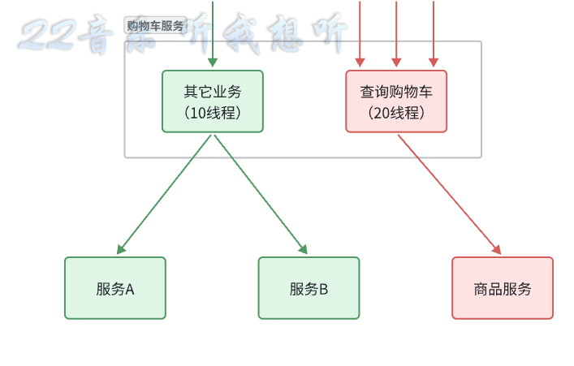

- 服务熔断

线程隔离虽然避免了雪崩问题，但故障服务（商品服务）依然会拖慢购物车服务（服务调用方）的接口响应速度。

所以，我们要做两件事情：

- **编写服务降级逻辑**：就是服务调用失败后的处理逻辑，根据业务场景，可以抛出异常，也可以返回友好提示或默认数据。
- **异常统计和熔断**：统计服务提供方的异常比例，当比例过高表明该接口会影响到其它服务，应该拒绝调用该接口，而是直接走降级逻辑。

### 降级逻辑处理

- 使用**FallbackFactory**接口，可以对远程调用的异常做处理，我们一般选择这种方式。

```java

@Slf4j
public class ItemClientFallback implements FallbackFactory<ItemClient> {
    @Override
    public ItemClient create(Throwable cause) {
        return new ItemClient() {
            @Override
            public List<ItemDTO> queryItemByIds(Collection<Long> ids) {
                log.error("远程调用ItemClient#queryItemByIds方法出现异常，参数：{}", ids, cause);
                // 查询购物车允许失败，查询失败，返回空集合
                return CollUtils.emptyList();
            }

            @Override
            public void deductStock(List<OrderDetailDTO> items) {
                // 库存扣减业务需要触发事务回滚，查询失败，抛出异常
                throw new BizIllegalException(cause);
            }
        };
    }
}
```

- 将该实现类注册为bean
- 在远程调用模块中使用, FeignClient主机有fallbackFactory（openfeign）

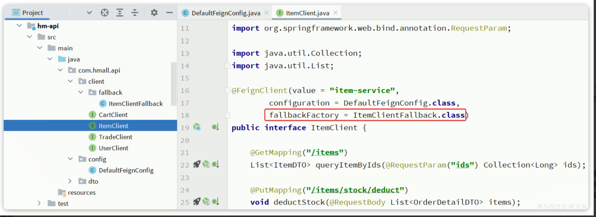

## 分布式事务

**分支事务**： 微服务本地的事务

全局事务：多个有关联的分支事务， 跨越服务的

### Seata

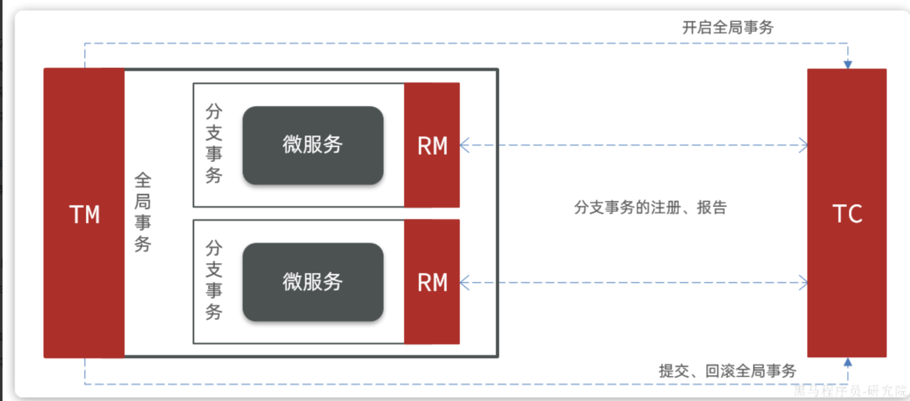

TC事务协调者:维护全事务和分支事务状态，协调全局事务提交或者回滚

TM事务管理器：定义全局事务范围，

RM-资源管理器：管理分支事务，与TC交谈以注册分支事务和报告分支事务的状态，并驱动分支事务提交或回滚。


**TM**和**RM**可以理解为Seata的客户端部分，引入到参与事务的微服务依赖中即可。将来**TM**和**RM**就会协助微服务，实现本地分支事务与**TC**之间交互，实现事务的提交或回滚。

而**TC**服务则是事务协调中心，是一个独立的微服务，需要单独部署。

1. 引入seata和nacos依赖

2. 编写seata配置文件，

   ```YAML
   seata:
     registry: # TC服务注册中心的配置，微服务根据这些信息去注册中心获取tc服务地址
       type: nacos # 注册中心类型 nacos
       nacos:
         server-addr: 192.168.150.101:8848 # nacos地址
         namespace: "" # namespace，默认为空
         group: DEFAULT_GROUP # 分组，默认是DEFAULT_GROUP
         application: seata-server # seata服务名称
         username: nacos
         password: nacos
     tx-service-group: hmall # 事务组名称
     service:
       vgroup-mapping: # 事务组与tc集群的映射关系
         hmall: "default"
   ```

   3. seata的客户端在解决分布式事务的时候需要记录一些中间数据，保存在数据库中。因此我们要先准备一个这样的表。undo_log表
   4. 将将其上的`@Transactional`注解改为Seata提供的`@GlobalTransactional`：，`@GlobalTransactional`注解就是在标记事务的起点，将来TM就会基于这个方法判断全局事务范围，初始化全局事务。

### Seata是如何解决分布式事务的呢？

#### XA

XA 规范 描述了全局的`TM`与局部的`RM`之间的接口，几乎所有主流的数据库都对 XA 规范 提供了支持。

实现的原理都是基于两阶段提交。

正常情况：

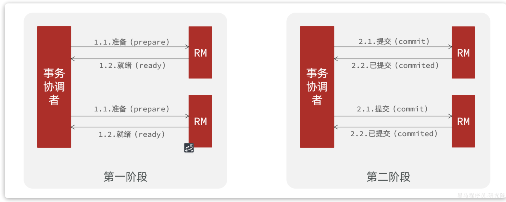

异常情况：
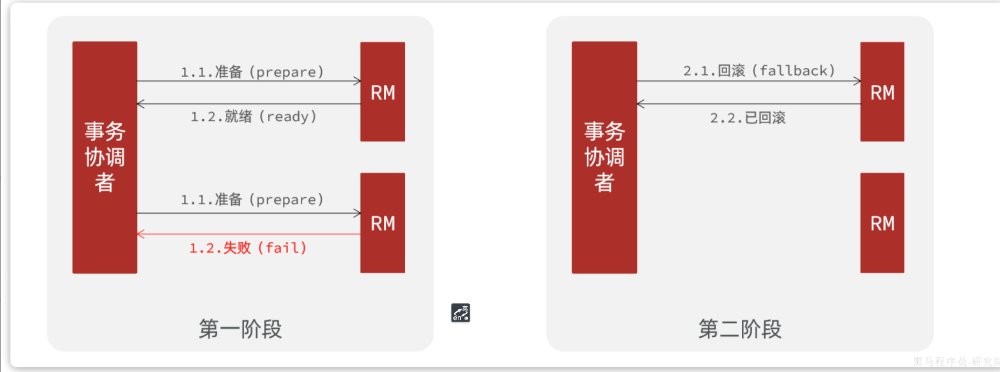

一阶段：

- 事务协调者通知每个事务参与者执行本地事务
- 本地事务执行完成后报告事务执行状态给事务协调者，此时事务不提交，继续持有数据库锁

二阶段：

- 事务协调者基于一阶段的报告来判断下一步操作
- 如果一阶段都成功，则通知所有事务参与者，提交事务
- 如果一阶段任意一个参与者失败，则通知所有事务参与者回滚事务

Seata对原始的XA模式做了简单的封装和改造，以适应自己的事务模型，基本架构如图：

实现

```YAML
seata:
  data-source-proxy-mode: XA
```


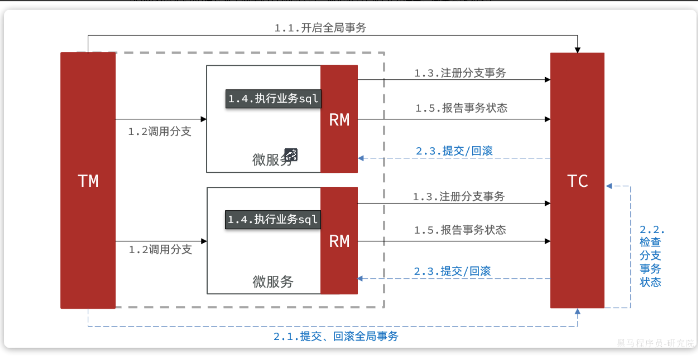

`RM`一阶段的工作：

1. 注册分支事务到`TC`
2. 执行分支业务sql但不提交
3. 报告执行状态到`TC`

`TC`二阶段的工作：

1.  `TC`检测各分支事务执行状态
   1. 如果都成功，通知所有RM提交事务
   2. 如果有失败，通知所有RM回滚事务 

`RM`二阶段的工作：

- 接收`TC`指令，提交或回滚事务

#### 优缺点

`XA`模式的优点是什么？

- 事务的强一致性，满足ACID原则
- 常用数据库都支持，实现简单，并且没有代码侵入

`XA`模式的缺点是什么？

- 因为一阶段需要锁定数据库资源，等待二阶段结束才释放，性能较差
- 依赖关系型数据库实现事务

#### AT

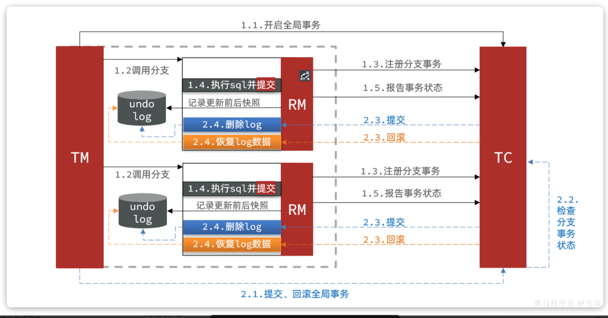

`AT`模式同样是分阶段提交的事务模型，不过缺弥补了`XA`模型中资源锁定周期过长的缺陷。

阶段一`RM`的工作：

- 注册分支事务
- 记录undo-log（数据快照）
- 执行业务sql并提交
- 报告事务状态

阶段二提交时`RM`的工作：

- 删除undo-log即可

阶段二回滚时`RM`的工作：

- 根据undo-log恢复数据到更新前

**简述`AT`模式与`XA`模式最大的区别是什么？**

- `XA`模式一阶段不提交事务，锁定资源；`AT`模式一阶段直接提交，不锁定资源。
- `XA`模式依赖数据库机制实现回滚；`AT`模式利用数据快照实现数据回滚。
- `XA`模式强一致；`AT`模式最终一致


## MQ

### JSON转换器

JDK序列化方式并不合适。我们希望消息体的体积更小、可读性更高，因此可以使用JSON方式来做序列化和反序列化

```java

@Bean
public MessageConverter messageConverter(){
    // 1.定义消息转换器
    Jackson2JsonMessageConverter jackson2JsonMessageConverter = new Jackson2JsonMessageConverter();
    // 2.配置自动创建消息id，用于识别不同消息，也可以在业务中基于ID判断是否是重复消息
    jackson2JsonMessageConverter.setCreateMessageIds(true);
    return jackson2JsonMessageConverter;
}
```

### 发送者可靠性

P->E->Q—>C

- 连接MQ失败:  **生产者重试机制**

- MQ后没有找到交换机 **生产者确认机制**

- 达到交换机后没有找到合适的队列 **生产者确认机制**

- 到达MQ，处理消息进程异常  **生产者确认机制**

- 保存到队列，未消费就宕机

- 消息接收后尚未处理突然宕机

- 消息接收后处理过程中抛出异常

  

**所易**

- 确保消息一定发送到MQ
- MQ的消息不丢失
- 消费者一定处理消息

#### 1.1.生产者重试机制

连接超时，重试机制

```YAML

spring:
  rabbitmq:
    connection-timeout: 1s # 设置MQ的连接超时时间
    template:
      retry:
        enabled: true # 开启超时重试机制
        initial-interval: 1000ms # 失败后的初始等待时间
        multiplier: 1 # 失败后下次的等待时长倍数，下次等待时长 = initial-interval * multiplier
        max-attempts: 3 # 最大重试次数
```

#### 1.2.生产者确认机制


- 到达MQ,路由失败，通过Pulisher Return返回异常信息，返回ack信息，投递成功
- 临时消息到达MQ,入队成功，返回ack,投递成功
- 持久化消息投递到MQ,入队成功，返回ack,投递成功
- 其他情况返回NACK,投递失败

其中`ack`和`nack`属于**Publisher Confirm**机制，`ack`是投递成功；`nack`是投递失败。而`return`则属于**Publisher Return**机制。

默认两种机制都是关闭状态，需要通过配置文件来开启。

```yaml
spring:
  rabbitmq:
    publisher-confirm-type: correlated # 开启publisher confirm机制，并设置confirm类型
    publisher-returns: true # 开启publisher return机制
```


这里`publisher-confirm-type`有三种模式可选：

- `none`：关闭confirm机制
- `simple`：同步阻塞等待MQ的回执
- `correlated`：MQ异步回调返回回执

**定义ReturnCallback**

每个`RabbitTemplate`只能配置一个`ReturnCallback`，因此我们可以在配置类中统一设置。我们在publisher模块定义一个配置类：

```java
@Slf4j
@AllArgsConstructor
@Configuration
public class MqConfig {
    private final RabbitTemplate rabbitTemplate;

    @PostConstruct
    public void init(){
        rabbitTemplate.setReturnsCallback(new RabbitTemplate.ReturnsCallback() {
            @Override
            public void returnedMessage(ReturnedMessage returned) {
                log.error("触发return callback,");
                log.debug("exchange: {}", returned.getExchange());
                log.debug("routingKey: {}", returned.getRoutingKey());
                log.debug("message: {}", returned.getMessage());
                log.debug("replyCode: {}", returned.getReplyCode());
                log.debug("replyText: {}", returned.getReplyText());
            }
        });
    }
}
```

**定义ConfirmCallback**

这里的CorrelationData中包含两个核心的东西：

- `id`：消息的唯一标示，MQ对不同的消息的回执以此做判断，避免混淆
- `SettableListenableFuture`：回执结果的Future对象

```Java
@Test
void testPublisherConfirm() {
    // 1.创建CorrelationData
    CorrelationData cd = new CorrelationData();
    // 2.给Future添加ConfirmCallback
    cd.getFuture().addCallback(new ListenableFutureCallback<CorrelationData.Confirm>() {
        @Override
        public void onFailure(Throwable ex) {
            // 2.1.Future发生异常时的处理逻辑，基本不会触发
            log.error("send message fail", ex);
        }
        @Override
        public void onSuccess(CorrelationData.Confirm result) {
            // 2.2.Future接收到回执的处理逻辑，参数中的result就是回执内容
            if(result.isAck()){ // result.isAck()，boolean类型，true代表ack回执，false 代表 nack回执
                log.debug("发送消息成功，收到 ack!");
            }else{ // result.getReason()，String类型，返回nack时的异常描述
                log.error("发送消息失败，收到 nack, reason : {}", result.getReason());
            }
        }
    });
    // 3.发送消息
    rabbitTemplate.convertAndSend("hmall.direct", "q", "hello", cd);
}
```

### MQ可靠性

#### 2.1.数据持久化

为了提升性能，默认情况下MQ的数据都是在内存存储的临时数据，重启后就会消失。为了保证数据的可靠性，必须配置数据持久化，包括：

- 交换机持久化

- 队列持久化

- 消息持久化

- 

  

页面设置去设置

#### 2.2 惰性队列

##### 特征如下：

- 接收到消息后直接存入磁盘而非内存
- 消费者要消费消息时才会从磁盘中读取并加载到内存（也就是懒加载）
- 支持数百万条的消息存储

### 消费者的可靠性

- 消息投递的过程中出现了网络故障
- 消费者接收到消息后突然宕机
- 消费者接收到消息后，因处理不当导致异常

#### 消费者确认机制

RabbitMQ提供了消费者确认机制（**Consumer Acknowledgement**）。即：当消费者处理消息结束后，应该向RabbitMQ发送一个回执，告知RabbitMQ自己消息处理状态。回执有三种可选值：

- ack：成功处理消息，RabbitMQ从队列中删除该消息
- nack：消息处理失败，RabbitMQ需要再次投递消息
- reject：消息处理失败并拒绝该消息，RabbitMQ从队列中删除该消息

因此SpringAMQP帮我们实现了消息确认。并允许我们通过配置文件设置ACK处理方式，有三种模式：

- **`none`**：不处理。即消息投递给消费者后立刻ack，消息会立刻从MQ删除。非常不安全，不建议使用
- **`manual`**：手动模式。需要自己在业务代码中调用api，发送`ack`或`reject`，存在业务入侵，但更灵活
- **`auto`**：自动模式。SpringAMQP利用AOP对我们的消息处理逻辑做了环绕增强，当业务正常执行时则自动返回`ack`.  当业务出现异常时，根据异常判断返回不同结果：
  - 如果是**业务异常**，会自动返回`nack`；
  - 如果是**消息处理或校验异常**，自动返回`reject`;

```YAML
spring:
  rabbitmq:
    listener:
      simple:
        acknowledge-mode: none # 不做处理
```

#### 失败重试

当消费者出现异常后，消息会不断requeue（重入队）到队列，再重新发送给消费者。如果消费者再次执行依然出错，消息会再次requeue到队列，再次投递，直到消息处理成功为止。

### 失败处理策略

本地测试达到最大重试次数后，消息会被丢弃。这在某些对于消息可靠性要求较高的业务场景下，显然不太合适了。

因此Spring允许我们自定义重试次数耗尽后的消息处理策略，这个策略是由

`MessageRecovery`接口来定义的，它有3个不同实现：

- `RejectAndDontRequeueRecoverer`：重试耗尽后，直接`reject`，丢弃消息。默认就是这种方式 
-  `ImmediateRequeueMessageRecoverer`：重试耗尽后，返回`nack`，消息重新入队 
-  `RepublishMessageRecoverer`：重试耗尽后，将失败消息投递到指定的交换机 

比较优雅的一种处理方案是`RepublishMessageRecoverer`，失败后将消息投递到一个指定的，专门存放异常消息的队列，后续由人工集中处理


# RPC

### **Vert.x** **的** **RecordParser** +**装饰者模式**

```java
NetServer connectHandler(@Nullable Handler<NetSocket> var1);
```

```java
netServer.connectHandler(new TcpServerHandler());

public class TcpServerHandler implements Handler<NetSocket>{
    @Override
    public void handle(NetSocket netSocket) {
     	TcpBufferHandlerWrapper tcpBufferHandlerWrapper = new 			 TcpBufferHandlerWrapper();
        netSocket.handler(tcpBufferHandlerWrapper);
     	
     }
}


public class TcpBufferHandlerWrapper implements Handler<Buffer>{
    private final RecordParser recordParser;

    public TcpBufferHandlerWrapper(Handler<Buffer> bufferHandler) {
        this.recordParser = initRecordParser(bufferHandler);
    }
}
```

如何使用的装饰着模式


- 通过装饰者TcpBufferHandlerWrapper类，封装Handler<Buffer>,并在次基础上增加对Buffer的处理逻辑。

-  加对Buffer的处理逻辑进行增强。通过RecoddParser解析Buffer,解析完成后调用原始的Handler<Buffer>

- ```java
  public TcpBufferHandlerWrapper(Handler<Buffer> bufferHandler) {
      recordParser = initRecordParser(bufferHandler);
  }
  ```

- `TcpBufferHandlerWrapper` 的构造方法接收一个 `Handler<Buffer>` 对象，这个对象就是原始的 `Buffer` 处理器。

- 在构造方法中，调用了 `initRecordParser` 方法，初始化了一个 `RecordParser`，并将原始的 `bufferHandler` 传递给它。

- `TcpBufferHandlerWrapper` 的 `handle` 方法直接将接收到的 `Buffer` 传递给 `recordParser` 进行处理。

- 这样，`TcpBufferHandlerWrapper` 就在原始的 `Handler<Buffer>` 基础上增加了对 `Buffer` 的解析逻辑

- `RecordParser` 通过 `setOutput` 方法绑定一个 `Handler<Buffer>`，当解析出一个完整的消息后，会调用这个 `Handler<Buffer>`：


# JAVA八股

## JAVA

### 基础

#### 1.面向对象和面向过程理解

- **面向过程（Procedure-Oriented Programming, POP）**
  面向过程是一种以过程为中心的编程思想，程序由一系列的函数或过程组成，强调“如何做”（How to do）。
  - 特点：代码从上到下顺序执行，函数之间通过参数传递数据。
  - 优点：简单直接，适合小型程序。
  - 缺点：代码复用性差，难以维护和扩展。
- **面向对象（Object-Oriented Programming, OOP）**
  面向对象是一种以对象为中心的编程思想，程序由多个对象组成，强调“谁来做”（Who to do）。
  - 特点：通过类（Class）定义对象的属性和行为，支持封装、继承和多态。
  - 优点：代码复用性高，易于维护和扩展。
  - 缺点：设计复杂，学习曲线较高。

面向过程是一种以过程为中心得编程范式，以过程为单元组织代码，过程中得一系列动作就是函数，面向过程得函数和数据是分离得，数据就是成员变量，强调如何做。面向对象，以对象为中心得编程思想，程序由多个对象组成，对象定义了属性和行为，关注对象之间得交互关系，强调谁来做，

#### 2.多态、继承、封装

**封装（Encapsulation）**
将数据（属性）和行为（方法）封装在类中，隐藏内部实现细节，只暴露必要的接口。

**继承（Inheritance）**
子类继承父类的属性和方法，实现代码复用和扩展。

**多态（Polymorphism）**
同一操作作用于不同的对象，可以有不同的解释和行为。

通过多态，可以灵活得处理不同类型的对象，降低代码的耦合 

#### 3.JDK和JRE

Java开发工具包，包含开发Java程序所需的所有工具和库。

javac编译器，jdb调试工具，JRE,,,java运行环境

JRE:用于运行java环境，，包括JVM,,虚拟机执行字节码文件，核心类库，java.lang,javva.util

#### 4.final，不可变类

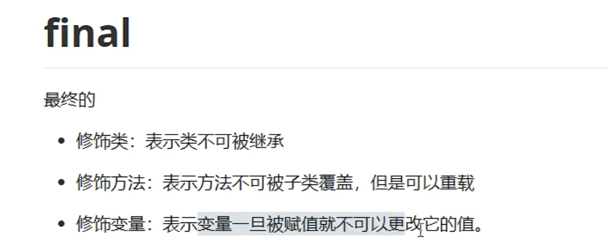

**修饰变量**

- 成员变量：类变量，只能再静态初始化中指定，或者生命类变量时指定

​                           成员变量：非静态初始化快生命变量或者构造器中执行初始值

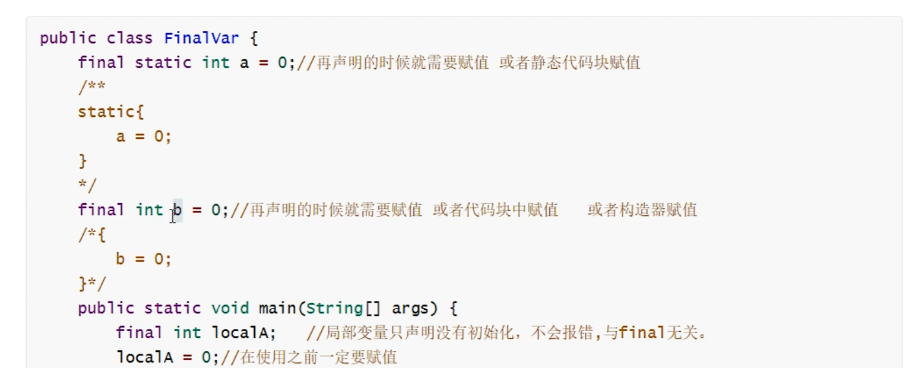

- 局部变量


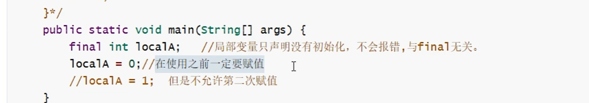

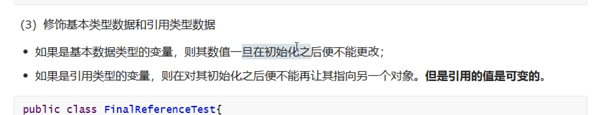

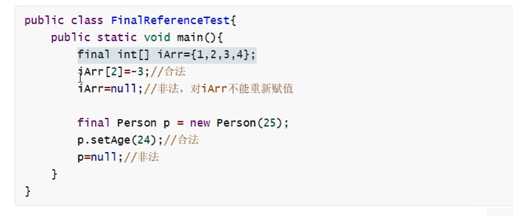

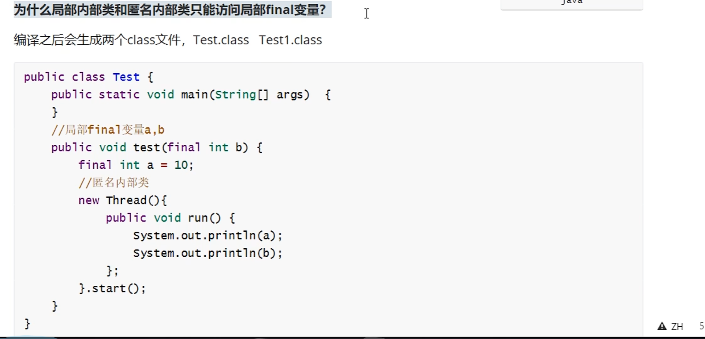

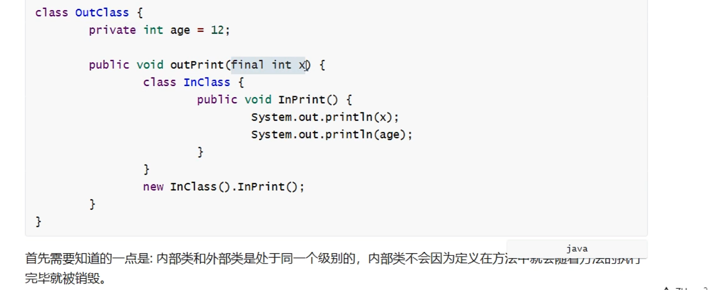

原因：里面的内部类不会因为外面的雷使用完毕就 销毁，可能内部类或者局部类孩在运行。

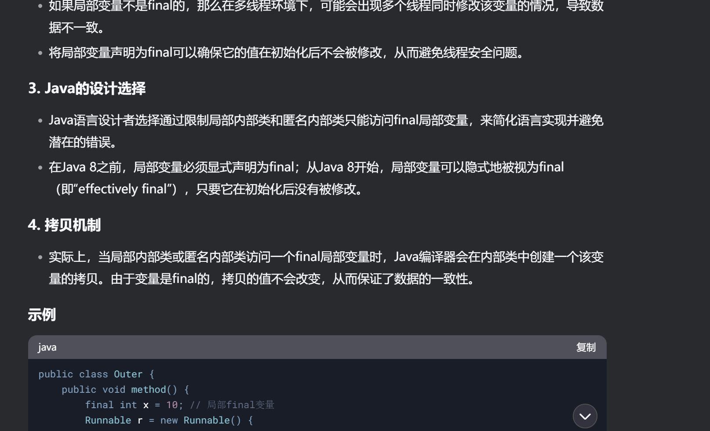

#### 5.String，StringBuffer, StringBuilder及其实现细节

String不可变类，被final修饰，对string的操作都会创建新的的String对象，常量池中的字符串时唯一的，用intern()实现复用，new String("abc",也会在堆中生成新的对象)

buffer:线程安全，可变的，使用Synchronized关键字保证多线程环境线程安全

原理：char[] value,int count, 

String 低层也是char[] value，存放 两者区别，string 中数组被final修饰，buffer，数组时连续的内存，有初始的capity,

appene(int)-->int转换为char的字符站几位，用查表法计算够不够存，不够就扩容，扩容就是Arrays.copyof,数组容量为之前的2倍

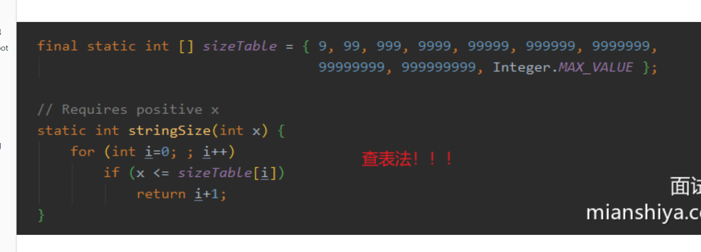

builder不安全，可变

##### StringBuilder

- append实现

特殊判断最小值，计算int转换程字符占用几位，判断数组够不够长，不够久扩容，更新现有的字符数

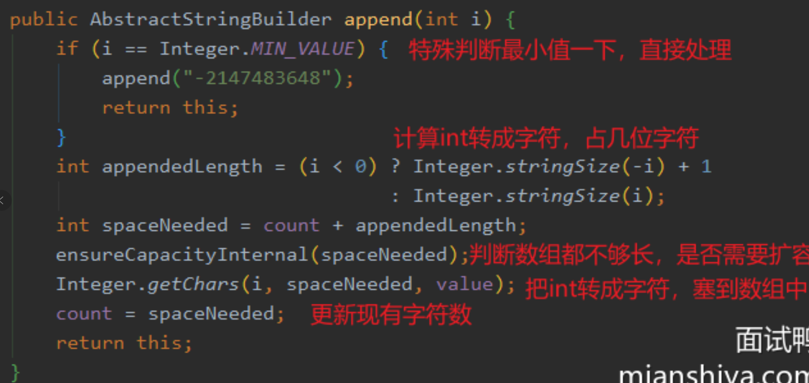

- Interger.stringSize:

查表法：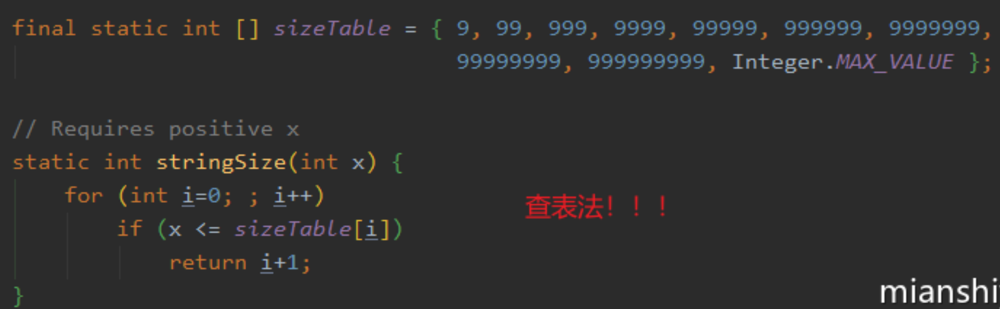

- 扩容

  Arrays.Copyof(),2倍

#### 6.hashcode和equals

equals两个对象是否相等。==，可以在类中重写equals

hashcode:定义在Object.java中，任何类都包含hashCode()函数，hashcode作用确定对象在哈希表中的位置

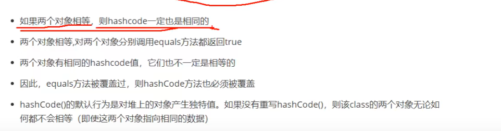

#### 重写重载

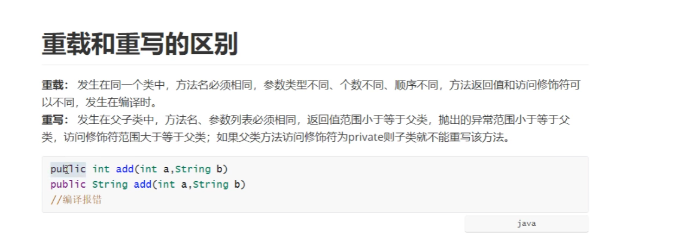

#### 接口、抽象类

 

接口成员变量默认private static final


接口约束了行为的有无，不对具体实现进行限制。接口是行为的抽象，核心就是定义行为，至于类的主体是谁，如何实现，不关心。

抽象类设计是代码复用，不同的类有相同行为（A），**其中一部分行为的实现方式一致**(B)。可以让这些类派生出一个抽象类。在这个抽象类中实现这个方法，避免所有的子类实现这个方法，达到代码复用,A-B留给子类自己实现。A-B这部分不允许倍实例化出来。抽象类包含并实现子类通用特性，但存在相同特性的差异化表达，差异化由子类实现。

#### 7.类加载过程

加载：二进制流加载到内存，生成class对象

验证，是否符合规范，比如JVM版本之类的验证

准备，为静态变量赋初始值，方法区话内存，静态变量，初始值，int0

解析，将常量池符号转化为引用，在内存中通过这个引用查找到目标

初始化，为一些静态代码块，为静态变量赋值

使用，

卸载。

#### 8.双亲委派机制

#### 9.泛型，泛型作用，泛型擦除

#### 10.BigDecimal原理

#### 11. 深拷贝和浅拷贝的区别吗，讲下你实现深拷贝的流程。实现深拷贝的其他方式。

##### **深拷贝与浅拷贝的区别**

- **浅拷贝（Shallow Copy）**：
  - 在浅拷贝中，拷贝的是对象的**引用**，即新对象和原对象指向的是同一个内存地址。
  - 对于对象中的引用类型字段（如数组、集合、对象等），浅拷贝只是复制了引用，而没有复制引用所指向的对象。
  - 结果是原对象和拷贝对象共享对同一对象的访问权。
- **深拷贝（Deep Copy）**：
  - 在深拷贝中，拷贝的是对象本身及其所有引用类型字段所指向的对象。即新对象和原对象都是独立的，拷贝对象不会受原对象的修改影响。
  - 对象内部的引用类型字段会递归地拷贝，直到最底层的对象为止，确保原对象和拷贝对象之间没有共享的引用。

```java
import java.util.Arrays;

class Person {
    String name;
    int[] scores;

    public Person(String name, int[] scores) {
        this.name = name;
        this.scores = scores;
    }
}

public class ShallowCopyExample {
    public static void main(String[] args) {
        int[] scores = {80, 90, 100};
        Person p1 = new Person("Alice", scores);
        Person p2 = p1;  // 直接赋值，p2和p1引用同一个对象

        // 修改p2的内容
        p2.scores[0] = 50;

        System.out.println(Arrays.toString(p1.scores));  // 输出 [50, 90, 100]
        System.out.println(Arrays.toString(p2.scores));  // 输出 [50, 90, 100]
    }
}


import java.util.Arrays;

class Person {
    String name;
    int[] scores;

    public Person(String name, int[] scores) {
        this.name = name;
        this.scores = scores;
    }

    // 实现深拷贝
    public Person deepCopy() {
        // 新建一个 Person 对象，并拷贝原有对象的属性
        int[] scoresCopy = Arrays.copyOf(this.scores, this.scores.length); // 深拷贝数组
        return new Person(this.name, scoresCopy);
    }
}

public class DeepCopyExample {
    public static void main(String[] args) {
        int[] scores = {80, 90, 100};
        Person p1 = new Person("Alice", scores);
        Person p2 = p1.deepCopy();  // 调用深拷贝方法

        // 修改p2的内容
        p2.scores[0] = 50;

        System.out.println(Arrays.toString(p1.scores));  // 输出 [80, 90, 100]
        System.out.println(Arrays.toString(p2.scores));  // 输出 [50, 90, 100]
    }
}

```


##### **实现深拷贝的流程**

1. **创建新对象**：
   - 你需要为目标对象创建一个新的实例。
2. **拷贝基本数据类型字段**：
   - 对于基本数据类型（如 `int`, `char`, `boolean`），直接将原对象的值复制到新对象。
3. **递归拷贝引用类型字段**：
   - 对于引用类型字段（如数组、集合、对象等），你需要递归地拷贝它们所指向的对象，而不是直接复制引用。
   - 使用合适的拷贝方法，例如对于数组，可以使用 `Arrays.copyOf()`，对于集合，可以使用集合的 `clone()` 或者自己手动拷贝每个元素。
4. **返回新对象**：
   - 完成所有字段的拷贝后，返回新创建的深拷贝对象

##### **实现深拷贝的其他方式**

1. **通过 `clone()` 方法实现深拷贝**：

   如果对象的类实现了 `Cloneable` 接口并且重写了 `clone()` 方法，可以使用 `clone()` 来实现深拷贝。需要注意的是，`clone()` 是浅拷贝的，因此需要手动拷贝引用类型字段。

```java
class Person implements Cloneable {
    String name;
    int[] scores;

    public Person(String name, int[] scores) {
        this.name = name;
        this.scores = scores;
    }

    @Override
    public Person clone() throws CloneNotSupportedException {
        Person cloned = (Person) super.clone();  // 浅拷贝
        cloned.scores = scores.clone();  // 深拷贝数组
        return cloned;
    }
}

```

**2、通过 `Serialization`（序列化）实现深拷贝**：

使用 Java 的序列化机制可以实现深拷贝。将对象序列化为字节流，然后再从字节流反序列化为新对象，这样可以完全复制原对象的所有内容

```java
import java.io.*;

class Person implements Serializable {
    String name;
    int[] scores;

    public Person(String name, int[] scores) {
        this.name = name;
        this.scores = scores;
    }
}

public class DeepCopyBySerialization {
    public static Person deepCopy(Person original) throws IOException, ClassNotFoundException {
        // 将对象写入 ByteArrayOutputStream
        ByteArrayOutputStream byteOut = new ByteArrayOutputStream();
        ObjectOutputStream out = new ObjectOutputStream(byteOut);
        out.writeObject(original);
        out.flush();

        // 从 ByteArrayInputStream 读取对象
        ByteArrayInputStream byteIn = new ByteArrayInputStream(byteOut.toByteArray());
        ObjectInputStream in = new ObjectInputStream(byteIn);
        return (Person) in.readObject();
    }

    public static void main(String[] args) throws Exception {
        Person p1 = new Person("Alice", new int[]{80, 90, 100});
        Person p2 = deepCopy(p1);  // 通过序列化进行深拷贝

        // 修改p2的内容
        p2.scores[0] = 50;

        System.out.println(Arrays.toString(p1.scores));  // 输出 [80, 90, 100]
        System.out.println(Arrays.toString(p2.scores));  // 输出 [50, 90, 100]
    }
}

```

3.**通过构造函数或工厂方法实现深拷贝**：

你可以通过自定义构造函数或工厂方法来手动复制对象的所有字段。

#### 12. new对象的过程

`new` 关键字在 Java 中创建一个对象的过程涉及以下几个步骤：

1. **类加载**：加载并验证类。
2. **内存分配**：为对象实例分配堆内存。
3. **初始化默认值**：将对象字段初始化为默认值。
4. **调用构造函数**：根据传递的参数调用构造函数进行初始化。
   - 调用构造方法，按代码逻辑显式初始化成员变量。
   - 若存在继承链，按顺序执行：
     1. 父类静态代码块 → 子类静态代码块（类加载时已执行）。
     2. 父类实例代码块 → 父类构造方法。
     3. 子类实例代码块 → 子类构造方法。
5. **返回对象引用**：返回创建的对象的引用供后续使用

对象的实例化过程并不是原子的，它可以被分解成以下几个步骤：

**分配内存空间**：JVM 为对象分配内存空间。

**初始化对象**：构造函数会被调用，实例变量会被初始化。

**赋值引用**：最后会将对象的引用赋值给 `instance` 变量

### 集合

#### 1.假设你要遍历一个 HashMap，同时删除一些 key，应该怎么编写代码？ 

在遍历 `HashMap` 的同时删除一些键值对时，你需要注意避免在遍历过程中修改 `HashMap`，因为这样会抛出 `ConcurrentModificationException`。一种常见的解决方法是使用 `Iterator` 来安全地进行遍历和删除。

```java
import java.util.HashMap;
import java.util.Iterator;
import java.util.Map;

public class Main {
    public static void main(String[] args) {
        // 创建一个 HashMap 示例
        Map<String, Integer> map = new HashMap<>();
        map.put("a", 1);
        map.put("b", 2);
        map.put("c", 3);
        map.put("d", 4);

        // 使用 Iterator 遍历并删除符合条件的元素
        Iterator<Map.Entry<String, Integer>> iterator = map.entrySet().iterator();
        while (iterator.hasNext()) {
            Map.Entry<String, Integer> entry = iterator.next();
            if (entry.getValue() % 2 == 0) {  // 删除值为偶数的键值对
                iterator.remove();  // 安全删除
            }
        }

        // 打印修改后的 map
        System.out.println(map);  // 输出: {a=1, c=3}
    }
}

```

原理在于 `ConcurrentModificationException` 错误的产生和 `Iterator` 的工作机制。

##### 1. **`ConcurrentModificationException` 的原理**：

- 在 Java 中，`HashMap` 和其他集合类（如 `ArrayList`）的结构在遍历时不能被修改。如果你在遍历过程中直接修改集合（比如删除或添加元素），就会触发 `ConcurrentModificationException`。
- 这是因为在集合被遍历时，它维护了一个修改计数器（称为 `modCount`）。每次修改集合时（如调用 `remove()`、`put()` 等），这个计数器就会增加。`Iterator` 在创建时，会保存当时的 `modCount` 值，并在遍历过程中检查该值是否变化。如果它发现 `modCount` 与初始值不同，就会抛出 `ConcurrentModificationException`，因为这表示集合在遍历过程中被修改过。

##### 2. **使用 `Iterator` 遍历并安全删除的原理**：

- **Iterator 本身维护了自己的删除机制**：`Iterator` 的 `remove()` 方法允许在遍历过程中安全地删除元素。它通过 `Iterator` 的内部机制避免了并发修改的错误。
- **`Iterator` 设计的目的是在遍历过程中允许安全修改集合**。当调用 `Iterator` 的 `remove()` 方法时，它会更新 `modCount` 并调整集合的结构，确保删除操作是线程安全的（至少在单线程环境下是安全的）。
- 在你使用 `iterator.remove()` 时，它不直接修改 `HashMap`，而是通过 `Iterator` 内部的结构来进行删除。这样就避免了直接修改 `HashMap` 导致的问题。

##### 3. **为什么 `iterator.remove()` 安全**：

- 由于 `Iterator` 在删除元素时，会在内部维护和更新集合的结构信息，所以不会与正在进行的遍历冲突。`Iterator` 在删除元素时，会同时调整迭代器的状态，确保在删除后，`Iterator` 的行为仍然是正确的。
- 这种设计允许你在遍历集合的同时，删除当前元素，而不引发并发修改异常。

### 反射

### 注解

### 动态代理

#### JDK动态代理和CGLIB的差别？

##### 1. **JDK 动态代理**：

Proxy基于反射

- **代理方式**：基于接口的代理（也就是说，JDK 动态代理只能对实现了接口的类进行代理）。
- **实现方式**：JDK 动态代理使用 `java.lang.reflect.Proxy` 类和 `InvocationHandler` 接口来创建代理对象。代理对象会实现与目标类相同的接口，并通过反射调用目标方法。
- **使用场景**：只适用于接口代理，因此目标对象必须实现一个或多个接口。
- **性能**：相对于 CGLIB，JDK 动态代理由于依赖接口，通常性能稍差，尤其是在方法调用时需要通过反射。
- Spring AOP:运行时为目标类生成一个动态代理 $proxy*.class,实现了目标类的接口，实现接口中的所有方法，调用通过代理类先调用处理类进行增强，再通过反射的方法进行调用目标方法，实现AOP

##### 2. **CGL	IB（Code Generation Library）代理**：

基于ASM，字节码生成库

- **代理方式**：基于类的代理（CGLIB 代理通过继承目标类并覆盖其方法来实现代理）。
- **实现方式**：CGLIB 通过生成目标类的子类来实现代理，因此不需要目标类实现任何接口。这是基于字节码操作的。
- **使用场景**：适用于没有接口的类，或者代理类需要继承某个父类时使用。
- **性能**：CGLIB 在性能上通常要比 JDK 动态代理好，尤其是在没有接口的情况下，因为它直接通过字节码修改类而非通过反射进行方法调用。
- **注意**：CGLIB 不能对 `final` 类或 `final` 方法进行代理，因为它是通过继承的方式创建子类，

## JVM

### 类加载

#### 字符-》直接引用

**符号引用**是 `.class` 文件中的一种间接引用，主要以**字符串、索引或其他符号**的形式存储，并不直接指向内存地址。符号引用通常用于：

- - **类和接口**（Fully Qualified Class Name，如 `"com.example.MyClass"`）
- - **字段**（Field Name，如 `"age"`）
- - **方法**（Method Name，如 `"getName()"`）

这些引用是编译期存储在**常量池（Constant Pool）**中的。

**直接引用**是指可以**直接操作的内存地址或偏移量**，它可以是：

- - **指向方法区的指针**
- - **字段的内存地址**
- - **方法的直接入口地址**

解析（Resolution）阶段会把**符号引用解析为直接引用**，这样 JVM 在运行时可以直接访问这些资源，而不需要再去查找常量池。

```java
public class ReferenceDemo {
    public static void main(String[] args) {
        Person person = new Person();
        System.out.println(person.getName());
    }
}

class Person {
    private String name = "Alice";

    public String getName() {
        return name;
    }
}

```

当 `ReferenceDemo` 类被编译后，在 `.class` 文件中，它并不知道 `Person` 类的实际内存地址，而是使用**符号引用**：

- **类符号引用**：`Person`
- **方法符号引用**：`Person.getName()`
- **字段符号引用**：`Person.name`

这些符号引用都存储在 `.class` 文件的**常量池**中。

当 `ReferenceDemo` 执行到 `new Person()` 时：

1. **类加载器查找 `Person` 类，并将其加载到方法区**（如果还没加载）。
2. 解析符号引用：
   - `Person` 这个类符号引用会被解析成该类的**方法区地址**。
   - `getName()` 方法的符号引用会被解析为方法的实际地址。
   - `name` 变量的符号引用会被解析为它在对象内存布局中的**偏移量**（访问地址）。

这样，JVM 运行时可以直接使用这些引用，不需要每次都查找

#### 类的生命周期


```java
public class Test{
    public static final int a = 123; // 常量 ----》  初始化
    
    public static int b = 222; // 类变量  ----》  初始化
    
    public int abc = 55; // 实例变量， 创建对象时才
    static{
        public int kk;
    } //静态代码块  ----》  初始化
    
    {
        public int ss = 5;
    }// 非静态代码快  -----》 创建对象
    
    psvm(String[] args){
        User user = new User();
        user.working();
        sout(abc);
    }
}
```


- 加载：.class二进制流读入内存，生成Class对象
- 验证（连接）: 验证二进制流是否符合规范，
- 准备（连接）：静态变量初始化0，对象null,bool:false

a = 0,b = 0.

- 解析（连接）:将字符引用转化为直接引用


- 初始化：静态代码快，使用时才执行

触发条件：当new一个类的对象、访问和修改类的静态属性、调用静态方法、反射对类调用，初始化当前类，父类也会被初始化。

**初始化执行顺序**

- 使用：
- 卸载：

一般不会类卸载：

- - 类的所有实例倍GC
  - 类的ClassLoader被GC
  - 该类的java.lang.Class对象没有任何地方被引用，
  - 就可以卸载

前四个|后三个：

 **继承时父子类的初始化顺序是怎样的？**

父类--静态变量

父类--静态初始化块

子类--静态变量

子类--静态初始化块

父类--变量

父类--初始化块

父类--构造器

子类--变量

子类--初始化块

子类--构造器


#### **类的初始化执行过程：**

准备阶段初始值0

初始化赋值正真的数据

成员变量在创建对象的时候才赋值。

#### 类加载器

加载阶段通过一个类的全限定命获取类的二进制字节流动作的代码---》类加载器

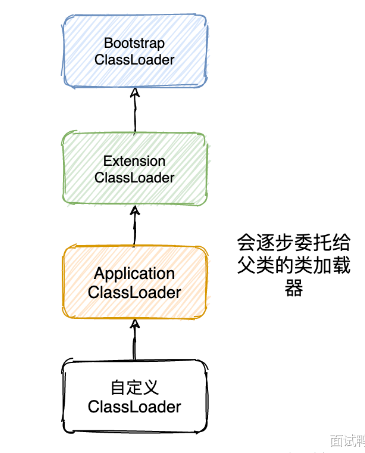


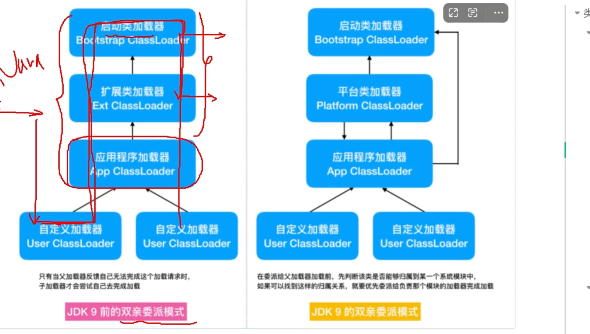

Boot: C++实现，虚拟机一部分

其他的java实现，继承自抽象类java.lang.ClassLoader

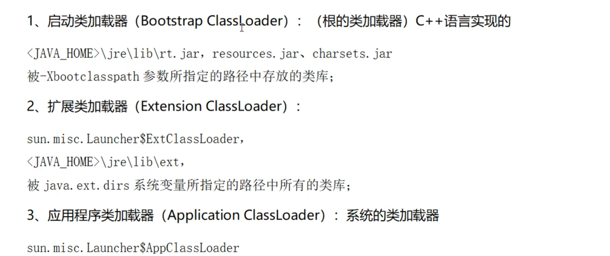


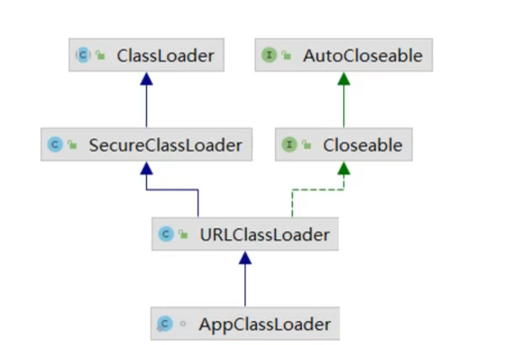

#### 双亲委派

JDK8：

内置：AppClassLoader-->Ext ClassLoader -->Bootstrap ClassLoader

保证类的

唯一性：

安全性：


#### 打破双亲委派机制：

- 自定义加载器，继承ClassLoader,  

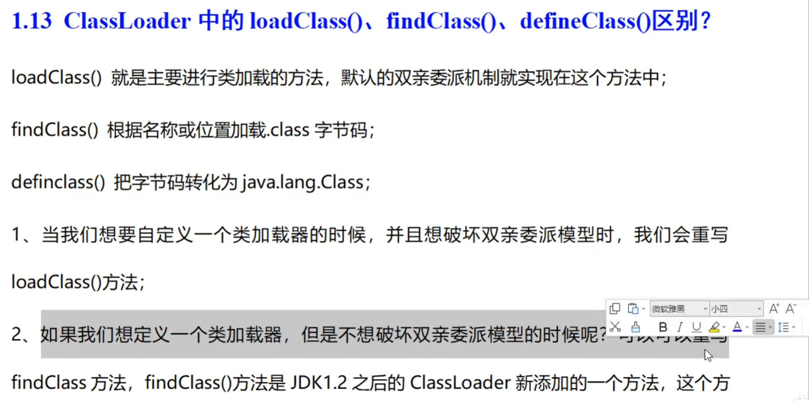

#### 为什么findClass不会打破双亲委派，loadClass就可以

Java类加载器（`ClassLoader`）的默认行为是：

1. **`loadClass` 方法**：
   - 收到类加载请求后，**先委派给父加载器**（递归向上）。
   - 如果父加载器无法完成加载（抛出 `ClassNotFoundException`），才调用自身的 `findClass`。
   - **这是双亲委派的核心实现**。
2. **`findClass` 方法**：
   - 由子类重写，**定义自定义加载逻辑**（如从网络、字节码文件等加载类）。
   - 默认抛出 `ClassNotFoundException`，需子类实现。

#### 加载类Class.forName和ClassLoader区别？

Class.forName（）-----> 会初始化

User.class.getClassLoader().loadClass("");----->不会进行初始化--->访问的时候才会初始化

User user = null  ------>  不会初始化

Class<?> clazz = User.class; // 不触发初始化

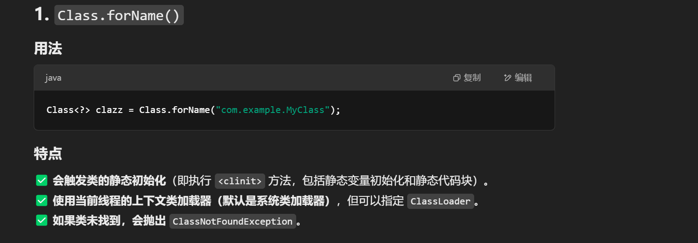

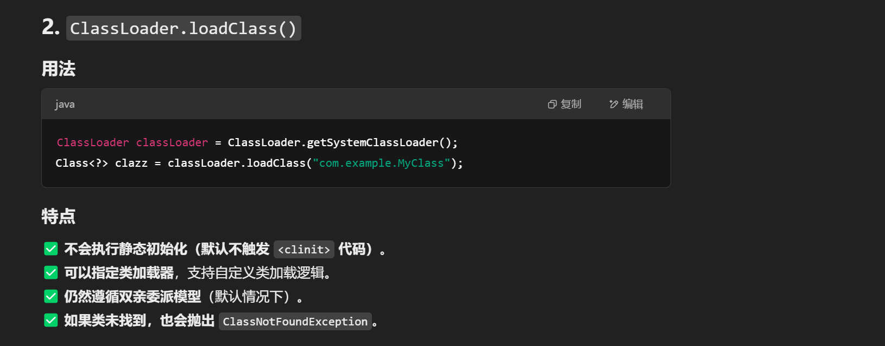

#### Tomacat 类加载器：

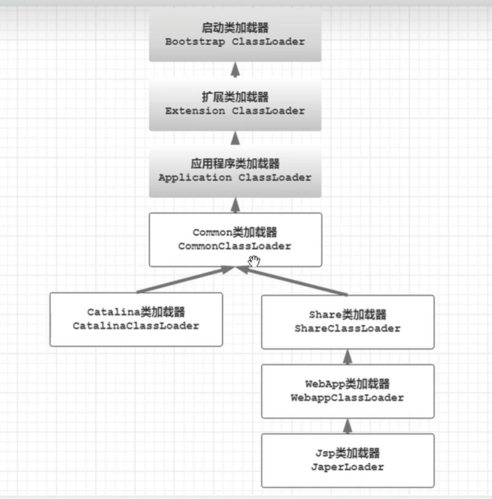

#### Tomacat为什么打破

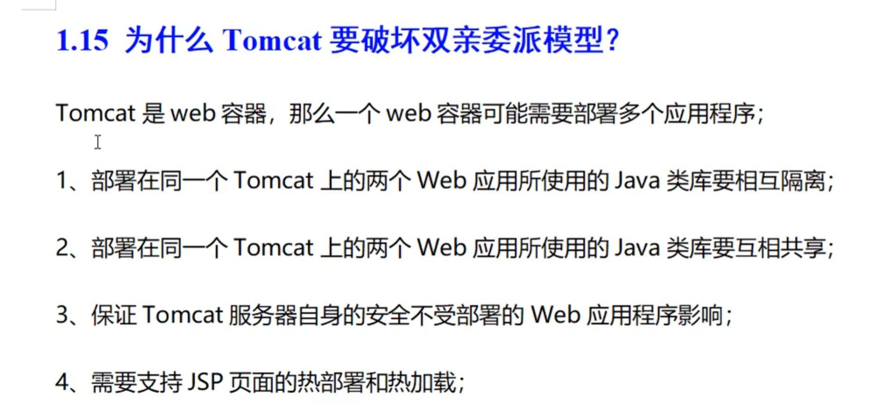


#### 热加载和热部署

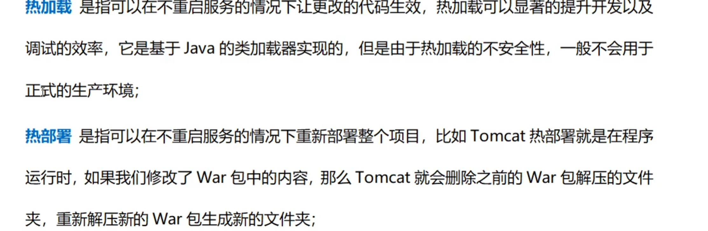

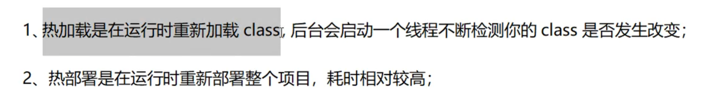

实现热加载：

实时获取重新编译后的class文件。

- 实现类加载器
- 加载要热加载的类
- 不断轮询类是否有更新，有更新重新加载

### 内存JVM

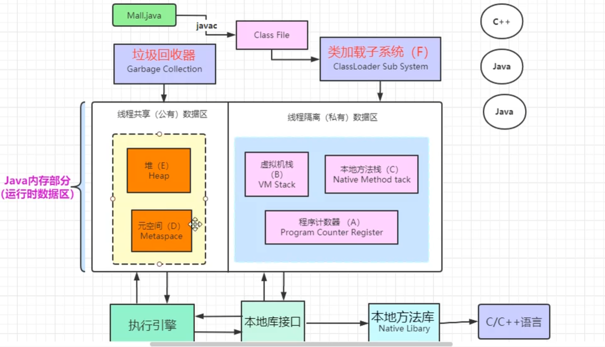

#### 内存划分

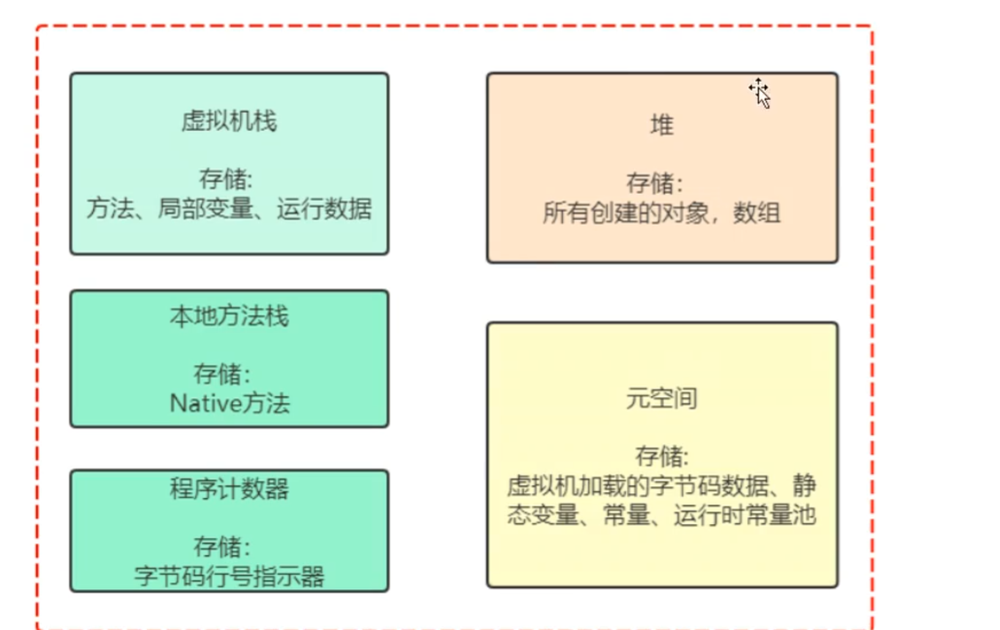

#### 虚拟机栈

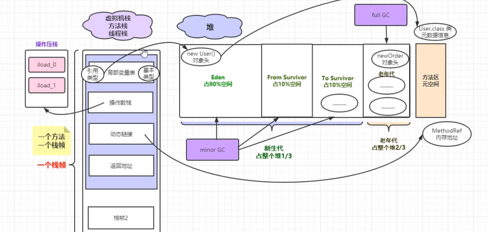

方法执行创建栈帧：栈帧包括局部变量表，操作数栈，动态连接，返回地址

执行方法入栈，完毕出栈

栈深度满了---》stackOverflower-->递归调用

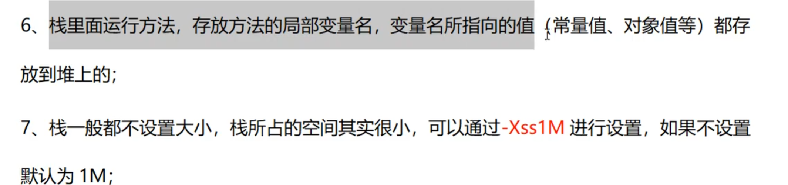

随线程而生而灭

没有GC

#### 本地方法栈

为Native方法提供

随线程而生而灭

没有GC

stackOverflower--》大量创建线程

#### 堆

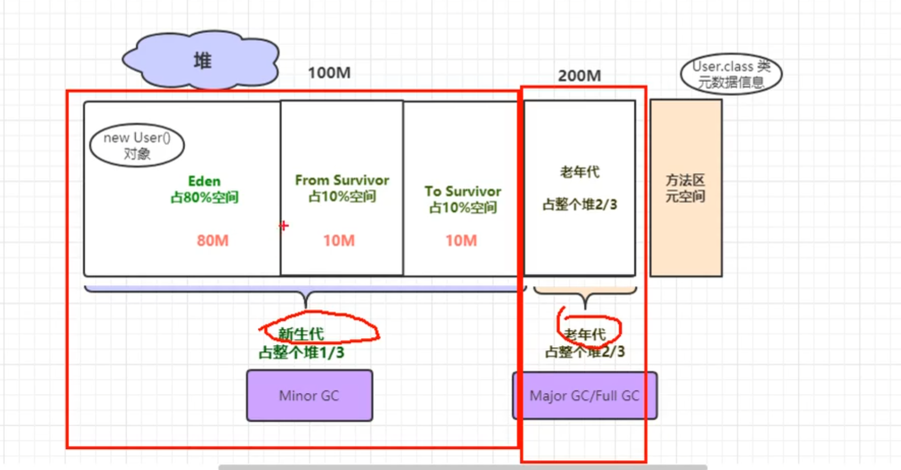

线程共享，最大一块，存放对象数组，虚拟机启动时创建，GC主要区域，分为新生代、老年代=1:2

新生代分为---》Eden\From Survivor(S0)\To Survivor(S1)\=8:1:1

- -Xmx、-Xms调整堆大小
- 堆溢出--》对象太多

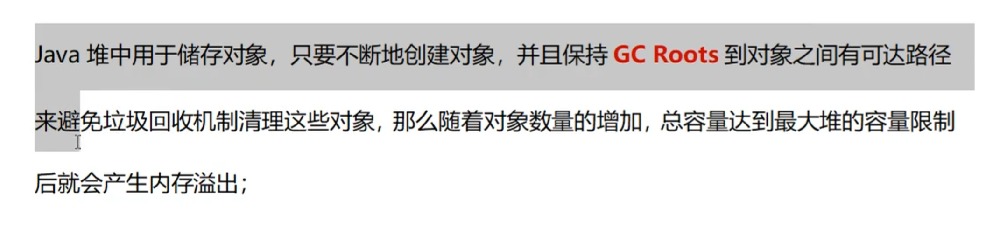

**TLAB** -----> 在堆中分配了每个线程分配私有的区域

### 堆

#### jvm对象如何在堆中分配内存

指针分配：内存规整的情况

空闲列表：内存不规整

本地线程分配缓冲TLAB

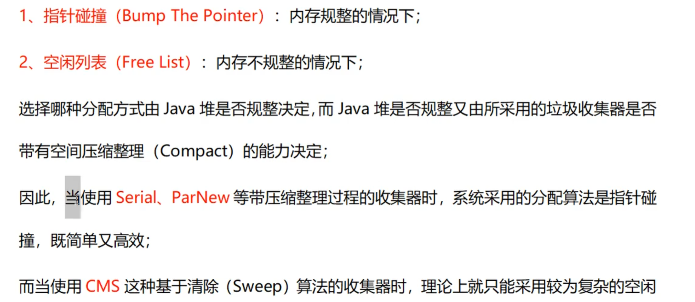


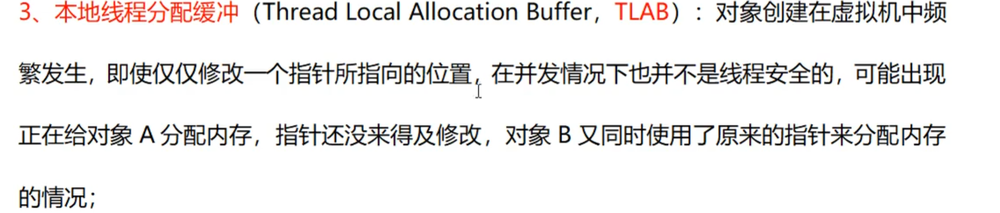

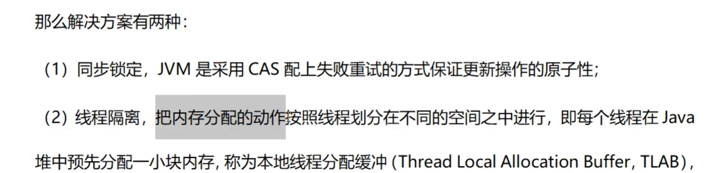


#### 堆中的对象布局

一个对象存储结构3部分：

- 对象头


- 实例数据


- 对齐填充


#### 堆溢出分析

- 工具分析MATxxx.hprof文件，通过配置VM参数, 
- MAT工具：Eclipse下的内存分析工具
- 分析内存占用情况，线程什么的，或者执行链路，还能够看到每个对象的占用大小

```txt
-Xms3072M 设置 JVM 初始堆大小 为 3072MB（3GB
-Xmx3072M 设置 JVM 最大堆大小 为 3072MB（3GB）。
-Xmn3072M 设置 JVM 年轻代（Young Generation）大小 为 3072MB（3GB）。
-Xss1M    设置 每个线程的栈大小 为 1MB。


-XX:+HeapDumpOnoutOfMemoryError  这两个当堆溢出时候，转成快照
-XX:HeapDumpPath=D:/dev/XXX.hprof 分析


```


#### 堆内存分代模型

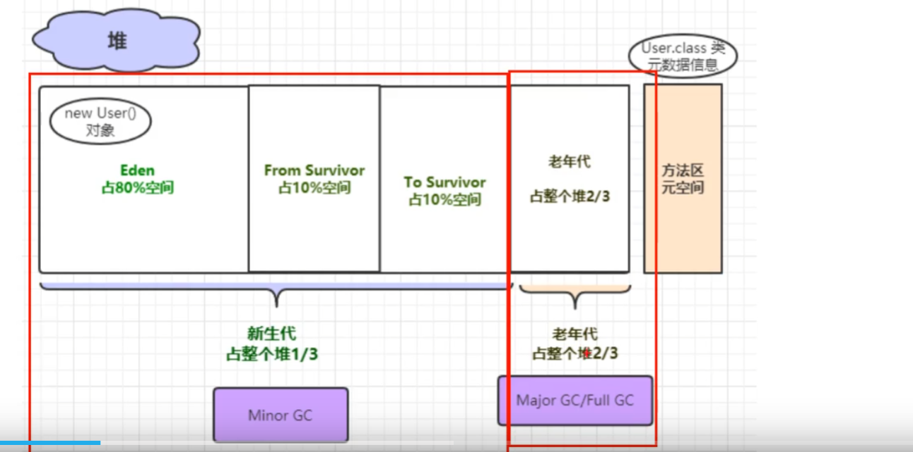

### 堆中的垃圾回收机制

#### 如何判断对象是否可以被回收？


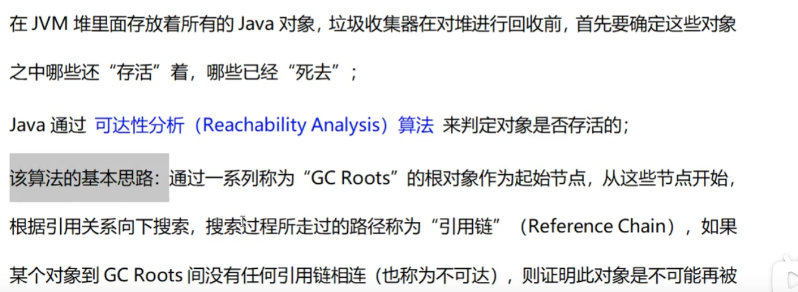


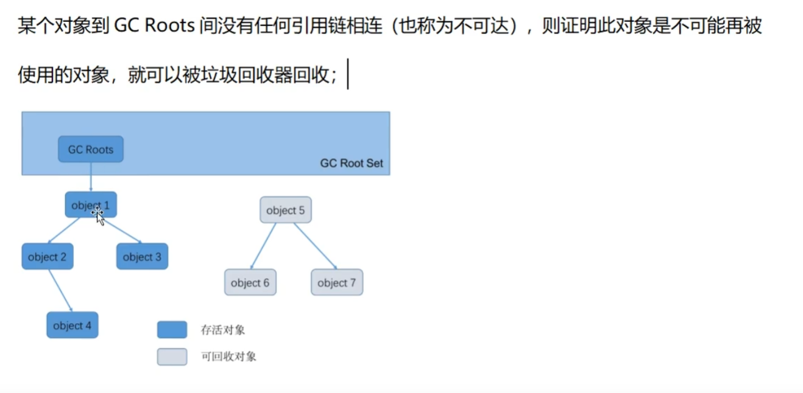

##### GC Root 对象的确定

1.栈上的本地变量（Java 方法栈中的引用）

**所有正在执行的线程**（包括主线程和 GC 线程）的 **栈帧（Stack Frame）** 里的本地变量表中的对象引用，都是 GC Root。

这些变量存储在 **栈上（Stack）**，不会被 GC 回收。

```java
public static void main(String[] args) {
    Object obj = new Object(); // obj 是 GC Root
}
```

**2. 方法区中的静态变量（静态字段）**

- **类的静态变量（static 变量）**，如果引用了对象，那么这个对象不会被 GC 回收。
- 这些变量存储在 **方法区（JDK8 以后是元空间 Metaspace）**。

```java
public class Test {
    private static Object staticObj = new Object(); // staticObj 是 GC Root
}
```

**3. 方法区中的常量引用（常量池引用）**

- **字符串常量池（String Pool）** 中的对象，如果被其他对象引用，也会作为 GC Root

4.JNI（Native 方法）引用的对象

5.活跃的线程

```java
public class Test {
    public static void main(String[] args) {
        Thread thread = new Thread(() -> {
            while (true) {} // 线程存活，thread 是 GC Root
        });
        thread.start();
    }
}
```

6.类加载器（ClassLoader）

7.被同步锁持有的对象

#### 引用类型

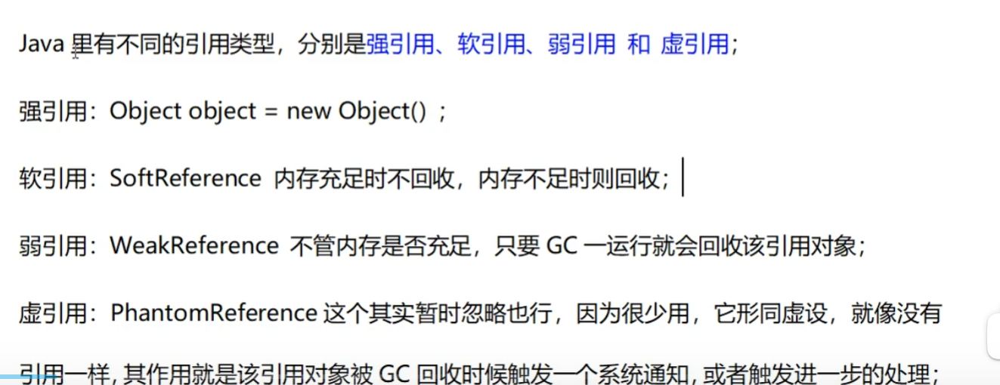


软引用：缓存

弱引用：ThreaLocal


#### 新生代垃圾回收过程

mainor gc:

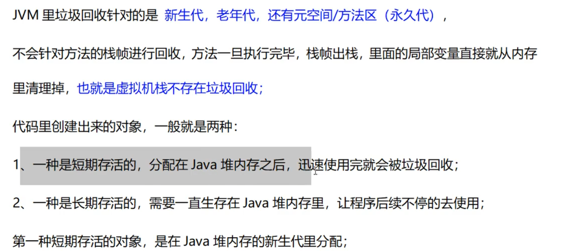

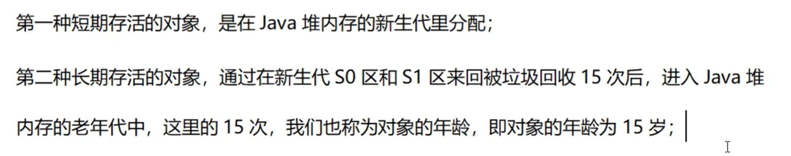

可以设置

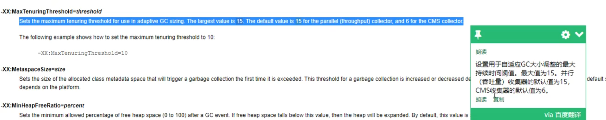


#### 对象动态年龄判断


#### 老年代空间担保机制，JVM怎么避免频繁的FULL GC呢

major gc/full gc

新生代Minor GC之后，剩余存活的对象太多，无法放入S区，此时将这些存货的对象直接转移到老年代去，如果老年代此时也不够怎么办？

- 执行任何以此Minor GC之前，JVM检查老年代可用内存，是否大于新生代所有对象的总和-------->

  1：大于，此时可以放心大胆的对新生代Minor Gc

  2:   小于, 进入下一次判断，判断老年代可用空间是否大于之前 **每一次Minor GC后放入老年代的平均对象的大小**，如果大于-------->

  ​		1: 可以冒险尝试一下Minor GC,可能有风险（Minor GC后剩余对象大于Survivor大小， 也大于 **老年代**的大小，此时触发以此 **Full GC**）

  ​        2: 直接触发Full Gc

- 如果FullGc之后，老年代还是没有足够的空间存放Minor  GC过后剩余存货的对象，OOM

FULL GC耗时操作，要避免频繁的FULL GC


调优：

#### 什么情况对象会进入老年代？

- 15次GC之后
- 动态对象判断
- 老年代空间担保机制
- 大对象直接进入（大量连续内存的JAVA对象）

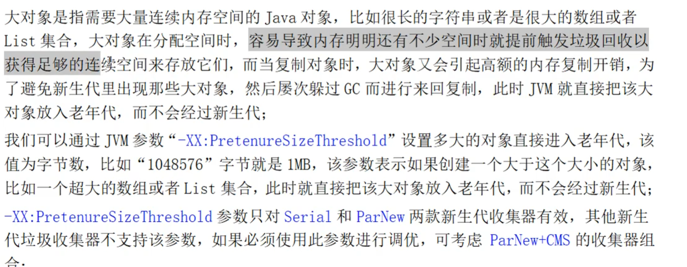


### 方法区，元空间特点

元空间（本地主机的剩余内存）

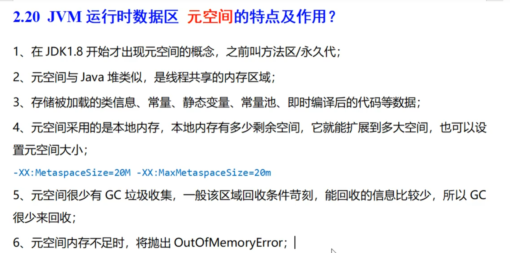


OOM：动态代理，一值生成类

**每个代理类都是一个新的 Class**

CGLIB 每次生成代理类时，都会**动态生成新的 `Class`，并存入方法区**。如果不断创建新代理，方法区就会**堆积大量类信息**，最终导致 OOM。

#### 本地直接内存

主机的内存，通过NIO方式进行分配，可以指定大小，使用NIO，可能发生OOM，看一下本地直接内存大小，JVM默认为设置0，由jvm自己分配，可以自己通过参数设置大小

### 垃圾回收算法相关

#### 为什么分为新生代老年代

- 采用不同的垃圾回收算法
- 年轻代对象，创建之后很快被回收
- 老年代，需要长期存活

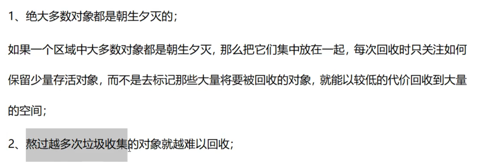

较低的频率回收

Minor Gc又叫做Young Gc:新生代收集

Major Gc又叫做Old Gc:老年代收集

Full GC:整堆手机，收集整个Java堆和元空间/方法区的垃圾收集

Mixed GC:混合收集，收集整个新生代和部分老年代的垃圾收集，目前只有G1收集器会有这种行为。


#### 为什么分S0,S1

没有s区，新生代Minor Gc,就会很快堆满老年代，触发Full GC，耗时

只分为一个S区,s区容易产生内存碎片，不连续，可以用标记-整理算法，但影响性能。

两个s区始终保持一个区连续，在Minor时，直接可以整齐的赋值到另一个区


#### 垃圾回收算法

- 标记-清楚

可达性GCROOT


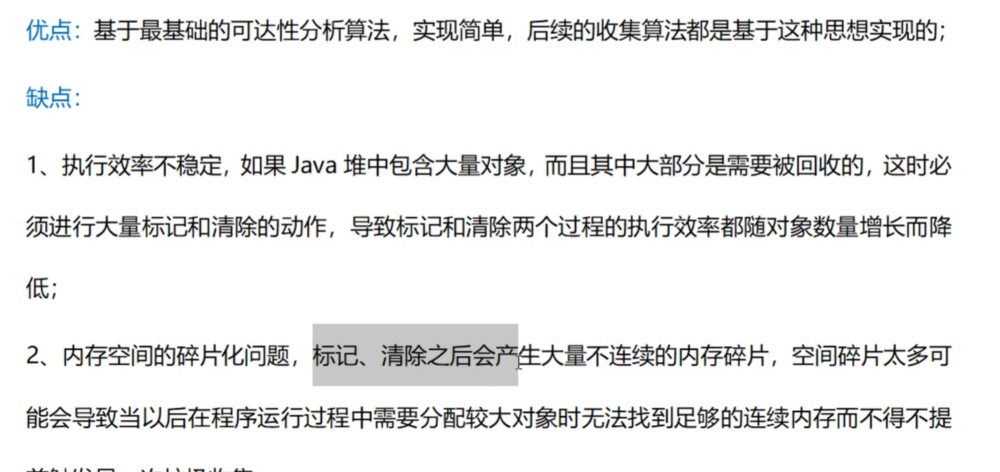

- 标记-复制算法

不适合老年代，适合新生代，新生代存货的很少，复制比较少-->Eden,s0,s1

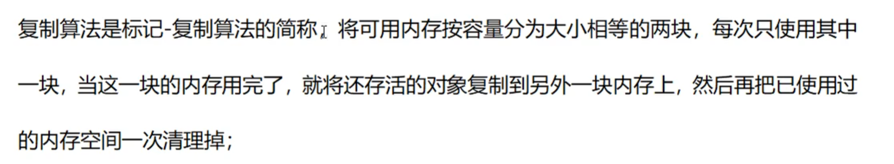

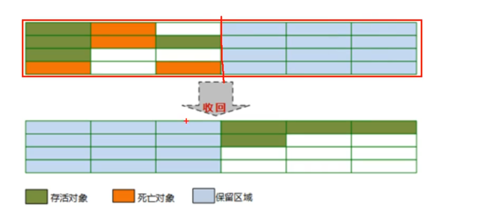

缺点：浪费一般空间

- 标记-整理

标记存活对象，将存货的整理到一边，清楚未标记的对象，

整理需要**移动对象**，导致开销，避免内存碎片

**STW**:


#### CMS

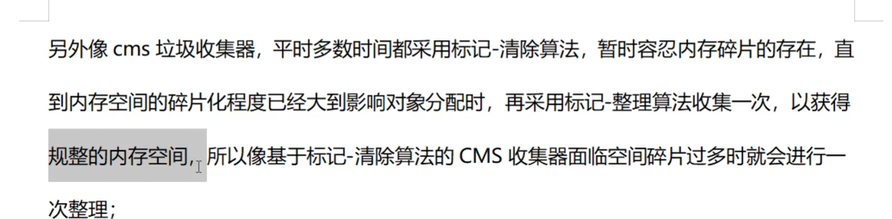


### 其他

#### JVM内存相关的核心参数

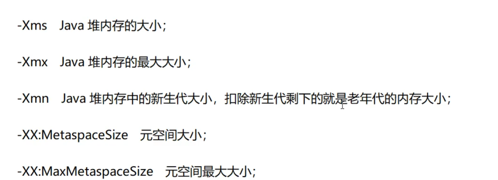


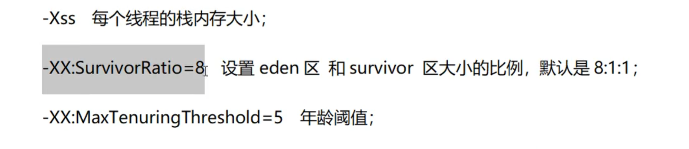

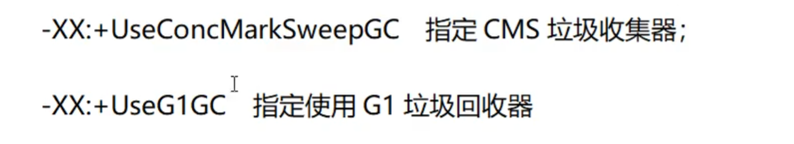

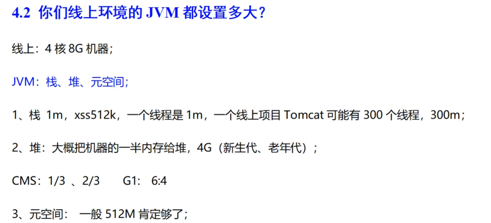

### 垃圾收集器

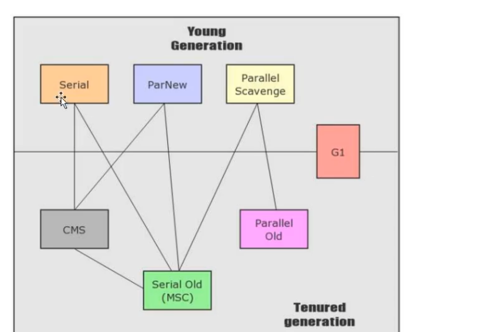


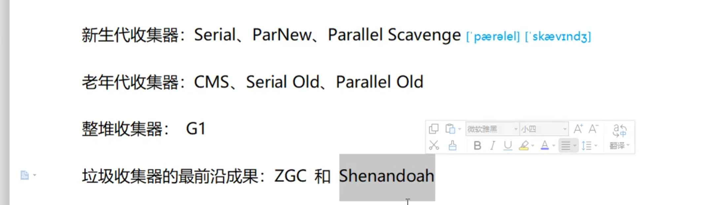


G1：不存在Eden,s1,s0--->分为一个个的region,更精细的控制，可预测的停顿时间，内存碎片的控制，优先级处理， 采用指针碰撞

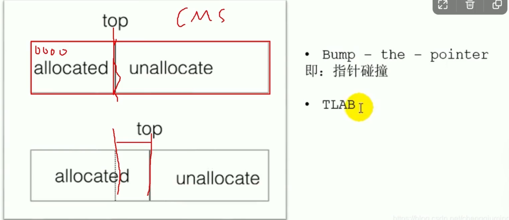

每个region更小，需要更大的堆内存，

### new对象一定会存放在堆中吗

- 逃逸分析
- 没有逃逸的，可能就在栈中
- - 逃逸的好处：
  - 站上分配，对象分配战中，不需要GC，减轻GC压力，
  - 同步消除，没有其他线程引用该对象，说明不会发生线程安全问题这个对象，就可以消除该对象的同步措施
  - 标量替换：如果一个数据类型是基本数据类型，就是标量，对象有int x,int y,这种情况分开存，x,y,以内存碎片存储，充分利用内存

### 三色标记

STW在标记垃圾时，要暂停陈鼓型，使用**并发**标记，程序一边运行，以便标记垃圾，减少stw时间。避免重复扫描对象。

三色标记时异步标记：漏标，多标

标记过程：也是通过GCROOTS

CMS对漏标的增加引用环节进行处理：增量更新

G1：对删除缓解进行SATB（灰色对象删除白色对象时，将白色对象置为灰色，保存旧的引用关系）

### 调优

原则：尽可能不要降低触发FULL GC的频率。

比如一台及其QPS:300, （高峰时期），订单相关业务，一个订单假设1KB,--->300KB----->考虑其他相关业务----->扩大20倍

就是60MB/S, 高峰时期，假设一台4核8G---->JVM分配3G给堆，新生老年各占一半，就是1.5G,--->假设新生代：S=8,s区就是150M,

Eden区就是1.2G=1.2*1024MB = 1500MB----> 大概25秒触发一次Minor GC----->假设存活率10%，存活150MB--->S0可能放不下或者触发动态年龄判断，对象转到老年代-->不需要长期存放对象就进如老年代，所以需要调优。

1.5G*1024MB=1800MB,1800/150=12, 12 * 25 s几分钟就得FULL GC


```txt
一、解决可能得S区不足，或者动态年龄判断
新生代  2G  Eden--->1.6G，S区200MB--->解决可能得S区不足，或者动态年龄判断
老年代  1G
 -Xms3072M 堆初始
 -Xmx3072M 堆最大
 -Xmn2048M 新生代
 -Xss1M  栈
 -XX:MetaSpqceSize=512M 元空间
 -XX:MaxMetaSpaceSize=512M
二、一般系统得@Service，@Controller需要长期存货，应该尽快进入老年代，调整年龄阈值
-XX:MaxTenurningThreshold=5
三、大对象直接进入老年代，可能需要长期存货，比如缓存。根据实际情况
-XX:PretenreSizeTreshold=1M
四、指定合适得垃圾回收期
G1适合大堆得：比如6G,8G
-XX：+UserParNewGc 新生代parNew
-XX:+UserConcMarkSweepGc 老年代CMS
五、
```


### JMM内存模型

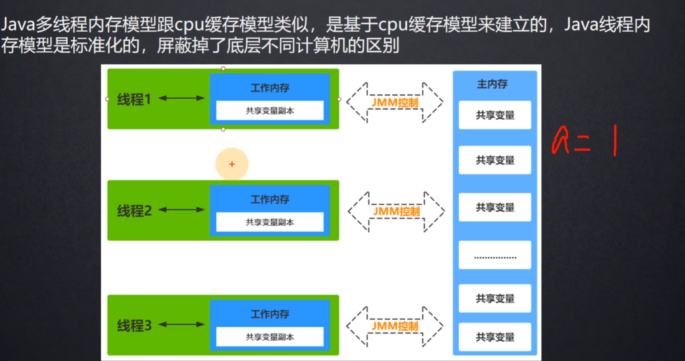

## JUC


### AQS

抽象队列同步器

#### 简介

AQS是一个抽象队列同步器，位于java.util.concurrent.locks中，为同步器实现了一个通用框架，简化了同步器的开发。

- 提供了一个统一的机制管理线程的同步状态
- 提供了一个高校的线程排队和等待机制
- 通过模板方法，允许子类自定义具体的同步逻辑。

同步状态管理使用的一个volatile修饰的int类型变量state。

排队机制，使用的是一个双向链表的先进先出的队列

AQS支持独占ReentrantLock和共享模式(Semphore)：


#### 方法成员变量

- CANCELLED 表示线程的等待状态被取消（通常是因为超时或者被中断），并且不会再参与锁竞争。被标记为 CANCELLED 的节点不会被唤醒，它的前驱和后继节点需要跳过它。

- SIGNAL： 表示当前节点的后继节点需要被唤醒。当一个节点（假设是 A）被阻塞时，A 会检查它的前驱节点 B 是否是 `SIGNAL` 状态：**特征**：`SIGNAL` 状态的节点依赖于前驱节点的唤醒逻辑。

  - 如果是，则意味着当 B 释放锁时，A 需要被唤醒。

  - 如果不是，A 可能需要自己主动挂起或者进行状态调整。

- CONDITION：**表示节点当前在 `Condition` 队列中等待**。`ConditionObject` 机制允许线程调用 `await()` 进入等待状态，并等待 `signal()` 唤醒。只有当 `Condition.signal()` 被调用时，`CONDITION` 状态的节点才会被移动到 **同步队列** 进行锁竞争。

- PROPAGATE ：**表示需要无条件地传播唤醒操作**，通常用于 **共享模式（如 `ReentrantReadWriteLock` 的读锁）**。这个状态会使得释放锁的操作不仅唤醒下一个节点，而且会继续向后传播，确保所有等待线程都能有机会获得锁。多线程同步工具（如 `CountDownLatch`）可能会使用 `PROPAGATE` 进行信号传播。

- nextWaiter：指向同一个 `Condition` 队列中的下一个等待线程。**用于 `ConditionObject`**：当线程调用 `Condition.await()` 进入等待状态时，它会被添加到 **条件队列（condition queue）**，这些等待线程通过 `nextWaiter` 进行链接。当 `Condition.signal()` 被调用时，一个线程会从 `condition queue` 移动到 **同步队列（sync queue）** 继续争夺锁。

```java
public abstract class AbstractQueueSynchronizer{
    static final class Node{ //包装的线程节点

        static final Node SHARED = new Node();
        static final Node EXCELUSIVE = null;
        
        static final int CANCELLED = 1; 
        static final int SIGNAL = -1; 
        static final int CONDITTION = -2;
        static final int PROPAGATE = -3;
		
        volatile int waitStatus; // 上面的值的其中一个。 0初始状态，表示线程没有特殊状态。
        
        volatile Node pre; // 当前节点的前驱 同步阻塞队列
        volatile Node next; // 当前节点的后继 同步阻塞队列
        volatile Thread thread; // 被包装的线程
        Node nextWaiter; // 还有一个waitSet队列，单项队列
    }
    // 同步双向队列
    private transient volatile Node head;
    private transient volatile Node tail;
    // 相当于锁，线程标识状态
    private volatile int state;
    
    // CAS形式状态修改上锁
    protected final boolean compareAndSetState(int expect, int update) {
        return STATE.compareAndSet(this, expect, update);
    }
    
    /**
    AQS 是一个通用的同步框架，但它本身不定义具体的同步逻辑，例如如何加锁、如何释放锁。
	AQS 只提供了一套线程排队和等待的机制，而具体的加锁/释放逻辑由子类实现。
	如果不重写，直接调用这些方法就会抛出异常，提醒开发者必须自己实现逻辑。
    
    **/
    // 尝试以独占模式（Exclusive Mode）获取同步状态
    protected boolean tryAcquire(int arg) {
        throw new UnsupportedOperationException();
    }
    // 尝试释放独占模式的同步状态。
    protected boolean tryRelease(int arg) {
        throw new UnsupportedOperationException();
    }
    // 尝试以共享模式（Shared Mode）获取同步状态。
    protected int tryAcquireShared(int arg) {
        throw new UnsupportedOperationException();
    }
    // 尝试释放共享模式的同步状态。
     protected boolean tryReleaseShared(int arg) {
        throw new UnsupportedOperationException();
    }
    // 判断当前锁是否被当前线程独占。
    protected boolean isHeldExclusively() {
        throw new UnsupportedOperationException();
    }
}
```


#### ReentrantLock

```java
public class ReentrantLock implements Lock{
    Sync synx; // 
    abstract static class Sync extends AbstractQueuedSynchronizer{
        // 重写了5个方法
    }
}
```


##### lock()

```java
// ReentrantLock中
public void lock() {
    sync.acquire(1); // AQS本身已经实现了acquire
}
// tryAcquire实现了公平和非公平

		protected final boolean tryAcquire(int acquires) {
            final Thread current = Thread.currentThread();
            int c = getState();
            if (c == 0) {
                /**
                hasQueuedPredecessors遍历同步队列  
                该线程没有前驱节点并且CAS修改为1acquires，获得锁，就会设置当前线程
                exclusiveOwnerThread=current 返回锁，获取成功
                **/
                if (!hasQueuedPredecessors() &&
                    compareAndSetState(0, acquires)) {
                    setExclusiveOwnerThread(current);
                    return true;
                }
            }
            else if (current == getExclusiveOwnerThread()) { // 可重入锁
                int nextc = c + acquires; // 重入次数加1
                if (nextc < 0)
                    throw new Error("Maximum lock count exceeded");
                setState(nextc); // 已经获取锁就用CAS
                return true;
            }
            return false;
        }

```


```java
public final boolean hasQueuedPredecessors() {
        Node h, s;
        if ((h = head) != null) {
            if ((s = h.next) == null || s.waitStatus > 0) {
                s = null; // traverse in case of concurrent cancellation
                for (Node p = tail; p != h && p != null; p = p.prev) {
                    if (p.waitStatus <= 0)
                        s = p;
                }
            }
            if (s != null && s.thread != Thread.currentThread())
                return true;
        }
        return false;
    }


// AQS中 tryAcquire在ReentrantLock实现逻辑
	static void selfInterrupt() {
        Thread.currentThread().interrupt();
    }
public final void acquire(int arg) {
    /**
    获取锁成功退出
    获取锁失败将当前先线程封装为node放入到同步队列尾巴上（自旋），返回这个结点node
    acquireQueued(node, arg))
    
    调用 tryAcquire 尝试获取锁，如果成功则直接返回。
	如果 tryAcquire 失败，则调用 addWaiter 将当前线程加入等待队列，并调用 acquireQueued 进行排队等待。如果在等待过程中被中断，则调用 selfInterrupt 恢复中断状态。
    **/
    if (!tryAcquire(arg) &&
        acquireQueued(addWaiter(Node.EXCLUSIVE), arg))
        selfInterrupt();
}

// =================================================================================================

	private Node addWaiter(Node mode) {
        Node node = new Node(mode); // mode当前线程是什么时候被封装的呢？
        for (;;) {
            Node oldTail = tail; // 保存为此时状态的尾节点，多线程Tail可能后面就不一样了，循环去更新oldTail
            if (oldTail != null) {
                node.setPrevRelaxed(oldTail); // node前驱指向尾巴节点
                if (compareAndSetTail(oldTail, node)) { // cas，Node放到尾节点，成功
                    oldTail.next = node; // 之前的尾巴节点指向node，双向
                    return node;
                }
            } else {
                initializeSyncQueue(); // 为节点为空，就初始化
            }
        }
    }
// mode当前线程是什么时候被封装的呢？
	Node(Node nextWaiter) {
            this.nextWaiter = nextWaiter;
            THREAD.set(this, Thread.currentThread());// 这里被封装
        }
	private final void initializeSyncQueue() {
        Node h;
        if (HEAD.compareAndSet(this, null, (h = new Node())))// new一个空结点。head设置为它，初始为null,如果其他的已经设置了就略过
            tail = h;
    }
// ========================================================================================================================

	final boolean acquireQueued(final Node node, int arg) {  
    /**
    
    初始化一个标志位 interrupted，用于记录当前线程是否被中断。
    进入无限循环，检查当前节点的前驱节点是否为头节点，并尝试获取锁。
    如果成功获取锁，则将当前节点设置为新的头节点，并返回是否被中断的状态。
    如果获取锁失败，则判断是否需要阻塞当前线程，如果需要则阻塞并更新中断状态。
    捕获异常并处理，取消获取锁的操作。
    
   	目的：阻塞当前线程，但需要把前面的设置为SINGAL，才能放心的去阻塞。
    **/
    
    /**
    flowchart TD
    A[开始] --> B{前驱是头节点？}
    B -->|Yes| C{尝试获取锁}
    C -->|成功| D[设置当前节点为头节点]
    D --> E[返回是否被中断]
    B -->|No| F{是否需要阻塞？}
    F -->|Yes| G[阻塞并检查中断]
    G --> H[更新中断状态]
    H --> B
    F -->|No| B
    A --> I{捕获异常}
    I --> J[取消获取锁]
    J --> K{如果被中断，中断自身}
    K --> L[抛出异常] 
    **/  
        boolean interrupted = false; // 目前不可倍中断
        try {
            for (;;) {
                final Node p = node.predecessor();
                if (p == head && tryAcquire(arg)) {
                    setHead(node);
                    p.next = null; // help GC
                    return interrupted;
                }
                if (shouldParkAfterFailedAcquire(p, node))
                    interrupted |= parkAndCheckInterrupt();
            }
        } catch (Throwable t) {
            cancelAcquire(node);
            if (interrupted)
                selfInterrupt();
            throw t;
        }
    }

	private void setHead(Node node) { // 
        head = node;
        node.thread = null;
        node.prev = null;
    }

    // 在p == head && tryAcquire(arg)后是否应该park
	private static boolean shouldParkAfterFailedAcquire(Node pred, Node node) {
        /**
        获取前驱节点的状态。
        如果前驱节点状态为 SIGNAL，返回 true，表示当前节点可以安全地阻塞。
        如果前驱节点状态为取消状态（大于0），则跳过所有已取消的前驱节点，并重新连接链表。
        否则，将前驱节点状态设置为 SIGNAL，但不立即阻塞，返回 false
        **/
        
        // pred可能就是头节点或者有线程包装的结点
        int ws = pred.waitStatus;
        if (ws == Node.SIGNAL)
            /*
             * This node has already set status asking a release
             * to signal it, so it can safely park.
             */
            return true;
        if (ws > 0) {
            /*
             * Predecessor was cancelled. Skip over predecessors and
             * indicate retry.
             */
            do {
                // 会存在内存泄漏吗a<=>b<=>c<=>d
                // a<===>d
                // a<-b<=>c->d
                // ????????
                node.prev = pred = pred.prev;
            } while (pred.waitStatus > 0);
            pred.next = node;
        } else {
            /*
             * waitStatus must be 0 or PROPAGATE.  Indicate that we
             * need a signal, but don't park yet.  Caller will need to
             * retry to make sure it cannot acquire before parking.
             */
            pred.compareAndSetWaitStatus(ws, Node.SIGNAL); // 设置为SIGNAL,表示唤醒下一个结点
        }
        return false;
    }
   
	private final boolean parkAndCheckInterrupt() {
        /**
        1. LockSupport.park(this);
        LockSupport.park(Object blocker) 让当前线程挂起（阻塞），直到被其他线程显式唤醒。
        this 参数（即当前对象）用于调试信息，可以帮助追踪哪个对象导致线程被挂起。
        线程在 park() 后会进入等待状态，直到满足以下任一条件：
        	其他线程调用 LockSupport.unpark(targetThread) 释放它。
        	线程被中断（即 Thread.interrupt()）。
        	可能由于虚假唤醒（Spurious Wakeup） 自动返回。
        2. return Thread.interrupted();
        Thread.interrupted() 用于检查并清除当前线程的中断标志：
        	如果线程在 park() 期间被中断，该方法返回 true，表示线程曾被中断过。
        	同时，这个方法会清除当前线程的中断标志（interrupt status）。
        	如果没有中断，返回 false。
        **/
        LockSupport.park(this);
        return Thread.interrupted();
    }
```


##### unlock()

```java
// ReentrantLock中
public void unlock() {
    sync.release(1);
}
// ===========================================================================
protected final boolean tryRelease(int releases) {
            int c = getState() - releases;
    		/** 解锁一定是先lock在unlock， lock成功后会setExclusiveOwnerThread
    		    判断这两个是否相等
    		**/
            if (Thread.currentThread() != getExclusiveOwnerThread()) 
                throw new IllegalMonitorStateException();
            boolean free = false;
            if (c == 0) {
                free = true;
                setExclusiveOwnerThread(null);
            }
            setState(c);
            return free;
        }		

```


```java
// AQS中

public final boolean release(int arg) {
    if (tryRelease(arg)) {
        Node h = head;
        if (h != null && h.waitStatus != 0)
            // 头节点为空，就没有，检查头节点是否Signal,不是就没必要唤醒后面的
            unparkSuccessor(h);
        return true;
    }
    return false;
}


private void unparkSuccessor(Node node) {
        /*
         * If status is negative (i.e., possibly needing signal) try
         * to clear in anticipation of signalling.  It is OK if this
         * fails or if status is changed by waiting thread.
         */
        int ws = node.waitStatus;
        if (ws < 0)
            node.compareAndSetWaitStatus(ws, 0);

        /*
         * Thread to unpark is held in successor, which is normally
         * just the next node.  But if cancelled or apparently null,
         * traverse backwards from tail to find the actual
         * non-cancelled successor.
         */
        Node s = node.next;
    // ReenLock中不会出现下述情况
        if (s == null || s.waitStatus > 0) {
            s = null;
            for (Node p = tail; p != node && p != null; p = p.prev)
                if (p.waitStatus <= 0)
                    s = p;
        }
    
    
        if (s != null)
            LockSupport.unpark(s.thread);
    }
```


##### 手动实现一个

不支持可重入

```java
package zy.sats.java.juc;

import java.lang.ref.Reference;
import java.util.concurrent.atomic.AtomicBoolean;
import java.util.concurrent.atomic.AtomicReference;
import java.util.concurrent.locks.LockSupport;

/**
 * @Description: TODO
 * @Author: sats@jz
 * @Date: 2025/2/17 14:54
 **/
public class AQSLinkedLock  implements MyLock{
    private final boolean fair;
    private final AtomicBoolean lock = new AtomicBoolean(false);
    private final AtomicReference<Node> head = new AtomicReference<>(new Node());
    private final AtomicReference<Node> tail = new AtomicReference<>(head.get());
    private Thread owner = null;

    class Node{
        Node pre;
        Node next;
        Thread thread;
        public Node(Thread thread) {
            this.thread = thread;
        }
        public Node() {
        }
    }
    public AQSLinkedLock(Boolean fair) {
        this.fair = fair;
    }
    @Override
    public void lock() {
        //  非公平 先尝试直接拿锁， 拿不到就将线程包装为节点加入到链表尾部
        if(!fair && lock.compareAndSet(false,true)){
            System.out.println(Thread.currentThread().getName()+" get lock");
            owner = Thread.currentThread();
            return;
        }
        // 获取当前线程，包装为Node节点
        Node current = new Node(Thread.currentThread());
        //  尝试将当前的节点放到链表尾部， 链表尾部进行CAS替换直到成功。
        //  将原来的链表尾部节点的next指向当前节点， 当前节点的前驱指向头信息。
        while(true){
            //  每次重新获取链表尾部的引用，因为多线程情况下可能会变化
            Node currentTail = tail.get();
            if(tail.compareAndSet(currentTail, current)){
                current.pre = currentTail;
                currentTail.next = current;
                System.out.println(Thread.currentThread().getName()+"加入链表尾部");
                break;
            }
        }
//        加入之后， 就LockSupport.park()， 但是需要注意，唤醒是个什么逻辑
        //  唤醒之后， 判断当前的线程的前驱是否是head节点，只有这样才是下一个释放，逻辑正确。
        //  并且要获取锁成功  才能释放。
        while(true){

            // condition
            // head -> A -> B -> C -> D
            if(current.pre == head.get() && lock.compareAndSet(false,true)){
                //  获取锁成功后，设置头节点的指向为当前线程
                owner = Thread.currentThread();
                Node old = head.get();
                head.set(current);
                old.next = null;
                current.pre = null;
                System.out.println(Thread.currentThread().getName()+"获得锁");
                return;
            }
            LockSupport.park(); // 先判断一次逻辑在阻塞， 保证一次自己唤醒自己的操作
        }
    }

    @Override
    public void unlock() {
        if(Thread.currentThread() != owner){
            throw new RuntimeException("not owner");
        }


//        Node headNode = head.get();
        owner = null;
        lock.set(false);
        Node next = head.get().next;

        // -----
        if(next != null){
            System.out.println(Thread.currentThread().getName()+"唤醒下一个线程"+next.thread.getName());
            LockSupport.unpark(next.thread);
        }


    }
}
```


### 锁

#### 乐观锁

CAS:比较并替换，比较当前值V和预期值S是否一样，一样就修改V为R.不一样说明被其他线程修改了。

#### CAS

三个操作数：内存位置，预期数值，新值

比较并交换，问题

- ABA问题：状态无感知，版本号， automi包就是这样
- 自旋时间过长，（循环，cpu占有，性能影响）
- 范围不能灵活控制，不能针对多个变量进行CAS


#### 非公平锁

维护一个队列，当一个线程对临界资源使用完毕后释放锁后，会判断当前是否由新的线程请求锁，没有就加入队列，从队首取出一个任务来，有新的线程请求，就会插队，，主要是因为队列中的线程状态被修改，新的线程状态没被修改直接去拿锁，效率最高。但是容易发生线程饥饿，队列中的先后曾可能长时间那不到锁。Snynoized是非公平锁，Reentrantlock看可以通过构造函数去指定公平和还是非公平。


吞吐量更大

#### 自旋锁

线程持有锁时间长，自旋消耗cpu

#### 可重入锁

#### 共享锁

可以多线程可以获取读锁，，以共享的方式持有锁，ReentrrantReadWriteLock

#### 重量级锁

依赖操作系统的锁

Synchronized:通过monitor监视器，，他依赖操作系统Mutex Lock，操作系统需要从用户态切换到内核太，，成本高

#### 轻量级锁

#### 偏向锁

#### 分段锁

jdk1.7 concurrentHashMap:就是分段锁

hashcode->在那个segment->锁对应的segment

#### 锁粗化

将多个锁，看情况合并为一个范围为内的锁。

#### 锁消除

消除不必要的同步操作，从而提高程序性能。锁消除的核心依据是**逃逸分析**

**逃逸分析**是JVM在编译时分析对象的作用域的一种技术。它判断一个对象是否会“逃逸”出当前线程或方法。

具体来说，逃逸分析会检查以下两种情况：

- **方法逃逸**：对象是否会被其他方法访问。
- **线程逃逸**：对象是否会被其他线程访问。

锁消除是基于逃逸分析的一种优化技术。如果JVM发现某个锁对象不会逃逸出当前线程，那么它会认为这个锁是线程安全的，从而**消除锁的开销**。

```java
public void method() {
    Object lock = new Object(); // 锁对象
    synchronized (lock) {       // 同步块
        System.out.println("Hello, World!");
    }
}


// 等效
public void method() {
    System.out.println("Hello, World!");
}
```

- `lock` 是一个局部变量，只在 `method()` 方法中使用。
- 通过逃逸分析，JVM发现 `lock` 对象不会逃逸出当前线程（即不会被其他线程访问）。
- 因此，JVM会认为这个同步块是多余的，直接消除锁操作

#####  **总结**

- **逃逸分析** 是JVM判断对象作用域的技术。
- **锁消除** 是基于逃逸分析的优化，用于消除不必要的同步操作。
- 锁消除可以显著提高性能，尤其是在高并发场景下。
- 锁消除是JVM自动完成的，开发者无需手动干预，但了解其原理有助于编写高效的代码

#### Synchronized

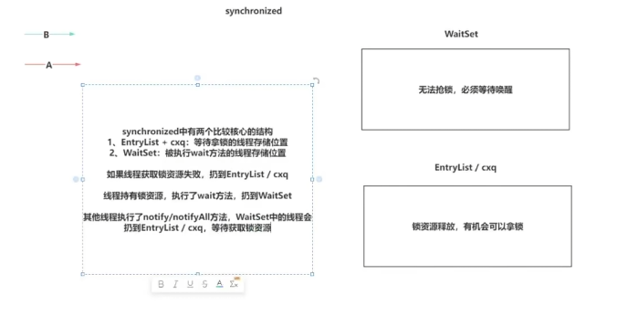

##### 1. **Synchronized 的用法**

- 修饰实例方法，锁的是当前方法，同一实例的多个线程调用该方法会互斥

- 修饰静态方法，锁的是类对象，所有线程调用该静态方法，会互斥
- 修饰代码块，锁对象是可以是任意对象

##### 2. 原理

`Synchronized` 的实现依赖于 JVM 的 **监视器锁（Monitor）** 机制。每个 Java 对象都有一个与之关联的监视器锁（也称为内置锁或互斥锁）

##### 3. **Synchronized 的特性**

- **互斥性**：同一时刻只有一个线程可以持有锁。
- **可见性**：线程释放锁时，会将共享变量的修改刷新到主内存；线程获取锁时，会从主内存中读取共享变量的最新值。
- **可重入性**：同一个线程可以多次获取同一把锁（避免死锁）。

##### 4. **Synchronized 的优化**

1.6引入了 **锁升级** 机制，以减少锁的开销。锁的状态分为以下几种：

- **无锁状态**
- 如果一个线程获得了锁，JVM 会将锁标记为**偏向锁**。适用于只有一个线程访问同步代码情景
- 当多个线程竞争锁时，偏向锁会升级为轻量级锁。轻量级锁通过 CAS（Compare-And-Swap）操作实现。
- 当竞争激烈时，轻量级锁会升级为重量级锁。重量级锁会导致线程阻塞，进入等待队列。

#### **重量级锁的触发条件**

重量级锁的触发通常与 **锁竞争** 的强度有关。以下是一些具体的条件：

1. **多个线程同时竞争同一把锁**：
   - 当多个线程尝试获取同一把锁时，轻量级锁的 CAS 操作可能会失败多次。
   - 如果 CAS 操作失败次数超过一定阈值（JVM 内部实现决定），JVM 会将锁升级为重量级锁。
2. **长时间持有锁**：
   - 如果某个线程长时间持有锁，其他线程在尝试获取锁时会频繁失败。
   - 这种情况下，JVM 会认为锁竞争激烈，从而将锁升级为重量级锁。
3. **等待队列中有多个线程**：
   - 当多个线程因为获取不到锁而进入阻塞状态时，JVM 会将这些线程放入等待队列。
   - 为了减少线程频繁唤醒和阻塞的开销，JVM 会将锁升级为重量级锁。

#### Lock和Synchronized区别

自动挡和手动挡区别

###### (1) **实现方式**

- **Synchronized**：
  - 是 Java 的关键字，由 JVM 直接支持。
  - 锁的获取和释放是隐式的，进入同步代码块时自动加锁，退出时自动释放锁。
  - 锁的实现基于监视器锁（Monitor），每个对象都有一个内置锁。
- **Lock**：
  - 是 `java.util.concurrent.locks` 包下的接口，常用实现类是 `ReentrantLock`。
  - 锁的获取和释放需要显式调用 `lock()` 和 `unlock()` 方法。
  - 锁的实现基于 `AQS`（AbstractQueuedSynchronizer），提供了更灵活的锁机制。

------

###### (2) **功能对比**

- **可中断性**：
  - `Synchronized` 不支持中断，线程在等待锁时会一直阻塞。
  - `Lock` 支持中断，线程在等待锁时可以通过 `lockInterruptibly()` 响应中断。
- **尝试获取锁**：
  - `Synchronized` 不支持尝试获取锁，线程要么获取锁，要么阻塞。
  - `Lock` 支持尝试获取锁（`tryLock()`），可以设置超时时间或立即返回获取结果。
- **公平锁**：
  - `Synchronized` 是非公平锁，不保证线程获取锁的顺序。
  - `Lock` 可以设置为公平锁（`new ReentrantLock(true)`），保证线程按顺序获取锁。
- **条件变量**：
  - `Synchronized` 通过 `wait()` 和 `notify()` 实现线程间的协作。
  - `Lock` 通过 `Condition` 实现更灵活的线程协作，支持多个条件队列。
- **可重入性**：
  - 两者都支持可重入性，即同一个线程可以多次获取同一把锁。

###### （3）性能

- **Synchronized**：
  - 在 JDK 1.6 之前性能较差，因为锁的实现是基于操作系统的互斥量。
  - 在 JDK 1.6 之后，JVM 对 `Synchronized` 进行了优化（如锁升级机制），性能有所提升。
  - 适用于简单的同步场景。
- **Lock**：
  - 性能优于 `Synchronized`，尤其是在高并发场景下。
  - 提供了更灵活的锁机制，适用于复杂的同步场景。


#### ReentrantLock和Synchronized区别

**相同点**：

都可以解决共享变量安全访问的问题

都是可重入锁

保证了线程安全的两大特性，原子性，可见性

**不同的**：

ReentrantLock需要手动的lock,unLock,；Synchronized隐式的释放获取

ReentrantLock可响应中断，增加了灵活性，Synchronized不可以

ReentrantLock是API界别，实现lock接口，Synchronized是jvm级别的

ReentrantLock可以实现公平和非公平，Synchronized非公平

#### 独占锁

只能有一个线程获取到锁，Sy、ReentrantLock


### 阻塞和非阻塞队列并发安全原理

#####  ArrayBlockingQueue:

```java
final ReentrantLock lock;

    /** Condition for waiting takes */
private final Condition notEmpty;

    /** Condition for waiting puts */
private final Condition notFull;
```

```java
public void put(E e) throws InterruptedException {
        Objects.requireNonNull(e);
        final ReentrantLock lock = this.lock;
        lock.lockInterruptibly();
        try {
            while (count == items.length)
                notFull.await();
            enqueue(e);
        } finally {
            lock.unlock();
        }
    }

public E take() throws InterruptedException {
        final ReentrantLock lock = this.lock;
        lock.lockInterruptibly();
        try {
            while (count == 0)
                notEmpty.await();
            return dequeue();
        } finally {
            lock.unlock();
        }
    }
```


- 如果读线程要获取元素，如果队列个数count为0，就会调用notEmpty.await中去等待排队，等待写线程写入元素，Enqueue会调用notEmpty.signal();唤醒前面的等待
- 如果写线程要写元素，如果队列满了，就会到notFull.await等待，等待读线程读取元素，Dequeue中取出元素会，notFull.signal()唤醒

### Volatile

- 有序性：  

  **指令重排（Instruction Reordering）** 是 Java **JVM** 和 **CPU** 为了提高程序运行效率而进行的一种优化策略，目的是 **充分利用 CPU 的并行执行能力**。指令重排能 **最大化利用 CPU 资源**，避免因数据依赖导致的 CPU 空闲

  j**ava 内存模型（JMM）允许指令重排序**，即代码的执行顺序 **可能不同于代码的书写顺序**，但仍然能保证单线程内的正确性。

  遵循as-if-seria语义：不管怎么排序，单线程执行结果不能被改变

  Happens-before原则：

  - 传递性，A优先B,B优先C,那么A一定优先C
  - volatile变量的写一定先于读

- 可见性 当一个变量被声明为 `volatile`，它有以下两个保证：

volatile，底层通过汇编对其加入了Lock 前缀指令，会锁定这块内存区域的缓存。

1. **线程对 `volatile` 变量的修改，会立即刷新到主存**。(基于总线嗅探机制)
2. **其他线程读取 `volatile` 变量时，会直接从主存获取最新值，而不是从 CPU 缓存读取**。


#### DCL中加入Volatile

##### 一个对象New的整个过程

- 分配内存
- 初始化对象
- 赋值

    public class Singleton {
        private static Singleton instance;
        public static Singleton getInstance() {
            if (instance == null) {  // 第一次检查
                synchronized (Singleton.class) {
                    if (instance == null) {  // 第二次检查
                        instance = new Singleton(); 
                    }
                }
            }
            return instance;
    }
}

**问题：指令重排序可能导致线程获取未完全初始化的对象**（半初始化）

- `instance = new Singleton();` 这行代码实际上可以被拆解成 **三步**：
  1. **分配内存**：为 `Singleton` 分配内存空间。
  2. **初始化对象**：调用 `Singleton` 构造方法。
  3. **赋值给 `instance`**：让 `instance` 指向分配的内存空间。
- 由于 **CPU 可能进行指令重排序**，上述三步可能会被执行为：
  1. **分配内存**。
  2. **赋值给 `instance`**（但此时对象还未初始化）。
  3. **初始化对象**。
- **问题出现的情况：**
  1. 线程 A 进入同步代码块，开始初始化 `instance`。
  2. 由于指令重排序，线程 A **提前执行了 `instance = new Singleton();`**，但对象还未初始化完。
  3. 线程 B 进入 `getInstance()` 方法，看到 `instance` 已不为 `null`，直接返回它。
  4. **线程 B 访问一个“未初始化完全的对象”，导致程序异常！**

## ThreadLocal

### 内存泄漏

内存模型：Stack中ThreadLocalRef->堆中的ThreadLocal, Heap中的Map的Key弱引用指向堆中的ThreadLocal

每一个线程都维护了一个ThreadLocalMap映射表，`ThreadLocalMap` 的键是 `ThreadLocal` 对象，值是该线程的变量副本。。ThreadLocal本身不会存储值，而是作为一个Key,让线程从Map中根据这个Key来获取Value值。而Map中key是Threadlocal对象，Threadlocal对象被设计为 弱引用关系，一旦发生GC,由于没有强引用指向Threadlocal对象，会被回收，但是，`ThreadLocalMap` 的值（即线程本地变量）仍然是强引用，不会被回收。

- 如果线程是线程池中的线程，它的生命周期可能非常长（甚至与应用程序的生命周期相同）。
- 当 `ThreadLocal` 对象被回收后，`ThreadLocalMap` 中对应的键（弱引用）会被清除，但值（强引用）仍然存在。
- 这些值会一直占用内存，导致内存泄漏。

在ThreadLocal进行get,set是会清楚key为null的value。

### 为什么设置为弱引用

`ThreadLocalMap` 中的键（即 `ThreadLocal` 对象）被设计为 **弱引用（WeakReference）**，主要是为了解决 `ThreadLocal` 对象本身的内存泄漏问题。然而，这种设计也带来了新的问题（如值的内存泄漏）。

- 在 `ThreadLocal` 的使用场景中，`ThreadLocal` 对象通常是一个类的静态变量或实例变量。
- 如果 `ThreadLocalMap` 的键是强引用，那么即使 `ThreadLocal` 对象不再被使用，它仍然会被 `ThreadLocalMap` 持有，从而导致 `ThreadLocal` 对象无法被垃圾回收。
- 通过将键设计为弱引用，当 `ThreadLocal` 对象不再被强引用时（例如，设置为 `null` 或超出作用域），ThreadLocal，它会被垃圾回收器回收，从而避免内存泄漏。

### 适用场景

提供线程的局部变量

- 代替参数的显示传递，比如springboot, 请求controller->service->A方法，用ThreadLocal实现就不用显示传参，直接在拦截器里面把参数丢进去，在需要用到的位置拿出来。
- 全局存储用户信息
- 解决线程安全问题


## 线程和线程池

### 了解CompletableFuture吗，怎么用的？

它扩展了 `Future` 接口，提供了更丰富的异步处理能力。通过 `CompletableFuture`，你可以轻松地执行异步任务、组合任务、处理任务之间的依赖关系，甚至进行回调操作。

`CompletableFuture` 是一种异步的计算任务，它允许你通过非阻塞的方式执行任务，并且可以在任务完成时接收结果。与传统的 `Future` 相比，`CompletableFuture` 提供了更强大的功能，比如：

- 任务的组合和依赖

- 回调操作

- 非阻塞的等待

- 异常处理

> 待续

### Executors创建线程存在的问题

Executors创建方式

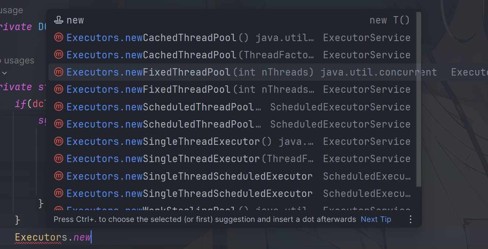

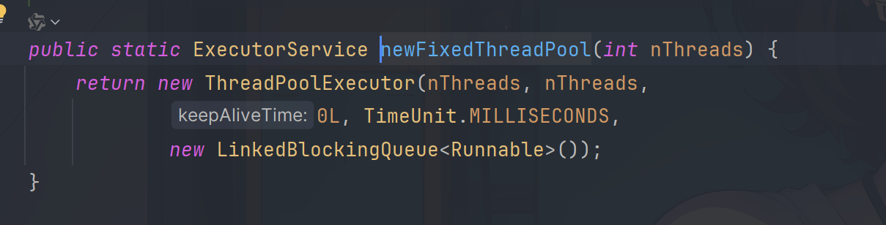


- FiexedThreadPool, SingeThreadPool:构造函数的阻塞队列长度默认为int最大值，可能会OOM，堆积大量请求
- CacheThreadPool和SchedukeThreadPool:创建大量请求，允许创建的线程数量为Int最大值

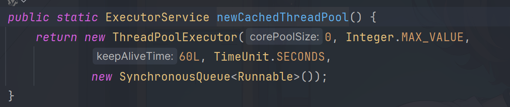

通过ThreadPoolExecutor去创建

```java
ThreadPoolExecutor executor = new ThreadPoolExecutor(
            corePoolSize,
            maximumPoolSize,
            keepAliveTime,
            unit,
            workQueue,
            handler
        );
```

### 线程生命周期和状态

线程的生命周期可以分为以下几个阶段：

1. **初始（NEW）**

   - 线程对象被创建，但尚未启动。

   - 代码示例：

     ```
     java
     
     
     复制编辑
     Thread t = new Thread(() -> System.out.println("Hello"));
     ```

2. **就绪（RUNNABLE）**

   - 线程调用 `start()` 方法后，进入就绪状态，等待 CPU 调度执行。

   - 代码示例：

     ```
     java
     
     
     复制编辑
     t.start(); // 线程进入就绪状态
     ```

3. **运行（RUNNING）**

   - 线程获取 CPU 时间片后，开始执行 `run()` 方法。

4. **阻塞（BLOCKED）**

   - 线程尝试获取锁，但锁被其他线程占用时，进入阻塞状态。

   - 代码示例：

     ```
     java复制编辑synchronized (lock) {
         // 线程 A 拥有锁
     }
     // 线程 B 进入 BLOCKED 状态，等待锁
     ```

5. **等待（WAITING）**

   - 线程调用 `wait()`、`join()`（无超时）、`park()` 方法后，进入无限等待状态，直到被其他线程显式唤醒。

   - 代码示例：

     ```
     java复制编辑synchronized (lock) {
         lock.wait(); // 线程进入 WAITING 状态
     }
     ```

6. **超时等待（TIMED_WAITING）**

   - 线程调用 `sleep()`、`wait(time)`、`join(time)`、`parkNanos()`、`parkUntil()` 方法，进入超时等待状态，一段时间后自动唤醒。

   - 代码示例：

     ```
     java
     
     
     复制编辑
     Thread.sleep(1000); // 线程进入 TIMED_WAITING 状态
     ```

7. **终止（TERMINATED）**

   - 线程执行完成或发生异常，进入终止状态，不能再次启动。

NEW → RUNNABLE → RUNNING → TERMINATED
       ↓         ↑
   BLOCKED ← RUNNING → WAITING/TIMED_WAITING

**NEW → RUNNABLE**：调用 `start()`

**RUNNABLE → RUNNING**：被 CPU 调度

**RUNNING → BLOCKED**：等待锁

**RUNNING → WAITING**：调用 `wait()`、`join()`（无超时）

**RUNNING → TIMED_WAITING**：调用 `sleep()`、`join(time)`、`wait(time)`

**BLOCKED/WAITING/TIMED_WAITING → RUNNABLE**：获取锁或被唤醒

**RUNNING → TERMINATED**：线程执行完毕或抛出异常


### 合适的线程数？CPU核心数和线程数的关系？

线程池的线程数量最主要的目的是：充分且合理使用CPU内存和资源，线程数太大增加上下文切换损耗，太小不能充分利用CPU资源

- CPU密集型

加解密、压缩、计算等任务：一般是CPU核心的1-2倍，对及其整体资源进行一个平衡

- IO密集型

网络、文件：一般大于CPU核心的很多倍。

线程数 = CPU核心数 * （1 + 平均等待时间/平均工作时间），通过压测监控运行状态来计算


## 垃圾收集器/回收算法

### 标记算法

- 标记-清除：GCRoots开始，遍历标记，清除未标记对象，内存碎片，两次遍历

- 标记复制：标记-存活对象复制到另一块空闲空间，浪费一半空间， 有优势大部分对象招生稀释，存活对象少，复制的就会少

- 标记整理：为了解决标记-清除的碎片问题，同时提高内存利用率。将所有**存活的对象**向内存空间的一端**移动**，使其紧凑排列，**效率最低**：移动对象和更新引用的开销非常大，尤其是堆很大时，会导致长时间的STW停顿。

- 并发标记算法：SATB

  > #### 

### G1

#### Cset和Rset

- **RSet** 是 **“谁在引用我”** 的记录本，用于**加速GC过程**。
- **CSet** 是 **“这次要清理谁”** 的名单，用于**定义GC范围**。

> Rset是记录了其他Region中那个卡页引用了本Region种的对象（不用感知具体引用本Region的那个对象）
>
> 每个Region都有自己得到Rset
>
> - 解决跨Region引用问题尤其是跨代引用。
> - 通过写屏障，当程序执行A.field = B时且存在跨Region引用，写屏障会找到A的所在的卡页，并将其标记为脏卡。后续由refine线程将这个信息记录到B所在的Region的Rset中。
> - 当需要回收某个Region Y时， GC会查看Region Y中的Rset，去扫描对应卡页中具体那个对象引用了region Y中的哪些对象C，将C作为GCRoots

> CSet 本次回收的清单
>
> CSet就是本次垃圾回收中将要被回收的Region的集合。定义了GC回收返回，无论是Young Gc还是Mixed Gc，都是针对Cset中的进行的。
>
> -  Young Gc的Cset: 包含所有年轻代的region， 
> - Mixed Gc的Cset:所有年轻代Region,+根据收益筛选的部分老年代Region（一般时垃圾比较多的Region）

> ### 核心关系与协作流程
>
> CSet 和 RSet 在一次 GC 中是如何协同工作的？我们以一次 **Mixed GC** 为例：
>
> 1. **确定CSet**：G1决定本次要回收老年代Region Y和Z，以及所有年轻代Region。
> 2. **为回收做准备**：对于CSet中的**每一个Region**（比如老年代Region Y），GC线程需要找到所有指向它的根（Roots），以确保存活对象不被误删。
> 3. **查询RSet**：GC线程**读取Region Y自己的RSet**。RSet返回信息：“Region X的卡页123和Region W的卡页456里有对象引用了你Region Y。”
> 4. **扩展GC Roots**：GC线程不会去扫描整个Region X和W，而是根据RSet提供的信息，**只精确地扫描Region X的卡页123和Region W的卡页456对应的内存块**。将这里面所有对象（可能是引用者）都加入到本次GC的GC Roots集合中。
> 5. **进行回收**：从这些GC Roots开始，标记出Region Y中所有存活的对象，并将其复制到新的Region。最后，清空Region Y，将其收回空闲列表。

> #### G1如何确定老年代的Cset
>
> 通过启动并发标记周期为老年代回收做准备，是Mixed GC前提
>
> **并发标记周期中**：
>
> - 标记存活对象：识别堆中所有存活对象。
> - 为每个老年代计算一个关键数据：存活字节数。
> - 存活字节数越少Region，内部垃圾越多，回收性价比越高。
> - Region排序，最多垃圾的Region排列在钱买你，优先考虑Cset
> - 基于停顿预测模型，根据历史数据预测回收一个所需要的时间【复制对象的开销】
> - - 如果耗时小于用户设定目标停顿时间，将该加入Cset，考虑下一个Region，总耗时达到或者超过目标停顿时间，停止添加

#### Region

一个 Region 在内存中是一段连续的地址空间。其大小可以通过 `-XX:G1HeapRegionSize` 设置，取值范围为 1M 到 32M，且必须是 2 的幂。JVM 会根据堆的初始值和最大值为你选择一个合适的值。

##### 数据结构

- bottom():指向Region起始地址的指针

- top():指向Region分配空间末尾的指针，下一个新对象从这里分配

> top和bottom之间时使用的，top到结束地址之间时未分配的。

- Rset
- Mark Bitmap

> 并发标记器不会直接修改对象头中的标记位，而是在这个独立的位图中设置相应的位。每一位对应 Region 中的一块极小内存范围（通常是一个对象），1 表示存活，0 表示死亡。

- 分配信息：是Eden还是S还是O还是Humongous
- Humongous还有指向下一个Humongous的指针
- 存活字节数，G1会计算并记录中存活对象所占用的总字节数。

#### 卡表

**卡表是一种通过粗粒度记录引用来换取极低维护开销和高回收效率的经典技术，它是实现分代收集理论的核心工程技术之一。**

- 物理实现： 字节数组，每个元素代表一个卡页
- 映射关系：每个元素对应java中固定大小的内存块（一般512字节），内存快就是卡页
- 标记代表可能包含跨代引用指针。这个状态为脏

> 卡表是垃圾回收（传统和现代）的必不可少的
>
> - 传统的解决分代
> - 现代解决分代和跨分区

#### G1垃圾回收类型以及流程，

> #### YoungGc【标记算法：标记-复制】
>
> Eden耗尽，回收整个E和S区：**回收年轻代， 会STW**
>
> #### 流程
>
> 1. 停止应用线程（STW）
> 2. 构建GCROOTS
>    - 栈引用，静态变量等传统的GCROOT
>    - 通过记忆集找到引用年轻代的老年代卡页，通过卡页扫描处年轻代存活对象加入GCROOTS
> 3. 可达性分析，标记存活对象
> 4. 对象处理
>    - 回收垃圾
>    - 存活对象被**复制**到新的S区，年龄加1或者晋升
> 5. Region清理原来的E和S区清空
> 6. 恢复应用线程STW结束
>
> 

> #### **Concurrent Cycle** (并发周期)
>
> 它不是一次真正的回收，而是一次“摸底调查”，目的是识别出老年代中哪些 Region 是垃圾最多的。
>
> 堆占用率超过阈值 (`-XX:InitiatingHeapOccupancyPercent`)，整个堆**标记老年代存活对象，计算Region存活数据**, 部分STW
>
> **流程**
>
> 1. 初始标记-STW， 附着在一次Young GC执行
> 2. 与应用线程一起运行，并发标记，标记存活对象
> 3. 最终标记remark-STW，处理并发标记期间应用线程产生的漏标对象
> 4. 清理阶段
>    - 统计Region存活字节数
>    - 排序
>    - 为MixedGC生成候选老年代Region列表。

> #### Mixed GC
>
> 并发周期技术后， 在目标停顿时间内回收最多垃圾，**所有**年轻代 Region + **部分**老年代 Region, **会STW**
>
> **流程**
>
> 1. 确定Cset， 所有年轻代+部分老年代
>    - 根据并发周期准备好的候选列表，根据 `-XX:MaxGCPauseMillis` 目标，**选择一批垃圾最多的老年代 Region** 加入 CSet。选择会持续到预测的回收时间接近目标停顿时间为止
> 2. **后续步骤**：之后的步骤（构建GC Roots、标记、复制存活对象、清空Region）与 Young GC **完全类似**，只不过范围从年轻代扩大到了 CSet 中的所有 Region。
> 3. **反复执行**：并发周期一次只会进行一次，但基于其结果，可以**连续触发多次 Mixed GC**，直到快把筛选出的老年代垃圾 Region 回收完毕，或者又分配了新的对象触发了新的 Young GC。

> #### FullGC
>
> 晋升失败，内存不足，挽救局面，避免内存溢出
>
> **并发模式失败 (Concurrent Mode Failure)**：在并发周期还未完成时，老年代就被填满了
>
> 退化为：Serial old对整个堆进行标记-整理


#### 为什么Mixed GC会多次触发

 **G1 垃圾收集器为了实现其核心目标——可预测的停顿时间——而采取的主动设计策略。**

想象一下这个场景：

- 并发标记周期结束后，G1 发现老年代中有 **100 个 Region** 的垃圾比例很高，值得回收。
- 但是，用户通过 `-XX:MaxGCPauseMillis=200ms` 设定了最大停顿时间目标。

**问题**：G1 无法在一次 200ms 的停顿内，完成对所有 100 个垃圾 Region 的回收（包括标记存活对象、复制它们到新 Region、清空旧 Region）。如果强行这么做，停顿时间会远超目标。

**G1 的解决方案**：
“我没办法一顿饭吃下所有东西，但我可以分好几顿，每次都在规定时间内吃完。”

1. **分批处理**：G1 不会一次性地把这 100 个 Region 都放进回收集（CSet）。它会根据**停顿预测模型**，计算每次 Mixed GC 可以处理多少 Region 才能不超过 `MaxGCPauseMillis`。
2. **多次回收**：假设预测模型算出，一次 Mixed GC 最多能处理 **10 个**老年代 Region 而不超时。那么 G1 就会计划进行 **10 次** Mixed GC（100 / 10），每次处理一批（10个）老年代 Region。
3. **与年轻代协同**：这 **10 次** Mixed GC 的每一次，都会**顺带回收当时所有的年轻代 Region**。所以一次 Mixed GC 的 CSet = *当前所有年轻代 Region* + *一批筛选出的老年代 Region*。

#### 调优参数

| **`-XX:MaxGCPauseMillis=200`**    | 200 ms | **最重要的参数**。设置期望的最大停顿时间目标。G1 会**尽力**达成这个目标（但不保证）。设置得太低会迫使 G1 更频繁地做小规模回收，反而降低吞吐量。 |
| --------------------------------- | ------ | ------------------------------------------------------------ |
| **`-XX:GCPauseTimeInterval=<n>`** |        | 设置期望的停顿间隔时间。与上一个参数配合，表示“每过 `<n>` 毫秒，停顿不超过 `MaxGCPauseMillis` 毫秒”。 |

| **`-Xms / -Xmx`**            |                               | **堆的最小和最大大小**。建议设置为相同值，以避免堆扩容带来的额外开销。 |
| ---------------------------- | ----------------------------- | ------------------------------------------------------------ |
| **`-XX:G1HeapRegionSize=n`** | 根据堆大小自动计算 (1MB~32MB) | **手动设置 Region 大小**。必须是 2 的幂。通常不需要设置，除非有特别大的对象。 |

| **`-XX:InitiatingHeapOccupancyPercent=45`** | 45%  | **IHOP 阈值**。当**整个堆**的使用率超过此值时，触发并发标记周期。**这是最重要的调优参数之一。** |
| ------------------------------------------- | ---- | ------------------------------------------------------------ |
|                                             |      |                                                              |

| **`-XX:G1MixedGCLiveThresholdPercent=85`** | 85%  | **Region 准入阈值**。只有**存活对象比例低于 85%** 的老年代 Region 才会被考虑放入 Mixed GC 的 CSet。防止复制大对象开销太大。 |
| ------------------------------------------ | ---- | ------------------------------------------------------------ |
|                                            |      |                                                              |

| **`-XX:G1UseAdaptiveIHOP`** | true | 是否启用 **IHOP 自适应优化**。建议开启，G1 会根据老年代晋升的历史数据自动优化 IHOP 值。 |
| --------------------------- | ---- | ------------------------------------------------------------ |
|                             |      |                                                              |

**`ParallelGCThreads=n`** **STW 阶段的并行工作线程数**。用于 Young GC 和 Mixed GC 的标记、复制阶段。CPU 资源充足时可适当增加。

**`-XX:ConcGCThreads=n`** | `ParallelGCThreads / 4` | **并发阶段（如并发标记）的线程数**。增加此值可加快并发标记速度，但会占用更多应用线程的 CPU 资源。 

**`-XX:G1MixedGCCountTarget=8`** | 8 | 设定一个并发标记周期后，**目标用多少次 Mixed GC** 来回收筛选出的老年代 Region。增加此值会让每次 Mixed GC 的停顿更短，但回收老年代的速度变慢

#### 调优步骤与策略建议

1. **不要过早调优**：首先使用默认参数运行，通过 GC 日志（`-Xlog:gc*`）分析是否存在问题。
2. **设定核心目标**：根据应用需求，设置 `-XX:MaxGCPauseMillis`。
3. **调整堆大小**：确保 `-Xms` 和 `-Xmx` 相同。
4. **优化并发周期触发**：如果并发周期启动太晚，导致 Mixed GC 来不及回收就在并发阶段发生晋升失败，可以**适当降低 `-XX:InitiatingHeapOccupancyPercent`**（如从 45 调到 35 或 40）。**保持 `-XX:G1UseAdaptiveIHOP=true`**。
5. **优化停顿时间**：
   - 如果 Young GC 停顿长：可以尝试**减小 `-XX:G1MaxNewSizePercent`**（如从 60 调到 40），限制年轻代的最大大小，但可能会增加 GC 频率。
   - 如果 Mixed GC 停顿长：可以**增加 `-XX:G1MixedGCCountTarget`**（如从 8 调到 16），让每次 Mixed GC 处理的老年代 Region 更少，停顿更短，但总回收周期变长。
6. **优化吞吐量**：如果 CPU 资源充足且停顿可以接受，可以**增加 `-XX:ParallelGCThreads`** 来加快 STW 阶段的处理速度。
7. **避免 Full GC**：
   - 如果看到晋升失败，可以尝试**增加 `-XX:G1ReservePercent`** 或**更早地触发并发周期**（降低 IHOP）。
   - 确保堆大小（`-Xmx`）本身是足够的。

**最重要的建议**：总是使用 `-Xlog:gc*,gc+heap=debug,gc+ergo*=trace:file=gc.log` 等参数开启详细的 GC 日志，然后使用 **GCeasy**、**G1GCViewer** 或 **JHiccup** 等工具分析日志，**用数据驱动调优**，而不是盲目猜测。

#### 其他

XX:G1MixedGCLiveThresholdPercent 决定了老年代的候选池大小

MixedGC是分批回收的

**自己理解**

四种y,并发-》多次mixedGC，full gc-》serial old

region：bottom，top， 标记，存活i字节数，标记位图，rset

卡表


### ZGC

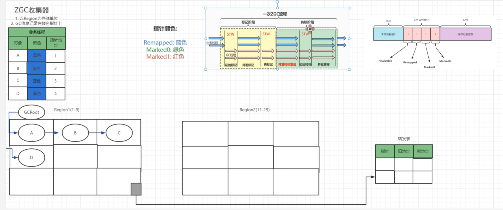

java 11， 支持大内存（数TB）

 颜色指针， 4位染色指针，42位对象信息，18位未使用

颜色指针：蓝， 绿，红色

- ZGC：ZGC 的设计目标是解决 G1 无法解决的问题：超大堆（TB级别）下的超低延迟。它的核心创新是**染色指针**和**读屏障**，使得耗时最长的**标记**和** relocation** 阶段几乎完全并发。


**a. 堆内存布局：**
ZGC 也划分 Region，但称为 **Page**。支持三种不同大小的 Page：小（2MB）、中（32MB）、大（容量可变，必须是2MB的倍数）。设计上更灵活

#### 染色指针

从64位的指针中，拿出几位标识对象的情况，共计4位, 42~45位置

Finalizable

Remapped

M1

M0

#### 为什么ZGC时间不会随着堆的大小和存活数量增加而增加，

- STW只和GCROOTS集合大小有关系，和堆的大小没有关系

- G1对象转移需要STW，ZGC有并发转移
- 如果并发转移是，新生成对象过快导致内存不够，ZGC会阻塞应用线程


#### 读屏障（using load barriers）

CMS和G1都用到了写屏障，ZGC用到了读屏障

在Object a = obj.field的时候，会触发读屏障

**并发转移的核心**

GC线程转移对象，应用程序读取对象的时候，利用读屏障通过指针上标志判断对象是否被转移

- 被转移，修正对象的引用，a不仅能得到最新的引用地址， obj.foo也会被更新，下次访问就一切正常。

**读屏障的工作：**

1. 检查加载到的指针的元数据位。
2. **如果指针处于 `Marked` 视图（即 `Remapped` 位未设置）**，这意味着该指针可能指向一个尚未被重定位的旧对象，或者需要被标记。
3. 触发“自愈”逻辑：读屏障会查询 ZGC 的转发表，找到该对象的新地址，**并自动将 `obj.field` 中的引用更新为新的、带有 `Remapped` 集的新地址**。之后，返回新地址给应用程序。

**“自愈”是 ZGC 实现并发移动的关键！** 它把修正指针引用的工作分摊到了所有应用程序线程上，并且是在线程执行过程中“顺便”完成的，避免了全局性的 STW 暂停。

#### 垃圾回收流程

如果一个对象是存活的，必定有对应的指针被着色。

> 1.并发标记：
>
> - （stw）初始标记，暂停所有的线程
>
> 仅仅扫描GCROOTS， 直接找到第一批存活对象，这下对象放入标记栈，
>
> **如何 标记：**ZGC不改变对象头，将指向这些对象的指针Marked0设置为1，清除Remappes
>
> 只和GCROOTS有关，很快
>
> - 并发阶段：并发标记
>
> 应用线程恢复，GC线程与应用线程并发执行，
>
> GC线程从标记栈中取出对象，递归遍历引用字段，对于遍历到的每一个对象，同样将指向这些对象的指针Marked0设置为1，清除Remappes
>
> 在标记期间，如果应用线程访问了一个尚未被标记的对象（其指针还处于 `Remapped` 视图），读屏障会捕获到这个加载操作，**不仅会“自愈”，还会顺带将这个对象标记为存活（设置 `Marked0` 位）并压入标记栈**。这确保了标记的正确性。

> 2.并发预备重分配
>
> 根据标记结果，分析哪些Page包含的垃圾做多，这些区域存活对象被丢进**重分配集**
>
> 为重分配集中的每一个对象创建转发表条目，记录就地址--->新地址映射关系
>
> 新地址三种状态：初始NULL, 正在转移，DONE

> 3. 并发转移
>
> - 短暂STW将，扫描GCROOTS， 重定位根直接引用且位于重分配集的对象，并将根集合中的指针更新为新的，带有Remapped的新地址。
> - STW结束， GC线程与应用线程并发进行。将其他存活的对象复制到新的page中。
> - 移动前访问：如果对象还没有移动到新地址，转发表是old-->NULL, 如果访问这个对象，会返回旧地址，并保证在使用这个对象期间不会进行移动。
> - 移动时访问： 会短暂等待移动结束时然后返回新地址
> - 移动后访问：直接访问转发表得到新地址。

> 4. 并发重映射
>
>  将堆中所有指向旧地址的 `Marked0` 视图指针更新为指向新地址的 `Remapped` 视图指针
>
> ZGC **并不立即执行一个独立的并发重映射阶段**。因为它发现，在下一个垃圾回收周期（比如周期 n+1，使用 `Marked1` 位）的**并发标记阶段**，它本来就需要遍历整个对象图来标记存活对象，ZGC **并不立即执行一个独立的并发重映射阶段**。因为它发现，在下一个垃圾回收周期（比如周期 n+1，使用 `Marked1` 位）的**并发标记阶段**，它本来就需要遍历整个对象图来标记存活对象

最终一致性


# SSM、SpringBoot

#### spinrgboot简化了spring哪一个部分的工作量？

Spring Boot 简化了 Spring 框架中许多常见的配置和设置工作，主要包括以下几个方面：

1. **自动配置**：Spring Boot 通过自动配置（AutoConfiguration）机制，自动为应用配置合适的 Spring 配置。例如，它能够自动配置数据源、JPA、消息队列、Web 服务器等，减少了开发者手动编写大量配置的工作。
2. **嵌入式服务器**：Spring Boot 集成了嵌入式的 Web 服务器（如 Tomcat、Jetty 或 Undertow），开发者不再需要额外的 web.xml 配置，也无需部署到外部的 Web 服务器上。只需要在项目中添加相应的依赖，Spring Boot 会自动启动并运行应用。
3. **简化的配置文件**：Spring Boot 提供了 `application.properties` 或 `application.yml` 文件，使得配置变得更加简洁、集中，且可以通过属性文件来轻松修改应用的配置。相比传统的 Spring 配置文件，Spring Boot 省去了大量的 XML 配置。
4. **快速开发的工具支持**：Spring Boot 提供了很多方便的工具，比如 Spring Boot DevTools，它能够自动重启应用、自动清除缓存，提升开发效率。
5. **生产级特性**：Spring Boot 提供了很多面向生产环境的特性，如健康检查、监控、日志管理等，使得开发者可以更方便地进行运维和监控。

#### @Autowired和@Resources区别

`@Autowired` 和 `@Resource` 都是 Spring 中用于依赖注入的注解，但它们有一些关键的区别，主要体现在注入方式和默认行为上。

##### 1. **`@Autowired`（Spring特有）**

- **依赖注入类型**：`@Autowired` 是 Spring 提供的注解，默认使用 **按类型注入**（by type）。
- **自动注入**：当 Spring 容器启动时，它会根据变量的类型，查找相应类型的 bean，并将其注入到对应的字段、构造函数或方法中。
- **可选注入**：`@Autowired` 默认情况下是 **必需的**，如果没有找到匹配的 bean，Spring 会抛出异常。但是可以通过设置 `@Autowired(required = false)` 来指定为可选注入。
- **注入方式**：可以用在字段、构造器、方法上。

##### 2. **`@Resource`（Java EE标准）**

- **依赖注入类型**：`@Resource` 是 Java EE 标准的一部分，默认使用 **按名称注入**（by name）。它首先会按字段名称查找一个同名的 bean，如果没有找到，它会回退到按类型注入。
- **按名称查找**：如果字段名和 Spring 容器中的 bean 名称匹配，`@Resource` 会优先使用名称来进行注入。
- **没有 `required` 属性**：`@Resource` 不具备 `@Autowired` 的 `required` 属性，因此如果找不到符合条件的 bean，它会抛出异常，除非配置了 `name` 属性来明确指定要注入的 bean。
- **注入方式**：也可以用在字段或 setter 方法上。


## SpringMVC

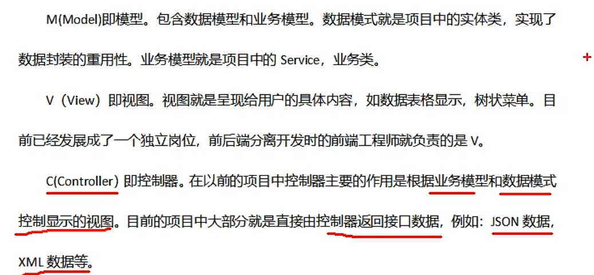

### 执行流程

是一个轻量级javaweb框架，采用MVC(model-view-controller)设计模式，提供一种松耦合的方式将用户请求、业务逻辑，视图渲染分离开。

核心组件：

- DispatchServlet: 前端控制器，接受所有的请求分发， 处理响应结果。   
- HandlerMapping: 映射请求处理器，根据URL找到对应的Handler(controller)
- Controller: 处理请求的业务逻辑
- HandlerAdapter: 调用处理器的方法。处理器适配器
- **ModelAndView**：封装模型数据和视图信息
- HandlerInterceptor: 拦截器，实现预处理和后处理
- ViewResolver: 解析逻辑视图名到具体视图实现

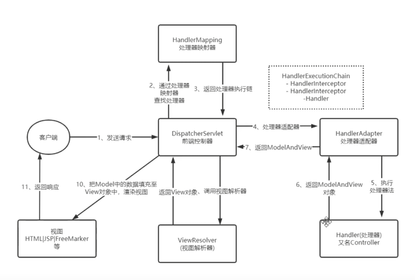

HandlerAdapter: 有多种适配器，每种适配器，适配了不同的controller实现方式。 

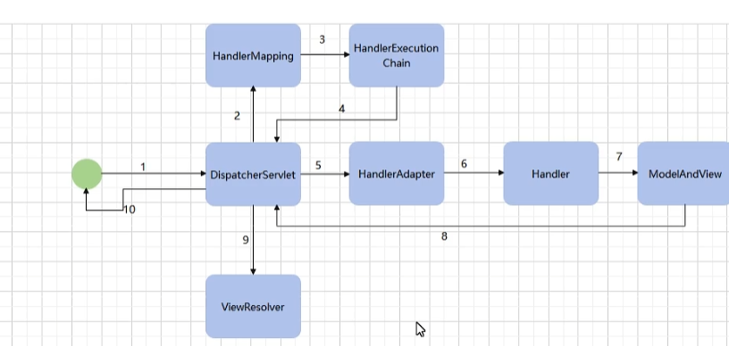


1. 客户端向服务端发起请求，URL匹配后执行DispatchServlet
2. DispatchServlet根据URL类型行调用HandlerMapping
3. HandlerMapping查找Handler后产生的HandlerExcutionChain,其中包含了Handler和Interceptor,返回给DispathServlet；Handler 可能是 `@Controller` 类的方法、`HttpRequestHandler` 实现等。**拦截器链** 是预先配置的 `HandlerInterceptor` 集合，按顺序执行。
4. DispathServlet根据Handler类型调用HandlerAdapter，`DispatcherServlet` 遍历所有 `HandlerAdapter`（如 `RequestMappingHandlerAdapter`），找到能处理当前 Handler 的适配器
5. HanderAdapter调用Handler进行执行，
   - **在 Handler 执行前**，会先按顺序调用拦截器的 `preHandle()` 方法。若任一拦截器返回 `false`，流程终止。
6. Handler执行完毕后返回ModelAndView给DispatchServlet

- 解析参数（通过 `HandlerMethodArgumentResolver`）。
- 执行方法逻辑。
- 处理返回值（通过 `HandlerMethodReturnValueHandler`）

- - 返回值可能是 `ModelAndView`、`String`（视图名）、`@ResponseBody` 等：
  - 如果是视图类型，进入视图渲染流程。
  - 如果是 `@ResponseBody`，直接写入响应（跳过视图解析）。

7. DispathServlet调用ViewResovler处理视图，**仅限需要视图时**
8. **在请求完成后**（无论成功或异常），按逆序调用拦截器的 `afterCompletion()` 方法
9. DispatchServlet响应结果给客户端。

补充：

1. **拦截器的执行时机**：
   - `preHandle()` → **Handler 执行前**
   - `postHandle()` → **Handler 执行后、视图渲染前**
   - `afterCompletion()` → **整个请求完成后**（易遗漏！）
2. **返回值类型的影响**：
   - 如果方法标注了 `@ResponseBody`，会直接返回 JSON/XML，跳过视图解析。
3. **异常处理流程**：
   - 若过程中抛出异常，会被 `HandlerExceptionResolver` 处理（如 `@ExceptionHandler`），您未提及但很重要。

### 适配器

- RequestMappingHandlerAdapter，适配 `@RequestMapping`、`@GetMapping`、`@PostMapping` 注解的方法

```java
@RestController
public class MyController {
    @RequestMapping("/hello")
    public String hello() {
        return "Hello, Spring MVC!";
    }
}

```


- SimpleControllerHandlerAdapter，**适配实现 `Controller` 接口的类**（**Spring 早期用法**，不推荐）

```java
public class MySimpleController implements Controller {
    @Override
    public ModelAndView handleRequest(HttpServletRequest request, HttpServletResponse response) {
        return new ModelAndView("hello");
    }
}

```

- HttpRequestHandlerAdapter,**适配实现 `HttpRequestHandler` 接口的类**（适用于 `Servlet` 风格的处理）,不推荐，除非特殊需求（如 WebService 处理 XML 请求）

```java
public class MyHttpRequestHandler implements HttpRequestHandler {
    @Override
    public void handleRequest(HttpServletRequest request, HttpServletResponse response) throws IOException {
        response.getWriter().write("Handled by HttpRequestHandler!");
    }
}

```

- SimpleServletHandlerAdapter,**适配 `Servlet` 组件**（用于 `Servlet` 组件整合到 Spring MVC）,不适用于现代 Spring MVC 开发（建议直接使用 `@RestController`）

```java
@WebServlet("/myServlet")
public class MyServlet extends HttpServlet {
    @Override
    protected void doGet(HttpServletRequest req, HttpServletResponse resp) throws IOException {
        resp.getWriter().write("Hello from Servlet!");
    }
}

```


###  HandlerMapping

- **RequestMappingHandlerMapping**（常见，基于 `@RequestMapping` 注解）
- **SimpleUrlHandlerMapping**（基于 `properties` 文件配置）
- **BeanNameUrlHandlerMapping**（基于 Bean 的名字）


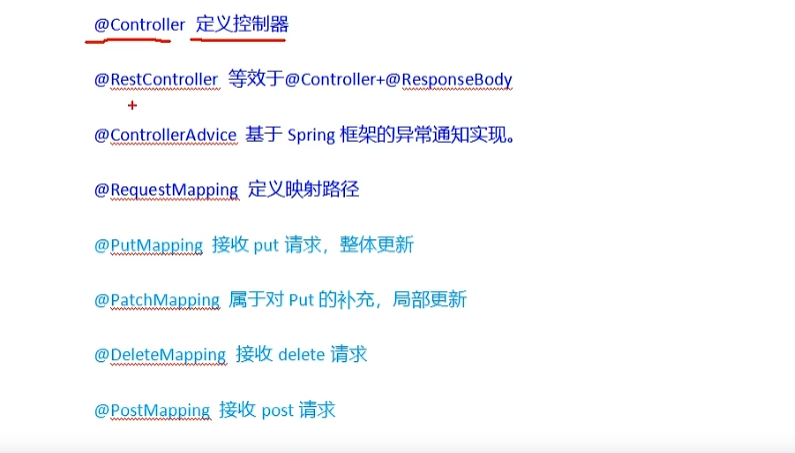


### 拦截器和过滤器

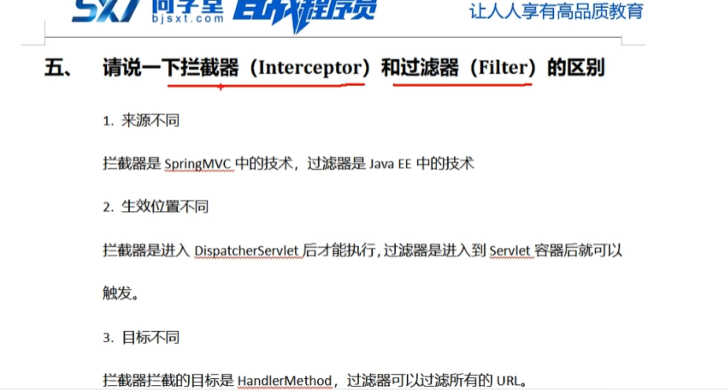


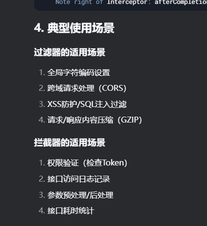


## Spring

#### Bean生命周期

bean从创建到销毁的流程。

大致分为4大部

##### 1. 实例化， 

通过反射推断构造函数进行实例化

实力工厂，静态工厂,如果是工厂方法，则调用指定的工厂方法

##### 2. 属性赋值

- 注入依赖（通过setter或者字段注入）
- 处理`@Autowired`、`@Value` 等注解

解析自动装配(@Autowired),DI体现

循环依赖

##### 3. 初始化

- Aware 接口回调， 调用XXXAware回调，

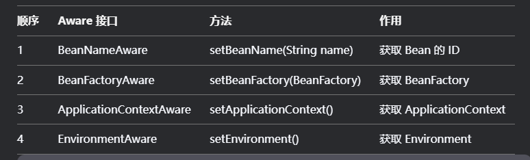

- 调用**初始化生命周期回调**（）:

- - BeanPostProcessor接口中的postProcessBeforeInitialization
  - 初始化阶段，Initialization，通过`PostConstruct` 注解方法后者实现Initialization接口重写afterPropertiesSet()方法。
  - BeanPostProcessor后置处理，实现该接口重写postProcessAfterInitialization方法，AOP代理在此阶段生成。
  - 然后Bean就绪可用。

##### 4. 销毁

- `PreDestroy` 注解
- - 或者实现接口DisposableBean，重写destory方法。

- spring容器关闭调用
- 调用销毁的生命周期回调


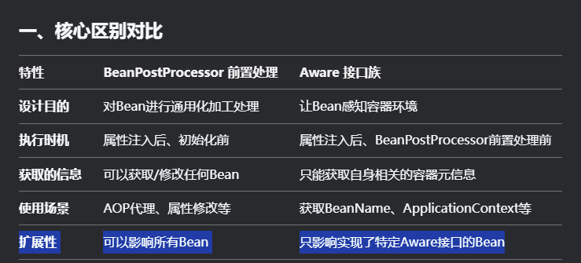

#### IOC加载过程


### 事务传播行为

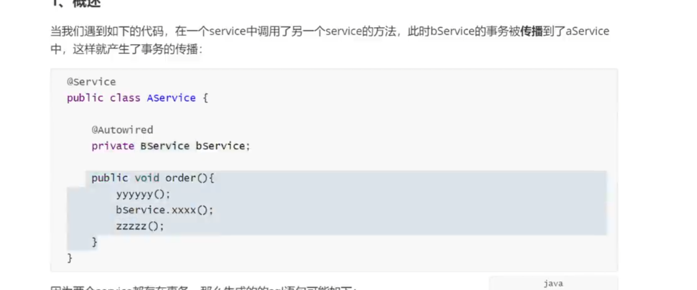

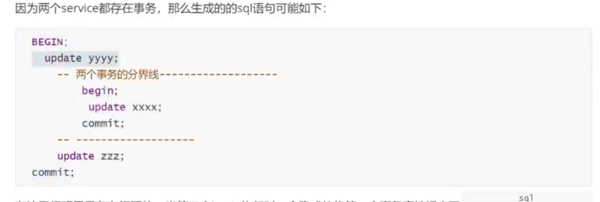


这种sql不支持这样的嵌套，如果是这样写的A事务执行到yyy的时候，执行begin，就会把yyy这一行事务提交，后面的zzz以无事务方式运行。

#### **解决方法**

- 融入到外界事务

  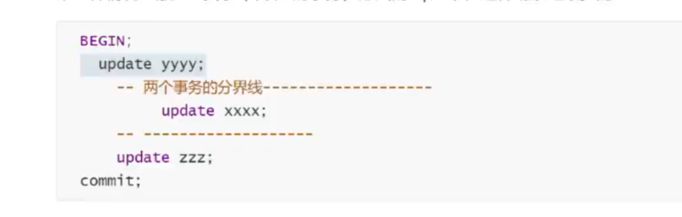

- 挂起事务A, 执行到B中的事务，先停下来，不要执行，从数据源中在拿一个connection来执行B事务，B事务执行完毕后在执行之前的事务： 不希望A事务的异常导致B事务的回滚，也不希望B事务的异常导致A事务的回滚。两个连接互不干涉，B事务执行了，在继续执行A事务。

- 用保存点模拟，把开启事务B设置为一个保存点，有问题就回滚到保存点。

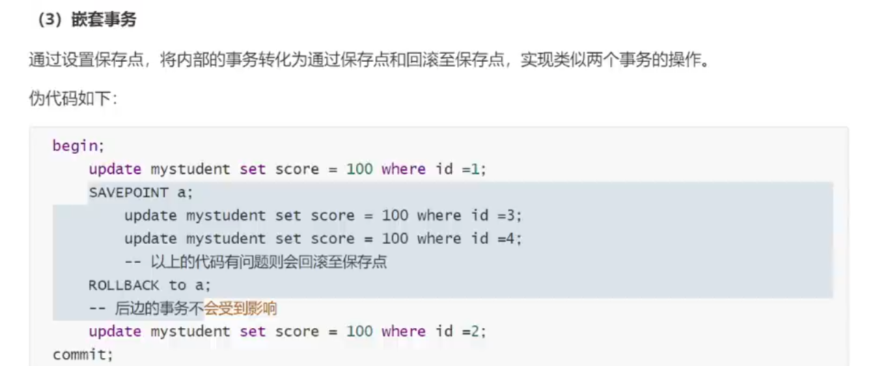


#### 传播行为

- REQUIRED: 当前方法如果运行在事务中，如果当前事务存在，B方法会在该事务中运行（融入），否则，会启动一个新事物。也就是无论如何B必须有事务【修改操作】
- SUPPOERTS:如果外界有事务，就融入到外界，如果没有，就以非事务方式运行【只读事务】
- MANDATORY:强制性的，这个方法必须在事务中运行，当前事务不存在，抛出异常
- REQUIREDS_NEW:需要新的,【挂起】，如果外界有事务，开启新的connection，以事务运行，如果没有，自己独立运行
- NOT_SUPPOERTED：不支持事务，如果外面存在事务，把外面的事务挂起，独立的以非事务方式运行，
- NEVER:如果当前有一个正在运行的事务，抛异常
- NESTED:嵌套的，

# Redis

## 数据结构

String，动态字符串

list,双向链表+压缩列表

set,哈希表+整数数组

hash,哈希表+压缩列表

sort set：跳表+压缩列表

#### 压缩列表

本质数组：

列表长度，尾部偏移量，列表元素个数，元素1-元素n,列表结束标识符，有利于快速寻找列表得首尾节点

## Redission


### 分布式锁，

直接```setIfAbsent(lockkey)```

#### 存在的问题

- 执行到一般，还没释放锁之前宕机了，lockkey不会被释放，其他的获取不了--------------------->设置过期时间
- 设置了过期时间，执行到一半，突然过期了，其他的线程获取到锁，执行业务代码，就有多个线程同时执行，然后释放了其他线程的锁，存在并发安全问题。------>给锁设置是哪个线程加的，释放的时候，判断是否这个线程在释放锁。
- 在判断是不是对应线程释放时，如果是，准备执行删除时，过期了，和2一样---->锁续命，分线程去实现

#### Redisson

**超时续期**


## Zset底层

- 有序集合得数量小于128且元素长度小于64字节：压缩列表
- 跳表在链表得基础上简历多个索引
- 范围查找更方便相比于红黑树

### 跳表


```c
typedef struct zkiplistNode{
    sds ele;// 结点value
    Double score;//分数
    struct zkiplistNode *backward;//后退指针，反向查找
    struct zkiplistLevel{
        struce zkiplistNode *forward;//前进指针
        unsigned long span;//到下一节点的距离
    }level[];//定义了层级指针和距离下个节点的跨度
    
}zkiplistNode
typedef struct zskiplist {
    struct zskiplistNode *header, *tail;
    unsigned long length; // 跳跃表的长度（节点数量）
    int level; // 当前跳跃表的最大层级
} zskiplist;
#define ZSKIPLIST_MAXLEVEL 32 /* Should be enough for 2^64 elements */
/* Create a new skiplist. */
zskiplist *zslCreate(void) {
    int j;
    zskiplist *zsl;

    zsl = zmalloc(sizeof(*zsl));
    zsl->level = 1;
    zsl->length = 0;
    zsl->header = zslCreateNode(ZSKIPLIST_MAXLEVEL,0,NULL);
    for (j = 0; j < ZSKIPLIST_MAXLEVEL; j++) {
        zsl->header->level[j].forward = NULL;
        zsl->header->level[j].span = 0;
    }
    zsl->header->backward = NULL;
    zsl->tail = NULL;
    return zsl;
}
/* Find the rank for an element by both score and key.
 * Returns 0 when the element cannot be found, rank otherwise.
 * Note that the rank is 1-based due to the span of zsl->header to the
 * first element. */
unsigned long zslGetRank(zskiplist *zsl, double score, sds ele) {
    zskiplistNode *x;
    unsigned long rank = 0;
    int i;

    x = zsl->header;
    for (i = zsl->level-1; i >= 0; i--) {
        while (x->level[i].forward &&
            (x->level[i].forward->score < score ||
                (x->level[i].forward->score == score &&
                sdscmp(x->level[i].forward->ele,ele) <= 0))) {
            rank += x->level[i].span;
            x = x->level[i].forward;
        }

        /* x might be equal to zsl->header, so test if obj is non-NULL */
        if (x->ele && sdscmp(x->ele,ele) == 0) {
            return rank;
        }
    }
    return 0;
}   

/* Internal function used by zslDelete, zslDeleteRangeByScore and
 * zslDeleteRangeByRank. */
void zslDeleteNode(zskiplist *zsl, zskiplistNode *x, zskiplistNode **update) {
    int i;
    for (i = 0; i < zsl->level; i++) {
        if (update[i]->level[i].forward == x) {
            update[i]->level[i].span += x->level[i].span - 1;
            update[i]->level[i].forward = x->level[i].forward;
        } else {
            update[i]->level[i].span -= 1;
        }
    }
    if (x->level[0].forward) {
        x->level[0].forward->backward = x->backward;
    } else {
        zsl->tail = x->backward;
    }
    while(zsl->level > 1 && zsl->header->level[zsl->level-1].forward == NULL)
        zsl->level--;
    zsl->length--;
}
int zslDelete(zskiplist *zsl, double score, sds ele, zskiplistNode **node) {
    zskiplistNode *update[ZSKIPLIST_MAXLEVEL], *x;
    int i;

    x = zsl->header;
    for (i = zsl->level-1; i >= 0; i--) {
        while (x->level[i].forward &&
                (x->level[i].forward->score < score ||
                    (x->level[i].forward->score == score &&
                     sdscmp(x->level[i].forward->ele,ele) < 0)))
        {
            x = x->level[i].forward;
        }
        update[i] = x;
    }
    /* We may have multiple elements with the same score, what we need
     * is to find the element with both the right score and object. */
    x = x->level[0].forward;
    if (x && score == x->score && sdscmp(x->ele,ele) == 0) {
        zslDeleteNode(zsl, x, update);
        if (!node)
            zslFreeNode(x);
        else
            *node = x;
        return 1;
    }
    return 0; /* not found */
}
/* Insert a new node in the skiplist. Assumes the element does not already
 * exist (up to the caller to enforce that). The skiplist takes ownership
 * of the passed SDS string 'ele'. */
zskiplistNode *zslInsert(zskiplist *zsl, double score, sds ele) {
    zskiplistNode *update[ZSKIPLIST_MAXLEVEL], *x;
    unsigned int rank[ZSKIPLIST_MAXLEVEL];
    int i, level;

    serverAssert(!isnan(score));
    x = zsl->header;
    for (i = zsl->level-1; i >= 0; i--) {
        /* store rank that is crossed to reach the insert position */
        rank[i] = i == (zsl->level-1) ? 0 : rank[i+1];
        while (x->level[i].forward &&
                (x->level[i].forward->score < score ||
                    (x->level[i].forward->score == score &&
                    sdscmp(x->level[i].forward->ele,ele) < 0)))
        {
            rank[i] += x->level[i].span;
            x = x->level[i].forward;
        }
        update[i] = x;
    }
    /* we assume the element is not already inside, since we allow duplicated
     * scores, reinserting the same element should never happen since the
     * caller of zslInsert() should test in the hash table if the element is
     * already inside or not. */
    level = zslRandomLevel();
    if (level > zsl->level) {
        for (i = zsl->level; i < level; i++) {
            rank[i] = 0;
            update[i] = zsl->header;
            update[i]->level[i].span = zsl->length;
        }
        zsl->level = level;
    }
    x = zslCreateNode(level,score,ele);
    for (i = 0; i < level; i++) {
        x->level[i].forward = update[i]->level[i].forward;
        update[i]->level[i].forward = x;

        /* update span covered by update[i] as x is inserted here */
        x->level[i].span = update[i]->level[i].span - (rank[0] - rank[i]);
        update[i]->level[i].span = (rank[0] - rank[i]) + 1;
    }

    /* increment span for untouched levels */
    for (i = level; i < zsl->level; i++) {
        update[i]->level[i].span++;
    }

    x->backward = (update[0] == zsl->header) ? NULL : update[0];
    if (x->level[0].forward)
        x->level[0].forward->backward = x;
    else
        zsl->tail = x;
    zsl->length++;
    return x;
}

```

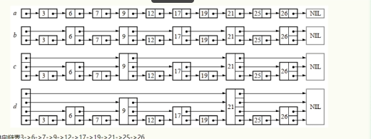

- 删除
- - `zslDelete` 函数用于删除跳跃表中的某个节点。
  - 首先通过遍历找到要删除的节点，并记录每一层的 `update` 节点。
  - 调用 `zslDeleteNode` 函数来实际删除节点，并更新相关指针和 `span` 值。
  - 如果删除成功，返回 1；否则返回 0。
- 插入
- - `zslInsert` 函数用于在跳跃表中插入一个新节点。
  - 首先通过遍历找到插入位置，并记录每一层的 `update` 节点和 `rank` 值。
  - 随机生成新节点的层级 `level`，如果 `level` 大于当前跳跃表的最大层级，则更新跳跃表的层级。
  - 创建新节点，并更新相关指针和 `span` 值。
  - 最后更新跳跃表的长度，并返回新插入的节点。

## IO多路复用

### AIO,NIO,BIO


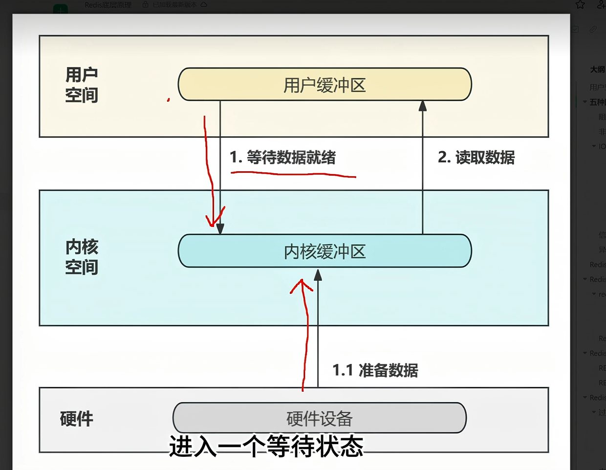

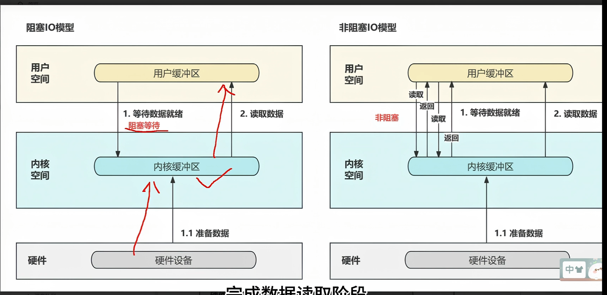

RecvFrom--->等待

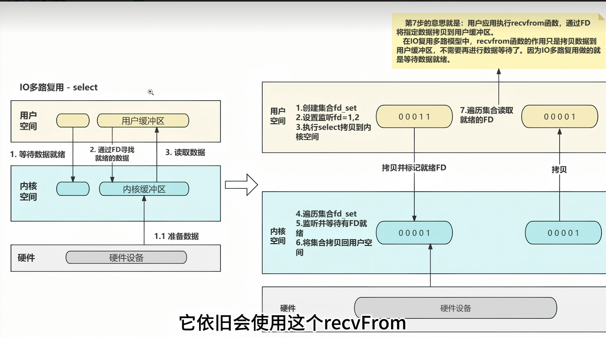

用户由100个redis请求连接，就会有100个FD，I/O多路复用可以同时监听100个

非/阻塞只能监听一个，非阻塞IO的非阻塞不是可以监听多个IO,而是发起监听时会立马返回这个结果

### SELECT、POLL、EPOLL

Select,通过Select,两个遍历，两次拷贝，最多只能容纳1024个FD

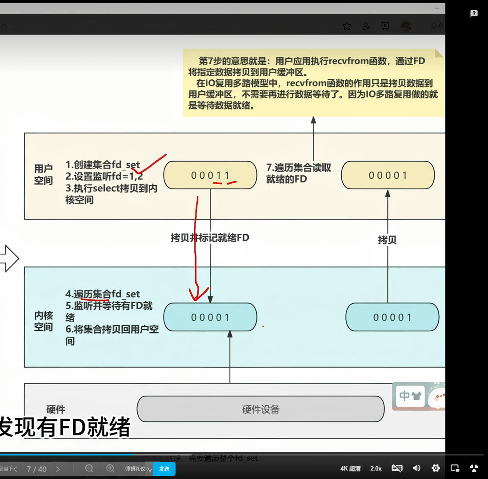


**POLL**

和select一样，比SElect可以多个不止1024

**EPOLL**：时间通知机制

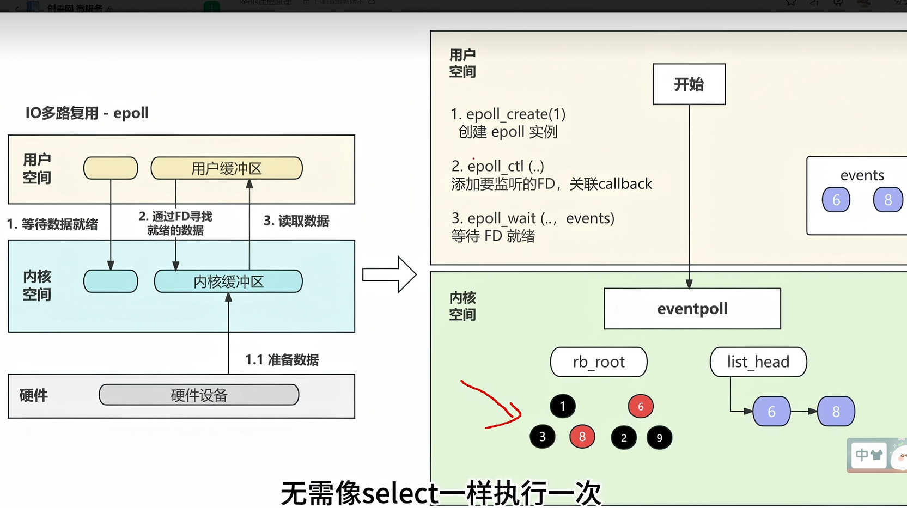

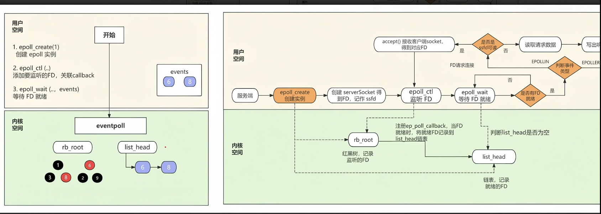


Linux中一切皆文件，当客户端发起一个连接请求时，accept，linux生成请求的文件描述符fd,fd是一个数，

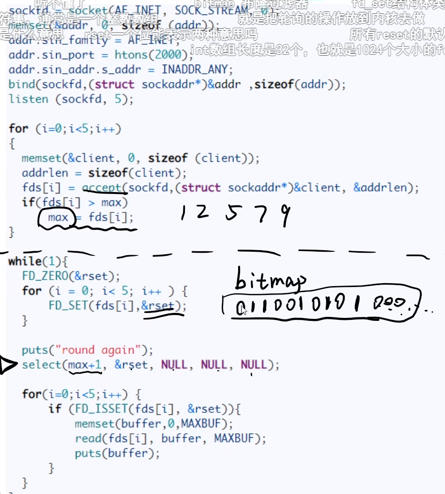

##### select

##### **原理**

- `select` 是最早的 I/O 多路复用机制。
- 它通过一个位掩码（`fd_set`）来管理文件描述符集合。
- 调用 `select` 时，内核会遍历所有被监视的文件描述符，检查它们的状态（可读、可写或异常）。
- 当有文件描述符就绪时，`select` 返回，并修改 `fd_set` 来指示哪些文件描述符已经就绪。

记录最大的文件描述符max,放入集合rset,包含了文件描述符，是一个bitmap(1024位)，再将这个rset放入内核态询问文件描述符是否有数据到来，rset不放入内核，在用户态询问，也是要切换到内核态，只不过一次一次，不如批次，内核态用户态切换一次就可以了。没有数据，程序会阻塞在select,有数据来，将对应的文件描述符置位1，然后在将内核的rset拷贝到用户态，判断哪些被置为了（置为rset）， 置位的会读取对应文件描述符的数据并进行处理。

缺点

- rset 1024，最多1024个请求
- rset是在内核中被修改的，不可重用，每次在用户态要重新赋值，每次调用 `select` 前，都需要重新初始化 `fd_set`。
- 用户态内核态切换
- 返回的不知道是哪些被置为的，需要自己判断


#### poll

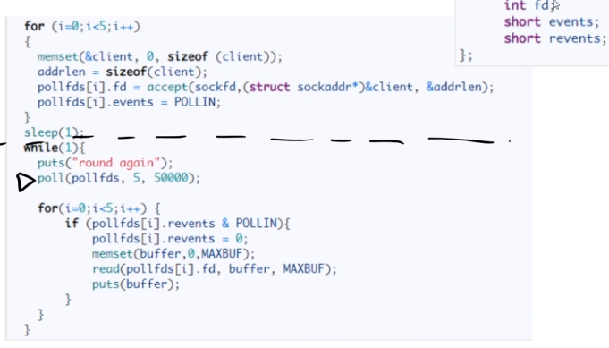

自己声明了一种结构体pollfds.events:表示读或者写或者读写

和select一样，

**区别**：

- 没用bitmap.而是一个pollfds数组
- 内核态的置位：将结构体中revents字段置为位
- 最后用户态的pollfds遍历，会将revents重新赋值为0

解决了哪些缺点：

- 1024限制
- 可重用

#### EPOLL

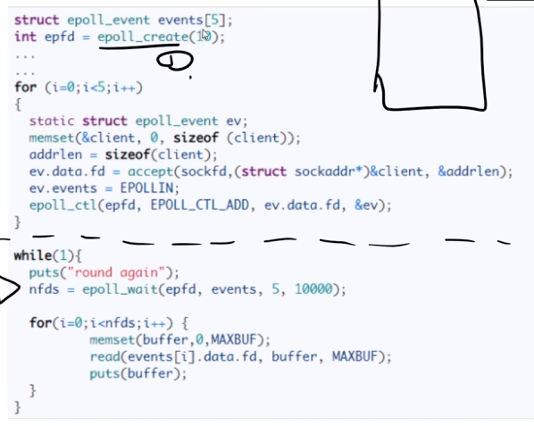

- 用户态通过 `epoll_ctl` 向 `epfd` 指向的 `epoll` 实例中添加、修改或删除文件描述符。

- 假设一个 `epoll` 实例监视了 3 个文件描述符：`fd1`、`fd2`、`fd3`。
- 当 `fd1` 和 `fd3` 有数据可读时，内核会将它们添加到就绪队列。
- 用户态调用 `epoll_wait`，内核返回 2（表示有 2 个文件描述符就绪），并填充 `events` 数组。
- 用户态遍历 `events` 数组，发现 `fd1` 和 `fd3` 就绪，然后读取它们的数据。


- 用红黑树管理文件描述符，没有数量限制
- `epoll` 使用回调机制，只有就绪的文件描述符会被通知，时间复杂度为 O(1)。
- **内存拷贝优化**：
  - 文件描述符集合只需在 `epoll_ctl` 时拷贝到内核空间，`epoll_wait` 时无需重复拷贝。
- **支持边缘触发（ET）和水平触发（LT）模式**：
  - 边缘触发（ET）：只在状态变化时通知一次。
  - 水平触发（LT）：只要状态满足条件，就会重复通知

- **内核通过回调机制通知就绪事件**：
  - `epoll` 使用回调机制来监视文件描述符的状态变化。
  - 当文件描述符的状态发生变化时（例如从不可读变为可读），内核会将该文件描述符添加到就绪队列中。
  - 当调用 `epoll_wait` 时，内核只需检查就绪队列并返回就绪的文件描述符，时间复杂度为 O(1)。


##### 切换

###### 1. **`epoll_ctl` 的用户态与内核态切换**

当我们调用：

```
c


复制编辑
epoll_ctl(epfd, EPOLL_CTL_ADD, fd, &event);
```

时，`epoll_ctl` 进入内核，执行如下步骤：

- 进行 **系统调用**（用户态 → 内核态）。
- 在内核中操作 `epoll` 的红黑树结构，将 `fd` 注册进去。
- 返回执行结果（内核态 → 用户态）。

###### **每次 `epoll_ctl` 调用都会导致一次用户态到内核态的切换**，即：

- **用户态 → 内核态**（进入 `epoll_ctl`）。
- **内核态 → 用户态**（返回 `epoll_ctl` 结果）。

因此，**如果我们有 N 个文件描述符（fd），需要调用 N 次 `epoll_ctl`，则会发生 `2N` 次用户态和内核态切换**。

如果有 **N 个 fd**：

1. `epoll_ctl` 需要 `N` 次调用，产生 `2N` 次切换。
2. `epoll_wait` 只发生 `2` 次切换（1 次进入，1 次返回）。


## 场景面试

### 缓存三件套

冷门商品一般设置过期时间，比如疫情时口罩，突然访问多了起来，恰好过期了，出现了**缓存击穿**。

- 数据设置永不过期。把能够预料的商品（设置访问量，如果某个商品访问量超过阈值或者只要有一次访问，就同步刷新过期时间）
- 加锁排队。 double check, 即使集群也没必要分布式锁，同步锁就可以，假设10个集群，数据库10个请求还是能抗住的，大道至简


缓存中的key集中过期了，或者服务器宕机，导致大量的请求访问数据库。压力数据库，出现**缓存雪崩**

- 随机失效时间
- 加锁排队
- redis高可用


请求数据redis没有，查询数据库，恶意攻击。**缓存穿透**

- 参数校验（不能完全杜绝）
- 缓存空对象，过期时间短一点。
- 布隆过滤器

### Redis连续登陆几天

bitmap实现

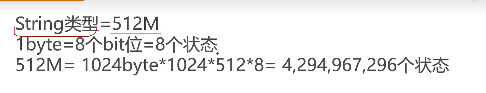

- 统计每一天的：key:日期，value,用户ID；统计所有用户效率高，单个用户需要遍历，用户量比较多适合，最近30天一般是，设置过期时间30天

### 给一亿个RedisKeys,统计双方共同好友

SINTERSTORE:取交集

一亿用户有点多，Neo4j针对社交场景，能快速查询这种

大数据套件：Hbase+Hadoop


### 防止重复下单

- 前端第一次点击的时候就把按钮变为不可用，防止用户点击多次
- setnx key:value+过期时间(2~3s),什么样的key（用户token::url::key）

### Redis6为什么引入多线程

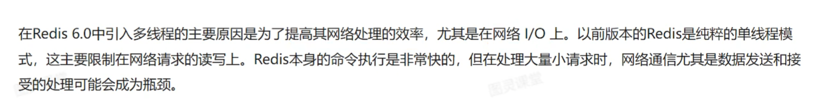

- 网络I/O瓶颈，Redis 6 引入了多线程来处理网络 I/O，将读取请求和写回响应的任务分配给多个线程，从而减轻主线程的负担，提升吞吐量。
- 多线程主要处理请求的网络I/O,实际执行任然在单线程中。避免了多线程对数据一致性和原子命令性的影响。
- **充分利用多核CPU**
  - 现代服务器通常配备多核 CPU，单线程模型无法充分利用多核资源。
  - 通过多线程处理网络 I/O，Redis 可以更好地利用多核 CPU，提升整体性能。
- **保持核心逻辑的单线程**
  - Redis 6 的多线程仅用于网络 I/O，核心的数据操作（如命令执行、数据存储）仍由单线程处理，避免了多线程带来的并发问题，如锁竞争和数据一致性问题。


### Redis的热Key如何解决

key访问的人特别多：几十万的并

- 本地缓存，提前能够预知到位。（java  cache, caffeine==>jvm里面）
- 热key拆分多个子key,
- 做限流
- 不可预知热key场景：做监控+报警，热点探测系统【统计哪些key的突发性，超过某个阈值，通知web应用，缓存到jvm】

### Redis大Key如何解决

单个key对应数据量过大（超过10KB）

- 网络延迟增大
- 阻塞redis性能：阻塞Redis单线程的性能
- 内存不足，OOM

解决：

- 分拆大Key,比如10w的list--->分拆成小的list
- 做压缩存储，
- 开启惰性删除。避免阻塞整个Redis
- 对集合类数据，使用SCAN命令遍历大KEY而不是KEYS,避免一次性加载所有的Key，内部有个游标做遍历


### 缓存与数据库双写不一致问题

- Cache aside pattern， 设置缓存时设置一个短一点的过期时间

- 分布式锁
- 利用canal中间件监听mysql的binlog，修改反馈到Redis


### KEY,VALUE设计原则

key:短小精炼，含义明确，：组织命名空间。结合业务逻辑，用业务标识。

value:类型数据类型选择。避免存储过大对象，拆分或者压缩。合理设置Blob,需要存储Blob数据，存放外部存储引擎。考虑存储引用或者索引


# Mysql

## 基础

### 存储引擎

- InnoDB:支持事务，外键，行级锁，聚簇索引
- MyISAM:不支持事务和外键，表级锁适合读多写少场景

## 索引

### 聚簇和非聚簇索引

### 索引下推

使用索引查找数据时，将部分查询条件下推到存储引擎层过滤，减少从表中需要读取得行，两种引擎都生效，5.6后


## 事务

### 什么是数据库事务？事务特性？

事务时数据库操作的最小单元，是作为单个逻辑工作单元执行的一系列操作，这些操作作为一个整体像系统提交，要么都执行，要么都不执行，是一组不可分割的操作集合。

ACID特性，

- 原子性：要么都执行，要么都不执行
- 一致性：事务执行结果必须使数据库从一个一致性状态转换为另一个一致性状态
- 隔离性：一个事务执行不能被其他事务干扰
- 永久性，（持续性）：一个事务被提交，最终的状态改变行应该是永久性的。

### 并发事务的问题

### 隔离级别

- 读未提交：可以读取到另一个事务未提交的数据。造成**脏读**
- 读已提交：一个事务只能看到其他事务已经提交的数据，**造成不可重复读**，相同的事务多次读取返回不同的结果。
- 可重复读：可以确保在同一个事务中，相同的查询返回相同的结果，**幻读**：多次查询可能返回不同的行数，一个事务count=5,另一个事务插入一条，之前的事务再次count就等于6.默认的隔离级别
- 串行化，可以避免所有的并发问题


### 如何选择事务的隔离级别

### 锁

在`InnoDB`中，如果一条`SQL`语句能命中索引执行，那就会加行锁，但如果无法命中索引加的就是表锁。

#### 死锁

现在一张表：记录用户ID，关注数量，被关注数量；已知A关注了B，接口1：取消关注，A取消B的关注：数据库A行关注数-1，数据库B行被关注数-1；接口2：添加关注，B关注A: 数据库B关注数+1，数据库A行被关注数+1；这两个接口如果同时触发，有死锁风险吗


`MySQL`会自动检测并介入，强制回滚结束一个“死锁的参与者（事务）”，从而打破死锁的僵局，让另一个事务能继续执行。需要对username加索引。

#### 锁范围

```java
SELECT * FROM users FOR UPDATE; -- 没有WHERE子句
    锁的范围：这条语句会查询并锁定表中的所有行。同样，它对所有行加的是临键锁。
    
SELECT * FROM users WHERE name = 'Alice' FOR UPDATE; -- name字段没有索引
    锁全表
```


#### 表级锁

表级锁是 MySQL 中最基本的锁机制，锁定整张表。表级锁的优点是实现简单，开销小；缺点是并发性能差。适用于 MyISAM 存储引擎（默认使用表级锁）。

- **表共享读锁（Table Read Lock）**：
  - 多个事务可以同时获取读锁。
  - 读锁会阻塞其他事务的写操作。
- **表独占写锁（Table Write Lock）**：
  - 只有一个事务可以获取写锁。
  - 写锁会阻塞其他事务的读和写操作

#### 行锁

行级锁是 InnoDB 存储引擎的默认锁机制，锁定表中的某一行或几行。行级锁的优点是并发性能高；缺点是实现复杂，开销大。

##### **行级锁的类型**

- **共享锁（S锁，读锁）**：
  - 允许事务读取数据。
  - 阻止其他事务获取排他锁。
- **排他锁（X锁， 写锁）**：
  - 允许事务修改数据。
  - 阻止其他事务获取共享锁或排他锁。

##### **行级锁的实现方式**

- **记录锁（Record Lock）**：
  - 锁定索引记录。
  - 例如：`SELECT * FROM table WHERE id = 1 FOR UPDATE;`
- **间隙锁（Gap Lock）**：
  - 锁定索引记录之间的间隙。
  - 防止其他事务在间隙中插入数据，避免幻读。
  - 例如：`SELECT * FROM table WHERE id BETWEEN 1 AND 10 FOR UPDATE;`
  - **锁定查询结果集中的行**：
    - 当使用 `SELECT ... FOR UPDATE` 时，MySQL 会对查询结果集中的每一行加 **排他锁（X锁）**。
    - 其他事务无法对这些行加锁（包括共享锁和排他锁），也无法修改或删除这些行。
- **临键锁（Next-Key Lock）**：
  - 记录锁 + 间隙锁的组合。
  - 锁定索引记录及其前后的间隙。
  - 例如：`SELECT * FROM table WHERE id > 1 FOR UPDATE;`

#### 意向锁：

- 意向共享锁IS: 表示事务打算在表中的某些行上加共享锁,

- 意向排他锁IX: 表示事务打算在表中的某些行上加排他锁。
- 当一个事务需要对表中的某些行加锁时，首先需要获取表级的意向锁。
- 意向锁不会阻塞其他事务的操作，但可以快速检测锁冲突


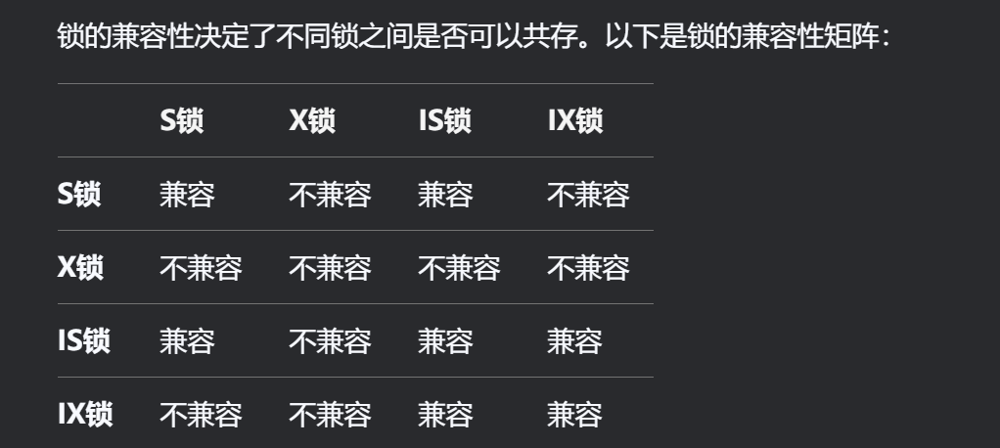


#### InnoDB支持:

支持行锁，表锁，间隙锁，

#### MySQl死锁原因和解决方法

无法直接避免

##### 解决：：：

- 快速失败：innodb_lock_wait_timeout,行锁超时时间
- 拆分sql,严禁大事务
- 充分利用索引，优化索引，优化where条件前缀批评配，减少表锁
- 操作多张表，尽量以相同的顺序来访问避免形成等待环路
- 单表操作先排序在操作
- 使用排他锁 for update

### MVCC多版本并发控制

不能解决幻读,用于实现高并发访问的一种技术。它通过维护数据的多个版本来避免读写冲突，从而提高并发性能。MVCC 是 MySQL 的 InnoDB 存储引擎实现事务隔离级别（如 **Read Committed** 和 **Repeatable Read**）的核心机制。

MVCC:维护某行数据的多个版本信息，返回给用户某个版本的数据，具体返回那个版本由mvcc根据readview+可见性算法规则控制。

### 当前读和快照读

select。。。。。lock in share mode

select.................for update

insert

update

delete

是当前读,和锁是相关的。，读取最新数据

select....................... MVCC非阻塞式读


#### **MVCC 的核心思想**

MVCC 的核心思想是为每个事务提供一个数据的 **快照（Snapshot）**，使得事务在读取数据时不需要加锁，从而避免读写冲突。

- 每个事务在开始时都会获得一个唯一的事务 ID（Transaction ID）。
- 每条记录会维护多个版本，每个版本包含创建该版本的事务 ID 和删除该版本的事务 ID。
- 事务根据自身的隔离级别和事务 ID 决定可以访问哪些版本的数据

#### **MVCC 的关键组件**

##### (1) **事务 ID（Transaction ID）**

- 每个事务在启动时会被分配一个唯一的事务 ID（递增）。
- 事务 ID 用于标识数据的版本。

##### (2) **Undo Log（回滚日志）**

- Undo Log 用于存储数据的旧版本。
- 当数据被修改时，旧版本的数据会被写入 Undo Log，以便其他事务可以访问旧版本。

##### (3) **Read View（读视图）**

- Read View 是事务在某个时间点对数据库的可见性快照。
- 它包含以下信息：
  - `m_ids`：当前活跃的事务 ID 列表。事务启动还没有commit
  - `min_trx_id`：`m_ids` 中的最小事务 ID。版本连末尾的事务ID
  - `max_trx_id`：下一个即将分配的事务 ID。max(m_ids+1)
  - `creator_trx_id`：创建该 Read View 的事务 ID。
  - 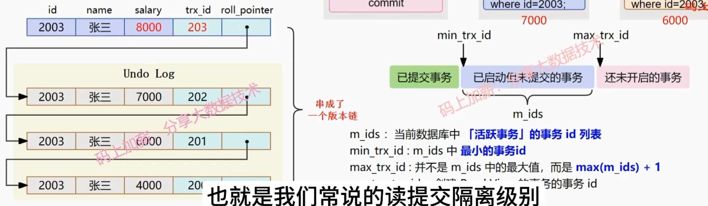


RC级别

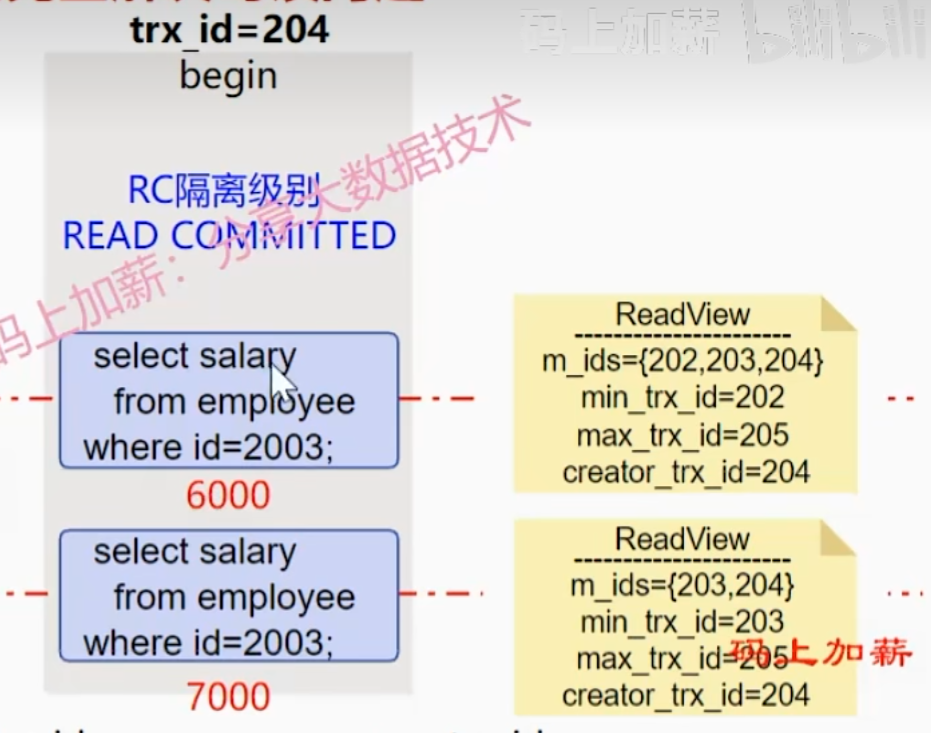

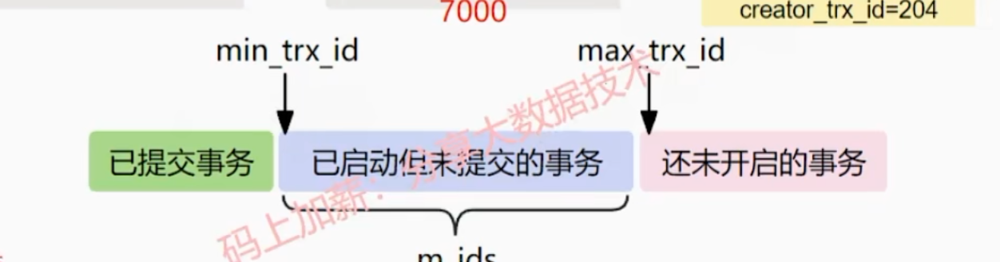

RR级别

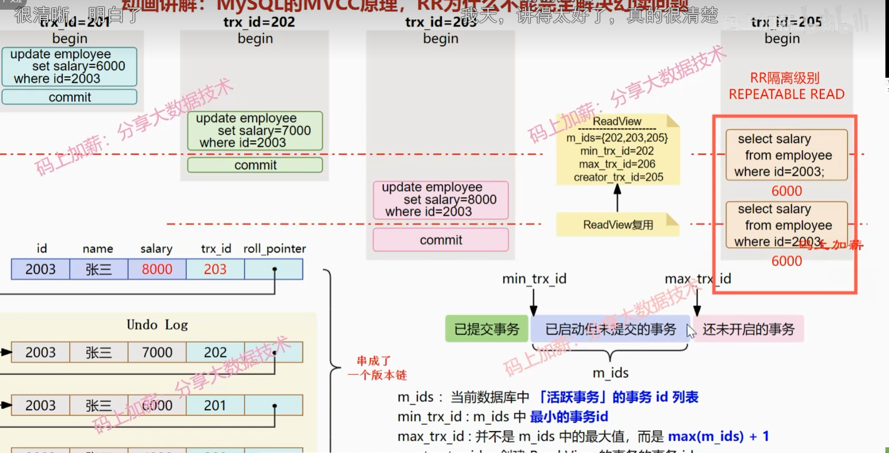

### MVCC可以避免幻读吗？


- 在可重复读隔离级别下，MySQL 的 InnoDB 引擎通过 MVCC 实现了一致性读（Consistent Read），确保同一个事务内的多次查询结果一致，因此可以避免幻读。readview视图都是同一个。MVC在快照读是可以避免一定的幻读的，当前读不能解决
- 在串行化隔离级别下，无论是 MySQL 还是 PostgreSQL，都会通过更强的锁机制（如范围锁）来严格保证事务的顺序执行，从而彻底避免幻读。
- 在串行化隔离级别下，幻读会被完全避免，但这是通过锁机制实现的，而不是单纯依赖 MVCC。

 RR隔离级别下，比如一个读事务1在查询了一条信息后，会生成一个读视图，这个视图假设只有一条数据，另一个事务2在事务1读取后，插入了一条数据并提交，读事务也发起了一条更新语句update，注意update是当前读。**如果update更新的数据包括了事务2插入的数据（如果没包括就不会比如范围更新通过临建锁破坏了可重复读）**，那么由于当前读是读取最新的，读视图不会变，但由于修改是自己修改的

​        在MySQL中，RR隔离级别下，如果只是使用MVCC而没有间隙锁的话，可能无法完全避免幻读。比如，当另一个事务插入新数据并提交后，当前事务如果执行了更新操作，可能会导致看到这些新插入的数据，从而出现幻读。比如，假设事务A第一次查询某个条件得到结果集，事务B插入符合该条件的新数据并提交，事务A再次查询可能看不到，但如果事务A执行了一个更新操作，更新所有符合该条件的数据，这时候事务A的后续查询可能会看到这些新数据，因为更新操作会读取最新的数据版本，导致幻读。MySQL中，RR隔离级别下，通过MVCC和间隙锁共同作用才能避免幻读，而单独的MVCC可能无法做到。

也就是用间隙锁锁住原来范围的，不让更新到其它事务在当前事务中满足条件的行。


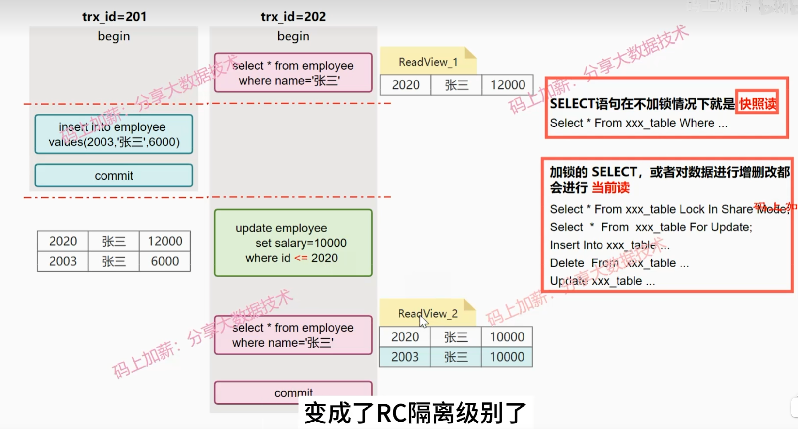

### 原子行如何实现

通过锁和MVCC实现了执行过程中的一致性和原子性

备灾方面通过 Redo log实现。把事务对数据库的修改都记录下来，

## 日志

- 错误日志
- 慢查询日志，记录Mysql中响应时间超过阈值的语句，结合Explain
- redo log重写日志：基于磁盘的日志，记录修改之后的值。还没来得及从内存更新到磁盘
- undo log回滚日志： 记录修改之前的值，事务失败回滚
- bin log二进制日志:记录增删改的记录日志，作用主从复制，数据恢复

## 场景

### 慢查询排查

慢日志，explain

### 优化器为什么选择这一条索引

使用Explain optimizer_trace

### Explain 指标重要的

- type: ALl:全表，Ref:性能好一点

- key: 使用得索引
- rows：命中多少行
- filtered：有效率百分比

### MySql Cpu飙升如何分析

- 排查是否是mysql导致，
- 使用top查看Mysqld得cpu利用率
  - 切换到常用数据库
  - 使用show full process list查看会话
  - 观察哪些sql消耗了资源，观察state指标
  - 定位到具体sql
- pidstat

#### count(*)和count(列)

前者所有，后者Null不会统计

#### 如果超大分页：

- select name from limit 1000,  10 如果主键自增，可以select name from limit 10000,  10 where id > 10000

- 需要order by 时，注意筛选条件，避免全表排序
- 延迟关联，通过内部子查询


## 常见问题

### 索引

#### 索引虽然能给`MySQL`检索数据的效率带来质的飞跃，但加入索引没有带来新问题吗？

- 建立索引会生成本地磁盘文件，需要额外的空间存储索引数据，磁盘占用率会变高。
- 写入数据时，需要额外维护索引结构，增、删、改数据时，都需要额外操作索引。
- 写入数据时维护索引需要额外的时间开销，执行写`SQL`时效率会降低，性能会下降。

但对数据库整体来说，索引带来的优势会大于劣势

#### 主键ID为很么递增

由于主键索引是聚簇索引，当后续节点需要挪动时，也就代表着还需要挪动表数据，如果是偶尔需要移动还行，但如果主键字段值无序，那代表着几乎每次插入都有可能导致树结构要调整。但使用自增`ID`就不会有这个问题，所有新插入的数据都会放到最后

#### 前缀索引问题

前缀索引的特点是短小精悍，我们可以利用一个字段的前`N`个字符创建索引，以这种形式创建的索引也被称之为前缀索引，相较于使用一个完整字段创建索引，前缀索引能够更加节省存储空间，当数据越多时，带来的优势越明显。

假设你有一个 `users` 表，其中 `email` 字段非常长（如 `very.long.email.address@example.com`）。你决定只为 `email` 字段的前10个字符创建索引来节省空间：

```
CREATE INDEX idx_email_prefix ON users (email(10));
```


这个 `idx_email_prefix` 索引只存储每个 `email` 值的前10个字符（例如 `'very.long.'`）

由于其索引节点中，未存储一个字段的完整值，所以`MySQL`也无法通过前缀索引来完成`ORDER BY、GROUP BY`等分组排序工作，同时也无法完成覆盖扫描等操作。

#### 全文索引

基于分词实现

模糊查询时，通常都会使用`like%`语法；可以利用全文索引代替`like%`语法实现模糊查询，它的性能会比`like%`快上`N`倍。

项目规模较大，通常再引入`ElasticSearch、Solr、MeiliSearch`等搜索引擎是一个更佳的选择。

#### 索引建立需要注意的地方

经常当做查询条件使用，也不一定，比如性别只有两个值，

①经常频繁用作**查询条件**的字段应**酌情**考虑为其创建索引。

②表**的主外键或连表字段**，必须建立索引，因为能很大程度提升连表查询的性能。

③建立索引的字段，一般值的**区分性**要足够高，这样才能提高索引的检索效率。

④建立索引的字段，**值不应该过长**，如果较长的字段要建立索引，可以选择**前缀索引**。

⑤建立联合索引，应当**遵循最左前缀**原则，将多个字段之间按优先级顺序组合。

⑥经常根据**范围取值、排序、分组**的字段应建立索引，因为索引有序，能**加快排序**时间。

⑦对于唯一索引，如果确认不会利用该字段排序，那可以将结构改为`Hash`结构。

⑧尽量使用联合索引代替单值索引，联合索引比多个单值索引查询效率要高。

#### 当表中存在多个索引时，一条查询`SQL`有多条路径可走，此时走哪条索引最好

表中存在多个索引时，数据库优化器（Optimizer）会扮演“导航软件”的角色，它的任务就是从所有可能的路径（索引）中，选择一条它认为**成本（Cost）最低**的路径来执行查询。

考虑：

- 覆盖索引，范围，排序分组

#### EXPLAIN

#### 索引失效

- OR可能会走全表， 改用Union

- like以%开头， 以%结尾可以
- 字符类型查询不带引号， 类型转换
- 索引字段参与计算或者用于函数
- 不满足最左原则
- 不同字段对比

```sql
EXPLAIN SELECT * FROM `zz_users` WHERE user_name = user_sex;
```

- 反向范围查询， not in, !=,is Not null

#### 跳跃索引扫描，mysql8,打破最左原则

```sql
SELECT * FROM `tb_xx` WHERE B = `xxx` AND C = `xxx`;
```

`SQL`中都已经使用了联合索引中的两个字段，结果还不能使用索引，这似乎有点亏啊对不？因此`MySQL8.x`推出了跳跃扫描机制，但跳跃扫描并不是真正的“跳过了”第一个字段，而是优化器为你重构了`SQL`，比如上述这条`SQL`则会重构成如下情况：

- 探测A有哪些值
- 将单一查询拆分多个范围查询最后合并

#### 索引下推

```sql
INSERT INTO `zz_users` VALUES(5,"竹竹","女","8888","2022-09-20 22:17:21");

SELECT * FROM `zz_users` WHERE `user_name` LIKE "竹%" AND `user_sex`="男";

```

```json
{
    ["熊猫","女","6666"] : 1,
    ["竹子","男","1234"] : 2,
    ["子竹","男","4321"] : 3,
    ["1111","男","4321"] : 4,
    ["竹竹","女","8888"] : 5
}

```


- 利用联合索引中的`user_name`字段找出「竹子、竹竹」两个索引节点。
- 返回索引节点存储的值「`2、5`」给`Server`层，然后去逐一做回表扫描。
- 在`Server`层中根据`user_sex="男"`这个条件逐条判断，最终筛选到「竹子」这条数据。

**索引下推**

- ①利用联合索引中的`user_name`字段找出「竹子、竹竹」两个索引节点。
- ②根据`user_sex="男"`这个条件在索引节点中逐个判断，从而得到「竹子」这个节点。
- ③最终将「竹子」这个节点对应的「`2`」返回给`Server`层，然后聚簇索引中回表拿数据

相较于没有索引下推之前，原本需要做「`2、5`」两次回表查询，但在拥有索引下推之后，仅需做「`2`」一次回表查询。

### 机制

#### MRR机制【read_rnd_buffer】

**传统的执行流程（无MRR）：**

1. **索引扫描：** 服务器层向存储引擎请求 `age` 在 20 到 30 之间的记录。
2. **回表查询：** 存储引擎通过遍历 `idx_age` 索引，找到所有匹配的**主键值（Primary Key, PK）**。
3. **随机I/O：** 对于每一个找到的主键值，存储引擎**立即**回到主键索引（聚簇索引）的B+树中，去查找对应的完整数据行。
4. **返回结果：** 将一行行完整的数据返回给服务器层。

**启用MRR后的执行流程：**

1. **索引扫描：** 和之前一样，存储引擎通过二级索引 `idx_age` 找到所有匹配记录的主键值。
2. **缓存与排序：** 存储引擎将这些主键值**缓存在一个缓冲区（Buffer）** 中，而不是立即回表。
3. **排序主键：** 当缓冲区满或所有主键都收集完毕后，MRR会将这些主键值**按照主键顺序进行排序**。
4. **顺序I/O：** 存储引擎**按照排序后的主键顺序**，回到主键索引中批量读取对应的完整数据行。
5. **返回结果：** 将数据返回给服务器层。

**这个过程的致命缺陷：**
由于辅助索引中存储的主键值很可能是**乱序**的（比如先找到主键ID=101，然后是500，然后是23...），导致每次回表查询都是在主键索引树的不同位置进行读取。这会产生大量的**随机磁盘I/O**。随机I/O是数据库性能的主要杀手，因为它需要频繁移动磁头（在HDD上）或在不同内存页间跳跃（在SSD上也好不了太多），速度比顺序I/O慢几个数量级。


MRR：针对辅助所以回表查询，减少离散IO ，解决**大量随机I/O**带来的性能瓶颈

原理：对于辅助索引中查询出的`ID`，会将其放到缓冲区的`read_rnd_buffer`中，然后等全部的索引检索工作完成后，或者缓冲区中的数据达到`read_rnd_buffer_size`大小时，此时`MySQL`会对缓冲区中的数据排序，从而得到一个有序的`ID`集合：`rest_sort`，最终再根据顺序`IO`去聚簇/主键索引中回表查询数据。

##### MRR带来的巨大优势

1. **显著减少随机I/O（最重要的优势）**
   - 将大量的、分散的随机磁盘读取，转变为少量的、连续的顺序读取。顺序I/O的效率远高于随机I/O，尤其是在传统机械硬盘（HDD）上，性能提升是颠覆性的。
2. **预读（Read-Ahead）优化**
   - 现代存储引擎都有预读机制。当MRR进行顺序读取时，存储引擎可以非常有效地预测并提前将接下来可能需要的数据页加载到内存缓冲区（Buffer Pool）中，进一步减少等待时间。
3. **缓存命中率提升**
   - 按主键顺序访问数据页，意味着同一个数据页只需要被加载一次。而在随机I/O中，同一个数据页可能会被多次加载和驱逐出缓存，造成缓存浪费。


#### 预读

局部性原理的思想比较简单，比如目前有三块内存页`x、y、z`是相连的，`CPU`此刻在操作`x`页中的数据，那按照计算机的特性，一般同一个数据都会放入到物理相连的内存地址上存储，也就是当前在操作`x`页的数据，那么对于`y，z`这两页内存的数据也很有可能在接下来的时间内被操作，因此对于`y，z`这两页数据则会提前将其载入到高速缓冲区（`L1/L2/L3`），这个过程叫做利用局部性原理“预读”数据。


`MySQL`一次磁盘`IO`不仅仅只会读取一条表数据，而是会读取多条数据，那到底读多少条数据呢？在`InnoDB`引擎中，一次默认会读取`16KB`数据到内存。

### MVCC

#### 隔离级别：

- 读未提交：可以读取到另一个事务未提交的数据。造成**脏读**
- 读已提交：一个事务只能看到其他事务已经提交的数据，**造成不可重复读**，相同的事务多次读取返回不同的结果。
- 可重复读：可以确保在同一个事务中，相同的查询返回相同的结果，**幻读**：多次查询可能返回不同的行数，一个事务count=5,另一个事务插入一条，之前的事务再次count就等于6.默认的隔离级别
- 串行化，可以避免所有的并发问题

#### MVCC

简短版本：

- Innodb每行数据会有隐藏字段，这条数据的事务ID,指向旧版本快照的指针
- MVCC通过版本快照+可见性规则+读视图解决脏读，不可重复读

版本快照：undolog链，通过行数据隐藏指针指向

读视图：mids集合，最小min_id,最大max_id

规则：

从最新的版本开始查找：

- 行数据事务ID（DRX_ID）==当前事务ID(CUR_ID)，可见，当前事务总能看见自己的修改

- DRX_ID>MAX_ID,说明这个数据是读史图之后的，不可见
- <, 说明这个数据是在读史图之前的，可见
- 之间：DRX_ID在mids中，未提交【脏读】，不可见
- ​           不在，可见。

#### 幻读

临建锁，间隙锁，行锁

快照读会幻读

### 数据结构

#### Mysql B树和B+树

**在 InnoDB 存储引擎中，无论是聚簇索引（Clustered Index）还是非聚簇索引（Non-Clustered Index，也叫二级索引 Secondary Index），其底层数据结构都是 B+Tree**

B树不适合范围查询，

**B+树：**

- 叶子节点和非叶子节点，
- 叶子节点存在一个单项指针指向下一个节点的位置，

#### 双向链表

- 高效的范围查询（Range Queries）

- 所以支持从后往前的遍历。这对于 `ORDER BY ... DESC` 这样的降序查询非常高效，无需从根节点重新开始查找
- 当需要扫描整个表时（例如没有合适的索引可用），优化器可以直接沿着叶子节点的链表从头到尾顺序遍历一遍。这比在B+树中上下递归遍历要高效得多。

#### 存放数据计算

单个索引节点容量为`16KB`，主键字段值为`4B`，指针大小为`6B`，一个完整的索引信息是由主键字段值+指针组成的，也就是`4+6=10B`，那此时先来计算一下单个节点中可存储多少个索引信息呢？数据大小1K

16KB/10B = 1638 * 1638 * 16 = 42928704 高度为3

### 内存

#### 连接池

数据库的连接池中，存的到底是什么？存的实际上就是数据库连接对象，`MySQL`内部的连接对象，其中包含了客户端连接信息，如客户端`IP`、登录的用户、所连接的`DB`....等这类信息

#### 工作线程内存区域

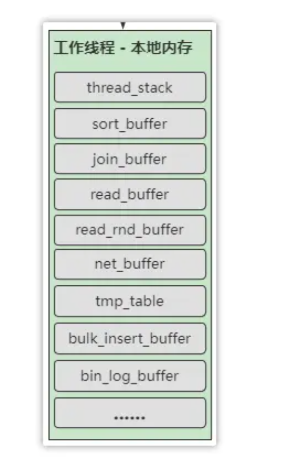


`thread_stack`：线程堆栈，主要用于暂时存储运行的`SQL`语句及运算数据，和`Java`虚拟机栈类似。

`sort_buffer`：排序缓冲区，执行排序`SQL`时，用于存放排序后数据的临时缓冲区。

`join_buffer`：连接缓冲区，做连表查询时，存放符合连表查询条件的数据临时缓冲区。

`read_buffer`：顺序读缓冲区，`MySQL`磁盘`IO`一次读一页数据，这个是顺序`IO`的数据临时缓冲区。

`read_rnd_buffer`：随机读缓冲区，当基于无序字段查询数据时，这里存放随机读到的数据。

`net_buffer`：网络连接缓冲区，这里主要是存放当前线程对应的客户端连接信息。

`tmp_table`：内存临时表，当`SQL`中用到了临时表时，这里存放临时表的结构及数据。

`bulk_insert_buffer`：`MyISAM`批量插入缓冲区，批量`insert`时，存放临时数据的缓冲区。

`bin_log_buffer`：`bin-log`日志缓冲区，[《日志篇》](https://juejin.cn/post/7157956679932313608#heading-11)提到过的，`bin-log`的缓冲区被设计在工作线程的本地内存中。


#### Buffer Pool

`InnoDB`会构建自己的`Buffer`缓冲区

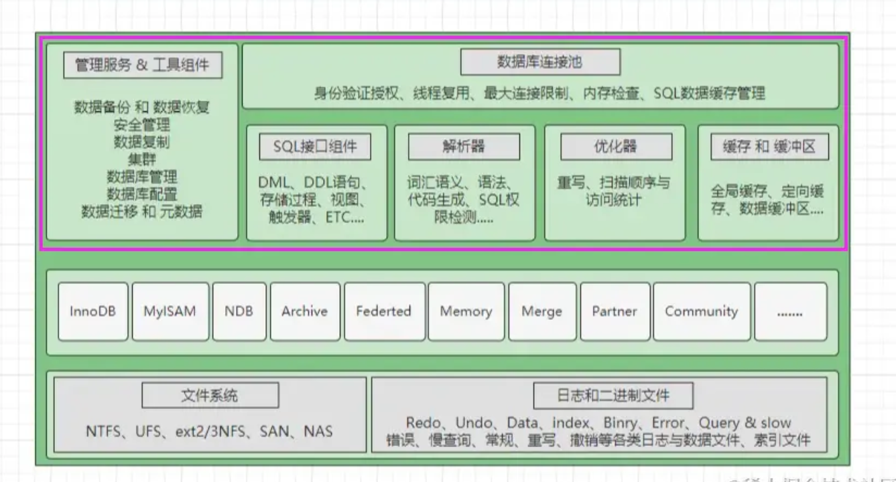

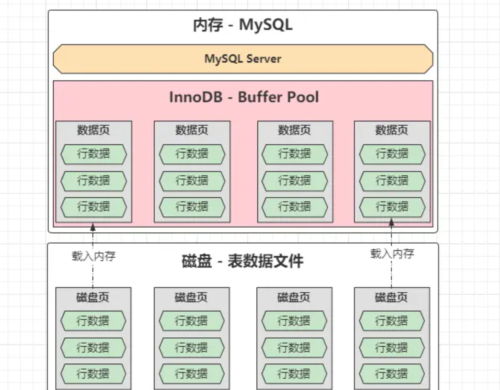


#### buffer pool和buffer change

##### pool

- **缓存数据页**：Buffer Pool 将磁盘上的表数据和索引数据以“页”（Page，通常为16KB）为单位缓存到内存中。

- **读写中转站**：
  - **读操作**：当需要读取数据时，InnoDB 首先检查数据页是否在 Buffer Pool 中。如果在（称为“命中”），直接返回；如果不在（称为“缺页”），则从磁盘加载到 Buffer Pool 再返回。
  - **写操作**：当需要修改数据时，InnoDB 直接在 Buffer Pool 中修改对应的数据页。这些被修改过的、与磁盘版本不一致的页，被称为**脏页（Dirty Page）**。
- **缓存管理**：它使用经典的 **LRU（最近最少使用）算法** 的变体来管理哪些页应该留在内存中，哪些应该被淘汰，以便为新的数据页腾出空间。

#####  change

Change Buffer 是 Buffer Pool 中的一块特殊内存空间，用于**缓存对非唯一二级索引（Secondary Index）的更改操作**（INSERT, UPDATE, DELETE, PURGE）。

**想象一个场景：要向表中插入一条新记录，这条记录涉及更新多个二级索引（例如，在 `name` 和 `email` 字段上都有索引）**。

1. 数据页（聚簇索引）被加载到 Buffer Pool 并修改。
2. 为了更新二级索引，需要将**各个二级索引页**也从磁盘加载到 Buffer Pool 中进行修改。
3. 这些二级索引的更新通常是**随机**的（新数据可能位于索引树的任何位置），这意味着每次更新都可能需要一次**昂贵的随机磁盘 I/O** 来读取索引页，这会极大地拖慢写入速度。

Change Buffer 的巧妙之处在于**延迟和合并**：

- **延迟写入**：当需要修改**非唯一二级索引**时，**并不立即将对应的索引页从磁盘读入内存**，而是直接将这个**修改动作**（例如“在索引A中插入值X”）记录到 Change Buffer 中。
- **合并写入（Merge）**：将来，当这个二级索引页因为其他查询**被真正加载到 Buffer Pool** 时，InnoDB 才会将 Change Buffer 中所有关于这个页的修改**合并（Merge）** 应用到该索引页上，使其更新到最新状态。之后，这个被修改的索引页也就变成了脏页，由后台线程刷回磁盘。

**优势**

- **大幅提升写性能**：尤其适用于**写多读少**的业务场景（如日志系统、OLTP 系统的非热点数据）。它将大量随机的、离散的磁盘 I/O，转换为了更高效的内存操作和后续的顺序 I/O（当刷脏页时）。
- **减少内存开销**：避免了立即加载大量低使用率的索引页到宝贵的 Buffer Pool 中。

### 日志

总的来说，可以分为两大类：**服务器层日志**和**存储引擎层日志（主要是InnoDB）**。

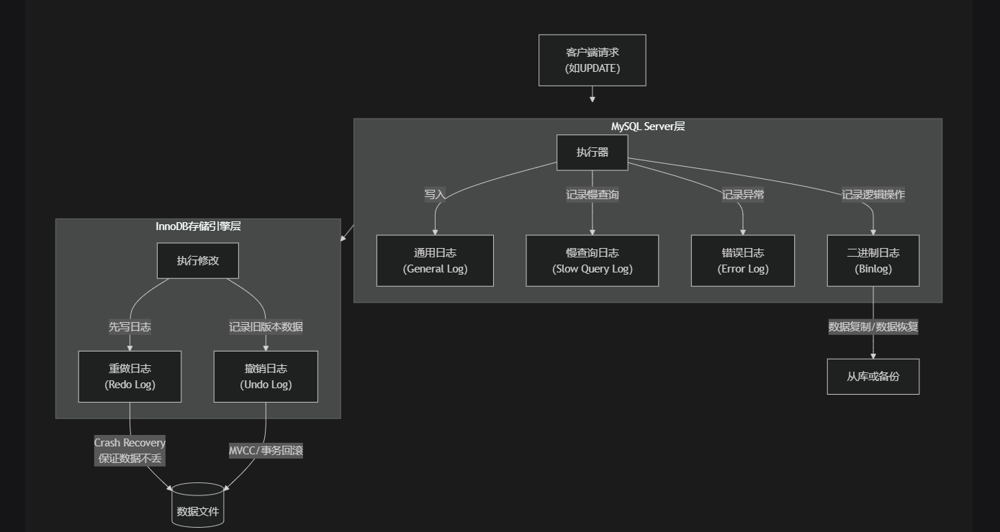


#### 1. 二进制日志 Binlog (Binary Log)

- **所属层级**：**MySQL Server层**，所有存储引擎都可使用。
- **内容**：记录所有**更改数据**的**逻辑操作**语句（如SQL语句）或更改后的行数据（格式可配置）。
- **写入时机**：在事务**提交时**进行写入。
- **主要用途**：
  1. **主从复制 (Replication)**：主库将Binlog发送给从库，从库重放这些操作，从而实现数据同步。
  2. **数据恢复 (Point-in-Time Recovery, PITR)**：可以使用`mysqlbinlog`工具重放某个时间点之间的所有操作，实现基于时间的恢复。
- **关键特性**：**追加写入**，文件写满后会切换到下一个文件。

#### 2. 重做日志 Redo Log

- **所属层级**：**InnoDB存储引擎层**特有。
- **内容**：记录的是对每个**数据页（Page）的物理修改**（例如：”在表空间XX、页YY、偏移量ZZ处写入数据‘abc’“）。
- **写入时机**：事务**执行过程中**不断写入。
- **主要用途**：**崩溃恢复 (Crash Recovery)**。
  - **为什么需要？**：因为修改数据时，首先在Buffer Pool中操作（内存），而不是直接写磁盘。如果事务提交后，脏页还没刷盘，此时数据库宕机，内存中的数据就丢失了。
  - **如何工作？**：Redo Log会先于数据页被持久化到磁盘（**WAL, Write-Ahead Logging 预写式日志** 原则）。宕机重启后，InnoDB会重放Redo Log中的操作，将提交的事务数据重新应用到磁盘上，保证数据不丢失。
- **物理组成**：通常由两个文件（`ib_logfile0`, `ib_logfile1`）组成，**循环写入**。

#### 3. 撤销日志 Undo Log

- **所属层级**：**InnoDB存储引擎层**特有。
- **内容**：记录事务**开始前**数据的旧版本。用于回滚事务和实现MVCC。
- **主要用途**：
  1. **事务回滚 (Rollback)**：当执行`ROLLBACK`时，Undo Log会将数据恢复到修改前的状态。
  2. **实现MVCC (多版本并发控制)**：这是实现**读已提交（RC）** 和**可重复读（RR）** 隔离级别的关键。当其他事务需要读取某行的旧版本时，可以通过Undo Log链来构建该行的历史版本，从而提供一致性非锁定读。
- **存储位置**：存放在**全局表空间**或**独立的Undo表空间**中


#### 4. 错误日志 Error Log

- **内容**：记录MySQL服务器**启动、运行、停止**过程中的详细错误、警告和提示信息。
- **重要性**：是诊断数据库问题的**首要查看地点**。任何启动失败、运行中的严重错误都会在这里体现。
- **文件默认名**：`hostname.err`

#### 5. 慢查询日志 Slow Query Log

- **内容**：记录执行时间超过指定阈值（`long_query_time`）的SQL语句。还可以配置记录未使用索引的查询。
- **主要用途**：**性能分析和优化**。DBA通过分析慢查询日志来找出需要优化的SQL语句。
- **注意**：开启后会带来轻微性能开销，一般只在需要优化时临时开启


#### 日志协同

**它们如何协同工作？（以Update为例）**

1. 事务开始。
2. 记录Undo Log（用于回滚和MVCC）。
3. 修改Buffer Pool中的数据页。
4. 记录Redo Log到Log Buffer（保证持久性）。
5. 事务准备提交。
6. Redo Log持久化到磁盘（**刷盘阶段**）。
7. 记录Binlog到磁盘（**提交阶段**）。
8. 事务提交成功。
9. （后台）最终将Buffer Pool中的脏页刷回磁盘数据文件。


# RabbitMQ


# 分布式

## 1.分布式和微服务

分布式系统:一个系统，不同组件部署在不同的服务器，多个不同的组件分布在网络中互相协作。一个组件的多个副本组成集群，解决单点问题，避免单点故障，造成系统不可用.更全面的应用

微服务：不一定是分布式系统，是一个应用拆分不同服务，服务分开部署，应用内通过服务协作完成一些功能，需要一些组件来协调服务之间的相互协作，注册中心。

## 2.CAP

C:一致性

A:可用性

P:分区容错性：分布式系统遇到结点或者网络分区故障时，人能保障系统对外提供服务。

C和A不能同时满足。P是分布式基本特性

## 3.Base理论

CAP全都要，但做了一些妥协

BA:基本可用，牺牲一些非核心的功能，保证核心的可用。降级、熔断、限流

软状态：有8个结点，保证8个结点的一致性，允许数据同步存在延迟。但最终的一致性（人工补偿，MQ去补偿）

## 4.分布式锁的实现

1.Mysql,数据苦的行锁，延迟大

2.Zookeeper,

3.Redis,通过消费订阅，数据超时，lua脚本。

## 5. 分布式id生成方案

- uuid, 无序，重复概率极低； 当前时间，时钟序列，全局唯一IEEE及其识别号
- 数据库自增序列
- 中间件，redis等
- 雪花算法，生成64bit的整数数字，42位时间戳，10位workID,12位序列号，依赖机器始终，时钟回拨，导致重复ID，（测试环境）

## 分布式缓存寻址算法

缓存村多个结点。

- hash算法， 结点数固定，不好扩充
- 一致性hash
- hash slot,


# ZOOKEEPER


### 数据一致性如何保证

- 弱一致性
- 最终一致性
- 强一致性

Zookeeper尽量保证强一致性，达到最终一致性，

#### ZAB模式

### 快速领导选举

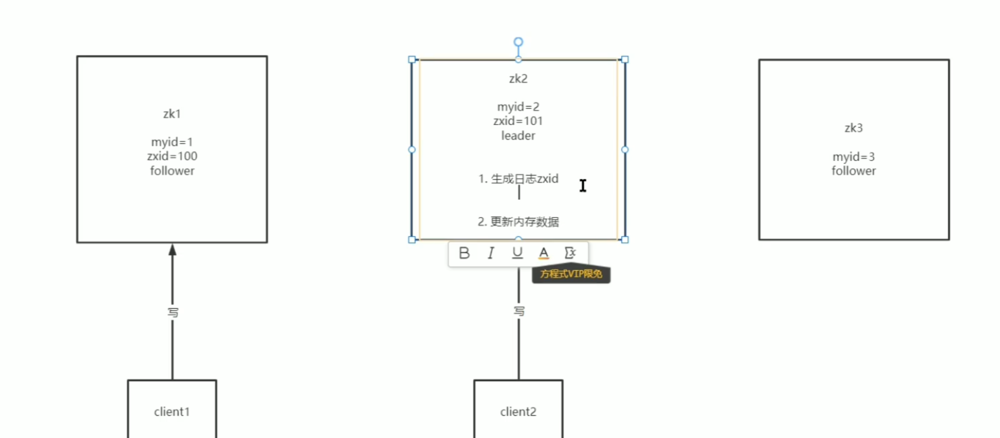


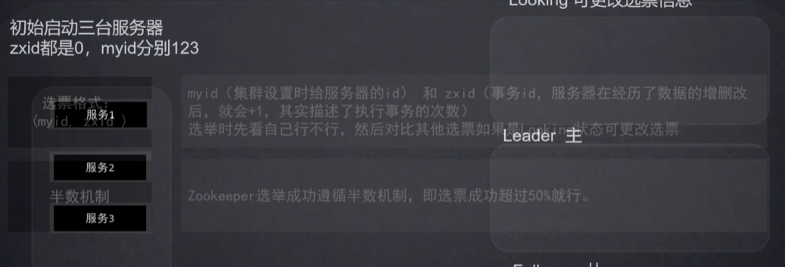

选票格式（myid,zxid）

#### 崩溃恢复

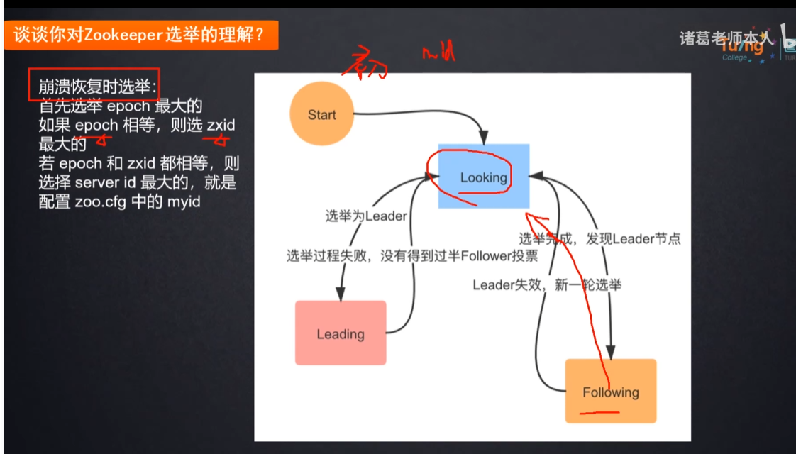

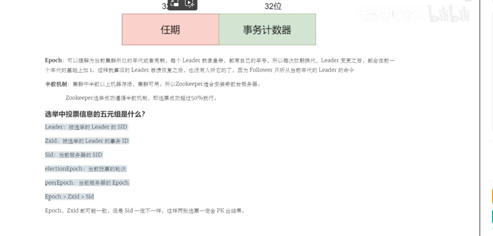

注节点挂掉，following变成观望状态（following->looking）

### 应用场景

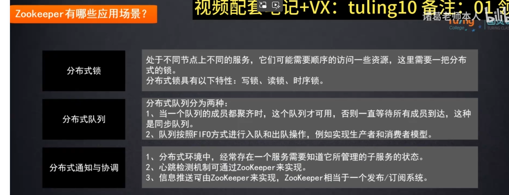


### 通知机制

- 客户端通过getData，getChildren,exist,传入Watcher对象，相服务端发送request请求封装Watcher到WatchRegistraction，服务端接受响应后，将Watcher注册到ZKWatcherManager进行管理，请求返回，完成注册

- 服务端接收到Watcher存储，Watcher触发，调用process触发Watcher
- 客户端回调Watcher,客户端通过SengThread接受事件通知，交给EventThread线程回调Watcher,客户端的Watcher一次性的，触发过后就失效
- 监听内容，Znode内容数据变化，子节点增减变化，增加一个Znode或者删除

### 持久化机制

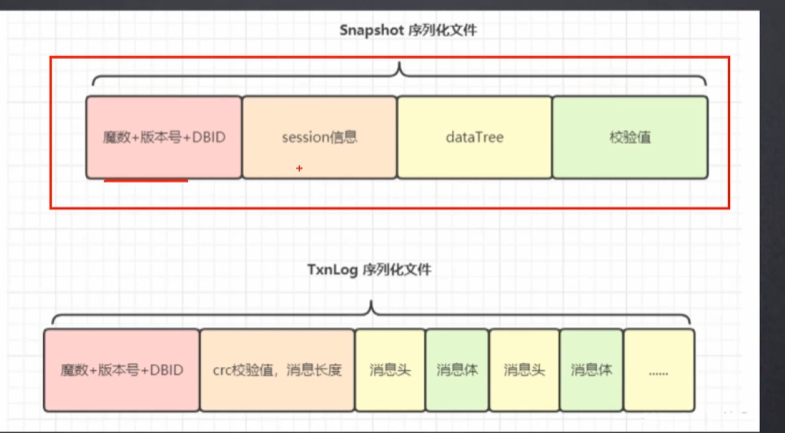


- 快照， Snapshot
- 日志文件,TxnLog序列化文件

# 计算机网络

## HTTP2.0；3.0:

http2.0基于TCP,使用二进制分帧层，实现多路复用

http3.0基于UDP,使用QUIC协议，提供类似TCP得可靠性和多路复用

## HTTP和HTTPS:

- Http明文传输，容易被窃听篡改，Https通过SSL或者TSL协议进行加密传输
- 端口号默认Http80,https:443
- HTTP:五加密速度快一点，HTTPS加解密会花费一点时间

## HTTPS,握手

#### RSA算法：

四次握手：

- 客户端问候
- 服务器问候
- 客户端密钥交换+开始使用加密+客户端完成
- 服务端发送使用加密+服务端玩成


## Http请求过程

HTTP 请求的整个过程包括从客户端发起请求到服务器响应并返回结果的各个阶段。以下是简述的过程：

##### 1. **客户端发起请求**

- **用户行为**：当用户在浏览器地址栏输入 URL（例如 `http://example.com`）或点击链接时，浏览器将构建一个 HTTP 请求。
- **DNS 解析**：浏览器需要解析域名 `example.com`，通过 DNS 查询将域名转换为服务器的 IP 地址。DNS 解析可能会在本地缓存中查找，也可能会向 DNS 服务器发送请求。

##### 2. **建立 TCP 连接**

- 三次握手

  ：在得到服务器的 IP 地址后，客户端与服务器建立 TCP 连接。该过程包括：

  - 客户端发送一个 SYN 请求，表示开始建立连接。
  - 服务器回应一个 SYN-ACK 消息，表示接受连接请求。
  - 客户端再发送一个 ACK 消息，表示连接成功建立。

- 这一步完成后，客户端和服务器可以通过 TCP 通道进行数据传输。

##### 3. **客户端发送 HTTP 请求**

- 构建 HTTP 请求

  ：客户端构建 HTTP 请求，通常包含以下部分：

  - **请求行**：包括请求方法（如 `GET`, `POST`）、请求 URL 和 HTTP 版本。例如：`GET /index.html HTTP/1.1`。
  - **请求头**：包含客户端的各种信息，如 `User-Agent`、`Accept`、`Cookie` 等。
  - **请求体**（如果有）：用于 `POST` 或 `PUT` 等请求方法，包含客户端发送给服务器的数据，如表单数据或 JSON。

- **发送请求**：通过 TCP 连接，客户端将 HTTP 请求发送到服务器。

##### 4. **服务器处理请求**

- **接收请求**：服务器的 Web 服务器（如 Nginx、Apache 或其他）接收客户端的 HTTP 请求。
- **路由请求**：Web 服务器根据请求 URL 和请求方法，路由到相应的处理程序。例如，某个请求可能会调用特定的 PHP、Java、Python 或 Node.js 后端处理代码。
- **业务逻辑处理**：服务器根据请求的具体内容进行相应的业务逻辑处理（如查询数据库、执行计算等）。
- **生成响应**：服务器生成一个 HTTP 响应，并通过 TCP 连接返回给客户端，通常包括状态码、响应头和响应体（如 HTML、JSON 数据等）。

##### 5. **客户端接收响应**

- **接收响应**：客户端的浏览器或其他客户端应用程序接收到来自服务器的 HTTP 响应。

- 解析响应

  ：

  - **状态码**：浏览器检查 HTTP 响应的状态码，确定请求是否成功。例如，`200 OK` 表示请求成功，`404 Not Found` 表示请求的资源不存在，`500 Internal Server Error` 表示服务器出现错误。
  - **响应头**：客户端检查响应头中的信息，如内容类型、缓存控制等。
  - **响应体**：客户端解析响应体的内容。如果是 HTML，浏览器会将其渲染为网页；如果是 JSON，可能会进一步通过 JavaScript 进行处理。

##### 6. **关闭连接**

- **TCP 连接关闭**：如果 HTTP 请求使用的是 `HTTP/1.0` 或未设置 `Keep-Alive`，那么在响应传输完成后，TCP 连接会被关闭。如果使用了 `HTTP/1.1` 且启用了持久连接（`Keep-Alive`），则 TCP 连接会保持打开状态，供后续请求复用。
- **四次挥手**：TCP 连接的关闭过程是通过四次挥手进行的：
  - 客户端发送 FIN 请求，表示请求关闭连接。
  - 服务器回应 ACK，表示收到关闭请求。
  - 服务器发送 FIN 请求，表示服务器准备关闭连接。
  - 客户端回应 ACK，连接正式关闭。

### 7. **客户端显示响应**

- **渲染网页**：对于 `GET` 请求，客户端的浏览器会根据返回的 HTML 内容进行解析和渲染。如果响应包含 CSS、JavaScript 或其他资源，浏览器可能会发起额外的 HTTP 请求来加载这些资源。
- **处理后端数据**：对于 `POST` 或 `PUT` 请求，客户端会根据返回的结果进行进一步处理，例如显示成功或错误消息，更新界面等。

# 操作系统

### 虚拟内存

[虚拟存储管理技术（分页）-CSDN博客](https://blog.csdn.net/qq_44744457/article/details/105644571)

### 操作系统虚拟内存和物理内存的区别？

#### 1. **物理内存 (Physical Memory)**

- **定义**：物理内存是计算机系统中实际存在的内存，也就是**RAM**（随机存取存储器）。它是硬件上存在的、直接由计算机的物理硬件管理的内存。
- **特点**：
  - 物理内存的大小是固定的，取决于计算机安装的内存条的容量。
  - 它直接存储程序执行时的数据、指令以及操作系统等。
  - 计算机的物理内存是有限的，只有在足够的物理内存时，程序才能顺利运行，否则会产生“内存不足”的情况。
- **访问速度**：物理内存的访问速度是非常快的，但容量有限。

#### 2. **虚拟内存 (Virtual Memory)**

- **定义**：虚拟内存是操作系统提供的一种抽象机制，它使得每个进程看起来都拥有一个**独立的内存空间**。虚拟内存允许程序使用比物理内存更大的内存空间，甚至超出了系统实际安装的物理内存大小。
- **特点**：
  - 操作系统通过**内存管理单元 (MMU)** 和**分页技术**或**分段技术**来实现虚拟内存。
  - 虚拟内存允许操作系统将不常用的数据从物理内存“交换”到硬盘（通常是交换文件或交换分区中），当需要时再交换回来，从而提供比物理内存更大的内存空间。
  - 每个进程都被分配到一个**虚拟地址空间**，这个地址空间和物理内存的实际地址是相互独立的。
- **访问速度**：虚拟内存的访问速度比物理内存慢，尤其是在使用硬盘（比如交换文件）时，因为硬盘的读取速度远低于内存。

### 虚拟内存的工作原理

虚拟内存的工作原理通常通过 **分页** 或 **分段** 来实现：

- **分页**：将程序的虚拟地址空间和物理内存划分成固定大小的块，称为“页”（Page）。操作系统通过**页表**将虚拟地址映射到物理地址。程序访问虚拟地址时，操作系统会根据页表将其转换为物理地址。
- **分段**：将程序的虚拟地址空间分成不同大小的段，如代码段、数据段、堆栈段等。每个段在物理内存中的位置可以不同。

当程序需要访问某个数据时，如果该数据不在物理内存中（即发生了**页面缺失**或**段缺失**），操作系统会将该数据从硬盘加载到内存中。

### **交换 (Swapping) 和 页面替换 (Page Replacement)**

- **交换（Swapping）**：操作系统将进程的部分数据从物理内存移动到硬盘上，以释放空间给其他进程使用。这通常发生在系统内存不足时。
- **页面替换（Page Replacement）**：当一个进程需要访问的页面不在物理内存时，操作系统会选择一个不常用的页面，将其从内存中交换到硬盘，腾出空间供新的页面使用。这是虚拟内存管理中的核心机制。

### 页面置换算法

内存置换算法（Memory Replacement Algorithms）是操作系统在虚拟内存管理中使用的一种技术，用于在物理内存已满时决定哪些页面（页面是内存的基本管理单元）应当被从物理内存中移除，以腾出空间加载新的页面。内存置换算法的设计目标是尽可能减少页面缺失（Page Faults），从而提高系统的性能。

常见的内存置换算法有以下几种：

#### 1. **最少使用 (Least Recently Used, LRU)**

**原理**：LRU 算法基于“最近最少使用”的原则，即在内存已满时，选择**最长时间没有被使用**的页面进行置换。

- **实现**：LRU 算法通常需要维护一个页面的访问时间戳或者使用一个队列来跟踪页面的访问顺序。当页面被访问时，将该页面移动到队列的前面。当内存不足时，置换队列尾部的页面。
- **优点**：在很多实际应用中，LRU 算法表现良好，因为它假设最近被访问的页面可能会被再次访问。
- **缺点**：LRU 算法的实现较为复杂，需要频繁地更新页面的访问顺序，可能导致性能损耗。

#### 2. **先进先出 (First In First Out, FIFO)**

**原理**：FIFO 算法是最简单的一种内存置换算法，它按照**页面进入内存的顺序**来进行置换。当内存满时，**最早进入内存的页面**被置换出去。

- **实现**：使用一个队列来记录页面的加载顺序。当页面被访问时，队列不改变顺序。当发生页面缺失时，将队列头部的页面替换出去。
- **优点**：简单易实现，操作简单。
- **缺点**：FIFO 算法可能会导致**不合适的页面置换**，因为它并没有考虑页面的使用频率或者访问时间。例如，可能会把一个即将被频繁使用的页面置换出去，造成性能下降。

#### 3. **最不常用 (Least Frequently Used, LFU)**

**原理**：LFU 算法选择**访问频率最小**的页面进行置换。即，如果某个页面在过去一段时间内被访问的次数最少，它就有较高的概率被置换。

- **实现**：每个页面都有一个访问计数器，记录它被访问的次数。访问次数较少的页面在内存满时会被优先置换出去。
- **优点**：LFU 算法能够保留长期使用的页面，对于某些应用场景可能表现不错。
- **缺点**：LFU 算法的实现需要额外的空间来维护计数器，且随着时间的推移，页面的访问频率可能发生较大变化，因此它可能会选择一些已经不再被频繁访问的页面进行置换（即缓存污染问题）

#### 4. **最佳置换 (Optimal, OPT)**

**原理**：最佳置换算法是一种理论上的理想算法，它选择在内存中**未来最长时间不被访问**的页面进行置换。该算法根据程序的访问行为，预测哪些页面在接下来一段时间内不会再被使用，并选择这些页面进行置换。

- **实现**：对于每个页面，操作系统需要预测它在未来的使用情况，选择未来最远不使用的页面进行置换。
- **优点**：由于该算法是理想的，它能够在页面置换中最小化页面缺失的次数，提供最佳的性能。
- **缺点**：最佳置换算法是**不可实现的**，因为在实际操作中我们无法预测未来的页面访问模式。它更多的是作为理论上的参考。

#### 5. **时钟算法 (Clock Algorithm)**

**原理**：时钟算法是一种近似于 LRU 算法的算法，它通过维护一个循环队列来记录页面的访问情况。每个页面有一个**访问位**，如果页面被访问，它的访问位被设置为1，否则为0。时钟算法会依次检查页面，如果访问位为1，表示该页面最近被访问过，访问位重置为0并继续检查下一个页面；如果访问位为0，则该页面将被置换。

- **实现**：时钟算法通常用一个环形队列表示。操作系统维护一个指针，指向当前需要检查的页面，按照顺序检查并决定是否置换。
- **优点**：时钟算法比 LRU 更加高效，因为它不需要频繁地更新页面的访问顺序，且实现比 LRU 更简单。
- **缺点**：时钟算法的效果不如 LRU，且也不能完全避免页面的频繁置换。

# 算法和数据结构

## 红黑树

treemap

## LRU


## 堆

#### 堆的构建过程

##### 1. **逐个插入元素**（插入法）

逐个插入元素的方法通过逐个将元素插入堆中来构建堆，堆中每个节点都符合堆的性质。

- **操作步骤**：

  1. 初始化一个空堆。
  2. 将数组中的元素逐个插入堆。
  3. 插入元素后，执行 **上浮操作（bubble-up 或 sift-up）**，确保堆的性质得到满足。

  **插入操作**：

  - 将元素插入到堆的末尾（保持完全二叉树的结构）。
  - 然后比较当前节点与父节点的大小关系。如果当前节点比父节点大（大堆）或小（小堆），就交换两者位置。
  - 这个过程重复直到堆的性质恢复。

  **时间复杂度**：对于每个插入操作，最坏情况下需要上浮到根节点，时间复杂度为 O(log n)。如果插入 n 个元素，总的时间复杂度是 O(n log n)。

##### 2. **堆化过程（Build Heap）**（自底向上）

这个方法通常比逐个插入方法更高效，特别是当堆已经有一部分数据时。堆化过程是从数组的中间节点开始，向上调整元素，最终构建成一个完整的堆。

- **操作步骤**：

  1. **从最后一个非叶子节点开始**，向上调整。对于一个完全二叉树，最后一个非叶子节点的索引为 `n/2 - 1`，其中 n 是数组的长度。
  2. 对每个非叶子节点，执行 **下沉操作（bubble-down 或 sift-down）**，确保该子树满足堆的性质。
  3. 对整个数组做此操作，直到根节点。

  **堆化操作**：

  - 对每个节点，从该节点出发，比较该节点和其左右子节点的大小。如果父节点比任何一个子节点大（小堆），就和最小（大）子节点交换。
  - 这个过程会递归地“下沉”到叶子节点。

  **时间复杂度**：堆化过程的时间复杂度是 O(n)，因为每个节点最多只需要进行一次下沉操作，而每次下沉操作最多会进行 O(log n) 次比较，但实际情况是，从叶子节点开始，很多节点的下沉操作会更少，因此总的时间复杂度是 O(n)。


# MQ[RocketMQ+Kafaka]

## MQ作用，具体使用场景

作用：

- 异步，快递员->菜鸟驿站<-客户， 提高系统吞吐量，响应速度。
- 解耦，服务解耦，减少服务之间影像，提高系统稳定性，可扩展性，实现数据分发，发送一个消息，多个消费者处理
- 削峰，以稳定的系统资源应对突发流量冲击，消息先到MQ缓存，在慢慢消费

缺点：

- 可用性降低，宕机，业务受到影响。**高可用**
- 系统复杂度提高，数据流链路复杂。**消息丢失，重复调用，顺序性**
- 数据一致性

## 产品选型

### RabbitMQ

🔹 优点：

- **高可靠性** ：支持持久化、镜像队列等机制，确保消息不丢失。
- **低延迟** ：适用于对实时性要求较高的场景。
- **功能丰富** ：提供多种交换机类型、死信队列、延迟队列插件等。
- **成熟稳定** ：社区活跃，文档齐全，生态完善。
- **易部署** ：安装配置简单，维护成本相对较低。

缺点：

- **吞吐量较低** ：不适合处理海量数据，每秒处理几千条消息已经不错。
- **扩展性有限** ：集群模式下不如 Kafka 和 RocketMQ 灵活。
- **无原生顺序消息支持** ：需要额外设计实现。
- **部署复杂度较高** ：尤其在大规模集群中。

小规模场景

### Kafaka

- 吞吐量非常大，性能好，集群高可用

- 会丢失数据，功能单一

使用场景：使用数据量很大，频繁；日志分析，大数据采集，偶尔可以丢失

#### 优点

### 优点：

- **超高吞吐量** ：单节点可轻松达到百万级别消息吞吐。
- **海量数据处理能力** ：支持消息持久化到磁盘，可以作为数据管道或日志中心。
- **良好的水平扩展性** ：支持动态扩容，适合大数据场景。
- **持久化能力强** ：所有消息默认持久化，便于回溯历史数据。
- **支持多副本机制** ：保证高可用和容错。
- **生态系统丰富** ：Kafka Streams、Kafka Connect、Schema Registry 等组件完善。

#### 缺点：

- **延迟较高** ：相比 RabbitMQ，实时性略差。
- **部署复杂** ：依赖 Zookeeper（除非使用 KRaft 模式）。
- **功能较单一** ：缺乏内置的高级特性（如延迟队列、死信队列等）。
- **消息确认机制弱** ：消费失败可能丢失消息，需开发者自行处理。

场景：大数据实时处理（Flink / Spark Streaming 接入），日志聚合与监控（ELK 架构中的消息总线）

### RocketMQ

- 阿里开源，高吞吐，高性能，高可用，综合kafaka,rabbitmq
- 有开源版和商业版，官方文档周边生态不成熟，客户端支持java

使用场景：几乎全场景

#### 优点：

- **高性能高吞吐** ：兼顾吞吐量和低延迟。
- **强一致性保障** ：支持同步双写、Dledger 集群，保证消息不丢不重复。
- **支持顺序消息** ：原生支持严格的消息顺序控制。
- **延迟消息** ：内置支持延迟等级的消息发送。
- **丰富的功能** ：死信队列、重试机制、广播消费、事务消息等。
- **云原生友好** ：支持 Kubernetes、Service Mesh 架构。

#### 🔻 缺点：

- 社区活跃度低于 Kafka。
- 相比 Kafka，学习曲线稍陡峭。
- 部署略复杂，尤其是 Dledger 集群搭建。
- 中文资料较多，英文文档较少。

#### 使用场景：

- 金融级交易系统（如订单状态变更的通知）
- 支付系统中的事务消息
- 电商大促下的削峰填谷
- 物联网设备消息上报
- 对消息顺序有强需求的系统（如库存扣减）

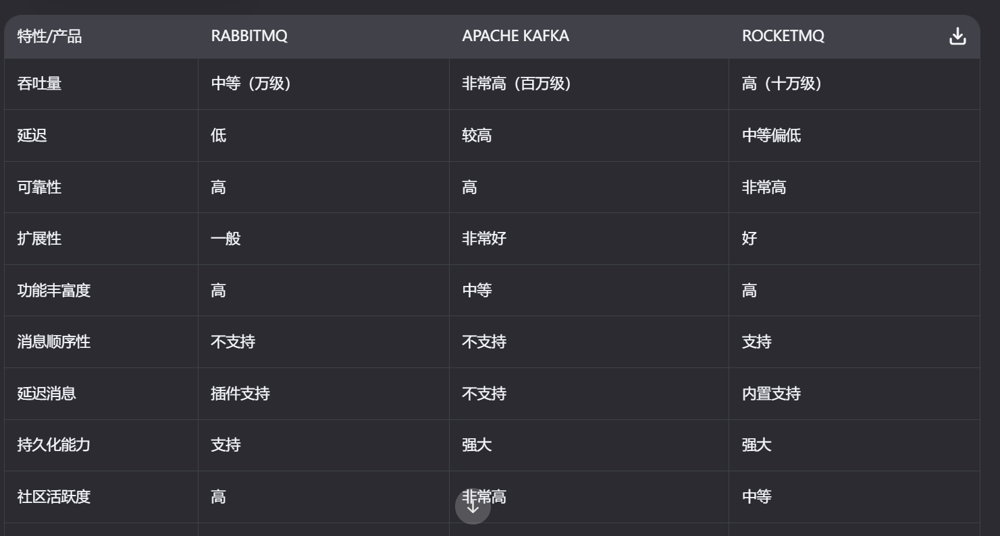

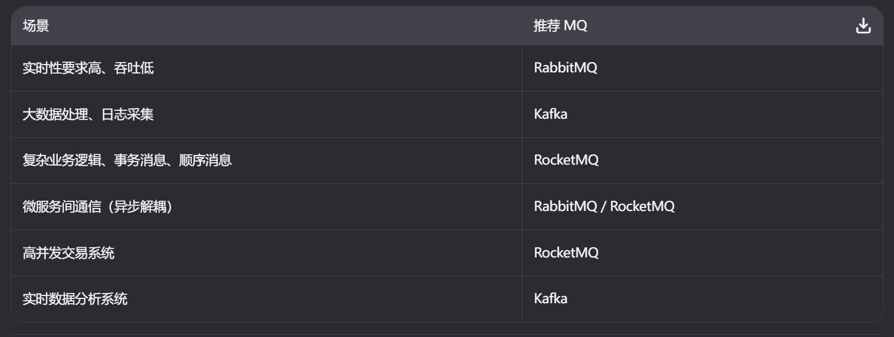


## 如何保证消息不丢失

### 1. 哪些环节造成消息丢失

- 发送消息失败丢失
- 主从同步丢失
- MQ基于内存丢失，保存到硬盘，保存到硬盘这一步
-  消费者消费

### 2.如何防止消息丢失

#### 2.1.生产者发送消息不丢失

- ##### Kafaka: 

  消息发送+回调

- ##### RocketMQ: 

  1. 消息发送+回调, 2.事务消息机制

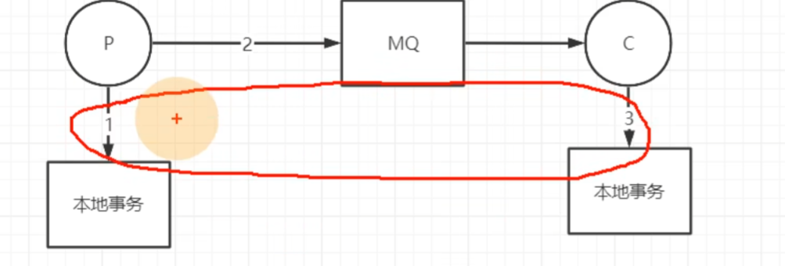

分布式事务保证1和3的原子性，

RocketMQ保证**1和2**的原子性，对于分布式事务，只需要关心MQ到消费者。

- ##### RabbitMQ

1. 消息发送+回调
2. 手动事务，提供API

channel.txSelect()开启事务， channel.txCommit()，提交事务，channel.txRollback()回滚事务，对channel造成阻塞。开启事务与结束事务，channel是阻塞的

3. 生产者确认机制：和RocketMQ差不多。


#### 2.2 主从同步如何不丢失

##### RocketMQ:


1. 普通集群中，**同步同步**，当往主节点发送后，会立即同步到从节点并刷盘，并反馈给生产者，这个过程会阻塞；**异步同步**，当往主节点发送后，主MQ刷盘，然后反馈给生产者， 开启线程异步给从节点。后者效率更高，有丢失消息的风险
2. Dleger集群：至少三个节点

节点一开始都是候选者D,然后选举，D-M,D-S,而且会经常选举。通过异步同步。大多数节点同步完了后，D-M将Uncommitted标记为committed。两阶段提交

xiz'zzzs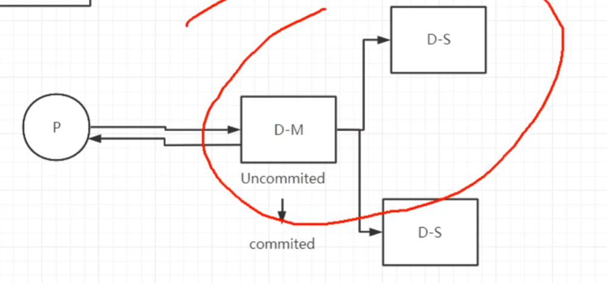

##### RabbitMQ

1. 普通集群。**消息分散存储**，消息发送到那个节点就存储到那个节点，只有等到消费者消费某台节点，然后从这个节点向有数据节点进行copy,不会主动进行消息同步，有可能消息丢失。【集群搭建：erlang，cookie文件相同就OK】
2. 镜像集群。主动同步

##### Kafaka

容易丢失消息，不用分析太详细。acks参数--【0同步， 1异步， all, 三个区别】

#### 2.3.MQ存盘不丢失

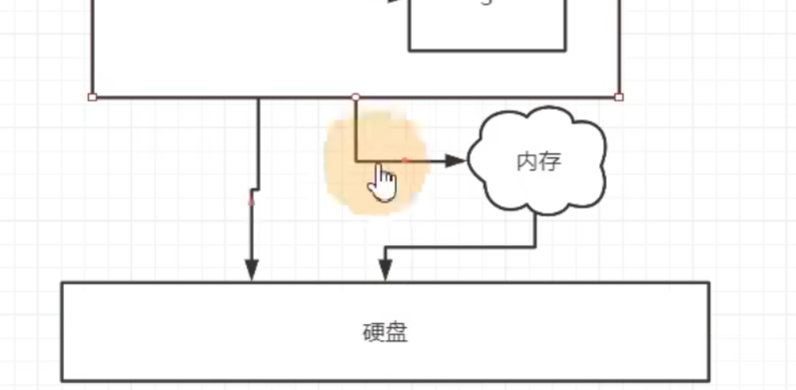


##### 1.RocketMQ

配置方式：【同步刷盘，异步刷盘】同步刷盘；不容易丢失消息的机制，刷完内存直接存硬盘， 异步刷盘：效率高，可能丢失消息

##### 2.RabbitMQ

配置队列持久化。3.X版本，新增Quorum类型队列，采用Raft协议进行消息同步

##### 3.Kafka

#### 2.4 消费者消费消息不丢失

##### 1.RocketMQ

使用默认的方式消费就行，别用异步【消费者收到消息后，直接提交offset给MQ,执行，结果执行失败】。

##### 2.RabbitMQ

手动提交offset


## MQ的幂等机制


可能因为网络原因【异步消费时】，消费者offset没有及时反馈给MQ，导致超时MQ，重复推送消息给消费者，从而造成重复消费的问题。

**原因：**由于网络波动、消费者宕机、重试机制等原因，可能会导致**消息被重复消费**

在以下几种情况下，MQ 可能会导致消息被重复消费：

| 场景                   | 描述                                                         |
| ---------------------- | ------------------------------------------------------------ |
| 消费者处理失败但未确认 | 消费者处理消息失败后，未向 MQ 提交 offset 或 ack，MQ 会认为该消息未消费成功，重新投递 |
| 网络问题               | 消息已经发送给消费者，但由于网络问题没有收到 ack，MQ 重发    |
| 消费者宕机             | 消费者正在处理消息时宕机，MQ 会将消息重新分配给其他消费者    |
| 批量消费失败部分成功   | 批量拉取消息后，其中一条失败，全部重试                       |

所有MQ产品没有主动提供解决幂等机制，需要消费者自行控制。

##### RocketMQ

给每个消费者分配了一个MessageID，让消费者自己去处理，时RocketMQ内部产生，数据量大不能保证ID全局唯一，自己去带一个业务标识ID/或者生成唯一ID分配，进行幂等判断

##### 1. **唯一业务 ID + Redis / DB 标记法**

实现原理：

- 每条消息带上一个唯一的业务标识（如 `order_id`、`request_id`）。
- 消费前先检查是否已处理过该 ID。
- 如果已处理，直接跳过；否则执行业务逻辑，并记录已处理。

优点：

- 简单易实现
- 通用性强

缺点：

- Redis 宕机或数据丢失可能导致幂等失效
- 需要维护业务 ID 的清理策略（例如设置过期时间）

##### 2. **数据库唯一索引去重**

实现原理：

- 在数据库中为关键字段建立唯一索引（如 `order_id`）。
- 插入记录时如果违反唯一索引，则说明该消息已经被处理过。

##### 3. **状态机机制**

适用于有明确状态流转的场景（如订单状态变更）。

实现原理：

- 维护一个状态字段（如 `order_status`）。
- 消费消息前检查当前状态是否允许执行该操作。
- 如果状态不符合预期，忽略该消息。

优点：

- 更贴近业务逻辑
- 可以配合乐观锁机制增强并发安全性

缺点：

- 实现复杂度较高
- 需要良好的状态设计

##### 4. **版本号 / 时间戳校验**

适用于更新类操作，如库存更新、余额变动等。

实现原理：

- 每条消息携带一个版本号或时间戳。
- 消费前检查当前对象的版本号是否小于等于消息中的版本号。
- 若小于等于，说明是旧消息，忽略。

## 顺序消息机制

#### 场景

MQ只需要保证局部有序，不需要保证全局有序

#### 1. Rocket

一个队列时天然有序。

**分布式：**topic下会有多个队列，队列会存放在不同的节点上

RocketMQ会一次性拿队列中的有序（局部）消息

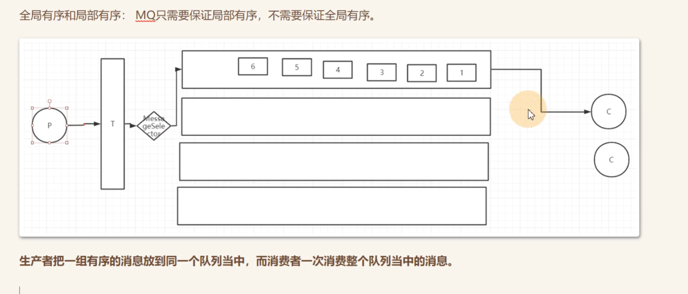

RockeMQ有完整的设计

#### 2. RabbitMQ

保证目标的Exchange只对应一个队列，一个队列只对应一个消费者。

#### 3.kafka

kafka中式一个Topic会有分区的，保证发送有序的一组消息分到同一个partition中去，Topic只对应一个消费者

## MQ的高速读写

**零拷贝：** kafka和RockeMQ都是通过零拷贝优化文件的读写

### 什么是内核空间和用户空间？

**用户空间（User Space）** ：是普通应用程序运行的地方。例如你的浏览器、微信、Java 程序等，都运行在用户空间

**内核空间（Kernel Space）** ：是操作系统内核运行的地方，负责管理系统的资源（CPU、内存、磁盘、网络等），为用户程序提供服务。

它们之间的界限是操作系统的“保护机制”，防止用户程序随意访问硬件或破坏系统

### 为什么要有这两个空间？

这是为了**安全性和稳定性** 考虑的，用户程序不能直接操作硬件（比如直接读写硬盘、控制网卡），否则一个程序出错就可能导致整个系统崩溃。

所以操作系统设计了一个“隔离层”：

- 用户程序只能运行在**用户空间** ，不能直接访问硬件。

- 如果需要访问硬件资源（如读文件、发送网络包），必须通过**系统调用（System Call）\**进入\** 内核空间** ，由内核代为完成。

  好处

- 防止你私自打开保险柜（权限隔离）

- 统一调度资源，避免混乱（集中管理）

不同操作系统的划分比例可能不同，比如：

- Linux 中通常是 **3:1** （3GB 用户空间，1GB 内核空间）
- Windows 中一般是 **2:2**

不管怎么分，**内核空间对用户程序不可见，只有内核可以直接访问** 。

现代 CPU 提供了多个特权等级（称为 Ring Level），用于实现这种隔离：

| RING 级别 | 权限 | 描述                             |
| --------- | ---- | -------------------------------- |
| Ring 0    | 最高 | 内核运行在此层级，可访问所有资源 |
| Ring 1/2  | 中等 | 一般用于设备驱动                 |
| Ring 3    | 最低 | 用户程序运行在此层级             |

### 零拷贝


传统的文件传输或网络通信过程中，数据通常需要经历多次**从磁盘到内存、从用户空间到内核空间的复制** ，例如：

```java
磁盘文件 --> 内核缓冲区 --> 用户缓冲区 --> Socket 缓冲区 --> 网络
```


磁盘文件 --> 内核缓冲区 --> 用户缓冲区 --> Socket 缓冲区 --> 网络

每次拷贝都要消耗 CPU 和内存资源。

而**零拷贝** 就是通过系统调用或底层机制，**尽可能减少这些中间步骤** ，让数据直接从一个地方传送到另一个地方，不经过不必要的复制。


- 传统

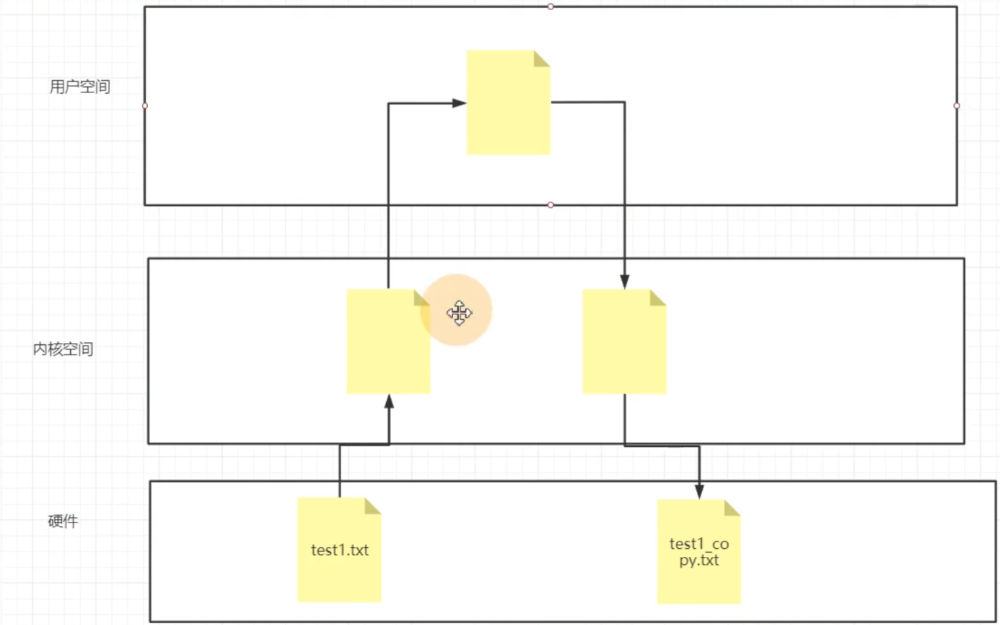


需要4次拷贝：---- 用户->内核->硬件->内核->用户

零拷贝实现方式

- ##### mmap

- ##### transfile

**DMA（Direct Memory Access）** ，直译为“**直接内存访问** ”，是一种 **绕过 CPU** 的硬件机制，允许某些外部设备（如网卡、磁盘控制器、GPU 等）**直接读写系统内存（RAM）** ，而不需要 CPU 参与数据的搬运过程。

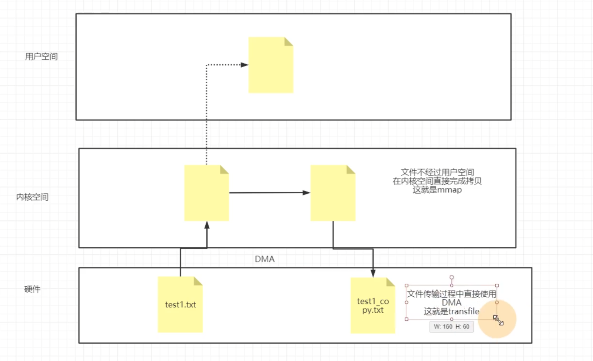

内存中还是有优化的


### MQ中

**Socket 缓冲区（Socket Buffer）是在内核空间（Kernel Space）中的** 。

`File.read()` —— 从磁盘加载到内核缓冲区, 发生上下文切换

`Socket.write()` —— 从用户缓冲区写入 socket, 发生上下文切换

#### 场景1：从磁盘读取日志文件并发送到网络（Kafka 的典型做法）

Kafka 将消息持久化到磁盘，并支持高效的网络传输。其核心优化之一就是使用了 `sendfile()` 或 `mmap` 技术来实现零拷贝。

**传统方式：**

```java
File.read() → 用户缓冲区 → Socket.write()
```

- 数据先从磁盘加载到内核缓冲区；
- 拷贝到用户空间；
- 再拷贝到 socket 缓冲区；
- 最后发往网络。

**零拷贝方式（使用 sendfile）：**

```java
sendfile(out_fd, in_fd, offset, size);
```

- 数据直接从文件描述符复制到 socket 描述符；
- 不经过用户空间，只在内核空间完成数据搬运；
- 减少一次上下文切换 + 两次内存拷贝。

##### Kafka 使用 mmap 实现零拷贝：

- Kafka 使用内存映射（`mmap`）将磁盘文件映射到用户空间；
- 实际上并没有真正把数据拷贝到用户空间，而是通过虚拟地址映射访问内核缓存
- 在发送数据时，由操作系统直接从页缓存（Page Cache）发送，避免额外拷贝。


#### 场景2：生产者写入消息到 MQ

当生产者发送一条消息到 Kafka / RocketMQ 时，如果使用的是 Java NIO 的 `Direct Buffer`（堆外内存），也可以减少一次从 JVM 堆到内核空间的拷贝。

```java
Java Heap → 内核空间（Socket Buffer）
```

**零拷贝方式**（Direct Buffer）：

- 直接分配在堆外内存，JVM 可以绕过 GC 区域；
- 网络 I/O 操作可以直接使用这块内存，无需复制；
- 提高大消息或高频写入场景下的性能。


### MQ 中常用的零拷贝技术实现方式

| 技术                          | 说明                                           | 应用场景                  |
| ----------------------------- | ---------------------------------------------- | ------------------------- |
| `sendfile()`                  | Linux 系统调用，用于文件到 socket 的高效传输   | Kafka、Nginx、HTTP Server |
| `mmap()`                      | 将文件或设备映射到内存，供用户程序直接访问     | Kafka、RocketMQ           |
| `splice()`                    | 用于两个文件描述符之间传输数据，不经过用户空间 | Kafka                     |
| `Direct Buffer`（堆外内存）   | Java NIO 提供，避免 JVM 堆与内核间的数据拷贝   | RocketMQ 生产/消费端      |
| `DMA（Direct Memory Access）` | 硬件级零拷贝，允许外设直接访问内存             | 网卡、GPU 加速            |


### Kafka 是如何使用零拷贝的？

Kafka 发送消息流程中的零拷贝：

```java
[磁盘文件] → [Page Cache（内核空间）] → [Socket Buffer（内核空间）] → [网卡]
```

- Kafka 利用 Linux 的 `sendfile()` 或 `transferTo()` 方法，跳过了用户空间；
- 消费者拉取消息时，Kafka 可以直接从 Page Cache 发送给客户端，不需要复制到 JVM 堆内存；
- 大幅提升吞吐量，降低延迟。


### RocketMQ 的零拷贝实践

RocketMQ 同样使用了多种零拷贝技术来提升性能：

#### 1. 使用 `mmap` 映射 CommitLog 文件

- 所有消息都写入统一的 CommitLog 文件【固定1G】；
- 通过内存映射（`mmap`）的方式读写文件；
- 减少频繁的 read/write 调用，提升 IO 性能。

#### 2. 使用 `Direct Buffer` 进行网络传输

- RocketMQ 的客户端使用 Netty，Netty 默认使用堆外内存（Direct Buffer）；
- 发送消息时，Netty 可以直接使用 Direct Buffer 写入 socket，减少一次拷贝。

> 1. **如果没有零拷贝（使用Java堆内存`byte[]`）**：
>    - RocketMQ Broker从`MappedByteBuffer`（本质是Page Cache）中取得消息数据。
>    - 这些数据需要被封装到一个Java对象（如`ByteBuf`）中，才能通过Netty的Channel发送。
>    - 如果使用堆内存（Heap Buffer），Netty在最终调用`write/send`系统调用之前，**必须先将堆内的数据拷贝到一个临时的堆外内存（Direct Buffer）中**。因为JVM的GC可能会移动堆内对象的内存地址，而系统调用要求数据地址是固定的。
>    - 这导致了**一次不必要的内存拷贝**。
> 2. **使用`Direct Buffer`（堆外内存）**：
>    - RocketMQ/Netty**直接**在堆外内存中分配`Direct ByteBuf`来承载要发送的消息数据。
>    - 从`MappedByteBuffer`（Page Cache）到`Direct ByteBuf`的数据拷贝依然存在，但这是**最后一次CPU拷贝**。
>    - 当调用`channel.write(...)`时，数据直接从这块**固定的、堆外的**`Direct ByteBuf`通过DMA方式拷贝到网卡缓冲区，无需再经过JVM堆。

> 1. **消息读取**：Broker通过`mmap`从CommitLog文件中读取消息数据。这些数据本质上是存在于**OS的Page Cache（内核态）** 中。
> 2. **数据传递**：需要将这些数据发送给Consumer。
> 3. **零拷贝优势**：由于Netty使用Direct Buffer，它可以将数据从**内核态的Page Cache**直接拷贝到**用户态的Direct Buffer**，然后直接送入网络栈。这条路径非常清晰高效。如果使用Heap Buffer，数据流可能会变成 `Page Cache -> 临时Direct Buffer -> Heap Buffer`，路径更长。

### **为什么 RocketMQ 使用 mmap 而不是 sendfile 来实现零拷贝？**


> RocketMQ 的 Broker 不仅要读取磁盘上的消息文件发给消费者，它**更核心、更频繁的操作是接收生产者发来的消息并写入磁盘**。
>
> RocketMQ 在发送消息前，可能需要进行一些操作，例如：
>
> - **消息过滤**：根据 Topic 和 Tag 信息从 CommitLog 中筛选出特定的消息。
> - **生成校验和**。
> - 在非堆外内存模式下，可能还需要进行一些数据格式的包装

1. **根本原因：功能不匹配**。`sendfile` 的设计目标是**高效地从磁盘读取文件并通过网络发送出去**，它是一个纯粹的‘读+转发’操作。而 RocketMQ 的 Broker 核心职责是**既要从生产者接收消息并写入磁盘，又要从磁盘读取消息发送给消费者**。`mmap` 提供的‘读写兼备’的能力正好满足这个需求，而 `sendfile` 无法完成消息持久化（写操作）这个核心任务。
2. **灵活性需求**。`sendfile` 是一个系统调用黑盒，数据直接从内核缓存到网卡，**应用程序无法在传输过程中对数据做任何处理**，比如消息过滤、校验等。而 `mmap` 将文件映射到用户内存空间，程序可以像操作内存一样灵活处理数据，这对于需要复杂逻辑的消息中间件至关重要。
3. **访问模式**。RocketMQ 的存储包含大的 `CommitLog` 和大量小的 `ConsumeQueue` 索引文件，访问模式兼具顺序和随机。`mmap` 非常适合于管理这种小文件的频繁随机访问，而 `sendfile` 更擅长顺序处理大文件。

## MQ如何保证分布式事务最终一致性

最终事务结果是对齐的

需要做到两点：

1. 生产者端需要保证100%消息投递。事务消息机制
2. 消费端保证幂等成功消费。唯一ID+业务自己实现幂等

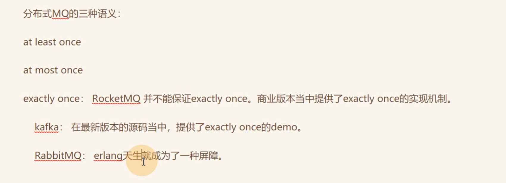


## 你如何设计一个MQ

描述： 从整体到细节，从业务场景到技术实现，以现有产品为基础

答题思路：MQ作用，项目大概样子

- 实现一个单机的队列结构。高校、可扩展
- 将单机队列扩展为分布式队列，分布式集群队列管理
- 基于Topic定制消息路由策略，默认轮询，（支持路由选择，顺序消息），offset
- 消费者和队列的关系， 一个队列只能有一个消费者进行消费，如何均匀消费分布，同机房分布，并发批量消费
- 高校的网络通信， Netty/Http
- 规划日志文件，实现文件高校读写。-零拷贝，顺序写。服务重启后，快速还原现场
- 定制高级功能，死信队列，延迟队列，事务消息。

## RabbitMQ架构+其他

### 架构设计

可靠性高

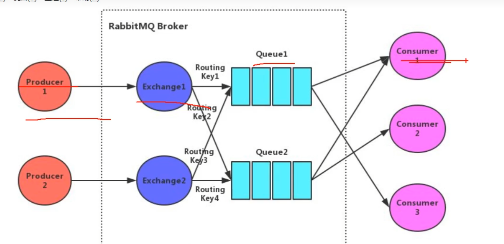


### 可靠性体现

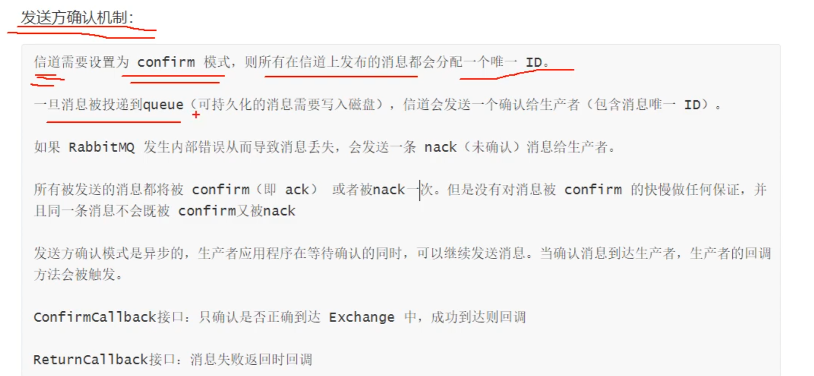

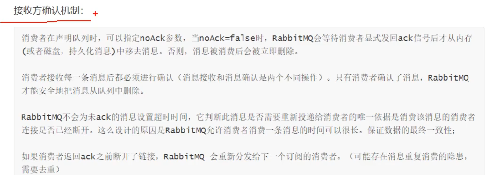

- 有限流的思想--》不会为未ack的消息设置超时时间


### 事务消息

对信道设置

channel.txSelect()开启事务， channel.txCommit()，提交事务，channel.txRollback()回滚事务，对channel造成阻塞。开启事务与结束事务，channel是阻塞的

## RocketMQ事务消息机制


分布式事务保证1和3的原子性，

RocketMQ保证**1和2**的原子性，对于分布式事务，只需要关心MQ到消费者。

- producer--->半消息给MQ,MQ存货状态
- MQ-->producer给半消息响应，producer执行本地事务
- producer--->给MQ发送具体消息本地事务状态
- 本地事务状态成功，MQ---->Consumer执行本地事务
- 本地事务状态失败，丢弃状态，重新开始
- 检查15次超时
- 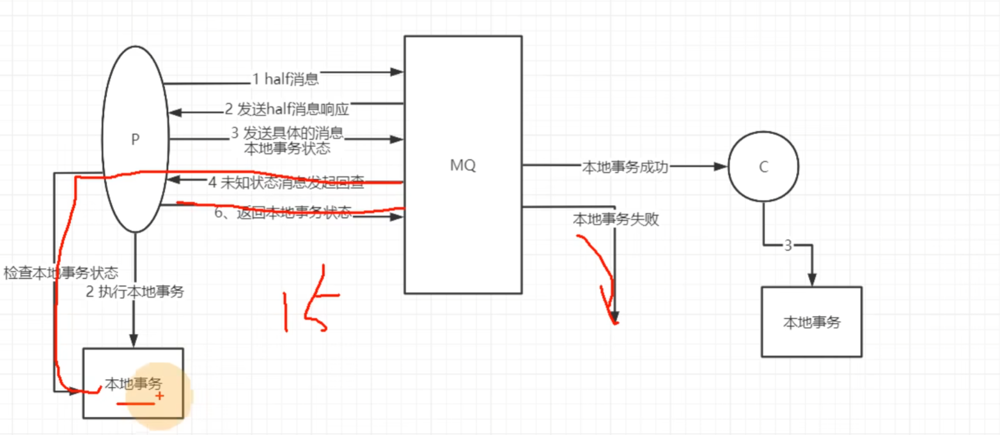


## 关于Kafka的一些理解


- 分区是逻辑概念，分区的副本是物理概念，一个副本存放在物理机器上。同分区的多个副本会有一个leader，多个follower

- 对于Broker而言，数据存储分区，每个分区【对应topic+角色+key标识同topic下的不同分区】。副本数<broker， 否则报错

- ISR是与Leader保持同步的所有副本包括leader自己，一个follower如果落后leader太多， 会被踢出ISR

- acks=0, 不用官Broker是否受到，发出去就认为成功，acks=1,Leader写入本地日志才成功，acks=all，Leader等待所有的ISR副本都成工复制消息，才返回成功。

  ## 元数据

  - 所有Broker的信息（ID、主机名、端口等）。
  - 所有Topic的信息（名称、分区数、配置等）。
  - **每个分区的Leader副本在哪台Broker上，以及所有ISR列表**。
  - 分区副本的分配方案

  #### 高可用

  #### 副本机制

  数据冗余思想

  ### ISR

  不是所有Follower都能随时变成Leader。Kafka通过ISR来智能地管理哪些副本是“合格”的备选者。

- **是什么**：ISR是指与Leader副本**保持同步**的所有副本的集合（包括Leader自己）。一个Follower如果落后Leader太多（比如网络延迟、机器故障），就会被**踢出ISR**。
- **如何判断同步**：Follower会定期向Leader发送 fetch 请求。如果它在规定时间内（`replica.lag.time.max.ms`）成功追赶上Leader的最新消息，它就留在ISR中；否则会被移除。
- **目的**：**保证数据一致性**。确保在故障转移时，新Leader拥有所有已确认的消息，避免数据丢失或不一致。

#### Leader选举机制

- **触发条件**：当Leader副本所在的Broker宕机（由Kafka Controller通过心跳机制检测到）。
- **选举过程**：Kafka控制器（Controller）会**立即自动**从该分区的**ISR列表**中选举出一个新的Leader。
- **特点**：
  - **自动化**：整个过程无需人工干预，对应用透明。
  - **快速**：通常发生在秒级，业务感知到的只是一次短暂的抖动或重试。
  - **安全**：**新Leader一定来自ISR**，这保证了它拥有所有已提交（committed）的消息，数据不会丢失。

###  生产者确认机制（Acks） - 控制消息的持久化级别

高可用不仅是服务不停，还要保证数据不丢。生产者可以根据业务需求，选择不同的可靠性级别。

- **`acks=0`**：**“发后即忘”**。生产者不管消息是否成功到达Broker。**性能最好，可靠性最差**（可能丢失消息）。
- **`acks=1`**（默认）：**“Leader确认”**。只要Leader副本将消息写入本地日志，就返回成功。**如果Leader刚写完就宕机且数据未同步到Follower，消息就会丢失**。
- **`acks=all`**（或`acks=-1`）：**“全量同步确认”**。要求Leader等待**所有ISR中的副本**都成功复制了这条消息后，才向生产者返回成功。这是**最高级别的可靠性保证**，只要ISR中至少还有一个副本存活，消息就不会丢失。

#### 消息转发

- **如果消息需要在Broker上执行复杂的逻辑（如重试、延时、事务、路由判断），RocketMQ是更合适的选择。** 它的设计哲学是 **“智能Broker， dumb客户端”**。
- **如果消息只是作为原始数据流进行高性能的存储和转发，由下游系统消费处理，Kafka是更强大的选择。** 它的设计哲学是 **“dumb Broker， 智能客户端”**。


### 如何选择：典型使用场景

#### 选择 RocketMQ 的场景（消息需要Broker处理）

你的判断是正确的，在以下场景，RocketMQ更胜一筹：

1. **电商、交易等核心业务**：需要**事务消息**来保证下单、扣库存、发消息的最终一致性。
2. **定时任务/延时场景**：需要发送一条**延时5分钟**后检查订单是否支付的消息，或者**每天定时**推送消息。
3. **需要严格重试保证的场景**：例如，支付成功后通知积分系统，如果积分系统暂时故障，希望Broker能自动、可靠地重试几次，而不是简单丢弃。
4. **消息过滤需求强的场景**：一个Topic的消息，希望不同的消费者只消费自己感兴趣的那一部分（例如用Tag=`VIP`来过滤出所有VIP用户的订单）。

#### 选择 Kafka 的场景（消息只是流转）

Kafka在这些场景下是无可争议的王者：

1. **日志收集、聚合与传输**：将大量应用日志、用户行为日志统一收集到Kafka，然后提供给下游的ELK、Spark、Flink等系统消费。**消息本身不需要Broker做任何处理**，Broker只是一个高速的缓冲区。
2. **流式处理（Stream Processing）**：与Kafka Streams、Flink、Spark Streaming等框架无缝集成，进行实时监控、实时ETL、实时风控等。Kafka在这里扮演着**实时数据流平台**的角色。
3. **活动追踪**：追踪网站用户的行为流（点击、浏览、搜索等），用于实时分析或离线分析。吞吐量极大，但单条消息的价值较低。
4. **运营指标**：聚合来自分布式应用的性能统计信息（如Metrics）

### RocketMq事务状态回查机制

**如何保证本地数据库操作和消息发送的最终一致性**

RocketMQ提供的解决方案是**事务消息**，其基本流程如下：

1. 生产者向Broker发送一条 **“半消息”** （Half Message）。这条消息此时对消费者是**不可见**的。
2. 生产者执行**本地事务**（如扣减库存）。
3. 生产者根据本地事务的执行结果（成功或失败），向Broker发送一个 **“提交”** 或 **“回滚”** 的指令。
4. Broker收到提交指令后，将半消息变为**正常消息**，消费者此时可以消费它。如果收到回滚指令，Broker则丢弃这条半消息。

**但这里存在一个致命问题：如果第3步，生产者发送了半消息之后，在执行本地事务或发送提交/回滚指令之前，突然宕机了怎么办？**

这条半消息会永远滞留在Broker上，处于一种“悬而未决”的状态（未知状态），既不能被消费，也不会被删除

**核心思想**：当Broker发现一条半消息长时间处于“未知状态”时，它会主动反向查询生产者，询问该消息对应的本地事务的最终状态。

#### 参与角色

- **生产者 (Producer)**：需要实现一个接口 `TransactionListener`，其中包含两个方法：
  - `executeLocalTransaction(Message msg, Object arg)`：执行本地事务。
  - `checkLocalTransaction(MessageExt msg)`：**供Broker进行事务回查时调用**。生产者需要在这个方法里检查该消息对应的本地事务的最终状态。
- **Broker**：负责定时扫描长时间处于“未知状态”的半消息，并向生产者发起回查请求。


# 项目简历

## 数据库表的设计

### 用户服务

- 用户表（ID, 邮箱， 手机号， 基本信息）
- 邮箱-->用户表 （ID,用户ID,邮箱）
- 手机--->用户表(ID,用户ID,手机)

### 藏品服务

- 发布（发布ID,类型ID,父类型ID,基本信息，高热度？，价格，分数）
- 类型（主键，父ID,名字）
- 藏品实体（主键，编号，拥有者UserID,  发布ID,）
- 藏品实体出售 (ID，实体ID, 出售价格， 状态 )

### 订单服务

- 订单：编号，发布ID, 藏品编号信息，价格，订单状态

### 支付服务

- 支付：支付流水号、订单号、支付渠道、订单标题、支付状态


### 用户路由表，基因法

**在用户表的基础上，设计用户手机、用户邮箱路由表，能在分库分表的情况下，支持手机号和邮箱的登录功能**

**通过基因法融合订单编号和用户 id(支持订单编号和用户 id 查询)，对订单表进行分库分表，解决读扩散问题**

### 为什么分库分表

分表：Mysql这种数据库2000W左右，叶子16KB,数据1KB,指针6B,  主键8B（16/1）x（16x1024/(14)）x（16x1024/14） = 21,913,098

`InnoDB` 存储引擎，聚簇索引结构的 B+树的层级变高，磁盘 IO 变多查询性能变慢，**单表数据量过大**

**分库**：将读写请求分散到不同物理机器，突破单机连接数、TPS限制。避免多个业务（如订单、支付）竞争同一数据库资源。

- 垂直拆分：就需要按照不同的业务来拆分成多个库
- - 垂直分库：产品库、订单库、用户库
  - 垂直分表：订单表--->订单详情部份表+订单价格部分表
- 水平拆分：单表容量越来越大，单表的读写、存储的性能瓶颈不能解决
- - 水平分库：同一个表按一定规则拆分到不同的数据库中，每个库可以位于不同的服务器上，每个数据库的库和表结构都是相同的，只有表中的数据不同
  - 水平分表：水平分表是在同一个数据库内，对大表进行水平拆分，分割成多个表结构相同的表
- 支持的组件：**ShardingSphere** ，引入ShardingSphere-JDBC

逻辑表：相同结构的水平拆分数据库（表）的逻辑名称，是 SQL 中表的逻辑标识。分别是 `t_order_0` 到 `t_order_9`，他们的逻辑表名为 `t_order`

真实表：`t_order_0` 到 `t_order_9`，

绑定表：必须使用分片键进行关联，否则会出现笛卡尔积关联或跨库关联，

数据节点：数据分片的最小单元，由数据源名称和真实表组成。 例：ds_0.t_order_0。 逻辑表与真实表的映射关系，可分为均匀分布和自定义分布两种形式。

分片键选择不当，很可能会导致 **全路由** 查询，也就是将分库分表的中所有的库以及所有的表都要路由一遍，这样效率是非常低下的：

- **业务相关性**：分片键应该与业务密切相关，能够反映出数据访问的模式。通常，选择那些经常作为查询条件的字段作为分片键，可以减少跨分片的查询，提高查询效率
- **均匀分布数据**
- **写入性能**：在考虑分片键时，应考虑到写入操作的性能。一个好的分片键可以减少写入时的热点问题，避免某个分片因为频繁的写入操作而过载。
- **避免频繁修改**：分片键一旦选择并开始使用后，修改起来将非常困难且成本很高。因此，应选择那些不会或很少需要修改的字段作为分片键。
- **考虑未来的扩展性**：在选择分片键时，还需要考虑到数据量增长和系统扩展的需要。分片键的选择应该能够适应数据量的增加，允许在不影响现有系统的前提下添加更多的分片。
- **避免业务操作跨分片**：如果业务操作需要跨多个分片进行，可能会严重影响性能。因此，应尽可能选择可以将相关数据局部化的分片键，减少跨分片操作的需求。

s三张表如何知道网那张表存呢？常见取模算法

#### 订单分库算法

继承复杂key分库算法，重写 doSharing，我们已知的就是分多少个库，对应这个分片键所在的表分了几个

```
public class DatabaseOrderComplexGeneArithmetic implements ComplexKeysShardingAlgorithm<Long> 


@Override
public Collection<String> doSharding(Collection<String> allActualSplitDatabaseNames, ComplexKeysShardingValue<Long> complexKeysShardingValue) {
```

得到所有库的名字DS_0,DS_1

```
d_user_mobile:
  actualDataNodes: ds_${0..1}.d_user_mobile_${0..1}
```

通过key计算index,遍历名字集合，索引包含在里面就是那个库

```java
public long calculateDatabaseIndex(Integer databaseCount, Long splicingKey, Integer tableCount) {
    String splicingKeyBinary = Long.toBinaryString(splicingKey);
    long replacementLength = log2N(tableCount);
    String geneBinaryStr = splicingKeyBinary.substring(splicingKeyBinary.length() - (int) replacementLength);
    
    if (StringUtil.isNotEmpty(geneBinaryStr)) {
        int h;
        int geneOptimizeHashCode = (h = geneBinaryStr.hashCode()) ^ (h >>> 16);
        // h = "101".hashCode() h = 123456789（二进制：00000111 01011011 11001101 00010101）
        // h >>> 16 → 右移 16 位 → 00000000 00000000 00000111 01011011 ^ 00000111 01011011 11001101 00010101 (h)[哈希值的高位信息被混合到低位，减少冲突, 如果哈希值的​​低位信息重复度高​​（例如低位相同但高位不同），会导致不同键被映射到同一个槽位，引发冲突, 打破低位重复性​]数学视角：熵的分布优化​​哈希函数的理想目标是让每个输出位​​均匀分布​​。若低位熵不足（信息量少），混合高位可以：​​增加有效熵​​：将高位的随机性扩散到低位。​​减少模运算的信息丢失​​：取模运算本质是丢弃高位信息，混合后低位已携带高位特征，降低信息损失。
        return (databaseCount - 1) & geneOptimizeHashCode;// 等价于 geneOptimizeHashCode % databaseCount，但​​位运算更快​​。要求 databaseCount 必须是 ​​2 的幂​​（如 2, 4, 8, 16），否则 & 不等价于 %。
    }
    throw new DaMaiFrameException(BaseCode.NOT_FOUND_GENE);
}
```


#### 订单分表算法

订单号&talbescount-1-->得到实际的表明

#### 登录流程

通过Phone查询是否有这个记录,有就得到Userid,到用户表和密码匹配查询。


### ShardingSphere

**是如何做到分库分表的，是在那一层对sql语句进行操作的，如果用mYbatis-PLus，Mybatis-plus是生成的sql语句后，ShardingSphere在对这个语句操作吗？如果是，是怎么操作的，如果不是，具体是怎么查的？有分片键和没分片键查询流程又是如何的？**

拦截应用代码通过 **JDBC 接口**发起的 SQL 请求（如 `Statement`/`PreparedStatement`），在 **SQL 执行前** 进行解析、改写、路由等操作。

MyBatis-Plus 生成的 SQL 会先交给 ShardingSphere-JDBC，由后者完成分片处理后再发送给数据库驱动

1. **SQL 解析（Parsing）**将 SQL 解析为抽象语法树（AST）

2. **路由（Routing）**，根据分片键（如 `user_id`）计算数据应落在哪个库/表。

   - **精确路由**：`user_id = 1` → 直接定位到具体分片。
   - **范围路由**：`user_id BETWEEN 1 AND 10` → 扫描多个分片。
   - **全库表路由**：向所有分片（如 `user_0`、`user_1`、`user_2`）广播查询【查询不到路由键位】

3. **SQL 改写（Rewriting）**

   - **逻辑表名替换**：将逻辑表名（`t_order`）改为真实表名（`t_order_0`）。

     分页修正

     - 原SQL：`SELECT * FROM t_order LIMIT 10, 5`
     - 改写后：`SELECT * FROM t_order_0 LIMIT 0, 15`（合并结果后再截取）。

   - **自增主键替换**：替换为分布式主键（如雪花ID）。

4. **SQL 执行（Execution）**

5. **结果归并（Merging）**


## **图形验证码+缓存穿透**

#### 背景：

- 大量的用户在一瞬间购买某项产品，当并发量达到一定限制后，需要先缓解下，降低瞬间的请求，不影响用户体验，就可以通过图形验证吗解决。
- 用户注册时，可能会产生缓存穿透的问题，当藏品发布后，有许多人都想购买，可能会存在在抢购时间之前的某一时间涌入大量的新用户，注册请求。
- 注册时得看看这个账号是否存在吧，对于新用户，不存在，这个场景也就算一个缓存击穿吧，通过缓存空值，但是这种注册不会进行复用，甚至不考虑脚本攻击，按正常流程去走，缓存空值也复用不到。通过用布隆过滤器就刚好能可以满足，布隆不存在的一定就不存在，存在的另说，至于已经注册的用户去进行注册的概率很小。

#### 流程

- 先校验是否需要验证码--->【通过计数器的方式Redis+LUA方式】返回是否需要验证码-->

  如果需要就返回一个UUID验证标识+是否需要验证码给前端-->获取验证码【带上这个UUID验证标识】--->返回【token+原始图片的base64+拼接图片的base64】--->滑动--->执行注册【带上这个UUID】

  不需要就返回一个UUID---->执行注册【带上这个UUID】

  UUID是代表这侧注册的标识，用于查找是否需要验证码

- 第一个计数器方式如何判定是否需要验证码：：：

​     首先：大体逻辑是统计1S窗口内的次数是否超过阈值，||，然后：LUA传参，三个redis键【计数器，时间戳，验证码ID】，4个参数【每秒最大请求次数,当前时间戳，验证码ID过期时间，是否强制开启验证码功能】

 	会有一个总开关来说明是否强制开启，如果开启直接true返回，否则获取当前计数器+上次重置计数的时间戳，检查时间窗口是否过了【当前-上次】，过了就重置计数器和时间戳为当前时间戳。否则计数器加1

​     判断计数器阈值是否超出限制，超出就重置计数器和时间戳，并设置验证码标识_catchid为yes和过期时间。不超出就设置验证吗标识为no,和过期时间。

- 执行注册的校验逻辑

查询是否存在，不存在直接注册，存在从数据库查，是否真的存在，假的不存在就注册

## 多级缓存，Caffine

还是100W个并发请求，查询同一个节目，这100W个请求仍然会落到同一个Redis节点上，使用集群仍然解决不了

所以这里我们要引用本地缓存来解决高并发的压力，原因有这几点：

1. 使用JVM的内存作为本地缓存，其效率是Reids的几十倍以上
2. 使用本地缓存不存在网络性能损耗

concurrenHashMap--->没有主动设置过期时间的功能

**Caffeine**: 

- ConcurrentMap将存储所有存入的数据，直到你显式将其移除；
- Caffeine将通过给定的配置，自动移除“不常用”的数据，以保持内存的合理占用。


比如这种详情界面的信息。可能成为突发性的热点

```java
/**
     * 本地缓存
     * */
    private Cache<String, ProgramShowTime> localCache;
 /**
     * 本地缓存的容量配置项 maximumSize 来设置
     * */
    @Value("${maximumSize:10000}")
    private Long maximumSize;
```

- 存放的容量阈值 默认为10000，可通过配置项 **maximumSize** 来设置
- 在向缓存中存放数据时，设置了expireAfter方法，来指定了使用节目演出时间作为过期时间的时长
- **getCache** 方法用来获取数据，当缓存中不存在时，执行function函数接口，将数据放入，整个过程是线程安全的


#### 多级流程


先从本地Caffine进行查询，

```java
public ProgramShowTime selectProgramShowTimeByProgramIdMultipleCache(Long programId){
    return localCacheProgramShowTime.getCache(RedisKeyBuild.createRedisKey
            (RedisKeyManage.PROGRAM_SHOW_TIME, programId).getRelKey(),
            key -> selectProgramShowTimeByProgramId(programId)); // 本地查询不到就给一个函数
    // selectProgramShowTimeByProgramId就是先查redis缓存，redis没有就查数据库。
}
```

本地查询不到，传一个从后续逻辑给Caffine的get函数，这个逻辑就是Redis查询，有就可以返回数据了，没有这个缓存那么我们就加一个分布式读锁+double check进行查询和缓存重建。doublecheck==>Redis不到，--> lock ---> 就去Mysql查询，当其他线程都停到lock锁之后，没有双重判定，从数据库查到之后，释放锁，其他线程获得锁又会从数据库查，所以就再从数据库查一次看看能不能查到。

**其实还能优化**：**加锁解锁还是串行的**，上锁lock改为，tryLock(1S), 意思也就是说请求等待锁的时间为1s，如果1s后还没有获得到锁的后，就不再继续等待，直接返回获得锁的结果。如果第一个请求的执行时间大于了1s，还没有来的及将数据库的数据放到缓存中，而这时其他的请求等待锁超过了1s。会继续执行还是会存在穿透，所以这个等待时间需要注意。


#### 多级缓存一致性

本地缓存就会有个问题，如果存在多实例，那么要怎么处理？

- 定时任务扫描失效，这种只能应对简单而且数据量小的业务，而且不好估算定时任务的执行时间，频率高了对数据库的压力很大，频率低了缓存又不及时被清除，
- MQ，因为这个功能是比较轻量级的，就算通知有延迟也没关系，顶多就是缓存中没有清掉呗，
- **Redis的PUB/SUB，订阅/发布模式** 这种发布订阅模式有个致命的问题就是没有办法进行持久化的，如果出现网络断开、Redis宕机的话，消息就会丢失，这种也不是很推荐
- **Redis的Stream** 可以理解成是Redis对消息队列MQ的完善实现，支持分组消费和广播消费，并且可以将消息进行持久化

**使用stream原因**

- redis基本都要用，不需要引入额外的中间件，redisstream可以持久化


## LUA+REDIS抢购


#### 抢购

avg:

发布信息缓存的内容【key:业务+藏品发布ID， hash】：开始结束时间，总数，库存，价格

抢购资格缓存【key:业务+藏品发布ID,hash】:userID-->nums

编号池【key:业务+藏品发布ID，zeset】:1~m  这三过期时间大于结束时间

data:

当前时间戳，用户ID,购买数量。

return:

{msg:true/false,data:[编号池]}

创建订单，返回订单信息。 异步保存到MQ【消费者】


#### 取消订单

- 获取分布式写锁，防止支付的操作冲突

- 修改缓存订单状态
- 修改数据库状态，数据库没有这个订单，说明MQ延迟消费了。【补一个到MQ中操作。】
- 库存回滚，资格回滚
- 取消锁

#### 延迟队列

- 取消订单的逻辑

#### 支付

支付宝沙箱环境

## 延迟队列

Redisson实现了延迟队列，提供了RDelayQueue接口

这里使用Redisson而不是用RocketMQ的原因有两点，一是RocketMQ虽然是本身支持延迟发送功能，但一旦消息发生堆积了。消息达不到指定的延时，而Redisson的方式比MQ的方式性能更叫高效。二是现在的项目中都会依赖Redis，但并不都会依赖MQ，也是为了减少对中间件的依赖

#### 使用 Redisson 的 RDelayedQueue 实现延迟队列

- 创建普通的队列，使用这个普通队列创建RdelayQueue实例
- 添加延迟元素，offer，指定延迟时间，元素在指定时间后转移到原始队列中
- 消费原始队列元素，如果是RblockingQueue，会阻塞知道可用

- 使用 `RDelayedQueue` 时，延迟的元素实际上是首先存储在 Redis 中的一个内部列表中，然后在到期后转移到目标队列。因此，需要保持 Redisson 实例运行，以便它可以处理延迟元素的转移
- 当 Redisson 客户端重启时，`RDelayedQueue` 的状态会被自动恢复，因为其状态是持久化在 Redis 中的。这意味着即使应用重启，延迟队列的功能也不会受到影响

#### 总体流程

- 先说Redisson是如何使用的，先创建一个普通的队列q【继承java的BlockingQueue】,用这个q来创建一个延迟队列dq,发送者通过dq进行offer入延迟队列，到达时间会转移到普通队列q，供接受者使用
- 所以我们首先定义一个基础性的延迟队列，包括redisson客户端和普通的队列，定义一个生产者队列，实现延迟队列的创建和offer,定义一个消费者的队列，实现消费者的执行。
- 从整体上来讲。分为发送方和消费方，
- - 首先说发送方，我们通过定义一个queue context类去实现消息的发送。这个context包括一个Map，这个map存的是Topic【order_topic】对发送器的实现。每个topic都会有一个发送器，我们send的时候，通过topic获取发送器，通过发送器进行消息发送，这个发送器的逻辑，包括一个分片选择器和分片数量的生产者队列List,就是前面我们定义的生产者队列。发送器发送的时候，根据分片器【轮询，】返回的索引选择List中的一个发送者，通过这个发送者进行消息的发送。
  - 消费方，我们也有一个消费器，这是一个消费接口，不同的topic实现不同的消费逻辑，,服务启动的时候，我们会做一些事情，我们定义了一个类实现ApplicationListener接口，重写ApplicationEvent事件。在这里面我们从Spring容器中获取所有消费器（ConsumerTask）类型的bean,对于每一个消费器，我们就要为这个消费器创建对应分片数量的消费队列，并执行消费队列定义的监听方法。
  - 我们前面定义的消费队列，包括两个线程池，一个线程池用于监听【1，1，60s】，另一个线程池用于消费任务[4,4,256,60]。
  - 执行其实在监听线程中去进行任务执行，因为消费队列中的q是阻塞队列嘛，take不到就会阻塞监听线程对主线程没有影响。

#### 优化

分片使用了对消息进行分片的策略，并结合了线程池并发的执行消费。使得**执行效率成几倍的提升**


#### 整个流程


- 服务启动，执行初始化，继承ApplicationListener<ApplicationStartedEvent>，重写onApplicationEvent

```java
public class DelayQueueInitHandler implements ApplicationListener<ApplicationStartedEvent> {
    
    private final DelayQueueBasePart delayQueueBasePart;
    
    @Override
    public void onApplicationEvent(ApplicationStartedEvent event) {
        Map<String, ConsumerTask> consumerTaskMap = event.getApplicationContext().getBeansOfType(ConsumerTask.class);
    }
```


从Spring容器中获取所有`ConsumerTask`类型的bean，得到Map<String, ConsumerTask>的映射

对于每一个ConsumerTask.创建一个【组合基础配置和具体消费者任务】，配置中获取分区数量，每一个分区创建一个延迟消费队列，并对队列进行监听。

**设计目的**：

- 实现延迟消息队列的自动初始化
- 支持消息主题的多分区处理（通过`isolationRegionCount`配置）
- 将不同的消息处理逻辑(`ConsumerTask`)与队列基础设施解耦


## 分布式锁组件

为什么开发这么一个组件

图方便：正常用锁流程

1.引入依赖 2.配置连接 3.枷锁 4执行业务 5 解锁 6。枷锁失败策略

除了2，4步其他都是公共的。对于第4点有的是在方法级别，所以可以考虑用aop. 

但方法级别粒度可能有点大，方法内如何使用呢，用委派模式


### 锁超时的策略

- 定义一个枚举类，实现自定义的锁超时接口
- 枚举类中实现字节的策略，每个策略重写超时处理策略。默认快速失败

### 锁工厂

会有一个ServiceLocker接口，有一些方法，加锁（带释放时间的，不带释放时间的，等待时间的），解锁方法，不同的锁（可重入，读写锁）实现

根据锁的类型使用上面实现SerciceLocker接口的进行不同类型锁的创建 ，用了一个Map存储这些锁，后续直接熊map中拿就行了。

### 基于AOP级别的锁

- 定义注解serviceLock，包括锁的类型，业务名称，尝试加锁最多等待时间，加锁超时的处理策略。
- 环绕通知around

```java
@Around("@annotation(servicelock)")
public Object around(ProceedingJoinPoint joinPoint, ServiceLock servicelock) throws Throwable {
}
```

- 根据锁类型从工厂得到锁
- 尝试获取锁
- 获取成功执行业务逻辑，释放锁
- 获取失败执行超时处理的逻辑


### 基于锁工具+命令模式的锁【灵活控制】

有一系列的execute方法（重载），参数（要执行的任务， 锁的业务名， 锁的标识， 等待时间），任务是定义的一个接口，里面只有一个执行方法。传一个lamba表达式就可以了【需要注意事务问题】

```java
public void execute(LockType lockType,TaskRun taskRun,String name,String [] keys,long waitTime) {
        LockInfoHandle lockInfoHandle = lockInfoHandleFactory.getLockInfoHandle(LockInfoType.SERVICE_LOCK);
        String lockName = lockInfoHandle.simpleGetLockName(name,keys);
        ServiceLocker lock = serviceLockFactory.getLock(lockType);
        boolean result = lock.tryLock(lockName, TimeUnit.SECONDS, waitTime);
        if (result) {
            try {
                taskRun.run();
            }finally {
                lock.unlock(lockName);
            }
        }else {
            LockTimeOutStrategy.FAIL.handler(lockName);
        }
    }
```


####  锁工具

提供了getLock，来获取原生的锁，手动加锁解锁。

## RedisStream


## Redission


### tryLock

```
public boolean tryLock(long waitTime, long leaseTime, TimeUnit unit)
```

waitTime: 重试机制等待时间

leaseTime: 默认-1， 传递的时候，默认30s

得到线程id+转换为时间毫秒

tryAcquireAsync

tyyLockInnerAsync():

```lua
-- 判断锁是否存在，不存在锁1，设置有效期，获取锁成功，nil和null差不多
if (redis.call('exists', KEYS[1]) == 0) then 
    redis.call('hincrby', KEYS[1], ARGV[2], 1); 
    redis.call('pexpire', KEYS[1], ARGV[1]); 
    return nil; 
end; 
-- 存在 判断锁的标识是不是自己，是加1，获取所成功
if (redis.call('hexists', KEYS[1], ARGV[2]) == 1) then 
    redis.call('hincrby', KEYS[1], ARGV[2], 1); 
    redis.call('pexpire', KEYS[1], ARGV[1]); 
    return nil; 
end; 
-- 获取锁失败
-- pttl返回锁剩余有效时间
return redis.call('pttl', KEYS[1]);
```

#### this.tryAcquire(waitTime, leaseTime, unit, threadId);  

返回锁获取是否成功，成功返回null,失败返回锁剩余有效时间  

waitTime: 重试机制等待时间

leaseTime: 默认-1， 传递给后续的函数，判断是不是-1，是走默认值30s.不是传递参数的值， 超时释放机制

有一个看门狗```scheduleExpirationRenewal``` 自动更新续期

static final, ConcurrentHashMap(线程安全)

```java
private static final ConcurrentMap<String, ExpirationEntry> EXPIRATION_RENEWAL_MAP = new ConcurrentHashMap();

private void scheduleExpirationRenewal(long threadId) {
    ExpirationEntry entry = new ExpirationEntry();
    ExpirationEntry oldEntry = (ExpirationEntry)EXPIRATION_RENEWAL_MAP.putIfAbsent(this.getEntryName(), entry);
    if (oldEntry != null) {
        oldEntry.addThreadId(threadId);
    } else {
        entry.addThreadId(threadId);
        this.renewExpiration();
    }

}
public static class ExpirationEntry {
        private final Map<Long, Integer> threadIds = new LinkedHashMap(); # 线程ID,重入次数
        private volatile Timeout timeout;
}
```

- 开启一个任务在leaseTime/3 后执行，执行刷新过期时间
- 递归调用，继续开启任务在leaseTime/3 后执行，执行刷新过期时间

保证以为阻塞超时，释放锁的原因。 

#### 流程

```
time -= System.currentTimeMillis() - currentTime; // 更新剩余时间 
```

**重试机制**

tryAcquire获取锁，判断是否成功，成功返回true,

失败ttl剩余有效期：

- waittime -= 上面获取锁逻辑消耗的时----》 剩余等待时间
- 剩余等待时间 <= 0,获取锁的时间将剩余等待时间耗完，返回false
- 剩余等待时间 > 0,继续尝试回去锁，并不是立即尝试，
  - 会有一个订阅，如果被锁被释放，会有一个释放信号，订阅这个信号，但并不是一直订阅，而是在剩余时间中来订阅
  - 如果剩余时间都消耗完了，还没有释放，返回false,获取锁就失败
  - 如果剩余时间没消耗完，订阅到释放信号
    - 判断剩余  waittime -= 上面订阅信逻辑消耗的时----》 剩余等待时间, 同理 剩余等待时间 > 0,尝试获取锁
    - while(true): 直到剩余时间 <=0
      - tryAcquire获取锁
      - 获取锁失败，订阅

**超时释放**

确保锁是因为业务执行完才被释放，而不是业务阻塞被释放

**锁时间续期**

看门狗， 注意只有当leasetime为-1时才会有看门狗

### unlock

- 释放锁资源
- 减少重入次数（支持可重入）
- 唤醒等待的线程或客户端（通过 Redis Pub/Sub）
- 关闭看门狗（Watchdog）
- 处理锁降级（Write to Read Downgrade）等

**cancelExpirationRenewal**:  取消看门狗的定时任务

#### cancelExpirationRenewal

```java
protected final ConcurrentMap<String, Timeout> expirationRenewalMap = new ConcurrentHashMap<>();
// Key：entryName（通常是 <UUID>:<threadId>）
// Value：Netty 的 Timeout 对象（表示一个定时任务）
```


##### 流程说明：

1. **获取当前锁对应的 entryName（唯一标识线程的 key）**
2. **从 `expirationRenewalMap` 中查找该锁是否注册了看门狗任务**
3. **如果存在，则调用 `timeout.cancel()` 取消定时任务**
4. **从 map 中移除该锁的续约记录**

根据当前的锁的名称通过EXPIRATION_RENEWAL_MAP获取ExpirationEntry任务对象(看门狗任务)

去移除当前线程ID，如果ExpirationEntry对象没有线程了，就timeout.cancel，最后再把EXPIRATION_RENEWAL_MAP中锁的名称移除掉

redis释放：

```lua
if (redis.call('hexists', KEYS[1], ARGV[3]) == 0) then 
    return nil;
end; 
local counter = redis.call('hincrby', KEYS[1], ARGV[3], -1); 
if (counter > 0) then 
    redis.call('pexpire', KEYS[1], ARGV[2]); 
    return 0; 
else redis.call('del', KEYS[1]); 
    redis.call('publish', KEYS[2], ARGV[1]); 
    return 1; 
end; 
return nil;
```

发布订阅机制，这里的释放锁的时候会向频道KEYS[2]发布消息，值为ARGV[1]


### tryAcquire没有获取到锁，是如何进行重试的

在 Redisson 中，当你调用 `tryLock()` 或 `tryLock(long waitTime, long leaseTime, TimeUnit unit)` 方法尝试获取锁时，如果**没有立即获取到锁（即 tryAcquire 返回 false）** ，Redisson 会根据你设置的参数自动进行**重试机制（retry）** 。这个过程是异步非阻塞的，并且使用了**Netty 的事件循环机制** 来实现。


```java
boolean tryLock(long waitTime, long leaseTime, TimeUnit unit) //waitTime ：最多等待多久去获取锁。
```

```txt
调用 tryLock(...)
        ↓
执行 tryAcquire(...) 尝试加锁
        ↓
成功？ → YES → 返回 true
        ↓
失败？ → NO → 进入重试逻辑
        ↓
注册 Redis Pub/Sub 监听器，监听锁释放事件
        ↓
计算剩余等待时间（waitTime - 已经花费的时间）
        ↓
如果剩余时间 > 0：
    等待锁释放通知（通过 Redis 发布/订阅）
    或者超时
        ↓
再次执行 tryAcquire(...)
        ↓
重复上述步骤直到：
    - 成功获取锁
    - 超出 waitTime 时间
    - 当前线程中断
    
    


```

- 基于 Redis Pub/Sub 的通知机制
  Redisson 使用 Redis 的发布/订阅功能来实现高效的锁释放通知：

获取锁失败时，当前线程会订阅锁对应的 Redis Channel（如 redisson_lock__channel.{myLock}）。
当锁被释放时（unlock()），Redisson 会向该 Channel 发送消息。
所有正在等待该锁的客户端收到通知后，会触发一次重试（重新尝试获取锁）。//避免了“忙等”或“轮询”，减少资源浪费

- 定时检查机制（兜底）
  除了监听 Pub/Sub 消息外，Redisson 还会设置一个定时任务 ，即使没有收到通知，也会每隔一段时间主动尝试获取锁：

默认间隔为 lockWatchdogTimeout / 2（通常为 15s）
避免因为网络问题导致通知丢失，确保最终能获取到锁

- 可中断性与超时控制
  整个重试过程是受 waitTime 控制的，一旦超过这个时间就不再重试。
  支持线程中断（interrupt），可以通过 Thread.interrupt() 提前终止等待。

### Redisson 读写锁的工作流程详解

#### 1. 获取读锁（`readLock.lock()`）

##### 成功条件：

- 没有写锁在运行
- 或者当前线程自己已经持有了写锁（支持“锁降级”）

#### 2. 获取写锁（`writeLock.lock()`）

##### ✅ 成功条件：

- 没有其他线程持有读锁或写锁
- 或者当前线程已经持有写锁（可重入）

Redisson 使用 **Hash 类型** 存储读写锁状态，例如：

```java
KEY: "redisson_rwlock__{myRWLock}"
FIELDS:
  - RWSemaphoreKey = 0 （表示读锁计数）
  - RWLockLuaKey = <threadId> （表示写锁持有者）
  - <threadId>:<UUID>:<entryCounter> （每个线程的读锁计数）
  - writeThreadId = <threadId>
  - writeCount = 1 （写锁重入次数）
```


# 高频

## redis6.0的多线程体现在什么地方

### ✅ 不是为了并行执行 Redis 命令

- Redis 的 **命令处理依然是单线程模型**
- 这是为了避免多线程访问共享内存带来的复杂性（如锁竞争、上下文切换等）

### ✅ 主要优化点：

- **网络 I/O 的读写操作（接收请求 + 发送响应）可以多线程处理**
- 减少主线程在网络 I/O 上的阻塞时间，提高吞吐量

## Redis 6.0 多线程的本质：**I/O 多路复用 + 线程池**

- 使用 **多个线程专门负责客户端连接的读/写操作**
- 主线程只负责解析和执行命令
- 所有数据结构操作仍然串行化，保持一致性

在 Redis 6.0 之前，Redis 使用的是经典的 **Reactor 模式** ，基于 **epoll/kqueue/io_uring** 等 I/O 多路复用技术：

```java
[Client] → [accept] → [read] → [parse & exec] → [write] → [Client]
当并发请求高时，read() 和 write() 操作会占用大量主线程时间
导致 Redis 虽然 CPU 未满载，但 QPS 却无法提升
```

Redis 引入了一个轻量级的线程池来处理网络 I/O 操作，主线程仅负责事件调度和命令执行。

```java
[Client] → [accept] → [Thread Pool (IO Threads) read()]
                       ↓
                  [Main Thread: parse & exec]
                       ↓
                 [Thread Pool (IO Threads) write()]
                       ↓
                    [Client]
```


## redis 跳表为什么用zset不用b+

在 Redis 中，`ZSet` 是一个**有序集合（Sorted Set）** ，每个元素都有一个唯一的成员（member）和一个分数（score），元素按照 score 排序。

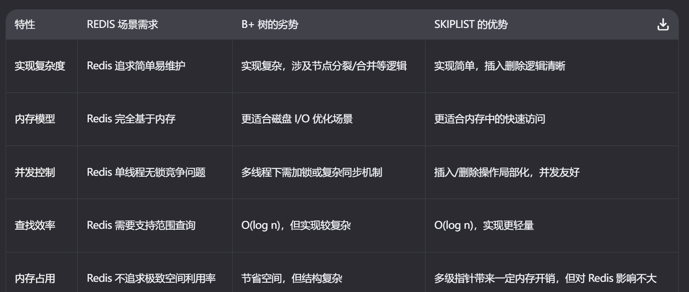

### 三、Redis 为何选择跳表（SkipList）

#### ✅ 1. **实现简单**

- SkipList 的插入、删除、查找操作都相对容易实现。
- Redis 的核心开发者希望保持代码简洁、稳定、易于维护。

#### ✅ 2. **支持范围查询**

- SkipList 天然支持按 key（score）顺序遍历。
- Redis 的 `ZRANGE`, `ZRANGEBYSCORE` 等命令依赖这种能力。

#### ✅ 3. **插入删除性能好**

- SkipList 平均时间复杂度是 O(log n)，最坏情况下也是 O(n)，但在随机跳跃层数设计良好的前提下，接近 O(log n)。
- 插入和删除只影响局部节点，不需要像 B+ 树那样进行复杂的树结构调整。

#### ✅ 4. **天然支持排名（rank）**

- Redis 的 ZRank、ZRevRank 命令需要知道某个元素在整个有序集合中的排名。
- SkipList 可以通过每层指针记录“跨度”（span）信息，轻松实现 rank 查询。

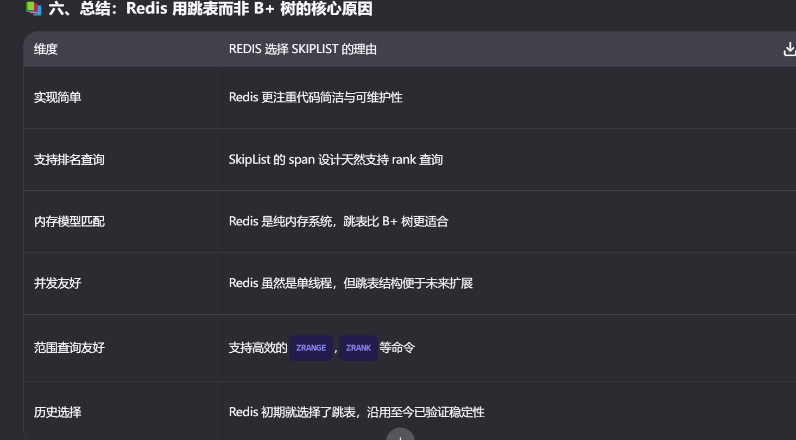

狼性文化：富有团队精神，不屈不挠，碰到难题啃下来而不是逃避

### 一、‌**以客户为中心**‌

- ‌**核心理念**‌：客户需求是华为发展的根本动力，所有产品、服务及创新均围绕客户价值展开。华为强调通过快速响应客户需求、持续优化体验来建立长期合作关系，并将客户满意度作为核心评价标准。
- ‌**实践体现**‌：例如在研发投入上，华为坚持将超过10%的销售收入用于研究经费，确保技术领先性以满足客户未来需求。

### 二、‌**以奋斗者为本**‌

- ‌**定义**‌：奋斗者指勇于担当、持续创造价值的员工。华为通过股权激励（“工者有其股”）和差异化的回报机制，确保奋斗者的贡献与收益匹配。
- ‌**任正非的诠释**‌：奋斗需以“为客户创造价值”为前提，无效加班或重复劳动不被认可。

### 三、‌**长期坚持艰苦奋斗**‌

- ‌**精神内涵**‌：既包括面对市场挑战的韧性（如早期开拓海外偏远市场的“烂脚”精神），也强调在技术攻坚中的持续投入。
- ‌**组织目标**‌：通过传递市场压力，保持内部机制激活状态，避免“组织疲劳症”。

### 四、‌**自我批判**‌

- ‌**作用**‌：通过定期反思不足、改进流程，推动个人与组织进步。任正非认为这是避免僵化、保持谦逊的关键。
- ‌**案例**‌：华为内部推行“小改进大奖励，大建议只鼓励”的制度，鼓励渐进式优化而非空谈。

### 五、‌**开放与进取**‌

- ‌**全球化视野**‌：华为倡导开放合作，吸收全球先进技术与管理经验，同时以客户需求驱动创新，将技术转化为商业成果。

### 六、‌**至诚守信**‌

- ‌**商业基石**‌：诚信被视为华为与客户、合作伙伴建立信任的核心资产，强调言行一致与契约精神。

### 七、‌**团队协作**‌

- ‌**跨文化合作**‌：打破部门壁垒，通过群体奋斗实现目标。华为的“狼性文化”中，群体意识与协作能力被视为成功的关键。


# 大模型相关问题

## MCP

在没有 MCP 之前，为 LLM（如 Claude、ChatGPT）提供外部能力通常面临以下挑战：

1. **紧耦合与高成本**：每个AI应用（如Claude Chat、Cursor IDE）都需要为自己想要集成的每一个工具（如数据库、JIRA、代码库）**单独编写和维护集成代码**。这成本极高，且不可扩展。
2. **重复造轮子**：如果另一个AI应用也想集成同样的工具（如Git），它必须从头再实现一遍相同的集成逻辑。
3. **安全隐患**：允许LLM直接执行代码或访问数据库会带来巨大的安全风险。需要一套机制来控制LLM的访问权限。
4. **能力受限**：LLM的知识受限于其训练数据，无法访问最新、最实时的或私有的信息（如公司内部的Wiki、代码库）。


**MCP 的出现，正是为了解耦 AI 应用与工具集成，让专业的人做专业的事：**

- **工具开发者**：只需专注于用一种标准协议（MCP）暴露他们的工具或数据。
- **AI 应用开发者**：只需专注于实现 MCP 客户端，就能立即让他们的应用获得所有兼容 MCP 的工具能力。
- **最终用户**：可以在他们喜欢的AI应用（如Claude、Cursor）中，安全地使用任何他们需要的工具。

- **对开发者而言**：只需编写一次MCP Server，就能让它运行在所有兼容MCP的客户端上，极大地扩大了工具的受众和影响力。

### MCP 的核心架构与工作原理


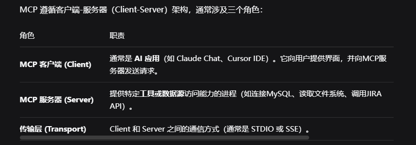


**工作流程（以在Claude中查询MySQL为例）：**

1. **启动**：用户启动客户端（Client）。客户端根据配置，启动本地的`mysql-mcp-server`（Server）。
2. **握手**：客户端和Server通过STDIO建立连接，交换各自的能力（例如，Server声明自己可以提供“数据库查询”和“列出表”的功能）。
3. **请求**：用户在客户端中输入：“帮我查看一下用户表里最近10个注册的用户。”
4. **路由与执行**：
   - 客户端识别出用户意图需要数据库工具，于是通过MCP协议向`mysql-mcp-server`发送一个 `query` 请求（包含SQL语句）。
   - `mysql-mcp-server` 接收请求，**安全地**执行这条**仅限于它被授权**的SQL查询。
5. **响应**：`mysql-mcp-server` 将查询结果以结构化数据（如JSON）的形式通过MCP协议返回给客户端。
6. **呈现**：客户端收到数据，将其作为上下文（Context）融入给LLM的提示词（Prompt）中，最终生成一个格式美观、易于理解的回答呈现给用户


## 一、基础概念与理论

#### 1. 解释一下 Token 是什么？Token 的限制会对大模型应用产生什么影响？如何应对？

**答**：

- **Token是什么**：Token 是大型语言模型处理和生成文本的基本单位。它不直接等同于单词，可能是一个词、一个子词（如`ing`）、甚至一个标点。例如，“ChatGPT”可能被拆分成`["Chat", "G", "PT"]`三个token。
- **影响**：
  1. **上下文长度限制**：模型有最大token数限制（如128k），限制了单次交互能处理的信息量。
  2. **成本**：API调用通常按token数收费，处理长文本成本高。
  3. **性能**：输入token数过多会导致延迟增加。
- **应对策略**：
  1. **摘要与提炼**：对长文本进行总结，用摘要代替原文输入。
  2. **检索增强**：采用RAG架构，只检索与问题最相关的片段送入上下文，而非全部文档。
  3. **优化Prompt**：精简指令，避免不必要的冗余。
  4. **模型选择**：根据任务选择上下文窗口合适的模型（如Claude 3支持200k上下文）。

#### 2. 什么是提示工程（Prompt Engineering）？举出几个常见的提示技巧及其适用场景。

**答**：
提示工程是通过精心设计输入文本来引导大模型产生更准确、更符合期望输出的技术和实践。

- **Zero-Shot Prompting**：直接给出指令，不提供例子。`“将以下文本翻译成法语：{text}”`。适用于简单、通用的任务。

- **Few-Shot Prompting**：提供少量示例（通常3-5个），让模型学习任务模式。

  text

  复制下载

  ```
  示例：
  输入：很高兴 -> 输出：Happy
  输入：很伤心 -> 输出：Sad
  输入：很兴奋 -> 输出：
  ```

  

  适用于任务复杂、难以用指令描述，或需要特定格式输出的场景。

- **思维链（Chain-of-Thought, CoT）**：要求模型逐步推理，展示其思考过程。`“请一步步推理并解答这个问题：...”`。适用于复杂推理、数学问题。

- **角色扮演（Role Playing）**：给模型赋予一个特定角色。`“你是一位资深律师，请审阅以下合同条款：...”`。用于引导模型输出更具专业性和特定视角的内容。

#### 3. 大模型的“温度”（Temperature）和 Top-p 参数分别控制生成的什么特性？

**答**：

- **Temperature**：控制输出的**随机性**。温度值越低（接近0），输出越确定、可预测（总是选择概率最高的token）；温度值越高（接近1或更高），输出越随机、创造性越强。
- **Top-p (核采样)**：从概率分布中筛选出一个候选集合，其累积概率刚好超过p（如0.9），然后只从这个集合中采样。这能动态地控制候选词的数量，避免选择概率极低的奇怪token，同时保持多样性。
- **调整策略**：
  - **代码生成、事实问答**：使用低温度（~0.2）以确保准确性和确定性。
  - **创意写作、头脑风暴**：使用较高温度（~0.7-1.0）以激发创造性。
  - Top-p通常设置为0.9-0.95，与温度配合使用。

#### 4. 什么是 Hallucination（幻觉）？在应用中如何尽可能地减少它？

**答**：

- **幻觉**：指模型生成的内容看似合理但实际上不正确或无法由输入信息验证，即“一本正经地胡说八道”。
- **减少策略**：
  1. **提供上下文**：使用RAG架构，为模型提供准确的、相关的信息源作为生成依据。
  2. **提示词约束**：在Prompt中明确要求“仅根据提供的上下文回答”，并警告“如果信息不足，请回答不知道”。
  3. **模型选择**：使用已知幻觉较少、更可靠的模型（如GPT-4通常比GPT-3.5更可靠）。
  4. **后处理验证**：对关键事实、数字、引用等进行二次验证（如通过另一个查询或规则系统）。

#### 5. 解释一下 RAG（Retrieval-Augmented Generation） 的完整流程和它的核心优势是什么？

**答**：

- **流程**：
  1. **索引**：将知识库文档切块，通过嵌入模型转换为向量，存入向量数据库。
  2. **检索**：用户提问时，将问题同样转换为向量，在向量数据库中检索出最相关的`k`个文本片段。
  3. **增强**：将检索到的相关片段（Context）和用户问题（Query）一起组合成一个Prompt。
  4. **生成**：将组装好的Prompt发送给LLM，让LLM基于提供的Context生成答案。
- **核心优势**：
  1. **知识实时性**：无需重新训练模型，只需更新知识库，即可让模型获取最新知识。
  2. **降低幻觉**：模型回答有据可依，减少了凭空编造的可能。
  3. **溯源能力**：可以追溯到答案的来源片段，增强可信度。
  4. **成本效益**：比微调（Fine-tuning）大规模模型成本低得多。

------

## 二、应用架构与模式

#### 1. 在 RAG 系统中，如果检索到的文档质量很高，但最终生成的答案仍然不准确，可能是什么原因？

**答**：排查思路如下：

1. **提示词问题**：检查组装Prompt的模板。是否清晰地指示了模型要基于Context回答？Context和Query的位置和格式是否合适？
2. **上下文过长**：检索出的`k`个片段可能总量还是超过了模型的有效上下文窗口，导致模型忽略了靠后的重要信息。可以尝试减少`k`，或使用摘要代替全文。
3. **模型本身能力**：使用的LLM（如GPT-3.5）可能推理或理解能力不足，无法从给定的Context中提炼出正确答案。可以升级到更强大的模型（如GPT-4）。
4. **冲突信息**：检索出的多个片段之间可能存在信息冲突，模型混淆了。可以引入**重排序（Re-Ranker）** 模型，对检索结果进行精排，将最相关的片段放在最前面。
5. **答案不在Context中**：问题可能需要综合推理，而检索到的片段只包含了部分信息。可能需要优化检索策略（如调整chunk大小，使用HyDE技术）。

#### 2. Agent 的核心思想是什么？ReAct 模式是如何工作的？

**答**：

- **核心思想**：Agent是将LLM作为“大脑”，通过**感知-思考-行动**的循环，自主调用工具（Tools/APIs）来完成复杂任务的系统。它赋予LLM执行能力和与世界交互的能力。

- **ReAct模式**：

  - **Reason**：模型**思考**当前情况，决定下一步该做什么。

  - **Act**：模型**行动**，调用一个工具（如`search`， `calculate`）并获取结果。

  - 循环上述步骤，直到任务完成。

  - **示例**：

    text

    复制下载

    ```
    Thought: 用户问的是最新消息，我需要先搜索一下。
    Action: search("特斯拉最新车型发布")
    Observation: [搜索引擎返回的结果：Model Y 在10月1日发布...]
    Thought: 我已经找到了发布信息，现在需要把关键信息总结给用户。
    Action: finish("根据最新消息，特斯拉于10月1日发布了Model Y车型...")
    ```

    

------

## 三、工程实现与优化

#### 1. 如何处理超出模型上下文窗口的长文本？

**答**：

- **滑动窗口**：处理长文本时，只关注当前窗口内的内容。缺点是会丢失全局信息。
- **分层总结/映射**：
  1. 将长文本切分成块。
  2. 对每个块生成一个摘要或嵌入向量。
  3. 先检索或查询这些摘要，找到最相关的部分。
  4. 再将相关的详细文本块送入LLM。这是RAG的核心思想。
- **选择性上下文**：使用更小的模型或专门算法来判断长文本中哪些部分是相关的，只将这些关键部分送入大模型。

#### 2. LangChain 和 LlamaIndex 这样的框架解决了什么核心问题？

**答**：

- **LangChain**：是一个**全流程应用开发框架**。它提供了Chain、Agent、Tool等高级抽象，旨在简化将LLM与各种工具、数据源、记忆组件连接起来构建复杂应用的过程。它更侧重于**编排和逻辑控制**。
- **LlamaIndex**：是一个**专注于数据接入和检索的框架**。它擅长将私有或自定义数据（API、PDF、DB等）高效地连接到LLM，核心优势在于为RAG应用提供最佳的数据索引和检索方案。它更侧重于**数据层**。
- **选择**：
  - 如果核心是构建一个**与数据对话的问答系统（RAG）**，从LlamaIndex开始非常合适。
  - 如果构建一个**复杂的、多步骤的、需要与外部工具交互的Agent应用**，LangChain更强大。
  - 在复杂应用中，两者常结合使用：LlamaIndex负责数据端，LangChain负责业务流程和Agent逻辑。

------

## 四、场景设计与开放题

#### 1. 设计一个支持私人知识库对话的AI助手。

**答**：

- **技术选型**：
  - **整体架构**：RAG
  - **向量数据库**：Chroma / Pinecone / Weaviate (选择理由：轻量、易部署、性能)
  - **嵌入模型**：`text-embedding-ada-002` 或 `BGE-large` 开源模型 (选择理由：效果和成本平衡)
  - **LLM**：GPT-4 Turbo (选择理由：强大的长上下文和理解能力) 或 Claude 3 (根据实际情况)
  - **框架**：LlamaIndex (核心数据管道) + LangChain (可选，用于复杂对话流)
  - **应用层**：FastAPI/Flask (后端) + Streamlit/Gradio/React (前端)
- **架构流程**：
  1. **预处理**：用LlamaIndex的`SimpleDirectoryReader`和`SentenceSplitter`加载和切分PDF、Word等私人文档。
  2. **索引**：使用嵌入模型将文本块向量化，并存储到向量数据库。
  3. **查询**：
     - 用户在前端提问。
     - 后端将问题向量化，在向量库中检索最相关的`k`个片段。
     - 组装Prompt：`“请仅根据以下上下文回答：{context}。问题：{question}"`。
     - 调用LLM API获取答案并返回给用户。
  4. **优化点**：引入重排序模型、缓存频繁查询结果、记录日志构建数据飞轮。


# 线上排查

## Arthas

“Arthas是我线上问题排查的首选工具，它让我在不修改代码、不重启应用的情况下，就能进行深入的诊断。我主要用它来解决以下几类问题：

#### 1. 排查CPU飙升问题（最常用）

**场景**：收到运维告警，某台应用服务器CPU使用率持续100%。

**排查步骤**：

1. **定位问题线程**：首先用 `thread` 命令查看所有线程的运行情况，看哪个线程消耗CPU最高。

   bash

   

   复制

   

   下载

   ```
   thread -n 3 # 显示CPU占用率最高的3个线程
   ```

   通常会发现某个线程的CPU占用率远高于其他线程。

2. **查看线程栈**：接着用 `thread <线程ID>` 命令查看这个繁忙线程的详细堆栈信息。

   bash

   

   复制

   

   下载

   ```
   thread 56 # 查看ID为56的线程的堆栈
   ```

   从堆栈信息中，我就能定位到是**哪个类**的**哪个方法**正在疯狂运行。

3. **反编译确认逻辑**：有时堆栈信息只能看到方法名，为了确认具体的代码逻辑，我会用 `jad` 命令反编译这个类。

   bash

   

   复制

   

   下载

   ```
   jad com.example.MyService expensiveMethod
   ```

   这样就能直接看到是不是出现了死循环、复杂的计算或者低效的算法。

**成果**：通过这个流程，我快速定位过因为正则表达式回溯导致的CPU爆满、以及一个意外的死循环问题。

#### 2. 排查接口耗时慢、超时问题

**场景**：监控发现某个接口耗时异常，从平均50ms涨到了2s。

**排查步骤**：

1. **监控方法调用轨迹**：使用 `trace` 命令，这是Arthas最强大的功能之一。它可以监控一个方法的内部调用路径，并统计每个子调用的耗时。

   bash

   

   复制

   

   下载

   ```
   trace com.example.UserController getuserInfo '#cost > 500' # 只显示耗时超过500ms的调用路径
   ```

2. **分析耗时瓶颈**：`trace` 的输出会清晰显示整个调用链，到底是卡在数据库查询、远程RPC调用，还是某个复杂的计算逻辑上。一眼就能找到瓶颈点。

**成果**：我用这个功能发现过一个N+1 SQL查询问题（循环内调用Mapper）、以及一个调用外部第三方API超时的故障。

#### 3. 动态观察方法入参和返回值

**场景**：测试环境发现一个Bug，但日志没打全，无法确定传入的参数是什么，返回了什么。

**排查步骤**：

- **观察方法调用**：使用 `watch` 命令，像一个动态的调试器。

  bash

  

  复制

  

  下载

  ```
  watch com.example.OrderService calculatePrice '{params, returnObj}' -x 3 # 观察入参和返回值，-x 3表示展开3层
  ```

- **甚至修改返回值**：在紧急情况下，可以用 `ognl` 命令临时修改一个静态变量的值，或者执行一些表达式来绕过某些逻辑，作为一种临时的热修复手段。

  bash

  

  复制

  

  下载

  ```
  ognl '@com.example.Config@SWITCH' # 查看静态变量值
  ognl '@com.example.Config@SWITCH = false' # 修改静态变量值
  ```

**成果**：在排查一个优惠券计算错误时，我通过`watch`发现了一个前端传入的异常参数值，快速定位了问题根源。

#### 4. 反编译线上代码确认版本

**场景**：怀疑线上部署的代码版本不是最新的，或者想知道某个类是否包含了最新的修复。

**排查步骤**：

- 直接使用 `jad` 反编译线上正在运行的类，与本地代码进行对比。

  bash

  

  复制

  

  下载

  ```
  jad com.example.MyImportantClass
  ```

**总结**：
对我来说，Arthas不仅仅是一个工具，它代表了一种**无需重启即可快速定位问题**的思维方式。它极大地缩短了排查线上问题的时间，从原来的“猜谜-加日志-发布-重启-等待复现”的漫长周期，变成了现在的“连接-输入命令-定位问题”的分钟级响应。我的经验是，熟练使用 `thread`, `trace`, `watch`, `jad` 这几个核心命令，就能解决90%的线上疑难杂症。


## 火焰图

**一句话概括：火焰图是一种将性能采样数据可视化的图形，它像一个倒置的火焰，用来快速定位CPU时间到底被哪些函数“烧”掉了。**

它的核心特点是：**看顶不看底，看平不看陡**。

- **X轴**：表示采样总量，每一块代表一个函数在采样中出现的机会。**条的宽度越宽，表示该函数占用的CPU时间越多。**
- **Y轴**：表示调用栈的深度。最顶层是正在执行的函数，下层是它的调用者。


“火焰图是我进行深度性能剖析，特别是排查CPU和性能瓶颈问题时最强大的工具。它不同于`arthas trace`那种针对单一方法的分析，而是给我一个**系统的、全局的鸟瞰视图**，告诉我整个应用在采样期间的所有热点。

**1. 我的使用场景：**
我主要会在两种情况下使用它：

- **CPU持续居高不下**，但使用`arthas thread`命令无法一眼看出是哪个单一线程的问题，可能热点分散在多个地方。
- **进行性能调优**，希望找到最耗时的函数进行优化，以求达到最大的投入产出比。

**2. 如何生成与查看（结合Arthas）：**
我通常使用Arthas的`profiler`命令来生成火焰图，非常方便。

```
# 启动性能采样（默认是CPU）
profiler start

# 让采样运行一段时间（比如30秒），模拟请求或等待问题复现
profiler stop --format html --file /tmp/hotspot.html # 停止采样并生成HTML格式的火焰图
```

然后我将生成的`hotspot.html`文件下载到本地，用浏览器打开即可查看。

**3. 如何解读火焰图 - 这才是关键：**
面试官，我理解的火焰图核心技巧是：**寻找最宽的‘平顶山’**。

- **平顶山（Flat Plateau）**：如果一个函数的调用栈项部出现了一个很宽的、平坦的条，这通常就是**性能热点**。这意味着这个函数自身占用了大量的CPU时间（例如，它内部可能有一个循环或繁重的计算）。
  - **示例**：你可能会看到一块很宽的 `String.decode` 或者 `HashMap.hash`，这提示你可能在频繁解码字符串或发生哈希冲突。
- **尖峰（Tall Peaks）**：如果一个条很高但很窄，这通常不是问题。它只表示调用链很深，但最终执行的函数本身并不耗时。

**4. 我的一次实战案例：**
有一次我们一个数据处理服务CPU使用率很高。我通过Arthas生成火焰图后，发现最宽的‘平顶山’是一个自定义的 `JSONUtils.parse` 方法。

- **深入分析**：我点击这个条，向下展开它的调用栈，发现它被一个循环内的代码频繁调用。
- **根因定位**：原来是在处理列表数据时，对列表中的每一个对象都单独进行JSON序列化，而不是对整个列表进行一次序列化。
- **解决方案**：将序列化移出循环，改为批量处理。
- **效果**：这个改动直接让该服务的CPU使用率下降了40%。

**5. 火焰图的变种：**
除了最常用的CPU火焰图，我还知道有其变种用于不同场景：

- **内存分配火焰图（Allocation Flame Graph）**：显示哪些函数分配了最多的内存，用于排查内存问题。
- **锁竞争火焰图（Lock Flame Graph）**：显示线程在哪些锁上等待的时间最长，用于排查并发瓶颈。

**总结：**
对我来说，火焰图不是一个日常命令，而是一个当常规手段（如日志、APM、Arthas简单命令）无法快速定位复杂性能问题时的‘核武器’。它能将抽象的CPU时间消耗变得一目了然，直接指引我去优化那些能带来最大收益的代码块，极大地提升了性能调优的效率

### JDK自带神器：

- **`jstack`**：在Arthas出现前，这是获取线程堆栈的必备命令。现在偶尔在机器环境非常受限无法安装Arthas时，会用它来抓取线程快照，分析死锁或锁竞争。
- **`jmap` + `jhat` / `MAT`**：这是**分析内存泄漏（OOM）的标准流程**。`jmap`dump堆快照，然后用Eclipse MAT工具分析，可以清晰地看到哪些对象占用了最多内存、是谁在引用它们，从而找到泄漏点。
- **`jstat`**：用于实时查看JVM的GC情况，比如每隔1秒打印一次GC统计信息，非常轻量。`jstat -gc <pid> 1s`

# 秋招简历相关

## 简历2实习内容

**2025.05-至今 得物(交易营销部门投放玩法组)** 

**业务概述：实现场域(会场/频道)投放(权益、商品流个性化定制)诉求**。解决投放领域(投放、反馈、投承一体)链路

闭环，最终实现支持招选搭投的投放能力闭环。我主要负责**会场商品流**投放链路、**出图业务**建设与迭代。

个人职责：

\1. **大用户优惠资产 DB+缓存治理**：增加基于用户维度并发 Redis 锁**+DCL 防止缓存**击穿，通过离线表同步大用户资产量

级并**定时任务每日缓存**加载大用户优惠资产，解决用户资产过大导致的 CPU 瞬时 100%问题。

\2. **出图业务迭代**：负责多场景出图链路统一渠道，将原来由**数据源驱动**出图业务改造为**按场景**出图，实现复用投放体

系底层能力，增强业务的可扩展性和代码可维护性。

**3. 首屏加载优化**：通过 **CompletableFuture** 并行实现多组件数据任务获取，提升会场首屏加载速度 75%，并通过**线程**

**池隔离**预防了异步嵌套带来的**线程池死锁**问题。 

**4. 疯狂周末秒杀排期后台开发**：实现秒杀频道排期场次、商品排期的管理，实现运营人员秒杀频道的排期、场次的快

速配置，结合 **Redis 分布式锁**支持多人同时排期，预估每季度**节约工时 120h**。 

**5. 营销 AI 小助手 (SpringBoot3 + SpringAI + RAG )** 

个人开发的一款针对得物营销部门的 AI 提效工具，支持 AI 多轮对话和对话持久化，通过 RAG 构建本地知识库，

帮助新人更快了解业务相关的知识。

**2023.12-2024.04 数字藏品交易平台** 

一款数字藏品交易平台，用户可以注册登录，抢购藏品，生成订单，订单支付等功能。解决高并发场景下库存超卖、

数据一致性问题

主要技术栈为：**SpringBoot+Spring+Spring MVC+MySQL+Redis+MyBatis-Plus+Rabbit MQ+Redisson** 

**核心方案与成果：** 

**1.** 在用户表的基础上，设计**用户手机、用户邮箱路由表**，能在**分库分表**的情况下，支持手机号和邮箱的登录功能。 

\2. **通过基因法融合订单编号和用户 id(支持订单编号和用户 id 查询)，对订单表进行分库分表，解决读扩散问题。**

\3. 设计**图形验证码**基础组件，应用到用户注册业务，以及再结合**布隆过滤器解决缓存穿透问题**。

\4. 采用多级缓存架构，使用 Redis 配合本地 Caffeine 实现 JVM 级缓存，查询接口响应从 330MS 降低至 29MS.

\5. 通过 **Lua+Redis** 保证**不会出现库存超卖+资格超卖**的问题。通过 RabbitMQ 实现异步下单解耦。

\6. 设计**分布式锁**基础组件，利用**工厂模式**和**策略模式**来提供多种类型的锁(可重入锁、读锁、写锁),并**兼容事务**


#### 大用户优惠资产 DB+缓存治理：

增加基于用户维度并发 Redis 锁**+DCL 防止缓存**击穿，通过离线表同步大用户资产量

级并**定时任务每日缓存**加载大用户优惠资产，解决用户资产过大导致的 CPU 瞬时 100%问题。

- 首先是收到飞书告警，查看APM监控，阿里云性能趋势监控大盘显示mysql cpu利用率出现一个尖刺，连接数，tps也是，历史top sql CPU消耗发现有一条sql耗时较长，平均执行耗时1.8S，扫描行18W行，这个sql语句根据用户id,券过期时间，是否删除，是否过期。来查询的，一般用户没有这么多代金券的。这个用户18W代金券有点多。然后查看APM查看一些接口，有一个接口的响应时间在对应时间端有上升，查询这个接口对应时间端的trace时间记录链条，发现调优惠的接口花费了接近1.8s, 然后查看对应优惠接口代码，发现先查缓存，没有就会插数据库，但是前端有个场景，在一个tab展示满减tab下展示 用户收藏∩可用满减的的商品，然后每个商品都会走这个接口，然后调优惠，导致并发针对同一个缓存，造成缓存击穿，而查数据库呢由于这个用户资产太多，扫描行数过多，就很慢。


定位到问题之后，解决方案：

1. 部分用户资产太多，有的是过期了，所以弄了个一周定时清理过期的

2. 给userid,过期时间,statue,isdel加了索引。

3. 缓存击穿的治理，原来是查缓存然后没有就去数据库查找，但是存在击穿的风险，所有加了并发锁和二次判断防止缓存击穿，为了优化体验呢，用的可配置退避指数重试3次。

4. 【暂无】 由于有的用户资产有点多，之前的没过期也有接近2400条。查询数据库时，分批聚合，每一批100个，【暂无】

5. 通过离线计算每日前300的的大资产用户， 加入到缓存。

   odps-离线数据同步任务
   1、首先第一步要申请odps的登陆权限

   2、新增数据同步任务
   选择离线任务，本任务是从mysql到odps，根据自己的需求和环境情况做选择
   3、配置完成后，运行任务，跑sql确认数据是否同步成功

   回流至对应表，按每天区分数据，通过oneservice数据服务中心来获取离线数据。

   MaxCompute适用场景
   大数据计算服务（MaxCompute，原名ODPS）是一种快速、完全托管的EB级数据仓库解决方案。 在得物现在的应用场景下，MaxCompute主要用于解决T+1离线 大数据 数据的复杂ETL场景

   **为什么是300**：这个数字是业务和技术权衡的结果。我们统计了历史数据，发现优惠券数量巨大的用户是典型的“长尾分布”，真正需要预热的极端用户并不多。300这个数字既能覆盖几乎所有可能造成问题的用户，又不会因为预热太多用户数据而给Redis带来太大的内存压力和网络带宽消耗。

6. 用户资产变更后，比如用户某一个优惠券核销了，删除对应用户优惠券缓存，异步MQ 进行一次数据库查询并写入缓存【list结构】

#### **出图业务迭代**：

负责多场景出图链路统一渠道，将原来由**数据源驱动**出图业务改造为**按场景**出图，实现复用投放体

系底层能力，增强业务的可扩展性和代码可维护性。

按数据源的话，不同场景的出图维护在不同的团队，由他们自己条其他接口出图。按场景的话，我们就能根据场景配置展位，通过投放的展位链路进行统一数据获取，投放这边涉及到商品图价的有一套统一的底层能力。如果链路走我们这边的话能够实现复杂的功能改造成本会更小。

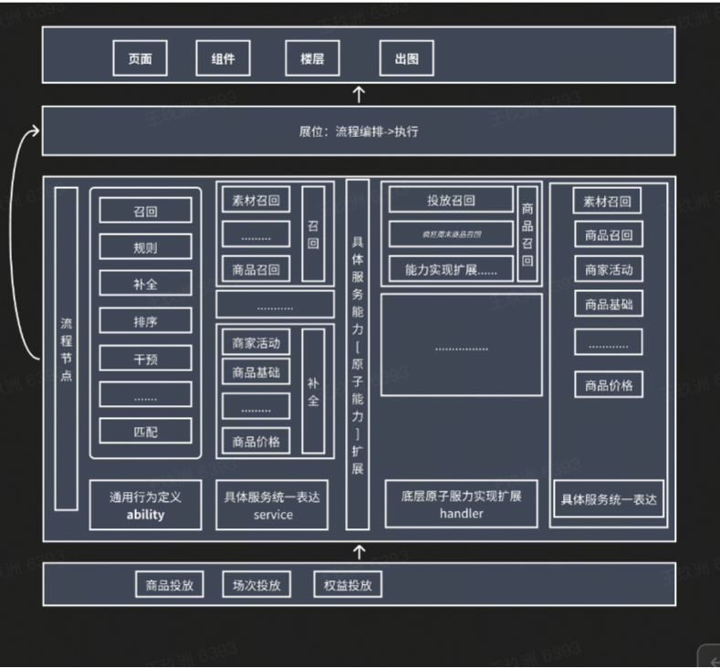

#### **首屏加载优化**：

通过 **CompletableFuture** 并行实现多组件数据任务获取，提升会场首屏加载速度 75%，并通过**线程**

**池隔离**预防了异步嵌套带来的**线程池死锁**问题。

​	会场是按楼层搭建，楼层一般就是一个组件，当跳转到首屏的时候，可能会有多个楼层，而一个组件如果是多展位组件在获取数据可能会差分多个组件模型获取数据，比如商品流组件配置了品牌墙，他在进行这个组件数据请求时会拆分为品牌墙展位和商品流展位两个模型去获取数据，对于首屏本来可能组件就多，当还有组件会拆分后就多次组件数据请求，组件数据请求的核心是这个一个展位能力，每个展位是一个原子流程编排的。所以为了提高请求响应速度，使用CompletableFuture去并行获取数据。

嵌套是因为，一个组件模型在执行展位链路的时候，里面可能还会有并发情况，比如一个组件获取了n个spu,针对者n个spu进行补全等等，可能会进行异步嵌套。


隔离，新建一个线程池。

自定义了一个线程池服务的接口，能够实现通过线程池对任务的提交等操作。具体实现类，用ConcurrentHashMap存储所有的线程池，key是一个枚举表示线程池具体的线程池名字，value是线程池实例。实现类实现，InitializingBean, DisposableBean接口。

afterPropertiesSet的时候便利枚举中的所有线程池服务进行线程池初始化。destory进行线程池销毁。

#### **疯狂周末秒杀排期后台开发**：

实现秒杀频道排期场次、商品排期的管理，实现运营人员秒杀频道的排期、场次的快速配置，结合 **Redis 分布式锁**支持多人同时排期，预估每季度**节约工时 120h**。


秒杀频道的商品是需要招商的，原始秒杀商品排期流程，用granfana一次性拉取秒杀审核通过的商品。运营把这些数据分给3~4个同学，线下为商品进行时间排期用excel，在吧对应的excel上传到秒杀排期组件配置页面。所以效率低，不方便。开发一个后台。


实现场次管理增删改查。场次就是比如几月几号几点到几点就是一个场次，然后那些商品加入到这个场次进行参与秒杀。

实现商品的排期。


#### **营销 AI 小助手 (SpringBoot3 + SpringAI + RAG )** 

个人开发的一款针对得物营销部门的 AI 提效工具，支持 AI 多轮对话和对话持久化，通过 RAG 构建本地知识库，

帮助新人更快了解业务相关的知识。


飞书挑了一些和相关的知识库，通过飞书api下载为markdown格式。主备好原始文档。

- 文档向量入库，通过SpringAI的VectorStore接口，定义了知识向量的增删改查吧。对于具体的VectorStore实例，通过配置数据源，向量模型等。我使用的是PgresSql,支持向量化。因为VectorStore处理的类型是SPringAI的Document,所以需要把markdown文件读取转换为Document交友VectorStore保存。

- springAi 有插件使用了会话的历史记录，但仅限于此，只记录了（会话id，内容，会话类型）这些，要实现不同用户的记录，需要额外简历一张表，而对这个表的存储，通过advisor来操作，advisor相当于拦截器，多个ad构成一条链，分为before和after,是在与LLM交互前进行一些操作比如日日志打印，会话保存，查询增强等，

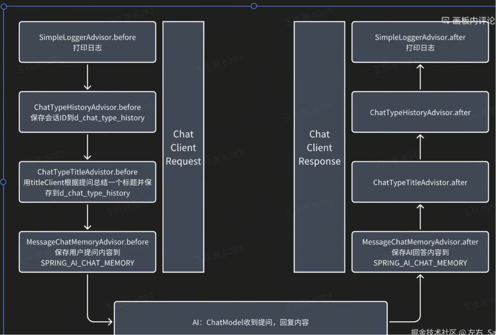

**多轮对话是如何保持上下文的？有没有用Redis存储会话？**
答：是的，我们使用了**Redis**来持久化对话上下文。

- **实现方式**：为每个对话会话（Session）创建一个唯一的ID。
- 用户每发起一次新的对话，我们就将这个ID下之前所有的**问答对（Q&A）** 从Redis中取出。
- 在调用大模型API前，我们将**历史对话**和**当前问题**一起作为Prompt（提示词）发送给模型。
- 得到回答后，我们将新的Q&A对追加到这个Session的上下文中，并重新存回Redis（通常会设置一个TTL，例如1小时，来自动清理过期会话）。
  这样，模型就能“记住”在当前会话中之前聊过的内容，实现连贯的多轮对话。

**如何评估AI回答的准确性？有没有人工审核机制？**
答：

- **评估准确性**：初期主要依靠**人工抽样评估**。我们邀请团队同事和运营同学试用，并收集反馈。同时，我们在后台记录了所有的问答日志，便于后续复查和分析。
- **人工审核机制**：对于这个**内部工具**，我们没有做强制的人工审核流程，因为不直接面向外部用户，风险可控。但我们提供了一个“反馈”功能，用户如果发现回答不准确，可以点击“踩”并填写原因，这些反馈会记录到日志和数据库，供我们后续优化模型和知识库。

**这个工具实际使用效果如何？有没有用户反馈？**
答：效果达到了预期。它确实成为了新人快速了解业务的一个有用工具，能回答很多常规的、文档中已有答案的问题，减少了老员工被重复咨询的次数。
我们收到了不少正面反馈，例如“查东西快多了”、“不用到处翻文档了”。同时，也收集到一些有价值的负面反馈，主要集中在一些非常具体的、细节的问题上回答不够准确，这帮助我们持续迭代和补充知识库。

**选择RAG模式的原因**：

1. **解决“幻觉”问题**：直接让大模型回答专业知识，它很容易“编造”信息（幻觉）。RAG通过先从我们自建的**权威知识库**中检索相关文档片段，再让模型基于这些**确凿的依据**进行回答，极大提高了回答的准确性。
2. **知识可更新**：大模型API的内部知识是静态的（存在截止日期）。而我们的业务知识在不断变化。通过RAG，我们只需要更新向量数据库中的文档，就能让助手立刻获取到最新知识，成本极低。
3. **数据安全**：有些内部知识不适合用于训练公开模型。RAG模式下，我们的内部知识始终存储在自己的向量库中，不会泄露给第三方模型厂商。


##### 其他

**对话越来越长，每次和新问题一起丢给大模型，消耗很多token。**

- 存储固定轮次数量的对话，简单，丢失早期对话
- 早期摘要，对话伦茨到达一定阈值（8论），下一次提问，会将前5论一起发给模型生成摘要，替换之前的5论对话，和最近3论详细以及问题发送给大模型，【系统指令+历史对话摘要+最近3论+当前问题】，保留一些对话核心语义，提升陈本
- 基于向量检索的记忆召回。
  - 每一轮对话结束后，不仅将其存入会话列表，还会异步将其**向量化**并存入一个专属于本次会话的**小型向量库**（Chroma支持多集合）。
  - 当用户发起新问题时，除了使用最新的对话历史，还会**用当前问题去这个专属向量库中进行检索**，找出整个会话历史中**最相关的”记忆“片段**（可能来自很久以前）。
  - 将这些检索到的相关片段作为上下文，与最近的几轮对话一起组成Prompt。

**向量数据库（Vector Database）的选型与利用**

- **索引创建**：将分块后的文本通过Embedding模型转换为向量后，并非简单地存入数据库。我使用了`HNSW`（Hierarchical Navigable Small World）这类高效的近似最近邻（ANN）算法来创建索引。这虽然增加了构建时间，但**极大地提升了后续检索的速度和效率**，这是生产级应用必须考虑的。
- **元数据（Metadata）存储**：除了存储向量和原始文本，我还在Chroma中为每个chunk存储了元数据，例如：`{“source”: “营销玩法手册_v2.pdf”, “page”: 12, “category”: “优惠券”}`。这为后续的**元数据过滤**提供了可能。

**RAG检索**

检索阶段是将用户问题与知识库匹配的过程，我的知识在这里得到了充分应用。

- **查询转换（Query Transformation）**：我意识到，用户的原始提问（Query）可能并不最适合用于检索。因此，我应用了以下技术：
  - **Query Expansion**：利用大模型本身的能力，让模型根据用户问题生成2-3个不同角度的同义或相关问题，然后用这一组问题去检索，扩大检索范围，避免遗漏。例如，用户问“如何投券？”，模型可能会生成“投放优惠券的步骤是什么？”、“投券工具有哪些？”。
  - **HyDE（Hypothetical Document Embeddings）**：让大模型根据问题“假设”一个答案（一段假想的文档），然后用**这段假设答案的向量**去检索，而不是用原始问题。这种方法有时能奇迹般地找到更相关的内容。
- **相似度算法**：我使用了余弦相似度（Cosine Similarity）来计算用户问题向量与知识库向量之间的相关性，因为它更关注方向而非大小，更适合文本相似度比较。
- **重排序（Re-Ranking）**：初步检索可能会返回N个（例如10个）相关chunk。我的知识告诉我，基于Embedding的初步检索可能会因为关键词不匹配而漏掉重要内容。因此，我加入了一个**重排序模型**（如`bge-reranker`），对Top N的结果进行更精细的语义打分和重新排序，将最相关的2-3个chunk放在最前面，显著提升最终注入Prompt的上下文质量。
- **元数据过滤**：如果用户的问题带有明确的范畴，例如“介绍一下**双十一**的投券规则”，我就可以在检索时增加元数据过滤条件`where: {"category": "双十一"}`，这样能排除大量无关信息，让检索结果极度精准

## 简历4-7内容

**业务概述：**实现场域(会场/频道)投放(权益、商品流个性化定制)诉求。解决投放领域(投放、投承一体)链路闭环，

最终实现支持招选搭投的投放能力闭环。我主要负责会场频道相关业务的建设和迭代**。**

主要产出：

\1. **优惠 C 侧库缓存**(由于部分用户优惠资产数量过大产生慢查询，且多次触发造成缓存击穿，导致 CPU100%)

通过增加用户维度的 **Redis 并发锁+DCL+**可配置**自旋重试**解决可能带来的**缓存击穿**问题;每日离线计算前 300 大用

户并定时缓存加载进行**定时预热；**优化缓存加载流程：用户资产变更后，MQ 异步进行一次**被动加载**。

\2. **首屏加载优化** (由于会场按楼层式搭建，会场首屏的楼层过多原串行处理组件逻辑速度较慢，降低首页呈现效果)

通过 **CompletableFuture** 并行实现多组件数据任务获取，提升会场首屏加载速度 **32%**，并通过**线程池隔离**预防了

异步嵌套带来的**线程池死锁**问题。

\3. **会场个性化校验（**运营人员用不同组件+数据配置搭建会场，经常会存在因配置问题而导致会场组件数据问题**）**

针对会场个性化分发**双端数据不一致**: 通过**版本号**为双端数据提供一致性识别口径，B 端定时扫库(分批+传上次

最大 ID 避免**深分页**)对比版本+**分布式锁**保证扫库无干扰+C 端版本校验留痕;实现 1H 运营发现+提高了会场数据一致性。

会场埋点设计：由于缺乏组件返回数据为 0 的 case 统计，考虑后续扩展性，通过**模板方法**构建了统一的组件埋点

监控框架，支持多种投放组件类型的标准化埋点。

**4.** 营销 AI 小助手 (SpringBoot3 + SpringAI + RAG ) 

个人开发的一款针对得物营销部门的 AI 提效工具，支持 AI **多轮对话**和**对话持久化**，通过 **RAG** 构建本地知识库，

帮助新人更快了解业务相关的知识。

### 1. 缓存治理

#### 排查：

飞书告警mysql 100%危机， 阿里云性能趋势监控大盘显示mysql cpu利用率出现一个尖刺，同时伴随的还有数据库连接数和TPS的尖刺

查看**历史Top SQL性能统计**。发现了一条非常可疑的SQL：它的平均执行时间高达**1.8秒**，最大扫描行数达到了**18万行**，并且在故障时间点执行频率异常的高。

这条SQL是根据`用户ID`、`券过期时间`、等条件查询用户的有效代金券。一个正常用户通常只有几十张甚至几张券，但这个被查询的用户ID居然有**18万张**代金券，这本身就是一个异常点。

我接着打开**APM应用性能监控系统**（比如Skywalking或Cat），筛选故障时间段的接口响应时间。发现有一个名为【获取商品可用优惠信息】的接口，其P99响应时间从正常的120ms上升到了接近**2秒**。

我抓取了这个接口在故障时间点的一个具体**调用链（Trace）**。链条清晰显示，耗时几乎全部集中在一个叫做`getUserCoupons`的方法上，耗时约**1.8秒**，这与慢SQL的耗时完全吻合。

**代码层面根因定位**：我立即去检查了这个优惠接口的代码逻辑，发现了一个设计上的问题：

1. 前端在一个展示“用户收藏且可用满减”的商品列表页中，**为每一个商品都并发地调用**这个优惠接口，检查该商品能否使用优惠券。
2. 该接口的逻辑是：先查Redis缓存，如果缓存不存在（未命中），则直接查询数据库，并将结果回写到缓存。
3. **问题就在这里**：当大量请求并发查询同一个用户（那个拥有18万张券的用户）的、**未在缓存中的**优惠券数据时，缓存瞬间被击穿。所有请求都绕过了缓存，直接打到数据库上执行那条需要扫描18万行数据的慢SQL。数据库CPU被瞬间打满，连接池也被占满。

#### 解决方案与优化
我们针对性地制定了三层解决方案：

1. 慢SQL的查询条件中包含了 `过期时间` 和 `是否删除`。但问题在于，**所有历史过期的代金券，其状态仍然是‘未删除’**。这意味着数据库需要持续地扫描和维护大量早已无效的‘冷数据’。我们增加了一个**低频运行的定时任务**（比如每天凌晨2点），它的任务逻辑非常清晰：定时将数据库的过期的数据逻辑删除。

> 1. **扫描行数急剧下降**：执行后，那个用户的‘有效’数据量就从18万行降到了1万行。之后同样的查询SQL，需要扫描的行数直接从**18万行降到了1万行**，扫描量减少了94%以上。如果再配合良好的索引，扫描行数可以进一步降到几十行。
> 2. **数据库整体压力降低**：表的数据体积虽然没有减小（因为是逻辑删除），但**有效数据集的体积变小了**。这提升了整个表的查询性能，缓冲池（Buffer Pool）可以缓存更多的热点数据，索引也更小、更高效。
> 3. **一劳永逸**：这个方案不仅解决了那个特定用户的问题，而是清理了所有用户的过期数据，避免了未来任何一个用户变成‘大户’时再次引发类似故障。

2. (立即修复，解决并发) **：在查询缓存和数据库的代码层，针对用户维度增加了**Redis分布式锁**，并采用了**双重检查锁定（DCL）** 模式。保证在缓存失效时，只有一个请求能去数据库加载数据，其他请求阻塞等待或可配置自旋重试，彻底避免缓存击穿。
3. 数据预热 (解决极端用户) **：我们增加了一个离线计算任务，每日凌晨通过大数据平台跑出**资产数量Top 300的用户列表**，并在业务低峰期（凌晨4点）定时将这些“热点用户”的优惠资产数据提前加载到缓存中（预热），避免他们成为击穿的源头。**
4. **流程优化 (保证数据一致性) **：我们优化了缓存更新流程。当用户的资产发生变更时（比如发券、删券），原来的流程会删除对应用户缓存，新的在此基础上：还会发送一条**MQ消息**，消费者会异步地、主动地去刷新Redis中的缓存。

> **总结一下，我们的优化是分层、全方位的：**
>
> - **短期应急**：通过**分布式锁**防止缓存击穿，立刻止血。
> - **中期应对**：通过**热点预热**应对极端case，防患于未然。
> - **长期治本**：**优化数据模型**（定时逻辑删除过期数据）+ **优化数据库索引**，从根源上降低单次查询的资源消耗。
> - **流程保障**：通过**MQ异步更新**保证缓存数据的时效性

#### MySQL出现短时间的尖刺，除了缓存穿透，			1？

##### 1. 外部流量与应用层原因 (最常见)

- **突发流量 (Traffic Spike)**：这是最直接的原因。比如某个热点新闻、网红带货、或者营销活动开始，导致瞬时流量远超平时，应用层产生大量数据库请求。
- **慢查询 (Slow Queries)**：**这是和缓存击穿同等重要的怀疑对象。**
  - **索引失效**：比如SQL写法不当导致没走成索引（如对索引字段使用函数、隐式类型转换）、或者统计信息过时导致优化器选错了执行计划。
  - **新上线的SQL**：某次发布引入了一条没有经过充分测试的慢SQL，在特定条件下被触发。
- **锁竞争 (Lock Contention)**：
  - **行锁/表锁升级**：一个长时间未提交的事务，持有了大量行锁，或者甚至升级为表锁，阻塞了其他所有对该表的写操作和部分读操作，导致后续请求全部堆积，连接数飙升。
  - **元数据锁 (MDL Lock)**：比如一个慢查询或未提交的事务持有着表的MDL读锁，此时有一个`ALTER TABLE`的DDL操作需要MDL写锁，这个DDL就会阻塞，并且后续所有对该表的请求都会被这个MDL写锁阻塞，导致连接数瞬间打满。这是一个非常隐蔽但致命的问题。

##### 2. 数据库内部原因

- **主从切换 (Failover)**：高可用架构下，主库因为某种原因（如机器宕机、网络分区、HA探测失败）触发了一次主从切换。应用在连接到新主库的瞬间，所有请求都会涌向新主库，可能导致尖刺。同时，老主库可能还有未完成的事务和连接。
- **批量操作 (Batch Jobs)**：
  - **定时任务**：是否有跑批任务（如数据报表统计、大数据抽取、批量更新状态）在这个时间点启动？这些任务往往涉及大量数据的扫描和更新。
  - **应用层的批量处理**：比如一个后台功能允许运营一次性导出大量数据或对大量用户执行某个操作。
- **资源密集型查询**：一些平时不常用的、但非常消耗资源的查询被触发，比如没有`LIMIT`的大结果集查询、复杂的多表关联查询、大量的磁盘排序（`filesort`）或临时表操作。

##### 3. 基础设施与底层原因

- **资源竞争 (Resource Competition)**：
  - **同一台机器上的邻居**：如果数据库不是独享物理机，可能同一台宿主上的其他实例或应用突然消耗了大量CPU、磁盘I/O或网络带宽，挤压了MySQL的资源。
- **磁盘I/O 问题**：
  - **间歇性IO瓶颈**：磁盘性能突然下降，比如云盘可能遇到IOPS或吞吐量限制，或者底层存储出现短暂抖动。这会导致所有需要读写的SQL变慢，请求堆积。
- **网络问题**：
  - **网络抖动**：应用层和数据库之间的网络出现短暂延迟或丢包，导致查询响应变慢，应用连接超时后重试，进一步加剧了数据库压力。

#### 总结与排查思路

当遇到这种问题时，我的排查思路会是：

1. **确认时间点**：精确定位尖刺发生的时刻。
2. **检查监控**：
   - **数据库监控**：立即查看该时间点的**慢查询日志**、**正在执行的进程列表**、**锁等待情况** 和 **InnoDB状态**。
   - **应用监控**：查看APM工具中的接口QPS、响应时间变化，确认是否有流量洪峰或慢接口。
   - **系统监控**：检查服务器当时的CPU、内存、磁盘IO、网络流量情况。
3. **关联变更**：查询发布系统，看那个时间点是否有应用或数据库的变更上线。
4. **关联业务**：联系业务方，确认是否有线上活动或后台任务在运行。

所以，缓存击穿只是“慢查询”这个大类下的一种特定场景。而一次MySQL尖刺的背

#### 离线

odps-离线数据同步任务
1、首先第一步要申请odps的登陆权限

2、新增数据同步任务
选择离线任务，本任务是从mysql到odps，根据自己的需求和环境情况做选择
3、配置完成后，运行任务，跑sql确认数据是否同步成功

MaxCompute适用场景
大数据计算服务（MaxCompute，原名ODPS）是一种快速、完全托管的EB级数据仓库解决方案。 在得物现在的应用场景下，MaxCompute主要用于解决T+1离线 大数据 数据的复杂ETL场景

- T+1离线：只包含昨日的数据(每日0-2点更新)
- 复杂：可以处理事务数据库不擅长的复杂查询
- 大数据：可以处理百亿及以上规模的数据

MaxCompute使用简介
MaxCompute和线上DB的核心差异

- 分库/分表：Maxcompute作为数据仓库的核心平台，所有的原始表（ODS层）均在同一个数据库中(du_all)。线上需要分库分表的表，在Maxcompute中会被合并成一张表，如订单表。
- 分区：数仓每天会对线上数据库做一次快照(大多数情况)，为了区分数据是哪一天的快照，需要使用分区字段pt，否则数据会有重复。
- 增删改查：Maxcompute不支持行级的更新和删除，不建议行级的插入（会导致性能急剧下降），所有的更新和删除需要全分区覆盖。
- 索引：Maxcompute中无索引概念，所有的查询均会扫描全表，只有分区字段可以减少扫描量，所以所有查询一定要加上分区，同时要保证使用最少分区

#### 后续

主从隔离：
1. discount-consult 查询场景统一走从库
2. 缓存一致性问题：主从同步时间gap可能导致脏缓存问题
主库更新数据 → 缓存删除/更新 → 从库未同步完成 → 读取缓存 miss → 读取从库旧数据 → 旧数据回填缓存 → 脏数据
  1. 延迟双删策略，通过MQ延迟加载一遍缓存，保证缓存最终一致性。

    - badcase：商详&确认订单能看到优惠券，但下单无法使用
    - 缓存自然过期，重新加载时读取脏数据，此时无法触发延迟双删
  2. 读路径默认为从库，回填/预热走主库（异步填充）

    - 从库读取压力过大，仍可能存在从库击穿风险？
  3. 乐观锁+版本号

    - 数据表&缓存中新增版本号，加载缓存时比对版本号
  4. 主从缓存隔离，consult走从库单独加载redis缓存

    - badcase：导致商详&商卡价格一致性问题
3. 主从切换：当从库失效时切换至主库，存量缓存处理方案
4. 主从延迟监控&告

### **首屏加载优化**：

通过 **CompletableFuture** 并行实现多组件数据任务获取，提升会场首屏加载速度 75%，并通过**线程**

**池隔离**预防了异步嵌套带来的**线程池死锁**问题。

​	会场是按楼层搭建，楼层一般就是一个组件，当跳转到首屏的时候，可能会有多个楼层，而一个组件如果是多展位组件在获取数据可能会差分多个组件模型获取数据，比如商品流组件配置了品牌墙，他在进行这个组件数据请求时会拆分为品牌墙展位和商品流展位两个模型去获取数据，对于首屏本来可能组件就多，当还有组件会拆分后就多次组件数据请求，组件数据请求的核心是这个一个展位能力，每个展位是一个原子流程编排的。所以为了提高请求响应速度，使用CompletableFuture去并行获取数据。

嵌套是因为，一个组件模型在执行展位链路的时候，里面可能还会有并发情况，比如一个组件获取了n个spu,针对者n个spu进行补全等等，可能会进行异步嵌套。

#### 线程池隔离

隔离，新建一个线程池。

自定义了一个线程池服务的接口，能够实现通过线程池对任务的提交等操作。具体实现类，用ConcurrentHashMap存储所有的线程池，key是一个枚举表示线程池具体的线程池名字，value是线程池实例。实现类实现，InitializingBean, DisposableBean接口。

afterPropertiesSet的时候便利枚举中的所有线程池服务进行线程池初始化。destory进行线程池销毁。

> /**
>      * 核心线程数
>           *
>           * 设置核心线程数，最大线程数，保持一致，避免线程创建开销
>                * CPU密集型：corePoolSize = CPU核数 + 1
>                * IO密集型：corePoolSize = CPU核数 * 2
>                     * Ncpu = CPU 数量
>                     * Ucpu = 目标CPU使用率, 0 <= Ucpu <= 1
>                          * W/C  = 等待时间与计算时间比率
>                     
>                          * Nthreads = Ncpu x Ucpu x (1 + W/C)
>                               *
>                          ​     */

#### 线程池配置

我们的配置原则是 **‘差异化配置，基于监控调优’**。

1. **初始估值**：对于一个新的业务线程池，我们会首先评估它的任务类型。
   - 如果是明显的CPU密集型，我们会用 `核心数 + 1` 作为初始值。
   - 如果是IO密集型，我们会尝试用 `Ncpu * Ucpu * (1 + W/C)` 公式进行估算，其中W/C的值会通过APM工具或压测来初步确定。
2. **差异化策略**：
   - **核心业务**：对于交易、支付等高优先级链路，我们会配置更充裕的线程资源和更短的队列，以保证高吞吐和低延迟，即使资源开销大一些。
   - **非核心业务**：比如后台数据同步、日志处理等，我们会限制其线程数和使用有界队列，防止它的异常耗尽其资源从而影响到核心业务。这符合**线程池隔离**的设计思想。
3. **核心环节：监控驱动调优**：我们不会‘设置后就不管了’。我们会建立完善的监控看板，重点关注**线程池活跃数、队列堆积情况、任务拒绝数**以及**下游依赖的响应时间**。根据这些实时数据，我们再动态地调整线程池参数，找到一个在吞吐量、延迟和资源消耗之间的最佳平衡点。

> 给系统施加模拟流量或观察线上流量，重点关注以下**监控指标**：
>
> 1. **线程池本身**：
>    - **Active Count**（活动线程数）：是否长期接近核心线程数？如果长期跑满，说明线程可能不够。
>    - **Queue Size**（队列大小）：任务队列是否堆积？如果队列持续增长，说明线程处理不过来，可能是线程数不足，也可能是下游瓶颈。
>    - **Rejected Execution Count**（拒绝任务数）：是否有任务被拒绝？说明线程和队列都已满，需要调整。
> 2. **系统资源**：
>    - **CPU使用率**：是否达到你的预期（如80%）？如果远低于预期而任务却堆积，很可能是IO等待时间过长，需要增加线程数。
>    - **内存使用率**：线程数过多会消耗大量内存（每个线程有栈空间）。
> 3. **下游依赖**：
>    - **数据库连接池**、**Redis**、**其他微服务**的响应时间和负载是否正常？如果你的应用线程池变大后，下游服务响应时间急剧上升，说明你的线程池已经成了“压垮下游的帮凶”，需要减小规模或对下游进行扩容。
>
> 根据监控数据进行调整：
>
> - **如果CPU空闲，但任务队列堆积** -> 适当增加 `corePoolSize` 和 `maximumPoolSize`。
> - **如果CPU使用率很高（如90%+），任务处理速度仍然跟不上** -> 可能是真·CPU密集型，或者计算逻辑有性能问题，应优先优化代码，而不是一味增加线程。
> - **如果下游服务响应时间变长、错误率增加** -> **立即减小线程池大小**，防止连锁故障。


### CompletableFuture

#### 什么是 `CompletableFuture`？它与 `Future` 有什么区别？

`CompletableFuture` 是 Java 8 引入的一个类，实现了 `Future` 和 `CompletionStage` 接口。它代表一个异步计算的结果，但远比传统的 `Future` 强大。

Future: 不支持异步回调，只能通过get阻塞，不能手动设置结果或者异常，提交结果后难以切换执行线程

CompletableFuture: 可以异步回调，`thenApply()`, `thenAccept()` 等方法注册回调函数，结果可用时自动触发，，支持任务组合通过thenCombine()`, `allOf()`, `anyOf()，通过 `complete()`, `completeExceptionally()` 方法手动完成计算。提供 `exceptionally()`, `handle()`, `whenComplete()` 等方法优雅地处理异常。可以指定自定义的 `Executor`

####  创建 `CompletableFuture` 有哪几种主要方式？

- **`runAsync(Runnable runnable)`**: 执行一个没有返回值的异步任务，返回 `CompletableFuture<Void>`
- **`supplyAsync(Supplier<U> supplier)`**: 执行一个有返回值的异步任务
- **使用已完成的值**：`CompletableFuture.completedFuture(value`

#### 请解释 `thenApply()`, `thenAccept()`, 和 `thenRun()` 的区别

这三个是**链式处理**的核心方法，都在前一个阶段完成后执行。

apply:前一阶段的结果转换，接收输入，产生新的输出

accept:消费结果，不反悔新的值

run：不关心结果，**只在前一个阶段完成后运行一个操作**。

#### 如何处理 `CompletableFuture` 中的异常？

1. **`exceptionally(Function<Throwable, T>)`**:

   - 类似于 `catch` 块。
   - 当之前阶段抛出异常时被调用，可以返回一个默认值或恢复值。

   java

   复制下载

   ```
   future.exceptionally(ex -> {
       System.out.println("Oops! " + ex.getMessage());
       return "Default Value"; // 提供降级结果
   });
   ```

   

2. **`handle(BiFunction<T, Throwable, U>)`**:

   - 类似于 `finally` 块，但更强大。
   - 无论成功还是失败都会被调用。接收两个参数：结果（成功时为值，失败时为`null`）和异常（成功时为`null`，失败时为异常对象）。

   java

   复制下载

   ```
   future.handle((result, ex) -> {
       if (ex != null) {
           return "Recovered from: " + ex.getMessage();
       }
       return result;
   });
   ```

   

3. **`whenComplete(BiConsumer<T, Throwable>)`**:

   - 用于添加副作用（如日志记录），**不能改变结果**。
   - 接收结果和异常，但无返回值。如果发生异常，它会继续向下传播。

   java

   复制下载

   ```
   future.whenComplete((result, ex) -> {
       if (ex != null) {
           System.err.println("Logging error: " + ex);
       } else {
           System.out.println("Logging result: " + result);
       }
   });
   ```

#### `*Async` 方法（如 `thenApplyAsync`）有什么作用？默认在哪个线程池执行？


- 带 `Async` 后缀的方法意味着后续的阶段（回调函数）会被**异步地**提交到一个线程池中执行，而不是在前一个阶段所在的线程中同步执行。这可以避免某个耗时回调阻塞后续任务的完成通知。
- **默认线程池**：`ForkJoinPool.commonPool()` (Java 8) 或 `ForkJoinPool.commonPool()` 的等效物。这是一个全局的、由JVM管理的ForkJoinPool。
- **自定义线程池**：所有 `*Async` 方法都有一个重载版本，可以接受一个 `Executor` 参数，让你指定自定义的线程池来执行回调任务。**这是一个最佳实践**，可以避免共享线程池的阻塞和资源竞争。


#### `ForkJoinPool` 的原理

高效地执行可以**递归分解（Fork/Join）** 的任务，其核心思想是 **“分治”** 和 **“工作窃取（Work-Stealing）”**。


##### 1. 工作窃取算法（Work-Stealing）

这是 `ForkJoinPool` 高效的核心秘诀。

- **每个线程都有一个双端队列（Deque）**：用来存放自己生成的任务（Fork出来的子任务）。
- **LIFO (后进先出) 处理自己的任务**：线程处理自己队列里的任务时，从**队尾**取出任务执行（`push`/`pop`）。**这保证了最大的局部性热点，刚创建的任务最可能持有需要的数据还在CPU缓存中。**
- **FIFO (先进先出) 窃取别人的任务**：当一个线程自己的队列空了，它不会闲着，而是会随机选择另一个线程的队列，从**队头**“窃取”一个任务来执行（`poll`）

##### **为什么这样设计？**

- **减少竞争**：自己从队尾取，窃取者从队头拿，操作的是队列的不同端，极大减少了线程间的竞争。
- **负载均衡**：忙的线程忙自己的，闲的线程主动去帮忙，自动实现了负载均衡，充分利用了所有CPU核心。
- **避免饥饿**：大的任务在队列底部，小的子任务在顶部。窃取者从队头偷走的是最早提交的、可能最大的任务，这有助于更快速地将工作分解开来。

#### 9. 使用 `CompletableFuture` 时有哪些常见的陷阱？

**答案：**

1. **忘记处理异常**：没有使用 `exceptionally()`, `handle()`, 或 `whenComplete()`，导致异常被静默吞掉，难以调试。
2. **错误地使用默认线程池**：所有任务都挤在 `commonPool` 中，可能导致性能瓶颈或响应延迟。**对于I/O密集型任务，务必使用自定义的有界线程池**。
3. **混淆 `thenApply` 和 `thenCompose`**：`thenApply` 会返回 `CF<U>`，而 `thenCompose` 会“扁平化”返回 `CF<U>`。如果函数本身返回一个 `CF`，你应该用 `thenCompose`。
4. **不必要的阻塞**：在 `CompletableFuture` 链中调用 `get()`/`join()`，这会阻塞线程，破坏了异步的优势。应尽量使用回调方法。
5. **循环引用与内存泄漏**：一个长时间运行的 `CompletableFuture` 链可能会间接持有大量对象的引用，阻止GC回收。

#### 如何用 `CompletableFuture` 实现一个简单的超时控制？

- java8

```java
CompletableFuture<String> future = fetchDataAsync();
// 启动一个定时任务，在超时后强制完成这个Future
ScheduledExecutorService scheduler = Executors.newScheduledThreadPool(1);
scheduler.schedule(() -> {
    if (!future.isDone()) {
        future.completeExceptionally(new TimeoutException());
    }
}, 3, TimeUnit.SECONDS);
```


### 会场埋点设计


有的组件获取数据时由于运营配置问题，导致组件获取不了数据，组件会被前端优化不展示，但是还没有组件返回数据为 0 的 case 统计。

投放类型的组件：
导购组件：卡片是会场，分发会场---》跳转到其他会场
会场商品流组件：卡片是一个个商品。分发商品--》跳转到商详

监控：

三张表：
组件监控表【整体行为】，商品流监控表【业务数据】，导购组件监控表【业务数据】，。
- 监控不同类型组件的具体坑位有哪些，【业务数据】，比如
- - 导购组件返回结果的每一个坑位的商品是什么， 出图的URL，spu等
- - 商品流组件的返回结果的每一个商品是什么， 组件ID，类型，展位，页面ID等等
- 组件依赖的展位执行情况。页面是谁，组件是谁，请求返回都少数据，异常信息

业务埋点数据包括：
- 组件维度【页面ID，组件ID，组件类型，投放组件类型，展位】，以及具体组件维度数据的整体情况【这批数据的大小，数据源等等】
- 组件类别：组件投放类型：【导购类，商品流】的具体数据埋点
对于不同的投放类型的组件，虽然返回的模型视图不一样，但每个组件都会走展位逻辑，
思路：
定义一个接口，行为，组件维度监控【整体行为】，组件内部监控【业务数据】
定义一抽象类继承这个接口，对于整体行为通过投放上下文进行记录【公共的】，而对于整体行为的组件请求结果的整体情况下沉到具体实现类实现，具体实现类就是不同投放组件类型的实现。
组件返回具体的数据埋点，也被下沉到具体类。

后续有其他的投放类别组件直接扩展对应类即可。

监控位置：展位执行完成后，进行埋点。怎么上报的：kafaka上报obs

上报使用，diting（sdk）,记录当前trace_id用apm sdk。

#### 精简

背景：
做了什么：构建了统一的会场组件投放类别的埋点监控框架，支持多种投放组件类型的标准化埋点。

怎么做的：

定义监控接口统一行为：

1. 组件整体行为【包括不同组件类别的返回的整体数据情况】埋点行为 
2. 组件具体数据内容埋点行为

抽象基类处理公共埋点逻辑：【组件整体行为】

具体子类实现特定业务数据埋点：【不同组件类别的返回的整体数据情况】【组件具体数据内容埋点行为】

通过上下文对象传递监控数据

提供灵活的扩展机制支持新组件类型

### AI小助手

#### 背景

个人开发的一款针对得物营销部门的 AI 提效工具，支持 AI 多轮对话和对话持久化，通过 RAG 构建本地知识库，

帮助新人更快了解业务相关的知识。


飞书挑了一些和相关的知识库，通过飞书api下载为markdown格式。主备好原始文档。

- 文档向量入库，通过SpringAI的VectorStore接口，定义了知识向量的增删改查吧。对于具体的VectorStore实例，通过配置数据源，向量模型等。我使用的是PgresSql,支持向量化。因为VectorStore处理的类型是SPringAI的Document,所以需要把markdown文件读取转换为Document交友VectorStore保存。

- springAi 有插件使用了会话的历史记录，但仅限于此，只记录了（会话id，内容，会话类型）这些，要实现不同用户的记录，需要额外简历一张表，而对这个表的存储，通过advisor来操作，advisor相当于拦截器，多个ad构成一条链，分为before和after,是在与LLM交互前进行一些操作比如日日志打印，会话保存，查询增强等，


**多轮对话是如何保持上下文的？有没有用Redis存储会话？**
答：是的，我们使用了**Redis**来持久化对话上下文。

- **实现方式**：为每个对话会话（Session）创建一个唯一的ID。
- 用户每发起一次新的对话，我们就将这个ID下之前所有的**问答对（Q&A）** 从Redis中取出。
- 在调用大模型API前，我们将**历史对话**和**当前问题**一起作为Prompt（提示词）发送给模型。
- 得到回答后，我们将新的Q&A对追加到这个Session的上下文中，并重新存回Redis（通常会设置一个TTL，例如1小时，来自动清理过期会话）。
  这样，模型就能“记住”在当前会话中之前聊过的内容，实现连贯的多轮对话。

**如何评估AI回答的准确性？有没有人工审核机制？**
答：

- **评估准确性**：初期主要依靠**人工抽样评估**。我们邀请团队同事和运营同学试用，并收集反馈。同时，我们在后台记录了所有的问答日志，便于后续复查和分析。
- **人工审核机制**：对于这个**内部工具**，我们没有做强制的人工审核流程，因为不直接面向外部用户，风险可控。但我们提供了一个“反馈”功能，用户如果发现回答不准确，可以点击“踩”并填写原因，这些反馈会记录到日志和数据库，供我们后续优化模型和知识库。

**这个工具实际使用效果如何？有没有用户反馈？**
答：效果达到了预期。它确实成为了新人快速了解业务的一个有用工具，能回答很多常规的、文档中已有答案的问题，减少了老员工被重复咨询的次数。
我们收到了不少正面反馈，例如“查东西快多了”、“不用到处翻文档了”。同时，也收集到一些有价值的负面反馈，主要集中在一些非常具体的、细节的问题上回答不够准确，这帮助我们持续迭代和补充知识库。

**选择RAG模式的原因**：

1. **解决“幻觉”问题**：直接让大模型回答专业知识，它很容易“编造”信息（幻觉）。RAG通过先从我们自建的**权威知识库**中检索相关文档片段，再让模型基于这些**确凿的依据**进行回答，极大提高了回答的准确性。
2. **知识可更新**：大模型API的内部知识是静态的（存在截止日期）。而我们的业务知识在不断变化。通过RAG，我们只需要更新向量数据库中的文档，就能让助手立刻获取到最新知识，成本极低。
3. **数据安全**：有些内部知识不适合用于训练公开模型。RAG模式下，我们的内部知识始终存储在自己的向量库中，不会泄露给第三方模型厂商。


#### 其他

**对话越来越长，每次和新问题一起丢给大模型，消耗很多token。**

- 存储固定轮次数量的对话，简单，丢失早期对话
- 早期摘要，对话伦茨到达一定阈值（8论），下一次提问，会将前5论一起发给模型生成摘要，替换之前的5论对话，和最近3论详细以及问题发送给大模型，【系统指令+历史对话摘要+最近3论+当前问题】，保留一些对话核心语义，提升陈本
- 基于向量检索的记忆召回。
  - 每一轮对话结束后，不仅将其存入会话列表，还会异步将其**向量化**并存入一个专属于本次会话的**小型向量库**（Chroma支持多集合）。
  - 当用户发起新问题时，除了使用最新的对话历史，还会**用当前问题去这个专属向量库中进行检索**，找出整个会话历史中**最相关的”记忆“片段**（可能来自很久以前）。
  - 将这些检索到的相关片段作为上下文，与最近的几轮对话一起组成Prompt。

**向量数据库（Vector Database）的选型与利用**

- **索引创建**：将分块后的文本通过Embedding模型转换为向量后，并非简单地存入数据库。我使用了`HNSW`（Hierarchical Navigable Small World）这类高效的近似最近邻（ANN）算法来创建索引。这虽然增加了构建时间，但**极大地提升了后续检索的速度和效率**，这是生产级应用必须考虑的。
- **元数据（Metadata）存储**：除了存储向量和原始文本，我还在Chroma中为每个chunk存储了元数据，例如：`{“source”: “营销玩法手册_v2.pdf”, “page”: 12, “category”: “优惠券”}`。这为后续的**元数据过滤**提供了可能。

**RAG检索**

检索阶段是将用户问题与知识库匹配的过程，我的知识在这里得到了充分应用。

- **查询转换（Query Transformation）**：我意识到，用户的原始提问（Query）可能并不最适合用于检索。因此，我应用了以下技术：
  - **Query Expansion**：利用大模型本身的能力，让模型根据用户问题生成2-3个不同角度的同义或相关问题，然后用这一组问题去检索，扩大检索范围，避免遗漏。例如，用户问“如何投券？”，模型可能会生成“投放优惠券的步骤是什么？”、“投券工具有哪些？”。
  - **HyDE（Hypothetical Document Embeddings）**：让大模型根据问题“假设”一个答案（一段假想的文档），然后用**这段假设答案的向量**去检索，而不是用原始问题。这种方法有时能奇迹般地找到更相关的内容。
- **相似度算法**：我使用了余弦相似度（Cosine Similarity）来计算用户问题向量与知识库向量之间的相关性，因为它更关注方向而非大小，更适合文本相似度比较。
- **重排序（Re-Ranking）**：初步检索可能会返回N个（例如10个）相关chunk。我的知识告诉我，基于Embedding的初步检索可能会因为关键词不匹配而漏掉重要内容。因此，我加入了一个**重排序模型**（如`bge-reranker`），对Top N的结果进行更精细的语义打分和重新排序，将最相关的2-3个chunk放在最前面，显著提升最终注入Prompt的上下文质量。
- **元数据过滤**：如果用户的问题带有明确的范畴，例如“介绍一下**双十一**的投券规则”，我就可以在检索时增加元数据过滤条件`where: {"category": "双十一"}`，这样能排除大量无关信息，让检索结果极度精准


#### 问题二：能详细说说你是如何构建和优化这个“本地知识库”的吗？（从数据准备到检索）

**面试官意图**：考察你对RAG核心细节的实践能力，这是项目的重中之重。

**参考答案**：
“构建过程分为几个关键步骤，其中充满了优化点：

1. **数据收集与清洗**：
   - 来源：我们汇集了ConfluenceWiki、飞书文档、历史活动策划案、商品营销SOP、客服话术库等。
   - 清洗：使用Python脚本移除了文档中的水印、页眉页脚等无关噪音，只保留核心内容。
2. **文本分块（Chunking）**：
   - 这是**最关键的一步**。简单的按固定大小（如512字符）分割效果很差，因为它会割裂完整的语义。
   - **优化策略**：我采用了**递归分块**策略。首先按标题（`#`， `##`）等语义标记进行分割，对于仍然过大的块，再按段落或固定大小进行二次分割。这样可以确保每个‘块’尽可能保持一个完整的语义上下文。
3. **向量化与索引**：
   - 嵌入模型：我试验了`text-embedding-ada-002`和开源的`BGE-large-zh`模型。鉴于我们的知识主要是中文，最终选择了针对中文优化的`BGE-large-zh`，它在相似度匹配任务上表现更好，且无需API调用成本。
   - 向量数据库：选择了**Chroma**，因为它轻量、开源且易于集成，非常适合个人开发项目。
4. **检索优化**：
   - **重排序（Re-Ranking）**：初步检索可能返回Top 5个相关片段，但它们的顺序可能不是最优的。我加入了一个轻量级的**重排序模型**（如`bge-reranker-base`），对初步结果进行精排，将最相关的结果排在前面，显著提升了最终答案的质量。
   - **元数据过滤**：我为每个文本块添加了元数据，如`来源部门`、`文档类型`、`创建日期`。在检索时，可以附加过滤条件，如`WHERE 文档类型 = “SOP”`，使检索更精准。”


### 上下游情况

千川，商品聚合中心（图片），优惠算价，出价，捞月，代金券，优惠资产。
### QPS， 响应RT， 缓存
componentdelivery:
QPS:500
P99:500ms
平均：220ms
机器：40台
平均每台：15qps
耗时分解：
平均耗时	占比	变化
Dubbo调用	218.91ms	98%	3.62%
Redis调用	2.57ms	1%	4.11%
Feign调用	1.92ms	1%	4.08%
MySQL调用	0.53ms	1%	4.21%
自身耗时	0ms	<0.01%	0%
MQ调用	0ms	<0.01%	0%
总耗时	208.14ms	100%	2.7

### 收获

“面试官您好，在我实习期间，**最大的挑战和最大的收获其实来自于同一个项目**，就是我简历里提到的‘优惠C侧库缓存’这个故障的排查和优化。

**首先，关于最大的挑战：**

最大的挑战并非仅仅是解决一个技术问题，而是如何在**高压的线上故障场景下，进行系统性思考和全链路排查**。

当时的情况是，数据库CPU突然100%，飞书告警频发，首先需要快速定位问题。这对我来说是一个全新的挑战。我不能只盯着代码看，而是需要：

1. **从监控入手**：我第一时间去看了阿里云的数据库监控，发现CPU、连接数尖刺，并通过历史Top SQL定位到了一条平均耗时1.8秒，扫描18万行的慢查询。
2. **串联业务链路**：光有SQL还不够，我需要知道*为什么*这条SQL会被频繁调用。于是我利用APM工具（如Skywalking）去查看接口耗时，发现了一个优惠接口响应时间飙升，再通过Trace链路定位到具体的慢方法。
3. **深度分析根因**：最后结合代码，我才发现问题的复杂性在于**多个因素的叠加**：一个拥有巨额资产的用户（数据问题）、一条扫描行数极高的SQL（性能问题）、和一个高并发查询且缓存失效的场景（架构问题）共同导致了缓存击穿。

这个挑战让我第一次完整地经历了从“现象->监控->数据库->中间件->应用代码->业务逻辑”的**全链路排查**，深刻理解到线上问题往往是环环相扣的。

**然后，关于最大的收获：**

正因为这个挑战，我获得了**远超技术方案本身的收获**，主要有三点：

1. **建立了系统性解决问题的思维框架**：我学会了面对线上故障不要慌，有一套科学的排查SOP：先看监控大盘定位大致方向，再结合日志、链路追踪精准定位，最后分析代码根因。这让我之后处理问题更加从容和高效。
2. **理解了技术方案的权衡（Trade-Off）与分层设计**：在设计解决方案时，我不仅实现了“用分布式锁防止击穿”这个临时方案，更思考了如何治本。所以我们采用了**分层优化的组合拳**：
   - **短期**：用Redis锁+DCL解决瞬时并发，立刻止血。
   - **中期**：定时预热热点用户，防范于未然。
   - **长期**：通过MQ异步刷新和定时清理过期数据，优化数据模型，从根本上降低负载。
     我认识到，一个鲁棒的架构不是靠一个“银弹”，而是多种技术手段的有机结合。
3. **提升了沟通和协作能力**：在这个过程中，我需要和导师、DBA同事沟通协作，比如请DBA帮忙分析SQL执行计划、加索引。我学会了如何清晰地描述问题背景、自己已做的分析、以及需要对方如何协助，这大大提高了协作效率。

总而言之，这个挑战让我把书本上的并发知识（锁、缓存）、数据库知识（索引、慢查询）和运维知识（监控、链路追踪）在真实的工业场景中串联了起来，完成了从学生到工程师思维的一次重要转变。这是我实习中最大也是最宝贵的收获。”

### 实习的一些

冒烟点--即不处理会对线上造成故障或系统中存在一定的风险问题，比如：某线上服务接口rt间断性不明原因升高、商品推荐重复等
灰度：
为了解决业务高复杂情况下的快速迭代的稳定性，需要支持灰度发布，即新版本的服务上线后发少数实例，将特定的用户、特定的IP的请求强制流入这部分少数实例做验证，待验证通过以后再发全量。在其上可以进行A/B testing，即让一部分用户继续用产品特性A，一部分用户开始用产品特性B，如果用户对B没有什么反对意见，那么逐步扩大范围，把所有用户都迁移到B上面来。灰度发布可以保证整体系统的稳定，在初始灰度的时候就可以发现、调整问题，以保证其影响度。
蓝绿发布：
蓝绿部署中，一共有两套系统：一套是正在提供服务系统(也就是旧版)，标记为“绿色”；另一套是准备发布的系统，标记为“蓝色”。两套系统都是功能完善的，并且正在运行的系统，只是系统版本和对外服务情况不同。
蓝色系统不对外提供服务，用来做啥？
用来做发布前测试，测试过程中发现任何问题，可以直接在蓝色系统上修改，不干扰用户正在使用的系统。
蓝色系统经过反复的测试、修改、验证，确定达到上线标准之后，直接将用https://poizon.feishu.cn/wiki/wikcnZj4o1odBtqrQpn9o6OzJvz户切换到蓝色系统, 切换后的一段时间内，依旧是蓝绿两套系统并存，但是用户访问的已经是蓝色系统。这段时间内观察蓝色系统（新系统）工作状态，如果出现问题，直接切换回绿色系统。
当确信对外提供服务的蓝色系统工作正常，不对外提供服务的绿色系统已经不再需要的时候，蓝色系统正式成为对外提供服务系统，成为新的绿色系统。 原先的绿色系统可以销毁，将资源释放出来，用于部署下一个蓝色系统。

组件与展位
- 一个组件类型直接映射到一个展位
- 一个组件内有 n 中交互，需要映射到 n 个展位上
- 一个组件内有 n 个分发数据源，需要映射到 n 个展位上

一些名词
展位：展位是可以跳转到频道或者会场的流量引导坑位入口，例如分类tab等。展位包含了从召回、补全到展示的所有后端能力模块；
单元：比展位小一个层级的模块。包括两种：权益投放活动，投放商品流；
素材：素材本质上指的是投放相关的资源，但不是单元的内容，单元是投放查询返回的；
计划：给予以上投放模型以时间维度的扩展，不同时间可以对应到不同的投放实体；
规则：投放具有个性化配置能力，根据不同的条件，如人群、ab实验等投放的过滤和排序规则，都会有不同。

钩子：和用户互动交互的具体方法，可以是一个弹窗、一个发券等；
人群：不同的人群有不同特征和购买习惯，以及不同的营销成长策略；
渠道：指的是具体的有流量的业务或者位置，需要把渠道-钩子-人群三者关系串起来，达到针对特定人群应用最优营销策略的目标。

### 

# 面经+一些问题

### JAVA25 

[刚刚Java25炸裂发布！让Java再次伟大_哔哩哔哩_bilibili](https://www.bilibili.com/video/BV1b5pCzGEPx/?spm_id_from=333.1007.tianma.1-2-2.click&vd_source=fc342be58651a9757d9489528de25b17)

#### 线程共享， 传统THREADLOCAL，线程父子共享

### 基础包模块

#### 灵活构造函数体

#### 紧凑对象头

#### 结构法并发
