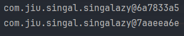
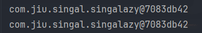
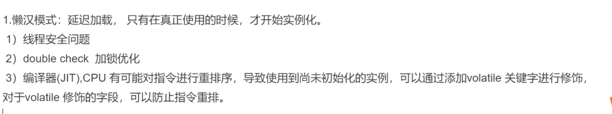
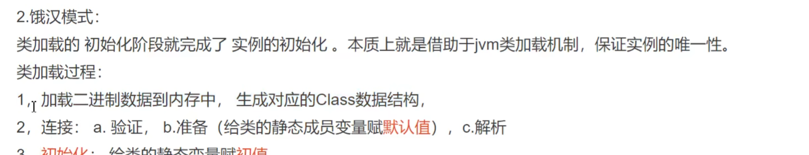

# 单例模式

## 懒汉模式

延迟加载，只有在真正使用时候才加载。

```java
public class singalazy {
    private static singalazy instance;
    private singalazy(){}
    public static singalazy getInstance(){
        if(instance == null){
            instance = new singalazy();
        }
        return instance;
    }
}

class singalazyTest{
    public static void main(String[] args) {
        singalazy instance = singalazy.getInstance();
        singalazy instance1 = singalazy.getInstance();
        System.out.println(instance == instance1);
    }
}
```

线程安全问题



```java
// 线程安全模拟
class singalazyThreadSafe{
    public static void main(String[] args) {
        new Thread( () -> {
            singalazy instance = singalazy.getInstance();
            System.out.println(instance);
        }).start();

        new Thread( () -> {
            singalazy instance = singalazy.getInstance();
            System.out.println(instance);
        }).start();
    }
}

```

解决,加singalazy关键字



```java
public class singalazy {
    private static singalazy instance;
    private singalazy(){}
    public synchronized static singalazy getInstance() {
        if(instance == null){
            try {
                Thread.sleep(200);
            } catch (InterruptedException e) {
                throw new RuntimeException(e);
            }
            instance = new singalazy();
        }
        return instance;
    }
}
```

这种加锁方式，不管创建没有都会加锁，所以在内部加锁,注意双重判断，并发走到synchronized (singalazy.class)，其中一个完成了实例化，另一个进入后判断即可，**多个线程都走到synchronized (singalazy.class)会影响性能**

```java
public class singalazy {
    private static singalazy instance;
    private singalazy(){}
    public synchronized static singalazy getInstance() {
        if(instance == null){
            synchronized (singalazy.class){
                if (instance == null){
                    instance = new singalazy();
                }
            }

        }
        return instance;
    }
}
```

```java
public class singalazy {
    private volatile static singalazy instance;
    // volatile 防止指令码重排
    private singalazy(){}
    public synchronized static singalazy getInstance() {
        if(instance == null){
            synchronized (singalazy.class){
                if (instance == null){
                    instance = new singalazy();
                }
            }

        }
        return instance;
    }
}

```




这里的 `instance = new Singleton();` 其实包含了三个步骤：

1. **分配内存**：为 `Singleton` 实例分配内存。
2. **初始化**：调用 `Singleton` 构造函数来初始化对象。
3. **引用赋值**：将分配的内存地址赋值给 `instance` 变量。

在没有 `volatile` 修饰的情况下，指令重排可能会导致这三个步骤的顺序被调整为：

1. 分配内存
2. 引用赋值（`instance` 指向分配的内存，但对象未完成初始化）
3. 初始化对象

### 指令重排带来的问题

假设线程A和线程B并发执行，可能出现如下情况：

1. 线程A进入 `getInstance()` 方法，判断 `instance == null`，于是进入同步块。
2. 线程A执行 `instance = new Singleton()` 过程中发生指令重排，将“引用赋值”提前执行。
3. 此时，`instance` 已经不为 `null`，**但对象还未初始化完成。**
4. 线程B调用 `getInstance()` 方法，看到 `instance` 不为 `null`，直接返回 `instance`，得到一个未完全初始化的对象，可能导致程序异常。

### `volatile` 的作用

将 `instance` 声明为 `volatile`，可以防止指令重排，确保初始化顺序为“分配内存 -> 初始化对象 -> 引用赋值”，从而避免多线程环境下的空指针或未初始化错误。

## 饿汉模式

```java
public class hungrysingle {
    private static hungrysingle instance = new hungrysingle();
    private hungrysingle(){}
    public static hungrysingle getInstance(){
        return instance;
    }
}
```

基于JVM类加载模式， 初始化阶段就完成了实例的初始化。本质借助jvm的类加载机制。保证实例的唯一性



**优点**：实现简单，线程安全。
**缺点**：不管是否使用单例，都会在类加载时创建，可能造成资源浪费

## 静态内部类

```java

public class Singleton {
    private Singleton() {}
    
    private static class Holder {
        private static final Singleton INSTANCE = new Singleton();
    }
    
    public static Singleton getInstance() {
        return Holder.INSTANCE;
    }
}

```

**优点**：线程安全，延迟加载，性能高。
**原理**：类 `Holder` 在 `Singleton` 类被加载时不会立即初始化，只有在调用 `getInstance()` 时才会加载。

# 工厂模式

工厂模式是一种创建型设计模式，用于封装对象的创建过程，从而将对象的创建与其使用分离。在工厂模式中，客户端不直接实例化对象，而是通过工厂类来获取对象的实例。这种模式特别适用于以下场景：

- 当客户端不知道具体的对象类型时。
- 当对象的创建过程可能会发生变化时。
- 当需要通过不同的条件创建不同类型的对象时。

工厂模式分为三种常见形式：简单工厂模式、工厂方法模式和抽象工厂模式。

### 1. 简单工厂模式

简单工厂模式（Simple Factory Pattern）将对象的创建封装在一个工厂类中，通过一个静态方法根据传入的参数创建不同类型的对象

假设我们有一个汽车接口 `Car`，以及具体的汽车类 `BMW` 和 `Audi`。

```java

// Car接口
interface Car {
    void drive();
}

// BMW实现类
class BMW implements Car {
    public void drive() {
        System.out.println("Drive a BMW.");
    }
}

// Audi实现类
class Audi implements Car {
    public void drive() {
        System.out.println("Drive an Audi.");
    }
}

// 简单工厂类
class CarFactory {
    public static Car createCar(String type) {
        if (type.equalsIgnoreCase("BMW")) {
            return new BMW();
        } else if (type.equalsIgnoreCase("Audi")) {
            return new Audi();
        } else {
            throw new IllegalArgumentException("Unknown car type.");
        }
    }
}

// 客户端代码
public class Main {
    public static void main(String[] args) {
        Car bmw = CarFactory.createCar("BMW");
        bmw.drive(); // 输出: Drive a BMW.

        Car audi = CarFactory.createCar("Audi");
        audi.drive(); // 输出: Drive an Audi.
    }
}

```

**优点**：实现简单，封装了对象的创建逻辑。
**缺点**：增加新类型时需要修改工厂代码，不符合开闭原则。

### 2. 工厂方法模式

工厂方法模式（Factory Method Pattern）通过为每一种产品提供一个工厂类来创建对象。这样可以通过工厂的子类来决定创建的对象类型，符合开闭原则

在工厂方法模式中，为每个具体产品创建一个工厂类。

```java
// 工厂接口
interface CarFactory {
    Car createCar();
}

// BMW工厂类
class BMWFactory implements CarFactory {
    public Car createCar() {
        return new BMW();
    }
}

// Audi工厂类
class AudiFactory implements CarFactory {
    public Car createCar() {
        return new Audi();
    }
}

// 客户端代码
public class Main {
    public static void main(String[] args) {
        CarFactory bmwFactory = new BMWFactory();
        Car bmw = bmwFactory.createCar();
        bmw.drive(); // 输出: Drive a BMW.

        CarFactory audiFactory = new AudiFactory();
        Car audi = audiFactory.createCar();
        audi.drive(); // 输出: Drive an Audi.
    }
}

```

