# 加速器

## XMRTH

1. https://www.xmrth.cloud/user（电脑打开）

- 注册
- 购买套餐

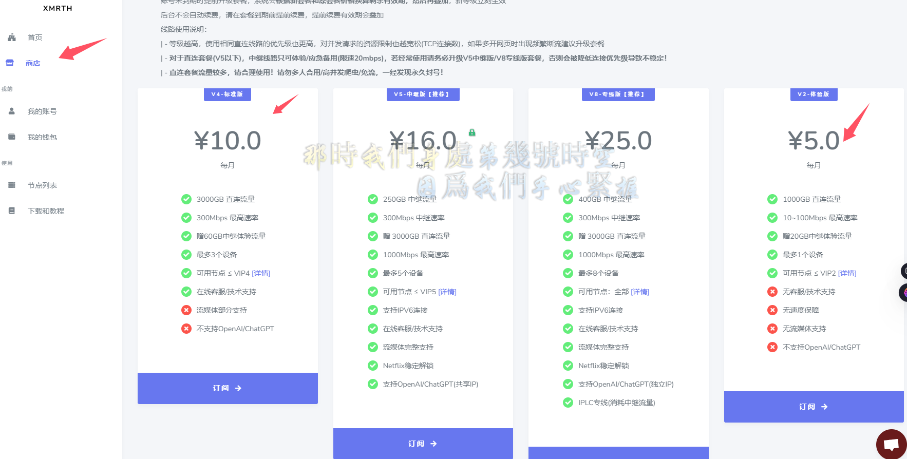

- 使用
- 选择对应的软件

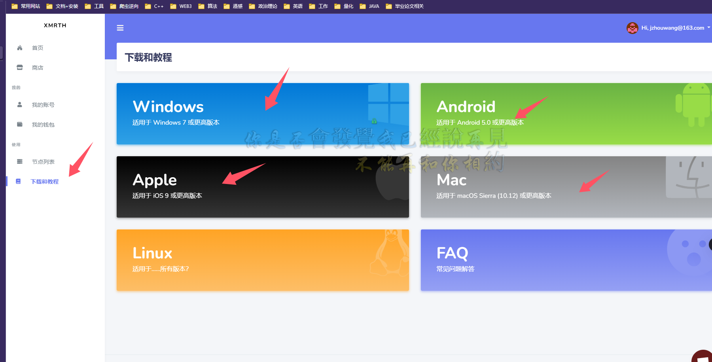

- 比如安装了windows 的 Clash for window

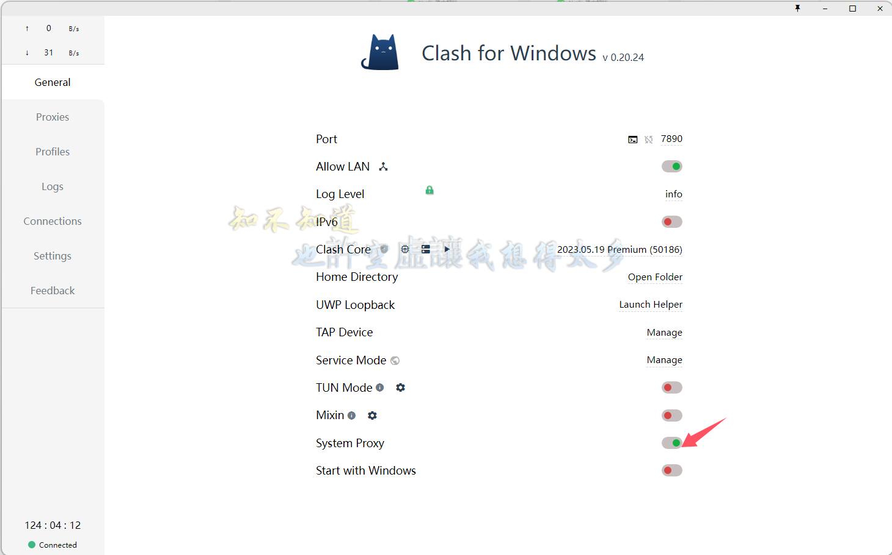

- 先关闭System Proxy(系统代理)， 代理开了就可以科学上网， 关了就不能）
- 复制配置文件的URL链接
- 粘贴到
- 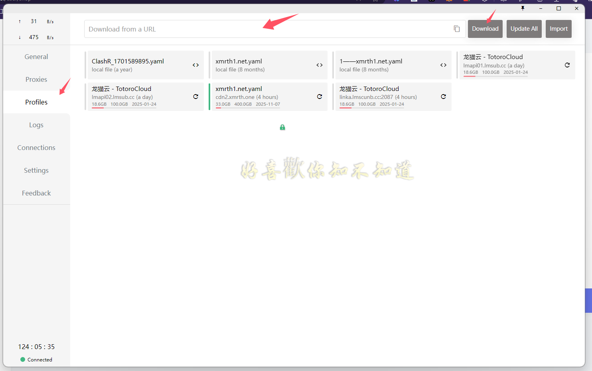
- 下载配置文件
- 打开系统代理
- 要切换节点就点击代理，选一个节点
- 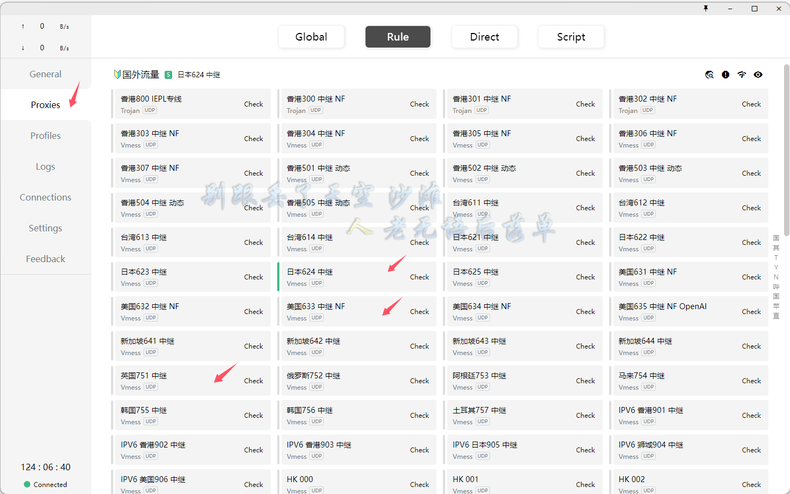
- 其他软件都是一样的思路
- 关键点：**配置文件、系统代理、节点**

# 欧意交易所（OKX）

## 注册

- 链接 [OKX全球领先的比特币交易平台 | 比特币行情价格 | 欧易](https://www.okx.com/zh-hans)

https://www.okx.com

- 邀请码填写：**64653088**， 切记切记切记！！！

- 加速器节点切换为新加披

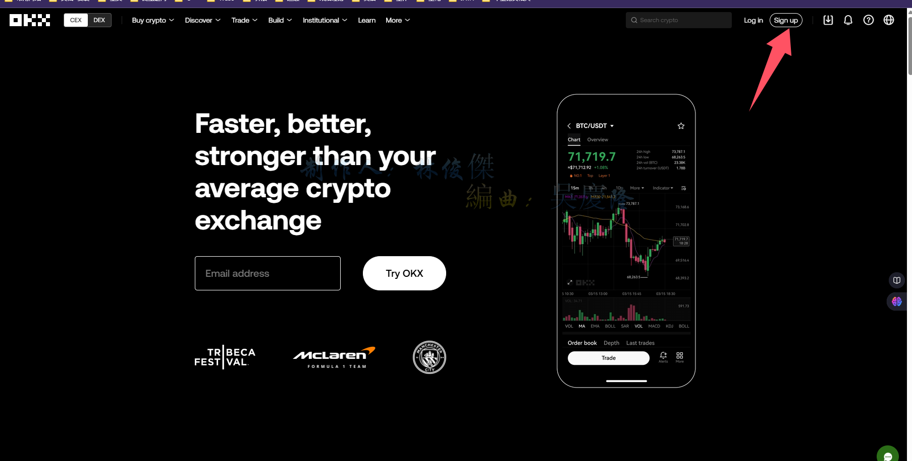

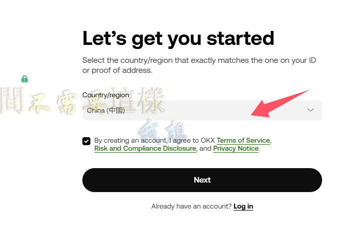

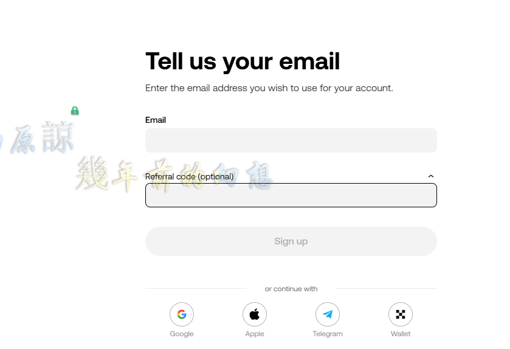

邀请码填写：**64653088**

##  手机下载

### 省力版

直接浏览器搜索欧意下载。找别人的下载链接，用刚才的账号登录

#### 一劳永逸版

下载谷歌商店，注册谷歌账号，商店下载正规软件，后续其他的东西下载就会很方便

### 安卓

#### 准备工作：

- 通过你购买加速器的地方，安装对应软件到手机

- 手机浏览器搜索。谷歌应用商店，安装到手机

- 注册谷歌账号

  ##### 注册谷歌账号

  - 电脑浏览器打开（chrome, edge都可以）
  - 先把语言设置设置为仅仅英文
  - 教程[2024-2025谷歌邮箱怎么注册申请，保姆级注册教程，让每个人都能注册谷歌邮箱 - 知乎 (zhihu.com)](https://zhuanlan.zhihu.com/p/693936906)
  - 注意浏览器用户中心如果登陆了先退出
  - 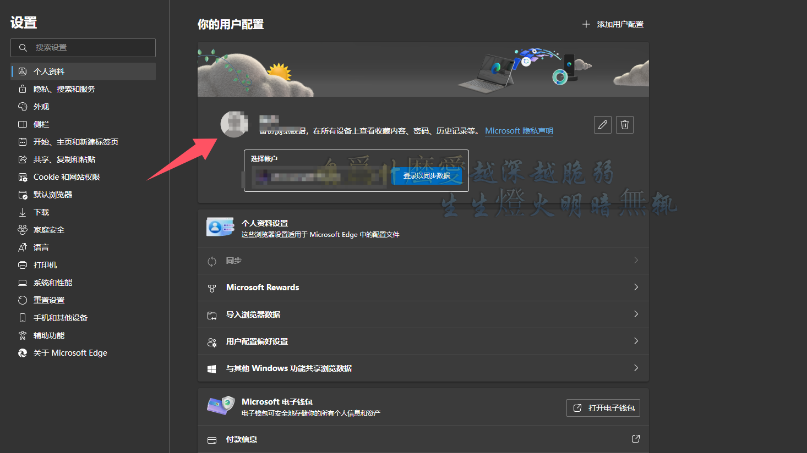
  - 打开链接[Google](https://www.google.com/)

https://www.google.com

- - 点击右上角
  - 
  - 创建账号
  - 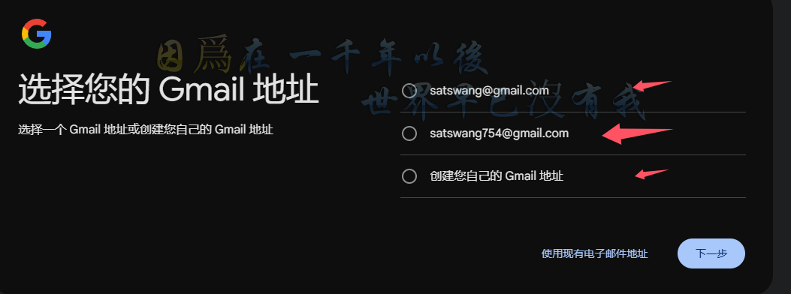

随便选一个，创建自己的就是自己填一个账号，上面两个就是系统生成的。

- - 输入密码
  - 输入手机号选择中国，你的电话号码接受验证吗
  - 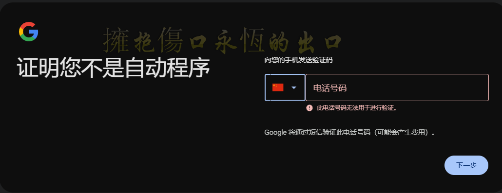
  - 一般中午的成功率会很高，我基本中午能成功
  - 如果还是显示此号码无法用于进行验证，只有用虚拟号码来接受验证码，
  - 我之前用的是这个网站， https://sms-activate.guru/cn/sim 最低需要重置2美元，16快的样子，接受不了就自己搜看看其他教程，也可以联系我，我还有点余额在里面（vx:quezhou_xh）
  - 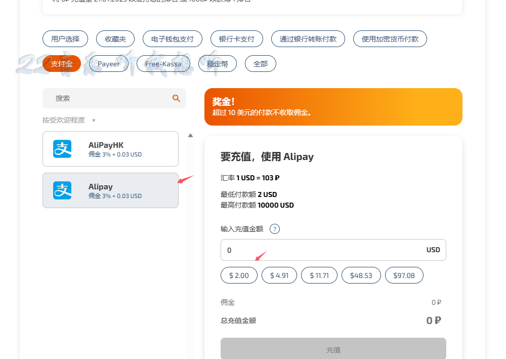

充值之后点击左侧服务选择，搜索goole,点击下面的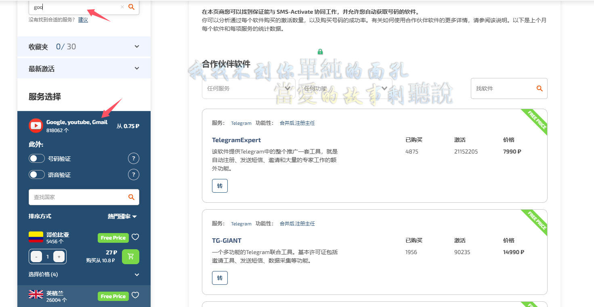

选择一个便宜的，我选的智利

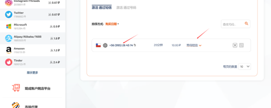

点击购买后，就是购物车图标等待一会，会有你的电话号码，填进需用于接受验证码的地方，验证码也在这个网页看（等待短信）

**接受验证码，前面的国家选择对应的,**注册成功后

##### 注册好了后应用商店登录就行

需要加速器

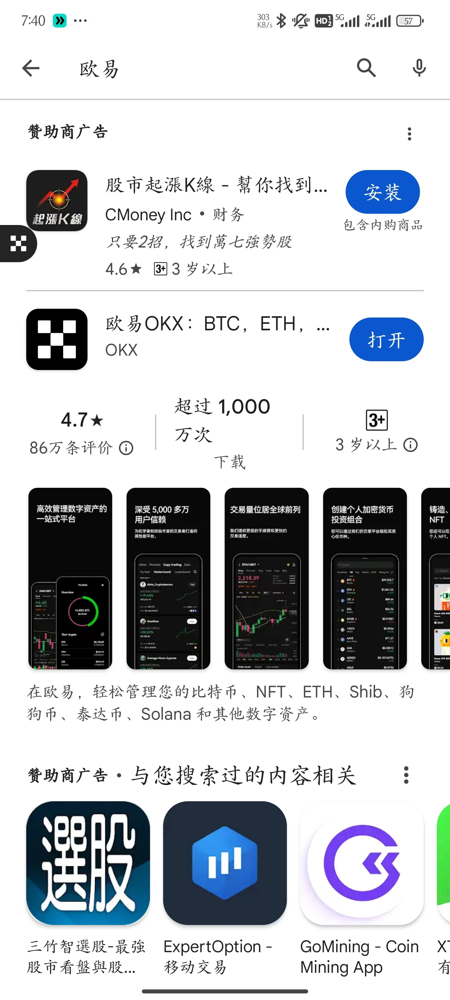

##### 安装好后登录，验证码接受，也在电脑上操作

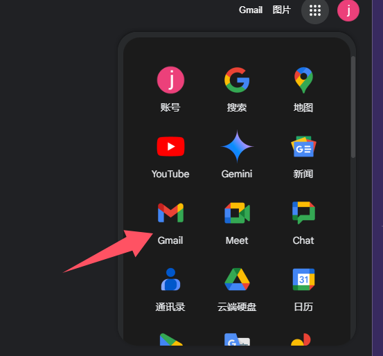

##### 其他像推特，电报都可以再上面下载，就会很方便，

### Apple

需要海外ID,淘宝上操作

然后appstore就可以下载

## 登录，认证（身份证）

## C2C买U

- 点击左上角9个点

- 找到资产管理->c2c

- 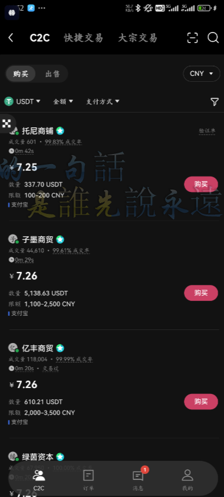

- 进去后就这样，从上到下说

   a.  购买就是购买到你的账户，出售就是出售你的u为money，

   b.  usdt不用管。都是买成u

   c.  金额就是你可以选择打算买多少，比如我我要买700块的u，输入700，就会筛选合适的商家给你

   d.  7.25啥的就是这个币商的价格7.25远/u

   e.  支付方式:支付宝或者微信

   f;  限额有个范围就是你能在这个商家最低和最高买多少

- 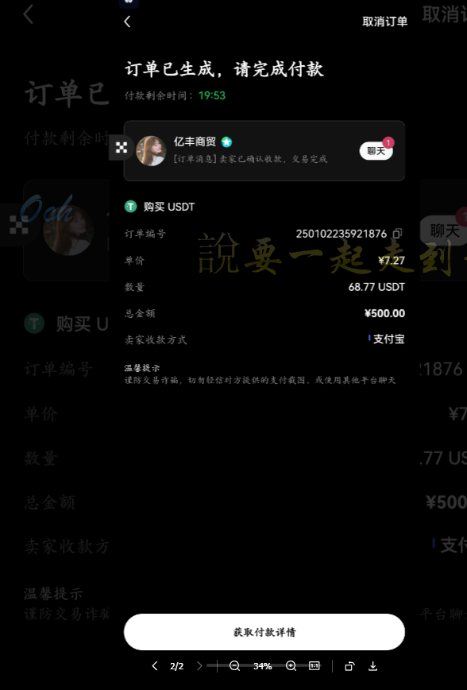

- 然后点击获取付款详情，支付宝就是转账给他，转账完成后，点击我已付款。

  等待他放u就行了，用相同实名账号的支付宝给他转，否则别人会取消订单的。

- 放U后。确认收货即可

#### C2C卖U

同样的流程

**注意**： 支付宝给你汇款时，注意支付宝转账和商家的实名姓名一致，遇到商家说什么我用其他账号给你打款，就直接取消订单